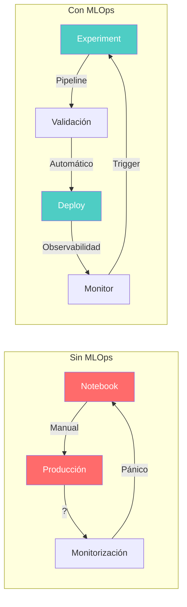
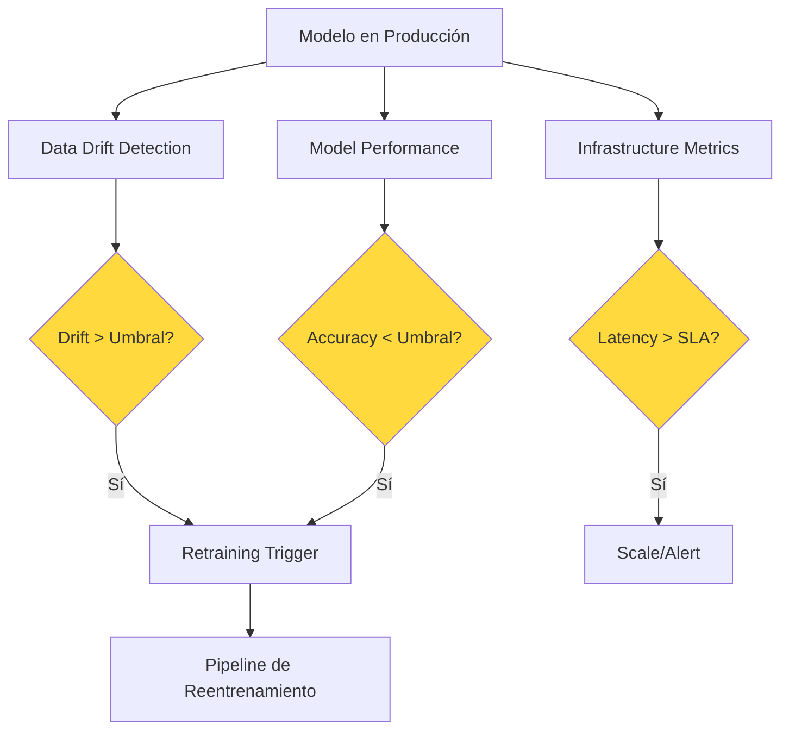
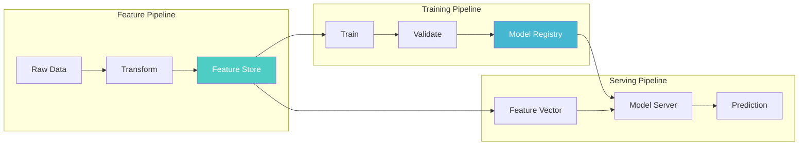

# MLOps — Machine Learning Operations

> [!abstract] Resumen
> *MLOps* (*Machine Learning Operations*) es la disciplina que aplica principios de ==DevOps al ciclo de vida del machine learning==. Sus pilares fundamentales son: gestión de datos, entrenamiento de modelos, despliegue y monitorización. Este documento cubre los ==niveles de madurez de Google (0-2)==, las herramientas clave del ecosistema (MLflow, Kubeflow, W&B, DVC), los patrones de pipeline y las diferencias fundamentales con DevOps tradicional que hacen de MLOps una disciplina distinta. ^resumen

---

## Qué es MLOps y por qué existe

*MLOps* surge de la necesidad de llevar modelos de *machine learning* de notebooks experimentales a producción de forma fiable, reproducible y escalable. El término combina *Machine Learning* y *Operations*, análogo a cómo *DevOps* combina *Development* y *Operations*.

> [!quote] Definición formal
> "MLOps es un conjunto de prácticas que combina Machine Learning, DevOps y Data Engineering para desplegar y mantener sistemas de ML en producción de forma fiable y eficiente."
> — Google Cloud Architecture Center

### El problema que resuelve



---

## Los cuatro pilares de MLOps

### 1. Gestión de datos (*Data Management*)

> [!info] Componentes de gestión de datos
> - **Versionado de datos**: Rastrear cambios en datasets de entrenamiento
> - **Linaje de datos** (*data lineage*): De dónde viene cada dato
> - **Calidad de datos**: Validación automática de esquemas y distribuciones
> - **Feature stores**: Repositorios centralizados de features reutilizables
> - **Privacidad**: Anonimización, cumplimiento de GDPR ([[licit-overview|licit]])

| Herramienta | Función | ==Fortaleza principal== |
|---|---|---|
| DVC | Versionado de datos | ==Git para datos== |
| Great Expectations | Validación de datos | Tests declarativos |
| Feast | Feature store | ==Feature serving online/offline== |
| Delta Lake | Almacenamiento | Transacciones ACID |
| LakeFS | Versionado | Branching para data lakes |

### 2. Entrenamiento de modelos (*Model Training*)

El entrenamiento es el proceso iterativo de crear modelos a partir de datos. En MLOps, se automatiza y se hace reproducible.

> [!example]- Pipeline de entrenamiento con MLflow
> ```python
> import mlflow
> import mlflow.sklearn
> from sklearn.ensemble import RandomForestClassifier
> from sklearn.metrics import accuracy_score, f1_score
> from sklearn.model_selection import train_test_split
>
> # Configurar experimento
> mlflow.set_experiment("clasificador-sentimiento")
>
> with mlflow.start_run(run_name="rf-baseline"):
>     # Parámetros
>     params = {
>         "n_estimators": 100,
>         "max_depth": 10,
>         "min_samples_split": 5,
>         "random_state": 42
>     }
>     mlflow.log_params(params)
>
>     # Entrenamiento
>     X_train, X_test, y_train, y_test = train_test_split(
>         X, y, test_size=0.2, random_state=42
>     )
>     model = RandomForestClassifier(**params)
>     model.fit(X_train, y_train)
>
>     # Métricas
>     predictions = model.predict(X_test)
>     accuracy = accuracy_score(y_test, predictions)
>     f1 = f1_score(y_test, predictions, average="weighted")
>
>     mlflow.log_metrics({
>         "accuracy": accuracy,
>         "f1_score": f1,
>         "training_samples": len(X_train),
>         "test_samples": len(X_test)
>     })
>
>     # Registrar modelo
>     mlflow.sklearn.log_model(
>         model,
>         "model",
>         registered_model_name="sentiment-classifier"
>     )
>
>     # Artefactos
>     mlflow.log_artifact("data/feature_importance.png")
>     mlflow.log_artifact("data/confusion_matrix.png")
> ```

### 3. Despliegue de modelos (*Model Deployment*)

> [!tip] Patrones de despliegue
> - **Batch inference**: Predicciones en lote, programadas (ej: nightly)
> - **Online inference**: API REST/gRPC, baja latencia
> - **Streaming inference**: Predicciones sobre flujos de datos (Kafka, Kinesis)
> - **Edge inference**: Modelos en dispositivos ([[multi-region-ai]])
> - **Shadow deployment**: Modelo nuevo en paralelo sin servir ([[canary-deployments-ia]])

### 4. Monitorización (*Monitoring*)



> [!warning] Señales de alerta en producción
> - **Data drift**: La distribución de datos de entrada cambia respecto al entrenamiento
> - **Concept drift**: La relación entre inputs y outputs cambia
> - **Performance decay**: Las métricas del modelo se degradan gradualmente
> - **Prediction skew**: Diferencias entre predicciones en training y serving

---

## Niveles de madurez de MLOps (Google)

Google define tres niveles de madurez para la adopción de MLOps, que representan un camino progresivo desde procesos manuales hasta automatización completa [^1].

### Nivel 0 — Proceso manual

> [!failure] Características del Nivel 0
> - Entrenamiento manual en notebooks
> - Sin pipeline automatizado
> - Despliegue manual del modelo
> - Sin monitorización de drift
> - Sin versionado de datos
> - ==Mayoría de organizaciones están aquí==

```
Científico de datos → Notebook → Modelo.pkl → "Ya lo paso a producción"
```

### Nivel 1 — Pipeline de ML automatizado

> [!success] Características del Nivel 1
> - Pipeline de entrenamiento automatizado
> - Entrenamiento continuo (*Continuous Training*)
> - Versionado de datos y modelos
> - Feature store implementado
> - Monitorización básica de performance
> - ==Reentrenamiento automático ante drift==

### Nivel 2 — Pipeline de CI/CD para ML

> [!success] Características del Nivel 2
> - CI/CD completo para código ML y pipelines
> - Testing automatizado de datos, modelos y pipelines
> - Despliegue automatizado con canary/blue-green
> - A/B testing en producción
> - ==Monitorización avanzada con alertas automáticas==
> - Gobernanza y compliance integrados ([[licit-overview|licit]])

| Capacidad | ==Nivel 0== | ==Nivel 1== | ==Nivel 2== |
|---|---|---|---|
| Pipeline ML | Manual | Automatizado | CI/CD |
| Reentrenamiento | Ad-hoc | Automático | Automático + validado |
| Deploy | Manual | Semi-auto | Automatizado |
| Monitoring | Ninguno | Básico | ==Avanzado== |
| Testing | Manual | Pipeline | ==CI/CD completo== |
| Feature store | No | Sí | Sí + versionado |

---

## Herramientas del ecosistema MLOps

### MLflow

*MLflow* es la plataforma open-source más adoptada para gestión del ciclo de vida de ML.

> [!info] Componentes de MLflow
> - **Tracking**: Registro de experimentos, parámetros y métricas
> - **Models**: Empaquetado estándar de modelos
> - **Registry**: Registro centralizado con versionado y stages
> - **Projects**: Formato reproducible de proyectos ML

### Kubeflow

*Kubeflow* es la plataforma de ML sobre Kubernetes, orientada a equipos que ya operan en K8s.

> [!example]- Pipeline de Kubeflow
> ```python
> from kfp import dsl
> from kfp.compiler import Compiler
>
> @dsl.component
> def preprocess_data(input_path: str, output_path: str):
>     import pandas as pd
>     df = pd.read_csv(input_path)
>     # Limpieza y transformación
>     df_clean = df.dropna()
>     df_clean.to_csv(output_path, index=False)
>
> @dsl.component
> def train_model(data_path: str, model_path: str, epochs: int = 10):
>     import joblib
>     from sklearn.ensemble import GradientBoostingClassifier
>     import pandas as pd
>
>     df = pd.read_csv(data_path)
>     X, y = df.drop("target", axis=1), df["target"]
>
>     model = GradientBoostingClassifier(n_estimators=epochs)
>     model.fit(X, y)
>     joblib.dump(model, model_path)
>
> @dsl.component
> def evaluate_model(model_path: str, test_data: str) -> float:
>     import joblib
>     import pandas as pd
>     from sklearn.metrics import accuracy_score
>
>     model = joblib.load(model_path)
>     df = pd.read_csv(test_data)
>     X, y = df.drop("target", axis=1), df["target"]
>     return accuracy_score(y, model.predict(X))
>
> @dsl.pipeline(name="ml-training-pipeline")
> def training_pipeline(input_data: str = "gs://data/input.csv"):
>     preprocess = preprocess_data(input_path=input_data, output_path="/tmp/clean.csv")
>     train = train_model(data_path="/tmp/clean.csv", model_path="/tmp/model.pkl")
>     evaluate = evaluate_model(model_path="/tmp/model.pkl", test_data="/tmp/test.csv")
>
> Compiler().compile(training_pipeline, "pipeline.yaml")
> ```

### Weights & Biases (W&B)

*Weights & Biases* es una plataforma SaaS para tracking de experimentos con visualización avanzada.

### DVC (Data Version Control)

*DVC* extiende Git para versionar datos y pipelines de ML.

> [!tip] DVC para versionado de datos
> ```bash
> # Inicializar DVC en repo existente
> dvc init
>
> # Trackear un dataset grande
> dvc add data/training-set.parquet
> git add data/training-set.parquet.dvc data/.gitignore
> git commit -m "Add training dataset v1"
>
> # Pipeline reproducible
> dvc run -n preprocess \
>   -d src/preprocess.py -d data/raw/ \
>   -o data/processed/ \
>   python src/preprocess.py
> ```

---

## Diferencias entre DevOps y MLOps

> [!question] ¿Por qué no basta con DevOps?
> DevOps gestiona código. MLOps debe gestionar código **más** datos **más** modelos **más** configuración de entrenamiento. La complejidad se multiplica por cada dimensión adicional.

| Dimensión | DevOps | ==MLOps== |
|---|---|---|
| Artefacto principal | Código | Código + datos + ==modelo== |
| Versionado | Git | Git + DVC + Model Registry |
| Testing | Unitarios + integración | + evaluación de modelo + ==data tests== |
| CI trigger | Push/PR | Push/PR + ==data change + drift== |
| CD target | Servicio/contenedor | Servicio + ==endpoint de inferencia== |
| Monitorización | Uptime, latencia, errores | + ==drift, accuracy, fairness== |
| Rollback | Código anterior | Código + modelo + ==datos anteriores== |
| Reproducibilidad | Determinista | ==No determinista== (seeds, hardware) |

---

## Patrones de pipeline MLOps

### Feature/Training/Serving Split



### Continuous Training Pattern

El *Continuous Training* (*CT*) es el análogo de ML al *Continuous Deployment*: cuando se detecta drift o degradación, se dispara automáticamente un pipeline de reentrenamiento.

> [!example]- Trigger de reentrenamiento automático
> ```python
> # monitor.py — Detectar drift y triggear reentrenamiento
> from evidently import ColumnDriftMetric
> from evidently.report import Report
> import subprocess
>
> def check_drift_and_retrain(reference_data, current_data, threshold=0.05):
>     """Verificar drift y triggear reentrenamiento si es necesario."""
>     report = Report(metrics=[ColumnDriftMetric()])
>     report.run(reference_data=reference_data, current_data=current_data)
>
>     drift_score = report.as_dict()["metrics"][0]["result"]["drift_score"]
>
>     if drift_score > threshold:
>         print(f"Drift detectado: {drift_score:.4f} > {threshold}")
>         # Triggear pipeline de reentrenamiento
>         subprocess.run([
>             "kubectl", "create", "-f", "pipelines/retrain.yaml"
>         ], check=True)
>         return True
>
>     return False
> ```

---

## MLOps en el contexto de LLMs

Con la llegada de los LLMs, MLOps evoluciona hacia [[llmops]]. Las diferencias principales son:

> [!info] De MLOps a LLMOps
> - **Sin loop de entrenamiento** (normalmente): Se usan modelos pre-entrenados vía API
> - **Prompt como artefacto**: El prompt reemplaza al modelo entrenado ([[prompt-versioning]])
> - **Evaluación diferente**: No hay accuracy clásica, sino evaluación de calidad de texto
> - **Costes por token**: No por GPU/hora sino por ==tokens consumidos== ([[cost-optimization]])
> - **Operación de agentes**: Más allá de modelos simples ([[agentops]])

---

## Relación con el ecosistema

MLOps proporciona la base conceptual sobre la que se construyen las prácticas específicas del ecosistema:

- **[[intake-overview|Intake]]**: Puede automatizar la generación de especificaciones de datos y modelos desde issues, alimentando el pipeline de ML con requisitos estructurados
- **[[architect-overview|Architect]]**: Aunque architect opera sobre código y no modelos ML tradicionales, su sistema de pipelines declarativos y checkpoints se inspira en patrones de MLOps
- **[[vigil-overview|Vigil]]**: El escaneo de seguridad de vigil es análogo a la validación de modelos en MLOps — ambos son gates de calidad antes del deploy
- **[[licit-overview|Licit]]**: La compliance de licit extiende la gobernanza de MLOps con verificación regulatoria específica para IA (EU AI Act, proveniencia de datos)

---

## Enlaces y referencias

> [!quote]- Bibliografía y recursos
> - Google. "MLOps: Continuous delivery and automation pipelines in machine learning." Cloud Architecture Center, 2023. [^1]
> - Sculley, D. et al. "Hidden Technical Debt in Machine Learning Systems." NeurIPS, 2015. [^2]
> - Huyen, Chip. "Designing Machine Learning Systems." O'Reilly, 2022. [^3]
> - Kreuzberger, D. et al. "Machine Learning Operations (MLOps): Overview, Definition, and Architecture." IEEE Access, 2023. [^4]
> - MLflow Documentation. "MLflow: A Machine Learning Lifecycle Platform." 2024. [^5]

[^1]: Referencia fundacional para los niveles de madurez de MLOps (0, 1, 2)
[^2]: Paper que identificó la deuda técnica específica de sistemas ML — precursor intelectual de MLOps
[^3]: Libro completo sobre diseño de sistemas ML con énfasis en operaciones
[^4]: Survey académico que formaliza la definición y arquitectura de MLOps
[^5]: Documentación oficial de la herramienta más adoptada en el ecosistema MLOps
