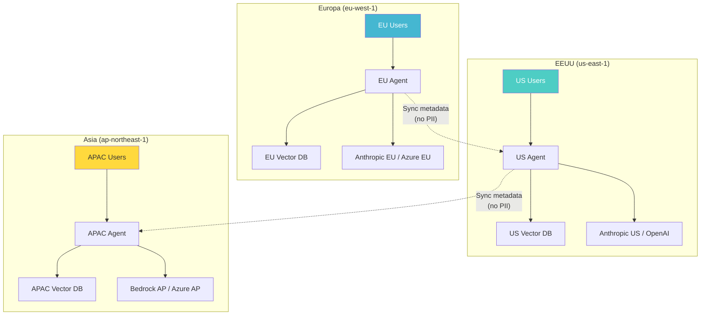
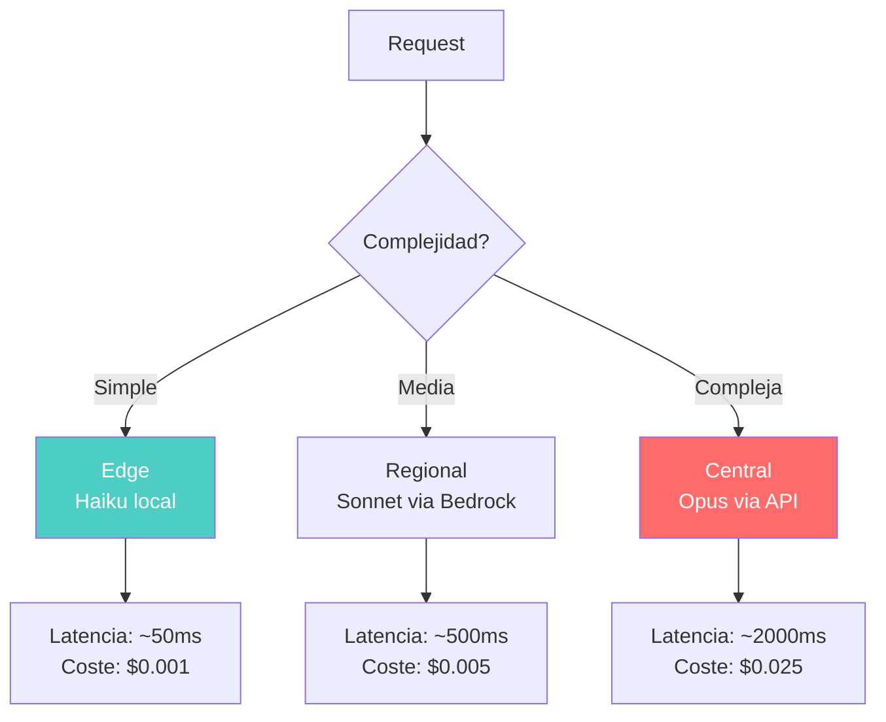
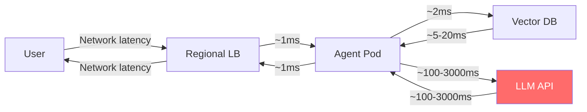
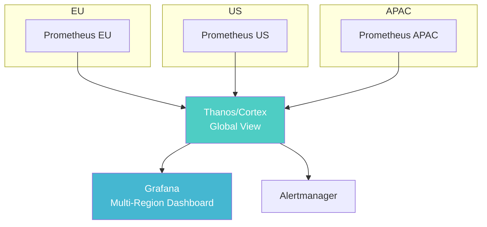

# Despliegue Multi-Región de Sistemas de IA

> [!abstract] Resumen
> El despliegue multi-región de sistemas de IA enfrenta desafíos únicos: ==residencia de datos (GDPR, EU AI Act)==, disponibilidad de modelos por región, optimización de latencia. Las estrategias incluyen ==edge inference para baja latencia y razonamiento centralizado para tareas complejas==. Se analiza la disponibilidad de modelos por proveedor y región (OpenAI, Anthropic, Bedrock, Azure), vector stores multi-región, y consideraciones regulatorias por jurisdicción. ^resumen

---

## Por qué multi-región para IA

Los sistemas de IA en producción necesitan despliegue multi-región por tres razones fundamentales:

> [!warning] Tres drivers de multi-región
> 1. **Regulación**: GDPR, EU AI Act y otras regulaciones exigen que ciertos datos no salgan de jurisdicciones específicas
> 2. **Latencia**: Los usuarios globales necesitan respuestas rápidas — la distancia al LLM API afecta directamente
> 3. **Resiliencia**: Una región caída no debe afectar al servicio global ([[disaster-recovery-ia]])



---

## Residencia de datos y regulación

### GDPR y sistemas de IA

> [!danger] Requisitos de GDPR para IA
> - **Datos personales** de residentes de la EU deben procesarse en la EU (o con protecciones adecuadas)
> - Los ==prompts que contienen datos personales== deben enviarse a LLMs con endpoint en la EU
> - Los ==embeddings de datos personales== son datos personales (CJEU ruling)
> - Los logs de interacciones con IA pueden contener PII
> - El derecho al olvido aplica a vector stores

| Dato | ¿Es dato personal? | ==Implicación para multi-región== |
|---|---|---|
| Nombre de usuario en prompt | Sí | ==Procesar solo en región del usuario== |
| Embedding de documento con PII | Sí | ==Vector store en región del usuario== |
| Pregunta genérica sin PII | No | Puede procesarse en cualquier región |
| Respuesta del modelo | Depende | Si contiene PII del input, sí |
| Métricas agregadas | No | Puede centralizarse |

### EU AI Act

> [!info] EU AI Act — Impacto en multi-región
> El *EU AI Act* clasifica sistemas de IA por riesgo y establece requisitos:
> - **Alto riesgo**: Requiere evaluación de conformidad, registro, monitorización continua
> - **Riesgo limitado**: Obligación de transparencia (informar que es IA)
> - **Riesgo mínimo**: Sin requisitos especiales
>
> Para sistemas multi-región, el EU AI Act implica:
> - Documentación técnica accesible a autoridades de la EU
> - ==Logs de decisiones de IA retenidos en la EU==
> - Monitorización post-market desde la EU
> - Compliance verification con [[licit-overview|licit]]

### Otras regulaciones por jurisdicción

| Jurisdicción | Regulación | ==Requisito principal== |
|---|---|---|
| EU | GDPR + EU AI Act | ==Residencia de datos + clasificación de riesgo== |
| EEUU | State laws (CCPA, etc.) | Opt-out, disclosure |
| China | PIPL + AI regulations | ==Datos en China, aprobación gobierno== |
| Brasil | LGPD | Similar a GDPR |
| Canadá | AIDA (propuesto) | Transparencia, evaluación de impacto |
| UK | ICO AI guidance | ==Data protection, fairness== |

---

## Disponibilidad de modelos por proveedor y región

### Mapa de disponibilidad

> [!tip] Disponibilidad de modelos por región (2025)
>
> | Proveedor | Modelo | US | EU | ==APAC== | Latam |
> |---|---|---|---|---|---|
> | Anthropic (API) | Claude Sonnet/Opus | Sí | Sí | ==Limitado== | Via US |
> | Anthropic (Bedrock) | Claude | Sí | Sí (Frankfurt) | ==Sí (Tokyo, Sydney)== | No |
> | OpenAI | GPT-4o | Sí | Sí (via Azure) | ==Sí (via Azure)== | Via US |
> | Azure OpenAI | GPT-4o | Sí | Sí | ==Sí== | Sí (Brazil) |
> | Google | Gemini | Sí | Sí | ==Sí== | Sí |
> | AWS Bedrock | Múltiples | Sí | Sí | ==Sí== | Parcial |
> | Self-hosted | Llama, Mistral | ==Cualquiera== | ==Cualquiera== | ==Cualquiera== | ==Cualquiera== |

> [!warning] Consideraciones de disponibilidad
> - No todos los modelos están en todas las regiones
> - Los rate limits pueden variar por región
> - Los precios pueden diferir por región
> - Nuevos modelos se lanzan primero en US, luego en otras regiones
> - Self-hosted resuelve disponibilidad pero añade complejidad operativa

### Estrategia de selección de modelo por región

> [!example]- Router multi-región
> ```python
> from dataclasses import dataclass
>
> @dataclass
> class RegionConfig:
>     primary_provider: str
>     primary_model: str
>     fallback_provider: str
>     fallback_model: str
>     data_residency: str
>     requires_eu_processing: bool
>
> REGION_CONFIGS = {
>     "eu-west-1": RegionConfig(
>         primary_provider="bedrock",
>         primary_model="anthropic.claude-sonnet-4-20250514-v1:0",
>         fallback_provider="azure",
>         fallback_model="gpt-4o",
>         data_residency="eu",
>         requires_eu_processing=True
>     ),
>     "us-east-1": RegionConfig(
>         primary_provider="anthropic",
>         primary_model="claude-sonnet-4-20250514",
>         fallback_provider="openai",
>         fallback_model="gpt-4o",
>         data_residency="us",
>         requires_eu_processing=False
>     ),
>     "ap-northeast-1": RegionConfig(
>         primary_provider="bedrock",
>         primary_model="anthropic.claude-sonnet-4-20250514-v1:0",
>         fallback_provider="azure",
>         fallback_model="gpt-4o",
>         data_residency="ap",
>         requires_eu_processing=False
>     ),
> }
>
> class MultiRegionRouter:
>     """Router de LLM consciente de región y regulación."""
>
>     def route(self, user_region: str, contains_pii: bool,
>               data_jurisdiction: str) -> RegionConfig:
>         """Seleccionar configuración de modelo por región."""
>         config = REGION_CONFIGS.get(user_region)
>
>         if not config:
>             # Fallback a US para regiones no configuradas
>             config = REGION_CONFIGS["us-east-1"]
>
>         # Si contiene PII de EU, forzar procesamiento en EU
>         if contains_pii and data_jurisdiction == "eu":
>             config = REGION_CONFIGS["eu-west-1"]
>
>         return config
> ```

---

## Estrategias de despliegue multi-región

### Edge Inference vs Centralized Reasoning

> [!info] Cuándo usar cada estrategia
> | Estrategia | ==Caso de uso== | Latencia | Coste | Complejidad |
> |---|---|---|---|---|
> | Edge inference | ==Tareas simples, baja latencia== | P95 < 100ms | Medio | Media |
> | Centralized | ==Razonamiento complejo== | P95 < 5s | Bajo | Baja |
> | Híbrido | ==Routing por complejidad== | Variable | ==Óptimo== | Alta |



### Arquitectura híbrida

> [!example]- Arquitectura multi-región híbrida
> ```yaml
> # infrastructure/multi-region.yaml
>
> regions:
>   eu-west-1:
>     tier: full
>     components:
>       agent:
>         replicas: 5
>         model_primary: bedrock/claude-sonnet
>         model_fallback: azure/gpt-4o
>       vector_db:
>         type: qdrant
>         replicas: 3
>         storage_gb: 500
>       cache:
>         type: redis
>         cluster_mode: true
>       monitoring:
>         langfuse: true
>         prometheus: true
>     data_policy:
>       pii_processing: local_only
>       log_retention_days: 90
>       gdpr_compliant: true
>
>   us-east-1:
>     tier: full
>     components:
>       agent:
>         replicas: 10
>         model_primary: anthropic/claude-sonnet
>         model_fallback: openai/gpt-4o
>       vector_db:
>         type: qdrant
>         replicas: 3
>         storage_gb: 1000
>       cache:
>         type: redis
>         cluster_mode: true
>       monitoring:
>         langfuse: true
>         prometheus: true
>     data_policy:
>       pii_processing: standard
>       log_retention_days: 365
>
>   ap-northeast-1:
>     tier: reduced
>     components:
>       agent:
>         replicas: 3
>         model_primary: bedrock/claude-sonnet
>         model_fallback: azure/gpt-4o
>       vector_db:
>         type: qdrant
>         replicas: 2
>         storage_gb: 200
>     data_policy:
>       pii_processing: standard
>       log_retention_days: 180
>
> cross_region:
>   sync:
>     metadata: true
>     pii_data: false
>     prompts: true
>     eval_results: true
>   failover:
>     strategy: automatic
>     health_check_interval_seconds: 30
>     failover_threshold: 3
> ```

---

## Vector stores multi-región

### Desafíos de sincronización

> [!danger] Sincronizar vector stores entre regiones es difícil
> - Los embeddings ocupan mucho espacio (768-3072 dimensiones × 4 bytes × millones de vectores)
> - La sincronización en tiempo real es costosa en ancho de banda
> - Si cada región usa un modelo de embedding diferente, los vectores no son comparables
> - La consistencia eventual puede causar resultados de búsqueda diferentes por región

### Estrategias

| Estrategia | ==Descripción== | Consistencia | Coste |
|---|---|---|---|
| Replicación async | Sync periódico de snapshots | ==Eventual (minutos)== | Medio |
| Replicación sync | Write a todas las regiones | ==Fuerte== | Alto |
| Indexación local | Cada región indexa sus propios datos | ==Independiente== | Bajo |
| Centralizada + cache | Un vector store central + cache regional | ==Fuerte== | ==Medio== |

> [!tip] Recomendación para la mayoría de casos
> - **Datos globales** (docs públicos, knowledge base): Replicación async entre regiones
> - **Datos por usuario** (chats, documentos privados): Indexación local en la región del usuario
> - **Datos sensibles** (PII, datos regulados): ==Solo en la región autorizada==, sin replicación

---

## Latencia por región

### Factores que afectan la latencia



> [!question] ¿Dónde está el cuello de botella?
> El ==LLM API call domina la latencia== (100-3000ms). La latencia de red entre usuario y agente es secundaria (~10-100ms inter-región). Por tanto:
> - Para tareas simples: priorizar cercanía del LLM API al usuario
> - Para tareas complejas: la latencia del LLM API domina, la proximidad importa menos
> - Para streaming: el *time to first token* es lo que el usuario percibe

### Optimización de latencia

| Técnica | ==Ahorro de latencia== | Complejidad |
|---|---|---|
| Regional LLM endpoints | ==100-500ms== | Baja |
| Semantic caching regional | ==Hasta 95%== (cache hit) | Media |
| Streaming responses | ==Percepción mejorada== | Baja |
| Edge inference (modelos pequeños) | ==500-2000ms== | Alta |
| Pre-computation | ==Variable== | Media |

---

## Compliance multi-jurisdicción

### Checklist por región

> [!danger] Verificar antes de desplegar en una nueva región
> - [ ] ¿Qué regulación de datos aplica? (GDPR, CCPA, PIPL, etc.)
> - [ ] ¿Qué modelos están disponibles en la región?
> - [ ] ¿Hay restricciones de exportación de datos?
> - [ ] ¿Se requiere notificación a autoridades?
> - [ ] ¿Los contratos con proveedores cubren la región?
> - [ ] ¿Se necesita Data Processing Agreement (DPA)?
> - [ ] ¿Hay requisitos de retención de logs específicos?
> - [ ] ¿Se requiere evaluación de impacto (DPIA)?

### Integración con licit

[[licit-overview|Licit]] proporciona verificación automatizada de compliance multi-jurisdicción:

```bash
# Verificar compliance para una región específica
licit verify \
  --bundle evidence/ \
  --jurisdiction eu \
  --regulation gdpr,eu-ai-act \
  --data-residency eu-west-1 \
  --strict

# Generar reporte de compliance multi-región
licit report \
  --format markdown \
  --regions eu-west-1,us-east-1,ap-northeast-1 \
  --include-data-flows \
  --include-model-inventory \
  --output compliance-multi-region.md
```

---

## Monitorización multi-región

> [!success] Dashboard multi-región
> | Métrica | Agregación | ==Alerta== |
> |---|---|---|
> | Availability por región | Por región | ==< 99.5% en cualquier región== |
> | Latencia P95 por región | Por región | > 2x de la región más rápida |
> | Coste por región | Por región | > 150% del presupuesto regional |
> | Data flow cross-region | Global | ==Cualquier PII cross-region== |
> | Model usage por región | Por región | Modelo no autorizado en región |



---

## Relación con el ecosistema

El despliegue multi-región afecta a la operación de todas las herramientas del ecosistema:

- **[[intake-overview|Intake]]**: Intake puede ejecutarse regionalmente para cumplir con residencia de datos — issues de repos EU se procesan con LLM endpoints EU
- **[[architect-overview|Architect]]**: En CI multi-región, architect usa el proveedor de LLM disponible en la región del runner CI, configurado via los flags de CI (`--mode yolo`, `--budget`)
- **[[vigil-overview|Vigil]]**: Los resultados SARIF de vigil se centralizan (no contienen PII), pero el escaneo puede ejecutarse regionalmente para cumplir con regulaciones de procesamiento de datos
- **[[licit-overview|Licit]]**: Licit es la herramienta clave para multi-región — verifica compliance por jurisdicción con `licit verify --jurisdiction`, generando reportes consolidados que incluyen flujos de datos cross-region

---

## Enlaces y referencias

> [!quote]- Bibliografía y recursos
> - European Commission. "EU AI Act - Regulation (EU) 2024/1689." Official Journal, 2024. [^1]
> - GDPR.eu. "General Data Protection Regulation." 2018. [^2]
> - AWS. "Multi-Region Application Architecture." Well-Architected, 2024. [^3]
> - Anthropic. "Claude API Regional Availability." 2025. [^4]
> - NIST. "AI Risk Management Framework." 2023. [^5]

[^1]: Texto oficial del EU AI Act, referencia primaria para compliance de IA en Europa
[^2]: Texto completo del GDPR, base legal para residencia de datos y procesamiento de PII
[^3]: Guía de AWS sobre arquitectura multi-región con consideraciones de data residency
[^4]: Documentación de Anthropic sobre disponibilidad regional de la API de Claude
[^5]: Framework de NIST para gestión de riesgos de IA, referencia para compliance multi-jurisdicción
