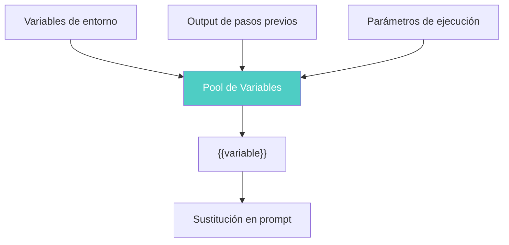
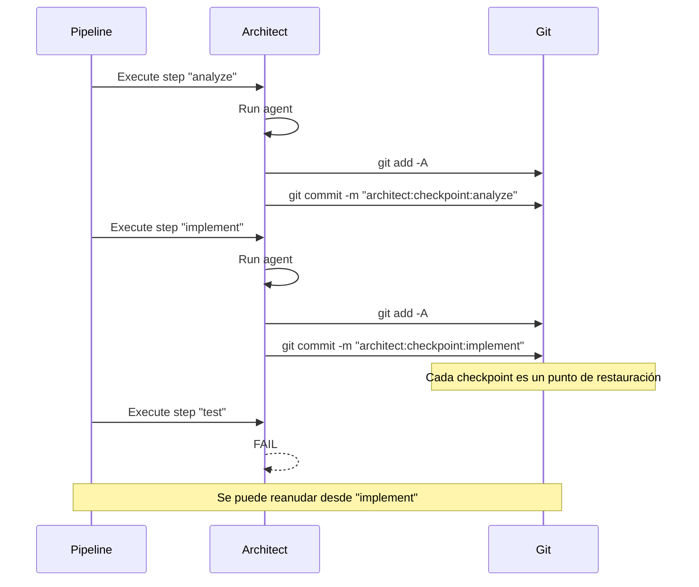

# Pipelines Declarativos para Agentes de IA

> [!abstract] Resumen
> Los *pipelines declarativos* definen flujos de trabajo de agentes IA como código YAML. El sistema de pipelines de architect soporta: steps con `name`, `agent`, `prompt`, `checks`, `checkpoint`, `output_var` y `condition`; ==sustitución de variables con `{{variable}}`==; ejecución condicional; ==captura de output entre pasos==; creación de checkpoints (git commits); preview con dry-run; reanudación con from-step; y validación con exit code 3. Se comparan con GitHub Actions, Tekton y Argo Workflows. ^resumen

---

## Qué son los pipelines declarativos

Un *pipeline declarativo* (*declarative pipeline*) define **qué** debe hacerse, no **cómo**. En lugar de scripts imperativos, se describe la secuencia de pasos, sus dependencias, condiciones y verificaciones en un formato estructurado (típicamente YAML).

> [!info] Declarativo vs imperativo
> | Aspecto | Imperativo | ==Declarativo== |
> |---|---|---|
> | Definición | Secuencia de comandos | ==Descripción de estado deseado== |
> | Formato | Bash/Python scripts | ==YAML/JSON== |
> | Legibilidad | Difícil con complejidad | ==Consistente y legible== |
> | Validación | En runtime | ==Pre-ejecución (exit code 3)== |
> | Reproducibilidad | Depende del entorno | ==Alta, auto-contenido== |
> | Dry-run | Difícil | ==Nativo== |

---

## Anatomía de un pipeline YAML de architect

### Estructura básica

```yaml
# pipeline.yaml
name: build-feature
description: "Build a feature from spec to tested code"
version: "1.0.0"

config:
  model: claude-sonnet-4-20250514
  max_cost_usd: 10.00
  timeout_minutes: 30
  checkpoint_enabled: true

steps:
  - name: analyze-spec
    agent: analyst
    prompt: |
      Analyze the following specification and create
      a technical design document.

      Specification:
      {{spec_content}}
    checks:
      - type: output_contains
        value: "## Technical Design"
      - type: max_tokens
        value: 5000
    checkpoint: true
    output_var: design_doc

  - name: implement
    agent: developer
    prompt: |
      Implement the following technical design:

      {{design_doc}}

      Follow the project's coding standards.
    checks:
      - type: files_created
        min: 1
      - type: lint_passes
    checkpoint: true
    output_var: implementation

  - name: write-tests
    agent: tester
    prompt: |
      Write tests for the implementation:

      {{implementation}}

      Ensure >80% code coverage.
    checks:
      - type: tests_pass
      - type: coverage_min
        value: 80
    checkpoint: true
    condition: "{{implementation_success}}"
```

### Campos de cada step

> [!tip] Referencia de campos de step
> | Campo | Tipo | Requerido | ==Descripción== |
> |---|---|---|---|
> | `name` | string | Sí | Identificador único del paso |
> | `agent` | string | No | Agente especializado a usar |
> | `prompt` | string | Sí | ==Instrucción para el agente== |
> | `checks` | list | No | Verificaciones post-ejecución |
> | `checkpoint` | bool | No | ==Crear commit checkpoint== |
> | `output_var` | string | No | Variable para capturar output |
> | `condition` | string | No | ==Condición para ejecutar== |
> | `timeout` | int | No | Timeout en segundos |
> | `model` | string | No | Override del modelo global |
> | `max_retries` | int | No | Reintentos ante fallo |
> | `on_failure` | string | No | Acción ante fallo |

---

## Sustitución de variables

El sistema de variables permite pasar datos entre pasos del pipeline usando la sintaxis `{{variable}}`.

### Fuentes de variables



> [!example]- Variables en acción
> ```yaml
> # Variables de entorno
> env:
>   PROJECT_NAME: "mi-proyecto"
>   LANGUAGE: "TypeScript"
>
> steps:
>   - name: analyze
>     prompt: |
>       Analiza el proyecto {{PROJECT_NAME}} escrito en {{LANGUAGE}}.
>
>       Archivos relevantes:
>       {{file_contents}}
>     output_var: analysis
>
>   - name: implement
>     prompt: |
>       Basándote en el análisis:
>       {{analysis}}
>
>       Implementa las mejoras sugeridas para {{PROJECT_NAME}}.
>     output_var: implementation
>
>   - name: summarize
>     prompt: |
>       Resume los cambios realizados:
>       - Análisis: {{analysis}}
>       - Implementación: {{implementation}}
>
>       Genera un changelog en formato Markdown.
>     output_var: changelog
> ```

### Variables especiales

| Variable | ==Valor== | Disponibilidad |
|---|---|---|
| `{{step.name}}` | Nombre del paso actual | Siempre |
| `{{step.index}}` | Índice del paso (0-based) | Siempre |
| `{{pipeline.name}}` | Nombre del pipeline | Siempre |
| `{{session.id}}` | ID de sesión de architect | Siempre |
| `{{timestamp}}` | ==Timestamp ISO 8601== | Siempre |
| `{{git.branch}}` | Branch actual | Si hay repo Git |
| `{{git.sha}}` | ==SHA del último commit== | Si hay repo Git |

---

## Ejecución condicional

Los pasos pueden ejecutarse condicionalmente basándose en el resultado de pasos anteriores.

> [!info] Sintaxis de condiciones
> ```yaml
> steps:
>   - name: check-type
>     prompt: "Determina si el issue es un bug o feature."
>     output_var: issue_type
>
>   - name: fix-bug
>     prompt: "Corrige el bug descrito..."
>     condition: "{{issue_type}} == 'bug'"
>
>   - name: build-feature
>     prompt: "Implementa la feature descrita..."
>     condition: "{{issue_type}} == 'feature'"
>
>   - name: always-test
>     prompt: "Ejecuta los tests del proyecto."
>     condition: "always"  # Se ejecuta siempre
> ```

### Condiciones soportadas

| Condición | ==Significado== | Ejemplo |
|---|---|---|
| `"{{var}} == 'value'"` | Igualdad | `"{{type}} == 'bug'"` |
| `"{{var}} != 'value'"` | Desigualdad | `"{{status}} != 'skip'"` |
| `"{{var}}"` | Variable truthy | `"{{has_tests}}"` |
| `"always"` | ==Siempre ejecutar== | Para pasos de cleanup |
| `"on_failure"` | ==Solo si falló algo== | Para notificaciones |
| `"previous.success"` | Paso anterior exitoso | Encadenamiento |

---

## Captura de output entre pasos

La captura de output (`output_var`) permite que un paso almacene su resultado para uso posterior.

> [!warning] Consideraciones de output_var
> - El output capturado incluye la respuesta completa del agente
> - Los outputs grandes consumen tokens cuando se inyectan en prompts posteriores
> - Considerar usar resúmenes o extracciones parciales para optimizar costes ([[cost-optimization]])
> - El output se pierde si el pipeline se interrumpe antes del checkpoint

> [!example]- Pipeline con output chaining complejo
> ```yaml
> name: full-feature-pipeline
>
> steps:
>   - name: parse-issue
>     agent: intake
>     prompt: |
>       Parse the following GitHub issue into a structured spec:
>
>       Title: {{issue_title}}
>       Body: {{issue_body}}
>       Labels: {{issue_labels}}
>     output_var: parsed_spec
>     checks:
>       - type: json_valid
>
>   - name: design
>     agent: architect
>     prompt: |
>       Create a technical design from this spec:
>       {{parsed_spec}}
>
>       Include: components, APIs, data models, dependencies.
>     output_var: design
>     checkpoint: true
>
>   - name: implement-api
>     agent: backend-dev
>     prompt: |
>       Implement the API layer from this design:
>       {{design}}
>
>       Use: TypeScript, Express, Zod validation.
>     output_var: api_code
>     checkpoint: true
>
>   - name: implement-tests
>     agent: tester
>     prompt: |
>       Write tests for this API implementation:
>       {{api_code}}
>
>       Design: {{design}}
>       Use: Jest, supertest.
>     output_var: test_code
>     checkpoint: true
>
>   - name: security-review
>     agent: security
>     prompt: |
>       Review the following code for security issues:
>
>       API: {{api_code}}
>       Tests: {{test_code}}
>
>       Check for: injection, auth bypass, data leaks.
>     output_var: security_report
>
>   - name: generate-pr-summary
>     agent: writer
>     prompt: |
>       Generate a PR summary from:
>       - Spec: {{parsed_spec}}
>       - Design: {{design}}
>       - Security: {{security_report}}
>
>       Format as GitHub PR description.
>     output_var: pr_summary
> ```

---

## Checkpoints

Los *checkpoints* son commits de Git que architect crea automáticamente al completar un paso marcado con `checkpoint: true`.

### Formato del checkpoint commit

```
architect:checkpoint:<step-name>

Pipeline: <pipeline-name>
Step: <step-index>/<total-steps>
Session: <session-id>
Status: success
Cost: $<step-cost>
```

### Flujo de checkpoints



> [!tip] Beneficios de los checkpoints
> - **Recuperación**: Reanudar desde el último checkpoint tras un fallo
> - **Auditoría**: Historial completo de lo que hizo cada paso
> - **Rollback**: Volver a cualquier punto intermedio ([[rollback-strategies]])
> - **Review**: Revisar cambios paso a paso en el PR
> - **Coste**: No re-ejecutar pasos costosos ya completados

---

## Dry-run y validación

### Dry-run preview

El modo *dry-run* muestra qué haría el pipeline sin ejecutarlo.

```bash
# Preview del pipeline
architect run pipeline.yaml --dry-run

# Output:
# Pipeline: build-feature (5 steps)
#
# Step 1: analyze-spec
#   Agent: analyst
#   Model: claude-sonnet-4-20250514
#   Checkpoint: yes
#   Estimated tokens: ~3,000
#   Estimated cost: ~$0.12
#
# Step 2: implement
#   Agent: developer
#   Model: claude-sonnet-4-20250514
#   Checkpoint: yes
#   Depends on: {{design_doc}} from step 1
#   Estimated tokens: ~8,000
#   Estimated cost: ~$0.35
# ...
#
# Total estimated cost: ~$1.23
# Total estimated time: ~5 minutes
```

### Validación (exit code 3)

La validación verifica la estructura del YAML sin ejecutar nada. Si hay errores, devuelve *exit code 3* (`CONFIG_ERROR`).

> [!danger] Errores de validación comunes
> | Error | ==Causa== | Exit code |
> |---|---|---|
> | Variable no definida | `{{undefined_var}}` en prompt | ==3== |
> | Step sin prompt | Campo `prompt` vacío o ausente | 3 |
> | Nombre duplicado | Dos steps con el mismo `name` | 3 |
> | Condición inválida | Sintaxis de condición incorrecta | 3 |
> | Referencia circular | Step A depende de Step B y viceversa | ==3== |
> | Modelo inválido | Modelo especificado no existe | 3 |

```bash
# Validar pipeline
architect validate pipeline.yaml

# Si hay errores:
# ERROR: pipeline.yaml validation failed
# - Step "implement": references undefined variable {{analyis}} (typo?)
# - Step "test": condition syntax error: missing closing quote
# Exit code: 3
```

---

## Reanudación con from-step

Si un pipeline falla en un paso intermedio, se puede reanudar desde ese paso (o desde un checkpoint anterior) sin re-ejecutar los pasos ya completados.

```bash
# Reanudar desde un paso específico
architect run pipeline.yaml --from-step implement

# Reanudar desde el último checkpoint
architect run pipeline.yaml --resume

# Reanudar con variables diferentes
architect run pipeline.yaml --from-step test --set "test_framework=pytest"
```

> [!success] La reanudación ahorra costes y tiempo
> En un pipeline de 5 pasos donde el paso 4 falla:
> - **Sin reanudación**: Re-ejecutar todo = 5x coste
> - **Con reanudación**: Solo paso 4 y 5 = ==2x coste== (ahorro del 60%)
>
> Ver [[cost-optimization]] para más estrategias.

---

## Comparación con otras herramientas de pipeline

### vs GitHub Actions

| Aspecto | GitHub Actions | ==Architect Pipelines== |
|---|---|---|
| Ejecutor | GitHub runners | ==Agentes IA== |
| Lenguaje | YAML (workflow) | ==YAML (pipeline)== |
| Steps | Bash/actions | ==Prompts para agentes== |
| Variables | `${{ }}` | ==`{{variable}}`== |
| Checkpoints | No nativo | ==Git commits nativos== |
| Dry-run | No nativo | ==Nativo== |
| Resume | Re-run job | ==From-step== |
| Validación | Lint | ==Exit code 3== |

### vs Tekton

> [!info] Tekton vs architect pipelines
> Tekton es un framework de CI/CD nativo de Kubernetes. Se diferencia en que:
> - Tekton ejecuta containers; architect ejecuta agentes IA
> - Tekton usa PipelineRuns y TaskRuns; architect usa sessions
> - Tekton tiene catálogo de tasks; architect tiene skills
> - Ambos son declarativos y YAML-based

### vs Argo Workflows

> [!info] Argo Workflows vs architect pipelines
> Argo Workflows soporta DAGs complejos y ejecución paralela en K8s. Se diferencia en que:
> - Argo define grafos de dependencias complejos; architect es secuencial con condiciones
> - Argo ejecuta containers; architect ejecuta prompts
> - Argo tiene retry policies sofisticadas; architect usa checkpoints para recovery
> - Argo tiene UI de visualización; architect genera reportes

---

## Patrones avanzados

### Pipeline con fan-out/fan-in

> [!example]- Ejecución paralela con convergencia
> ```yaml
> name: parallel-review
>
> steps:
>   - name: prepare
>     prompt: "List all files that changed in this PR."
>     output_var: changed_files
>
>   # Fan-out: múltiples reviews en paralelo
>   - name: security-review
>     prompt: "Security review of: {{changed_files}}"
>     output_var: security_findings
>     parallel_group: reviews
>
>   - name: performance-review
>     prompt: "Performance review of: {{changed_files}}"
>     output_var: performance_findings
>     parallel_group: reviews
>
>   - name: style-review
>     prompt: "Code style review of: {{changed_files}}"
>     output_var: style_findings
>     parallel_group: reviews
>
>   # Fan-in: consolidar resultados
>   - name: consolidate
>     prompt: |
>       Consolidate these review findings:
>       - Security: {{security_findings}}
>       - Performance: {{performance_findings}}
>       - Style: {{style_findings}}
>
>       Create a unified review summary.
>     output_var: review_summary
>     depends_on: reviews
> ```

### Pipeline con retry y fallback

```yaml
steps:
  - name: complex-task
    prompt: "Implement the complex algorithm..."
    max_retries: 3
    retry_delay_seconds: 10
    on_failure: fallback-task

  - name: fallback-task
    prompt: |
      The primary implementation failed.
      Implement a simpler version...
    condition: "on_failure"
```

---

## Relación con el ecosistema

Los pipelines declarativos son el formato unificador que orquesta todas las herramientas del ecosistema:

- **[[intake-overview|Intake]]**: Intake puede ser un step dentro de un pipeline declarativo, generando especificaciones desde issues que alimentan pasos posteriores del pipeline
- **[[architect-overview|Architect]]**: Es el ejecutor nativo de pipelines declarativos — interpreta el YAML, gestiona sesiones, crea checkpoints, y produce reportes en JSON/Markdown/PR comments
- **[[vigil-overview|Vigil]]**: Se integra como step de verificación (`type: security_scan`) dentro del pipeline, con su output formateado como SARIF
- **[[licit-overview|Licit]]**: Se integra como step de compliance (`type: compliance_check`) al final del pipeline, verificando bundles de evidencia con `licit verify`

---

## Enlaces y referencias

> [!quote]- Bibliografía y recursos
> - Tekton. "Pipeline Documentation." CD Foundation, 2024. [^1]
> - Argo Project. "Argo Workflows User Guide." CNCF, 2024. [^2]
> - GitHub. "GitHub Actions Workflow Syntax." 2024. [^3]
> - Anthropic. "Architect Pipeline Reference." 2025. [^4]
> - Richardson, Chris. "Microservices Patterns." Manning, 2018. [^5]

[^1]: Documentación de Tekton como referencia de pipelines declarativos nativos de K8s
[^2]: Guía de Argo Workflows para comparación de capacidades de ejecución de DAGs
[^3]: Sintaxis de workflows de GitHub Actions como punto de referencia para pipelines CI/CD
[^4]: Referencia oficial de architect para la sintaxis y semántica de pipelines YAML
[^5]: Patrones de microservicios aplicables a orquestación de pipelines (saga, compensación)
