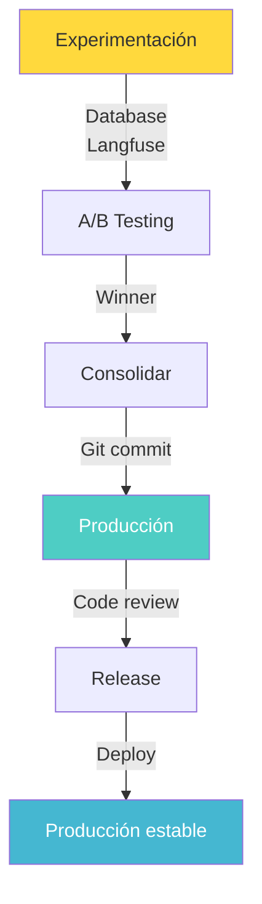
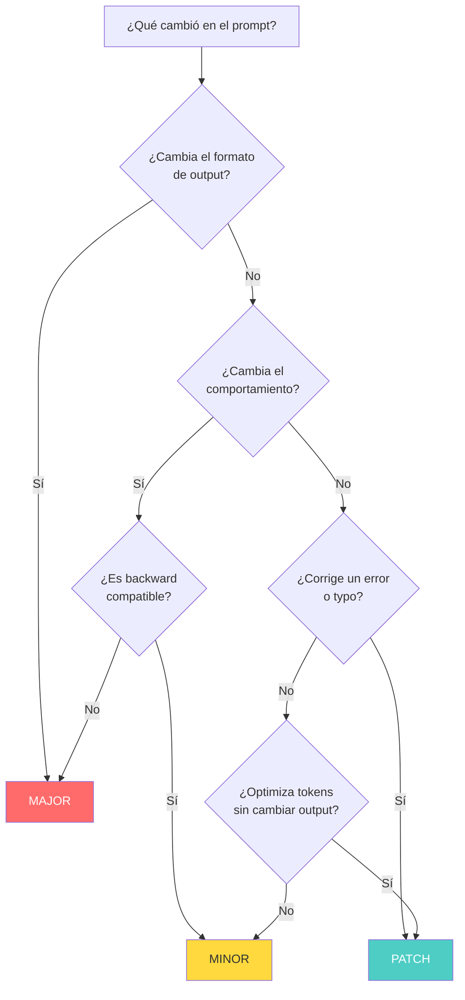
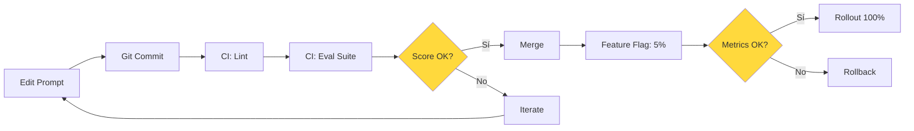

# Versionado de Prompts como Código

> [!abstract] Resumen
> Los prompts son código que afecta directamente al comportamiento del sistema y deben versionarse con el mismo rigor. Las estrategias incluyen: ==versionado en Git== (prompts en repositorio), ==database-backed== (Langfuse, Braintrust) e híbrido. Se aplica *semantic versioning*: major (cambio de comportamiento), minor (mejora), patch (typo). Se cubren estrategias de migración al cambiar prompts, A/B testing de versiones, rollback, y cómo el sistema de skills de architect (`.architect.md`, `.architect/skills/*.md`) ==es una forma de prompts versionados==. ^resumen

---

## Por qué los prompts necesitan versionado

Un prompt no es "texto". Es ==código que determina el comportamiento de un sistema de IA==. Un cambio de una palabra en un prompt puede:

> [!danger] Impacto de cambios en prompts
> - **Cambiar el formato de salida**: Rompiendo parsers downstream
> - **Alterar el comportamiento**: El agente hace cosas diferentes
> - **Introducir alucinaciones**: Instrucciones ambiguas causan confabulación
> - **Afectar costes**: Más verbosidad = más tokens ([[cost-optimization]])
> - **Crear vulnerabilidades**: Instrucciones débiles permiten prompt injection ([[vigil-overview|vigil]])
> - **Violar compliance**: Cambios pueden incumplir regulaciones ([[licit-overview|licit]])

| Propiedad | Código Python | ==Prompt== |
|---|---|---|
| Afecta comportamiento | Sí | ==Sí== |
| Necesita review | Sí | ==Sí== |
| Puede introducir bugs | Sí | ==Sí (alucinaciones)== |
| Debe testearse | Sí | ==Sí (evals)== |
| Debe versionarse | Sí | ==Sí== |
| Puede causar incidentes | Sí | ==Sí== |

---

## Estrategias de versionado

### 1. Git-based (prompts en repositorio)

La estrategia más simple y robusta: los prompts viven como archivos en el repositorio de código.

> [!success] Ventajas del versionado en Git
> - **Familiar**: Mismo workflow que para código
> - **Atomic**: Cambios de prompt + código en el mismo commit
> - **Review**: Code review estándar para cambios de prompts
> - **History**: Historial completo con `git log`
> - **Rollback**: `git revert` para revertir cambios
> - **Branching**: Experimentar con prompts en branches

#### Estructura de directorio recomendada

```
prompts/
├── system/
│   ├── main.md                    # System prompt principal
│   ├── main.v2.1.md              # Versión anterior (archivo)
│   └── CHANGELOG.md              # Historial de cambios
├── tasks/
│   ├── code-review.md            # Prompt para code review
│   ├── test-generation.md        # Prompt para generación de tests
│   └── summarization.md          # Prompt para resumen
├── guardrails/
│   ├── safety.md                 # Instrucciones de seguridad
│   └── format.md                 # Instrucciones de formato
└── templates/
    ├── few-shot-classification.md
    └── chain-of-thought.md
```

> [!example]- Prompt versionado con metadata YAML
> ```markdown
> ---
> version: "2.3.1"
> created: 2025-05-15
> updated: 2025-06-01
> author: team-ai
> model_compatibility:
>   - claude-sonnet-4-20250514
>   - claude-opus-4-20250514
> eval_score: 0.92
> tokens_estimate: 450
> changelog:
>   - version: "2.3.1"
>     date: 2025-06-01
>     change: "Fix typo in output format instruction"
>   - version: "2.3.0"
>     date: 2025-05-28
>     change: "Add chain-of-thought for complex queries"
>   - version: "2.2.0"
>     date: 2025-05-15
>     change: "Improve handling of multi-language queries"
> ---
>
> # System Prompt: Code Review Agent
>
> You are an expert code reviewer. Your role is to review code changes
> and provide actionable, specific feedback.
>
> ## Instructions
>
> 1. Analyze the code diff provided
> 2. Identify issues in these categories:
>    - **Bugs**: Logic errors, edge cases, null checks
>    - **Security**: Injection, auth bypass, data leaks
>    - **Performance**: Unnecessary allocations, N+1 queries
>    - **Style**: Naming, structure, readability
> 3. Provide specific suggestions with code examples
> 4. Rate severity: critical, major, minor, nitpick
>
> ## Output Format
>
> Respond in JSON:
> ```json
> {
>   "summary": "Brief overall assessment",
>   "issues": [
>     {
>       "severity": "critical|major|minor|nitpick",
>       "category": "bug|security|performance|style",
>       "file": "path/to/file",
>       "line": 42,
>       "description": "What's wrong",
>       "suggestion": "How to fix it",
>       "code": "suggested code"
>     }
>   ],
>   "approval": "approve|request_changes|comment"
> }
> ```
> ```

### 2. Database-backed (Langfuse, Braintrust)

Los prompts se almacenan en una base de datos con UI de gestión, versionado automático y evaluación integrada.

> [!info] Herramientas database-backed
> | Herramienta | Tipo | ==Fortaleza== | Integración eval |
> |---|---|---|---|
> | Langfuse | Open-source | ==UI + observabilidad== | Sí |
> | Braintrust | SaaS | ==Eval-first== | Nativo |
> | PromptLayer | SaaS | Logging + versioning | Parcial |
> | Humanloop | SaaS | Collaborative editing | Sí |
> | Pezzo | Open-source | ==Self-hosted, simple== | Parcial |

> [!example]- Gestión de prompts con Langfuse
> ```python
> from langfuse import Langfuse
>
> langfuse = Langfuse()
>
> # Crear nueva versión de prompt
> langfuse.create_prompt(
>     name="code-review",
>     prompt="You are an expert code reviewer...",
>     config={
>         "model": "claude-sonnet-4-20250514",
>         "temperature": 0.3,
>         "max_tokens": 2000
>     },
>     labels=["production", "v2.3"]
> )
>
> # Obtener prompt en producción
> prompt = langfuse.get_prompt("code-review", label="production")
>
> # Usar en la aplicación
> response = await client.messages.create(
>     model=prompt.config["model"],
>     system=prompt.prompt,
>     messages=[{"role": "user", "content": code_diff}],
>     temperature=prompt.config["temperature"],
>     max_tokens=prompt.config["max_tokens"]
> )
>
> # Registrar uso para tracing
> langfuse.generation(
>     name="code-review",
>     prompt=prompt,
>     input=code_diff,
>     output=response.content[0].text,
>     model=prompt.config["model"]
> )
> ```

### 3. Enfoque híbrido

Combinar Git para prompts estables con database-backed para experimentación rápida.



> [!tip] Cuándo usar cada enfoque
> | Escenario | ==Recomendación== |
> |---|---|
> | Equipo pequeño, prompts estables | ==Git-based== |
> | Equipo grande, iteración rápida | Database-backed |
> | Compliance estricto | ==Git-based (auditabilidad)== |
> | Experimentación frecuente | Database-backed |
> | Mejor de ambos mundos | ==Híbrido== |

---

## Semantic Versioning para prompts

Aplicar *SemVer* a prompts proporciona comunicación clara sobre el impacto de los cambios.

### Definición

> [!warning] Semantic versioning para prompts
> | Tipo | Versión | ==Impacto== | Ejemplo |
> |---|---|---|---|
> | **Major** | `3.0.0` | ==Cambio de comportamiento== | Cambiar formato de output de texto a JSON |
> | **Minor** | `2.3.0` | ==Mejora compatible== | Añadir manejo de un nuevo caso |
> | **Patch** | `2.3.1` | ==Corrección sin impacto== | Corregir typo en instrucción |

### Guía para decidir la versión



### Registro de versiones

> [!example]- CHANGELOG para un prompt
> ```markdown
> # Changelog: System Prompt - Code Review
>
> ## [3.0.0] - 2025-06-01
> ### Breaking
> - Changed output format from markdown to JSON
> - Requires parser update in downstream services
>
> ## [2.3.1] - 2025-05-30
> ### Fixed
> - Fixed typo: "performace" → "performance"
> - No behavioral change
>
> ## [2.3.0] - 2025-05-28
> ### Added
> - Chain-of-thought reasoning for complex queries
> - Improved handling of multi-file diffs
>
> ## [2.2.0] - 2025-05-15
> ### Added
> - Multi-language support (Python, TypeScript, Go, Rust)
> - Security-specific review guidelines
>
> ## [2.1.0] - 2025-05-01
> ### Improved
> - More concise output (30% fewer tokens)
> - Better severity classification
> ```

---

## Migración de prompts

Cuando un cambio major requiere actualizar sistemas downstream.

### Estrategia de migración gradual

> [!info] Pasos para migración segura
> 1. **Preparar**: Crear nueva versión del prompt
> 2. **Evaluar**: Ejecutar evals comparativas (vieja vs nueva)
> 3. **Shadow**: Ejecutar nueva versión en parallel sin servir ([[canary-deployments-ia]])
> 4. **Canary**: Servir a un pequeño porcentaje de usuarios
> 5. **Rollout**: Incrementar gradualmente ([[feature-flags-ia]])
> 6. **Deprecar**: Marcar versión antigua como deprecated
> 7. **Eliminar**: Remover versión antigua tras periodo de gracia

```python
# Migración con feature flag
prompt_version = get_feature_flag(
    "prompt_code_review_version",
    default="v2.3",
    context={"user_id": user_id}
)

if prompt_version == "v3.0":
    prompt = load_prompt("prompts/system/main.v3.0.md")
    parser = JSONOutputParser()  # Nuevo parser para JSON
else:
    prompt = load_prompt("prompts/system/main.v2.3.md")
    parser = MarkdownOutputParser()  # Parser legacy

response = await agent.execute(prompt, input_data)
result = parser.parse(response)
```

---

## A/B testing de versiones de prompts

### Diseño del experimento

> [!tip] Métricas para A/B testing de prompts
> | Métrica | Medición | ==Significancia== |
> |---|---|---|
> | Calidad de output | LLM-as-judge | ==p < 0.05== |
> | Tokens consumidos | Token count | Ahorro ≥ 10% |
> | Latencia | Time to response | Diferencia ≤ 10% |
> | Tasa de error | Error rate | ==No incremento== |
> | User satisfaction | Feedback rating | Mejora ≥ 0.2 pts |

> [!example]- Framework de A/B testing para prompts
> ```python
> import random
> from dataclasses import dataclass
> from datetime import datetime
>
> @dataclass
> class PromptExperiment:
>     name: str
>     control_version: str
>     treatment_version: str
>     traffic_split: float  # 0.0 - 1.0, porcentaje para treatment
>     start_date: datetime
>     end_date: datetime | None = None
>     min_samples: int = 500
>
> class PromptABTester:
>     """A/B testing para versiones de prompts."""
>
>     def __init__(self, experiment: PromptExperiment):
>         self.experiment = experiment
>         self.results = {"control": [], "treatment": []}
>
>     def get_version(self, user_id: str) -> str:
>         """Asignar versión de forma determinística por user_id."""
>         # Hash determinístico para consistencia
>         import hashlib
>         h = hashlib.sha256(
>             f"{self.experiment.name}:{user_id}".encode()
>         ).hexdigest()
>         bucket = int(h[:8], 16) / 0xFFFFFFFF
>
>         if bucket < self.experiment.traffic_split:
>             return self.experiment.treatment_version
>         return self.experiment.control_version
>
>     def record_result(self, version: str, metrics: dict):
>         """Registrar resultado para una versión."""
>         group = "treatment" if version == self.experiment.treatment_version else "control"
>         self.results[group].append({
>             "timestamp": datetime.now(),
>             "version": version,
>             **metrics
>         })
>
>     def should_conclude(self) -> bool:
>         """¿Hay suficientes datos para concluir?"""
>         return (
>             len(self.results["control"]) >= self.experiment.min_samples and
>             len(self.results["treatment"]) >= self.experiment.min_samples
>         )
>
>     def analyze(self) -> dict:
>         """Analizar resultados del experimento."""
>         if not self.should_conclude():
>             return {
>                 "status": "in_progress",
>                 "control_samples": len(self.results["control"]),
>                 "treatment_samples": len(self.results["treatment"]),
>                 "min_required": self.experiment.min_samples
>             }
>
>         # Análisis estadístico
>         from scipy import stats
>         import numpy as np
>
>         control_quality = [r["quality_score"] for r in self.results["control"]]
>         treatment_quality = [r["quality_score"] for r in self.results["treatment"]]
>
>         t_stat, p_value = stats.ttest_ind(control_quality, treatment_quality)
>
>         return {
>             "status": "complete",
>             "control_mean": float(np.mean(control_quality)),
>             "treatment_mean": float(np.mean(treatment_quality)),
>             "p_value": float(p_value),
>             "significant": p_value < 0.05,
>             "winner": (
>                 "treatment" if np.mean(treatment_quality) > np.mean(control_quality)
>                 and p_value < 0.05
>                 else "control"
>             )
>         }
> ```

---

## Rollback de prompts

Ver [[rollback-strategies]] para estrategias completas. Para prompts específicamente:

### Rollback en Git

```bash
# Ver historial de cambios en el prompt
git log --oneline -- prompts/system/main.md

# Revertir el último cambio
git revert HEAD -- prompts/system/main.md

# Restaurar una versión específica
git checkout abc123 -- prompts/system/main.md
git commit -m "rollback: restore system prompt to v2.2"
```

### Rollback con feature flags

```python
# Rollback instantáneo via feature flag
set_feature_flag("prompt_code_review_version", "v2.3")  # Versión anterior
```

---

## Skills de architect como prompts versionados

El sistema de *skills* de [[architect-overview|architect]] es una implementación nativa de prompts versionados:

### Estructura de skills

> [!info] El sistema de skills de architect
> | Archivo | ==Propósito== | Versionado |
> |---|---|---|
> | `.architect.md` | ==System prompt principal== | Git |
> | `.architect/skills/*.md` | ==Skills especializados== | Git |
> | `.architect/config.yaml` | Configuración | Git |

```
.architect.md                    # "Eres un agente de desarrollo..."
.architect/
├── skills/
│   ├── code-review.md          # Skill: revisión de código
│   ├── test-generation.md      # Skill: generación de tests
│   ├── refactoring.md          # Skill: refactorización
│   └── documentation.md       # Skill: documentación
└── config.yaml                 # Configuración global
```

> [!success] Los skills son prompts versionados en Git
> - Cada skill es un archivo Markdown con instrucciones especializadas
> - Viven en Git → historial completo, review, rollback
> - Se pueden versionar independientemente del código
> - El `.architect.md` es el system prompt → ==versionado como código==
> - Los cambios en skills siguen el mismo workflow de PR/review

### Ejemplo de skill como prompt versionado

> [!example]- Skill de code review
> ```markdown
> ---
> name: code-review
> version: "1.2.0"
> description: "Review code changes for quality and security"
> triggers:
>   - "review this code"
>   - "check this PR"
> ---
>
> # Code Review Skill
>
> When reviewing code:
>
> 1. Read the full diff carefully
> 2. Check for:
>    - Logic errors and edge cases
>    - Security vulnerabilities (see vigil guidelines)
>    - Performance issues
>    - Code style consistency
> 3. Provide specific, actionable feedback
> 4. Suggest concrete code improvements
> 5. Rate each issue: critical, major, minor, nitpick
>
> Always explain WHY something is an issue, not just WHAT.
> ```

---

## Pipeline de versionado de prompts



> [!question] ¿Cuándo iterar el prompt vs cambiar el modelo?
> - **Iterar prompt**: Si el modelo puede hacerlo pero las instrucciones son confusas
> - **Cambiar modelo**: Si el modelo no tiene la capacidad requerida
> - **Ambos**: Si se necesita un salto cualitativo en performance
> - **Ni uno ni otro**: Si el problema es en los datos/contexto, no en el prompt

---

## Relación con el ecosistema

El versionado de prompts es la práctica que conecta el desarrollo con la operación de todo el ecosistema:

- **[[intake-overview|Intake]]**: Los prompts que intake usa para parsear issues son prompts versionados — cambios en cómo intake interpreta issues siguen el workflow de prompt versioning
- **[[architect-overview|Architect]]**: El sistema de skills de architect (`.architect.md`, `.architect/skills/*.md`) es la implementación más directa de prompts versionados en el ecosistema — cada skill es un prompt con metadata y versionado Git
- **[[vigil-overview|Vigil]]**: Vigil escanea prompts versionados por vulnerabilidades de prompt injection — cada nueva versión de prompt pasa por el escaneo de seguridad en CI
- **[[licit-overview|Licit]]**: Licit verifica que los cambios de prompts mantienen compliance — un prompt que elimina instrucciones de seguridad puede violar regulaciones

---

## Enlaces y referencias

> [!quote]- Bibliografía y recursos
> - Langfuse. "Prompt Management Documentation." 2024. [^1]
> - Braintrust. "Prompt Engineering Best Practices." 2024. [^2]
> - Anthropic. "Prompt Engineering Guide." 2024. [^3]
> - OpenAI. "Prompt Engineering Best Practices." 2024. [^4]
> - Anthropic. "Architect Skills System Reference." 2025. [^5]

[^1]: Documentación de Langfuse sobre gestión de prompts con versionado y evaluación
[^2]: Guía de Braintrust sobre mejores prácticas de prompt engineering con eval-driven development
[^3]: Guía oficial de Anthropic sobre prompt engineering para Claude
[^4]: Guía de OpenAI sobre mejores prácticas de prompt engineering
[^5]: Referencia del sistema de skills de architect como implementación de prompts versionados
