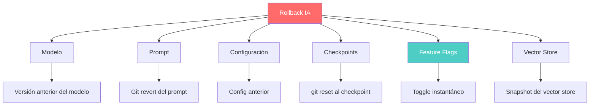
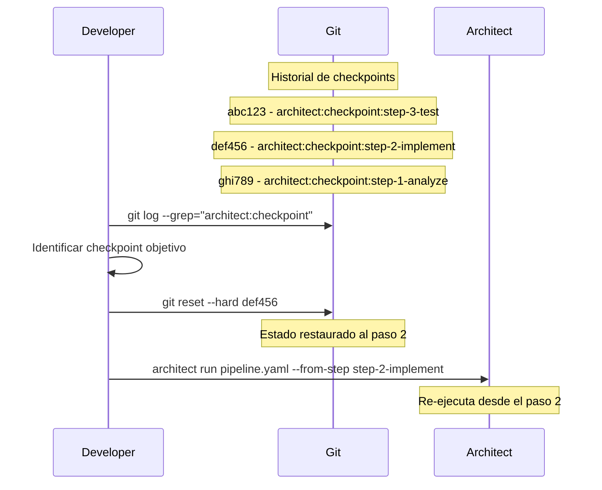
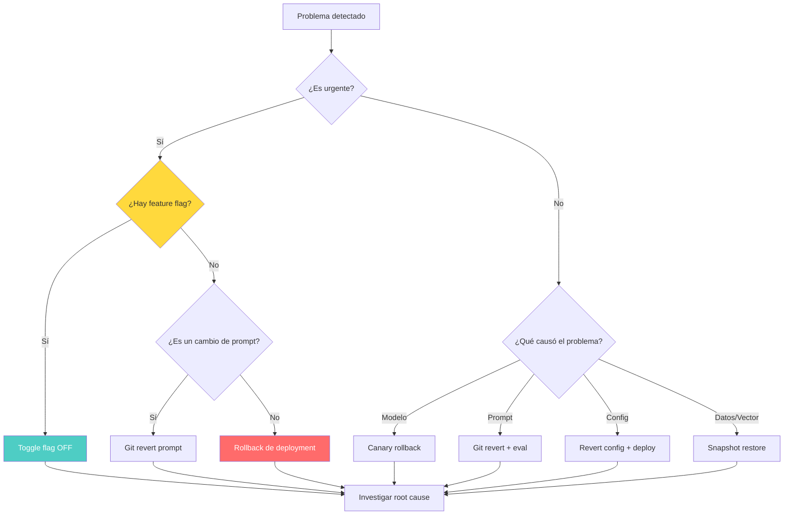

# Estrategias de Rollback para Sistemas de IA

> [!abstract] Resumen
> Los sistemas de IA tienen ==múltiples dimensiones de rollback==: modelo (revertir a versión anterior), prompt (revertir cambios de prompt vía git), configuración (revertir config del agente), checkpoints de architect (==`git reset --hard` al commit del checkpoint==) y feature flags (rollback instantáneo vía toggle). Este documento cubre cada estrategia, incluyendo consideraciones para ==rollback de vector stores== y la relación entre rollback y recuperación. ^resumen

---

## Dimensiones del rollback en IA

A diferencia del software tradicional donde el rollback implica revertir código, los sistemas de IA tienen múltiples dimensiones que pueden revertirse de forma independiente o conjunta.



> [!danger] No todos los rollbacks son iguales
> | Tipo | ==Velocidad== | Riesgo | Coste |
> |---|---|---|---|
> | Feature flag | ==Instantáneo== | Bajo | Ninguno |
> | Prompt (git) | Segundos | Bajo | Ninguno |
> | Configuración | Minutos | Medio | Re-deploy |
> | Modelo | ==Minutos-horas== | Medio | Re-deploy |
> | Vector store | Horas | ==Alto== | Reindexación |
> | Checkpoint | Segundos | Medio | Re-ejecución parcial |

---

## 1. Rollback de modelo

Revertir a una versión anterior del modelo cuando el nuevo modelo causa problemas.

### Escenarios de rollback de modelo

> [!warning] Cuándo revertir un modelo
> - Aumento de alucinaciones tras cambio de modelo
> - Degradación de calidad en tareas específicas
> - Aumento inesperado de costes
> - Incompatibilidad con prompts existentes
> - Problemas de latencia

### Implementación

> [!example]- Model rollback con registry
> ```python
> from dataclasses import dataclass
> from datetime import datetime
>
> @dataclass
> class ModelVersion:
>     model_id: str
>     version: str
>     deployed_at: datetime
>     metrics: dict
>     config: dict
>
> class ModelRegistry:
>     """Registry de versiones de modelo con rollback."""
>
>     def __init__(self):
>         self.versions: list[ModelVersion] = []
>         self.current_index: int = -1
>
>     def deploy(self, model_version: ModelVersion):
>         """Registrar despliegue de nueva versión."""
>         self.versions.append(model_version)
>         self.current_index = len(self.versions) - 1
>
>     def rollback(self, steps: int = 1) -> ModelVersion:
>         """Revertir N versiones atrás."""
>         target_index = max(0, self.current_index - steps)
>         previous = self.versions[target_index]
>
>         # Registrar el rollback como un nuevo evento
>         rollback_record = ModelVersion(
>             model_id=previous.model_id,
>             version=f"{previous.version}-rollback",
>             deployed_at=datetime.now(),
>             metrics={},
>             config=previous.config
>         )
>         self.versions.append(rollback_record)
>         self.current_index = len(self.versions) - 1
>
>         return previous
>
>     def get_current(self) -> ModelVersion:
>         return self.versions[self.current_index]
>
>     def get_history(self) -> list[ModelVersion]:
>         return self.versions
> ```

### Consideraciones al revertir modelo

> [!tip] Checklist de rollback de modelo
> - [ ] ¿Los prompts actuales son compatibles con el modelo anterior?
> - [ ] ¿Las evaluaciones del modelo anterior aún son válidas?
> - [ ] ¿El modelo anterior soporta las features actuales (tool use, vision)?
> - [ ] ¿El coste del modelo anterior es aceptable?
> - [ ] ¿Hay dependencias de formato de output que cambien?

---

## 2. Rollback de prompt

Los prompts versionados en Git ([[prompt-versioning]]) permiten rollback preciso usando operaciones Git estándar.

### Rollback vía git

```bash
# Ver historial de cambios en prompts
git log --oneline -- prompts/

# Output:
# a1b2c3d Update system prompt to v2.3
# e4f5g6h Refactor RAG prompt for better retrieval
# i7j8k9l Fix hallucination in summary prompt
# m1n2o3p Initial prompt v2.0

# Revertir un prompt específico
git revert a1b2c3d -- prompts/system-prompt.md

# O restaurar una versión anterior
git checkout e4f5g6h -- prompts/system-prompt.md
```

### Rollback por semantic version

Si se usa *semantic versioning* para prompts (ver [[prompt-versioning]]):

| Cambio | Tipo | ==Impacto del rollback== |
|---|---|---|
| Corrección de typo | Patch (v2.0.1 → v2.0.0) | ==Mínimo== |
| Mejora de instrucciones | Minor (v2.1.0 → v2.0.0) | Bajo |
| Cambio de comportamiento | ==Major (v3.0.0 → v2.x.x)== | ==Significativo== |

> [!warning] Rollback de prompt puede romper evaluaciones
> Si las eval suites se actualizaron para la nueva versión del prompt, revertir el prompt puede hacer que las evals fallen. Considerar revertir las evals también.

---

## 3. Rollback de configuración

Revertir la configuración del agente (temperatura, max_tokens, tools habilitadas, etc.).

> [!info] Configuración como código
> La configuración del agente debe vivir en Git junto con el código y los prompts:
> ```yaml
> # config/agent.yaml (versión actual)
> model: claude-sonnet-4-20250514
> temperature: 0.7
> max_tokens: 4096
> tools:
>   - code_editor
>   - terminal
>   - web_search
> guardrails:
>   max_steps: 50
>   budget_usd: 5.00
>   content_filter: moderate
> ```

```bash
# Rollback de configuración
git revert HEAD -- config/agent.yaml

# O restaurar una versión específica
git checkout v1.2.3 -- config/agent.yaml
```

---

## 4. Rollback con checkpoints de architect

Los *checkpoint commits* de [[architect-overview|architect]] (con prefijo `architect:checkpoint:step-name`) son la base más sólida para rollback de cambios generados por agentes.

### Flujo de rollback con checkpoints



### Comandos de rollback

```bash
# Listar checkpoints disponibles
git log --oneline --grep="architect:checkpoint"

# Rollback completo al checkpoint del paso 1
git reset --hard $(git log --grep="architect:checkpoint:step-1" --format="%H" -1)

# Rollback suave (mantener cambios como unstaged)
git reset --soft $(git log --grep="architect:checkpoint:step-2" --format="%H" -1)

# Ver qué cambió entre checkpoints
git diff checkpoint-step-1..checkpoint-step-3 -- src/

# Reanudar pipeline desde checkpoint
architect run pipeline.yaml --from-step step-2-implement
```

> [!success] Ventajas del rollback por checkpoint
> - **Granularidad**: Revertir paso a paso, no todo-o-nada
> - **Ahorro**: No re-ejecutar pasos costosos ya validados ([[cost-optimization]])
> - **Auditoría**: Cada checkpoint tiene metadata de sesión y coste
> - **Reproducibilidad**: El mismo checkpoint produce el mismo estado

---

## 5. Rollback con feature flags

El rollback más rápido: cambiar un *feature flag* para revertir comportamiento instantáneamente sin deploy.

### Escenarios de rollback instantáneo

> [!tip] Feature flags como primer recurso de rollback
> | Escenario | Flag | ==Acción== |
> |---|---|---|
> | Nuevo modelo falla | `model_v2_enabled` | ==Toggle OFF== |
> | Prompt causa alucinaciones | `prompt_version` | ==Cambiar a v1== |
> | Agente ejecuta acciones no deseadas | `agent_autonomous` | ==Toggle OFF== |
> | Costes se disparan | `cost_circuit_breaker` | ==Toggle ON== |
> | Guardrails demasiado permisivos | `guardrail_level` | ==Cambiar a "strict"== |

Ver [[feature-flags-ia]] para implementación detallada.

### Velocidad de rollback por método

```mermaid
gantt
    title Tiempo de rollback por método
    dateFormat s
    axisFormat %S s

    section Feature Flag
    Toggle OFF :ff, 0, 1s

    section Prompt Git
    Git revert + Deploy :pg, 0, 30s

    section Config
    Update + Deploy :cfg, 0, 120s

    section Modelo
    Swap + Validate :mdl, 0, 300s

    section Vector Store
    Restore snapshot :vs, 0, 3600s
```



---

## 6. Rollback de vector stores

El rollback de *vector stores* es el más complejo porque involucra datos de embedding que pueden tener dependencias con el modelo de embedding usado.

> [!danger] Complejidades del rollback de vector stores
> - **Modelo de embedding**: Si se cambió el modelo de embedding, los vectores antiguos no son compatibles
> - **Datos incrementales**: Los datos se añaden continuamente, no hay "versiones" claras
> - **Tamaño**: Los vector stores pueden ser enormes (millones de vectores)
> - **Tiempo**: La reindexación puede tomar horas o días
> - **Consistencia**: Durante el rollback, las búsquedas pueden devolver resultados inconsistentes

### Estrategias de rollback para vector stores

| Estrategia | ==Tiempo== | Complejidad | Coste |
|---|---|---|---|
| Snapshot/restore | ==Minutos-horas== | Baja | Almacenamiento |
| Dual-write con switch | ==Segundos== | Alta | ==2x almacenamiento== |
| Reindexación completa | ==Horas-días== | Media | Compute + API |
| Point-in-time recovery | Minutos | Media | Depende del DB |

> [!example]- Dual-write con switch para vector stores
> ```python
> class DualWriteVectorStore:
>     """Vector store con dual write para rollback instantáneo."""
>
>     def __init__(self, primary_collection: str, shadow_collection: str):
>         self.primary = VectorDB(collection=primary_collection)
>         self.shadow = VectorDB(collection=shadow_collection)
>         self.active = "primary"
>
>     async def upsert(self, documents: list[Document]):
>         """Escribir en ambas colecciones."""
>         await asyncio.gather(
>             self.primary.upsert(documents),
>             self.shadow.upsert(documents)
>         )
>
>     async def search(self, query: str, top_k: int = 5):
>         """Buscar en la colección activa."""
>         store = self.primary if self.active == "primary" else self.shadow
>         return await store.search(query, top_k)
>
>     def switch_to_shadow(self):
>         """Rollback instantáneo al shadow."""
>         self.active = "shadow"
>
>     def switch_to_primary(self):
>         """Volver al primary."""
>         self.active = "primary"
>
>     async def create_snapshot(self, name: str):
>         """Crear snapshot para point-in-time recovery."""
>         store = self.primary if self.active == "primary" else self.shadow
>         await store.create_snapshot(name)
>
>     async def restore_snapshot(self, name: str):
>         """Restaurar desde snapshot."""
>         inactive = "shadow" if self.active == "primary" else "primary"
>         store = self.shadow if inactive == "shadow" else self.primary
>         await store.restore_snapshot(name)
>         self.active = inactive
> ```

---

## Árbol de decisión para rollback



> [!question] ¿Cuándo NO hacer rollback?
> - El problema es intermitente y se resuelve solo (issue del proveedor)
> - El rollback causaría más problemas que el issue actual
> - El problema afecta a < 0.1% de usuarios y tiene workaround
> - Ya se tiene un fix listo que se puede desplegar rápidamente

---

## Automatización del rollback

### Rollback automático en CI/CD

> [!example]- Rollback automático en GitHub Actions
> ```yaml
> name: Auto Rollback
>
> on:
>   workflow_dispatch:
>     inputs:
>       rollback_type:
>         description: 'Tipo de rollback'
>         required: true
>         type: choice
>         options:
>           - feature-flag
>           - prompt
>           - model
>           - config
>           - checkpoint
>       target_version:
>         description: 'Versión o commit objetivo'
>         required: false
>         type: string
>
> jobs:
>   rollback:
>     runs-on: ubuntu-latest
>     steps:
>       - uses: actions/checkout@v4
>         with:
>           fetch-depth: 0
>
>       - name: Feature Flag Rollback
>         if: inputs.rollback_type == 'feature-flag'
>         run: |
>           curl -X PATCH "$FLAG_SERVICE_URL/flags/model_v2" \
>             -H "Authorization: Bearer $FLAG_TOKEN" \
>             -d '{"enabled": false}'
>
>       - name: Prompt Rollback
>         if: inputs.rollback_type == 'prompt'
>         run: |
>           git revert --no-commit ${{ inputs.target_version }}
>           git commit -m "rollback: revert prompt to pre-${{ inputs.target_version }}"
>           git push
>
>       - name: Checkpoint Rollback
>         if: inputs.rollback_type == 'checkpoint'
>         run: |
>           CHECKPOINT=$(git log --grep="architect:checkpoint:${{ inputs.target_version }}" --format="%H" -1)
>           git reset --hard $CHECKPOINT
>           git push --force-with-lease
>
>       - name: Verify Rollback
>         run: |
>           # Ejecutar smoke tests
>           pytest tests/smoke/ --timeout=60
>
>       - name: Notify
>         if: always()
>         run: |
>           curl -X POST "$SLACK_WEBHOOK" \
>             -d "{\"text\": \"Rollback ${{ inputs.rollback_type }} ejecutado. Status: ${{ job.status }}\"}"
> ```

---

## Post-rollback: investigación

> [!info] Después del rollback, investigar
> 1. **Recopilar evidencia**: Logs, métricas, traces del periodo problemático
> 2. **Identificar root cause**: ¿Qué cambio causó el problema?
> 3. **Evaluar impacto**: ¿Cuántos usuarios/requests afectados?
> 4. **Documentar**: Crear incident report con timeline
> 5. **Prevenir**: ¿Qué eval/test habría detectado esto antes del deploy?
> 6. **Mejorar**: Actualizar evals y monitoring para detectar problemas similares

---

## Relación con el ecosistema

Las estrategias de rollback son la red de seguridad que protege todo el ecosistema:

- **[[intake-overview|Intake]]**: Si intake genera especificaciones incorrectas desde issues, el rollback es revertir el prompt de intake y regenerar las specs afectadas
- **[[architect-overview|Architect]]**: Los checkpoints de architect son la infraestructura de rollback más granular — `git reset --hard` al commit `architect:checkpoint:step-name` restaura el estado exacto de ese paso
- **[[vigil-overview|Vigil]]**: Si un rollback introduce código que vigil marca como inseguro, el pipeline de CI bloquea el rollback hasta que se resuelva — los rollbacks no son exentos de escaneo de seguridad
- **[[licit-overview|Licit]]**: Licit verifica que los rollbacks mantienen compliance — revertir a un modelo anterior que no cumple una regulación nueva no es aceptable

---

## Enlaces y referencias

> [!quote]- Bibliografía y recursos
> - Nygard, Michael. "Release It!: Design and Deploy Production-Ready Software." Pragmatic Bookshelf, 2018. [^1]
> - Kim, Gene et al. "The DevOps Handbook." IT Revolution, 2016. [^2]
> - Google SRE. "Handling Overload and Cascading Failures." Site Reliability Engineering, 2016. [^3]
> - Anthropic. "Architect Checkpoint and Recovery Guide." 2025. [^4]
> - Pinecone. "Vector Database Backup and Recovery." 2024. [^5]

[^1]: Libro referencia sobre patrones de resiliencia incluyendo rollback en sistemas de producción
[^2]: Handbook de DevOps con capítulos sobre deployment seguro y rollback
[^3]: Prácticas de Google SRE para manejo de fallos que incluyen estrategias de rollback
[^4]: Guía de architect sobre checkpoints y recuperación en pipelines de agentes
[^5]: Documentación de Pinecone sobre backup y recovery de vector stores
