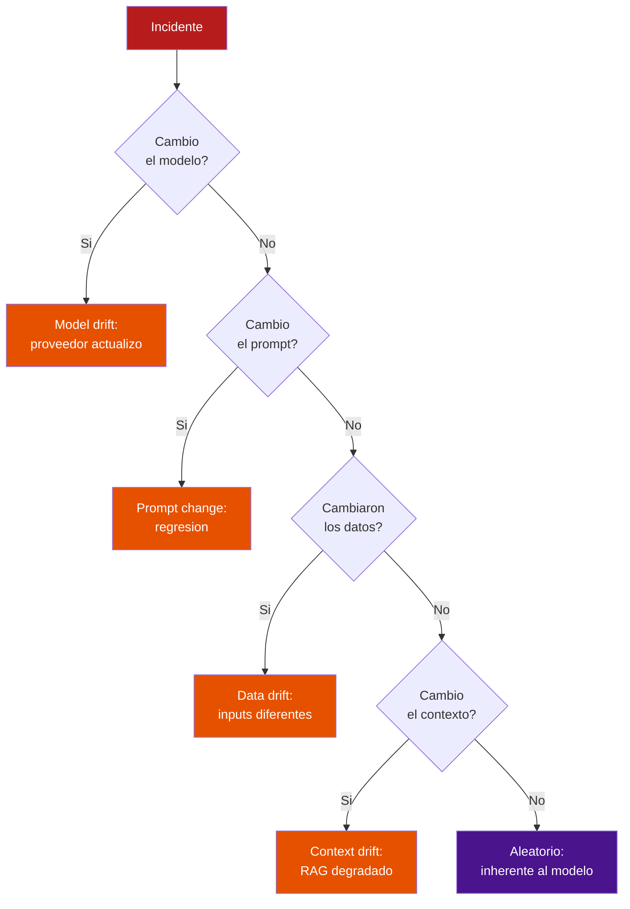
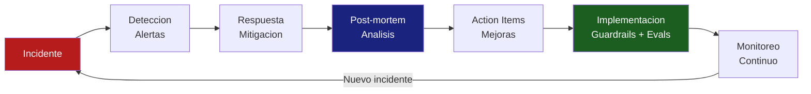

# Post-mortems para Incidentes de IA

> [!abstract] Resumen
> Los post-mortems de incidentes de IA requieren secciones adicionales que no existen en post-mortems tradicionales: ==analisis de comportamiento del modelo==, ==version del prompt==, ==analisis de contexto==, y ==replay de trazas==. La cultura *blame-free* es especialmente importante porque los fallos de IA a menudo no tienen un "culpable" humano: el modelo simplemente se comporto de forma inesperada. Las trazas de [[architect-overview]] y los scans de [[vigil-overview]] son herramientas clave para la investigacion forense de incidentes.
> ^resumen

---

## Por que los post-mortems de IA son diferentes

Los incidentes de IA tienen caracteristicas unicas que hacen que los post-mortems tradicionales sean insuficientes[^1]:

> [!warning] Diferencias clave
> | Aspecto | Incidente Tradicional | ==Incidente IA== |
> |---------|----------------------|------------------|
> | Causa raiz | Bug en codigo, config erronea | ==Comportamiento emergente del modelo== |
> | Reproducibilidad | Alta (mismo input = mismo output) | ==Baja (no-determinismo)== |
> | Evidencia | Stack traces, logs | ==Trazas + prompts + contexto + modelo== |
> | Culpabilidad | Commit especifico, persona | ==A menudo nadie: model drift, data drift== |
> | Prevencion | Fix + test | ==Fix + eval + monitoreo continuo== |
> | Complejidad causal | Lineal | ==Multi-factorial (modelo + datos + prompt)== |

---

## Template de post-mortem para IA

### Estructura completa

> [!info] Secciones del post-mortem IA
> 1. **Resumen ejecutivo**: que paso, en una frase
> 2. **Impacto**: usuarios afectados, duracion, datos comprometidos
> 3. **Timeline**: secuencia cronologica del incidente
> 4. **Analisis de comportamiento del modelo** *(IA-especifico)*
> 5. **Version del prompt y contexto** *(IA-especifico)*
> 6. **Replay de trazas** *(IA-especifico)*
> 7. **Causa raiz**: por que paso
> 8. **Que funciono bien**: lo que nos ayudo a detectar/resolver
> 9. **Que fallo**: lo que debio funcionar y no funciono
> 10. **Action items**: tareas concretas con responsable y fecha
> 11. **Lecciones aprendidas**

### 1. Resumen ejecutivo

```text
El [FECHA], el agente [NOMBRE] envio datos incorrectos a [N] usuarios
durante [DURACION]. La causa raiz fue [CAUSA]. El impacto fue [IMPACTO].
```

### 2. Impacto

| Dimension | ==Valor== |
|-----------|----------|
| Usuarios afectados | ==N usuarios== |
| Duracion | HH:MM |
| Datos comprometidos | Si/No, detalle |
| Coste financiero | $X (LLM) + $Y (compensaciones) |
| Error budget consumido | ==X% del mensual== |
| Reputacion | Alto/Medio/Bajo |

### 3. Timeline

> [!example]- Ejemplo de timeline
> ```text
> 2025-06-01 10:00 UTC  Model provider deploys update (unknown to us)
> 2025-06-01 10:15 UTC  First anomalous responses detected in traces
> 2025-06-01 10:30 UTC  Faithfulness score drops below SLO (0.75)
> 2025-06-01 10:45 UTC  Alert fires: QualityDegradation P2
> 2025-06-01 10:50 UTC  On-call acknowledges alert
> 2025-06-01 11:00 UTC  Investigation begins: traces show hallucinated data
> 2025-06-01 11:15 UTC  Root cause identified: model behavior changed
> 2025-06-01 11:20 UTC  Mitigation: switch to previous model version
> 2025-06-01 11:25 UTC  Quality metrics return to normal
> 2025-06-01 11:30 UTC  Incident declared resolved
> Total duration: 1h 30m
> Detection time: 30m (10:00 - 10:30)
> Response time: 20m (10:45 - 11:05)
> Resolution time: 25m (11:05 - 11:30)
> ```

### 4. Analisis de comportamiento del modelo (IA-especifico)

> [!danger] Esta seccion es critica y no existe en post-mortems tradicionales

| Pregunta | ==Respuesta esperada== |
|----------|----------------------|
| Que modelo estaba en uso? | ==Modelo exacto con version== |
| Cambio el modelo recientemente? | Si/No, cuando |
| El comportamiento fue consistente o intermitente? | Patron observado |
| Que tipo de error produjo? | Alucinacion, formato, rechazo, etc. |
| Afecto a todos los tipos de tarea o solo algunos? | Analisis de segmentacion |
| El mismo prompt en otro modelo produce el error? | Test de comparacion |



### 5. Version del prompt y contexto

| Elemento | Valor | ==Cambio reciente?== |
|----------|-------|---------------------|
| System prompt | v3.2.1 (hash: abc123) | ==No (sin cambios en 2 semanas)== |
| Tool descriptions | v2.1.0 | No |
| RAG documents | Last indexed: 2025-05-30 | ==Si (nuevos docs agregados)== |
| Few-shot examples | 5 examples | No |
| Temperature | 0.7 | No |
| Max tokens | 4096 | No |

### 6. Replay de trazas

Usar las trazas almacenadas para ==reproducir exactamente== lo que hizo el agente durante el incidente.

> [!tip] Como hacer replay de trazas
> 1. Obtener trazas del periodo del incidente desde [[tracing-agentes|Jaeger/Tempo]]
> 2. Filtrar por sesiones afectadas (usar `session_id` de logs)
> 3. Examinar la secuencia de pasos: LLM calls → tool calls → respuesta
> 4. Identificar el punto exacto donde el agente se desvio
> 5. Comparar con trazas del mismo tipo de tarea previas al incidente

> [!example]- Analisis de traza durante incidente
> ```text
> TRACE: sess_incident_001
> ├── Step 1: LLM Call (gpt-4o)
> │   ├── Input: 1,523 tokens (normal)
> │   ├── Output: 487 tokens (normal)
> │   └── Cost: $0.023 (normal)
> │
> ├── Step 2: Tool Call (search_database)
> │   ├── Success: true
> │   ├── Duration: 120ms
> │   └── Results: 5 documents (normal)
> │
> ├── Step 3: LLM Call (gpt-4o)       ← ANOMALIA
> │   ├── Input: 3,200 tokens (alto - incluye docs irrelevantes)
> │   ├── Output: 1,890 tokens (muy alto - verboso)
> │   ├── Cost: $0.087 (3.8x normal)
> │   └── Content: contiene datos fabricados sobre "Proyecto Fenix"
> │       que NO existe en los documentos de contexto
> │
> ├── Step 4: Tool Call (send_email)    ← IMPACTO
> │   ├── Success: true
> │   ├── Recipient: user@company.com
> │   └── Content: incluye datos alucinados del Step 3
> │
> └── RESULTADO: Email enviado con informacion incorrecta
>
> COMPARACION con trace normal (sess_normal_002):
> - Step 3 normalmente produce 400-600 tokens
> - Step 3 normalmente NO menciona proyectos que no existen
> - La diferencia parece estar en el modelo behavior post-update
> ```

---

## Cultura *blame-free*

> [!success] Principios de post-mortem blame-free en IA
> La cultura *blame-free* es ==especialmente importante== en IA porque:
> 1. **El modelo no es una persona**: no puedes "culpar" a GPT-4o
> 2. **Los fallos son emergentes**: nadie escribio un bug, el modelo genero comportamiento inesperado
> 3. **La prevencion es sistemica**: mejorar prompts, evals, guardrails - no castigar individuos
> 4. **La complejidad es real**: la interaccion modelo + datos + prompt + contexto crea comportamientos impredecibles

> [!quote] Cita relevante
> "No buscamos quien cometio el error; buscamos que condiciones del sistema permitieron que el error tuviera impacto."
> — Adaptado de Sidney Dekker, *The Field Guide to Understanding Human Error*[^2]

### Preguntas que SI hacer

- "Que condiciones del sistema permitieron este incidente?"
- "Que informacion le faltaba al equipo para prevenir esto?"
- "Que guardrails deberian haber existido?"
- "Que evaluaciones habrian detectado este problema antes de produccion?"

### Preguntas que NO hacer

> [!failure] Evitar
> - "Quien aprobo este prompt?"
> - "Por que no se probo mejor?"
> - "Quien decidio usar este modelo?"
>
> Estas preguntas buscan culpables, no mejoras del sistema.

---

## Ejemplo completo: agente alucina en produccion

> [!example]- Post-mortem completo: PM-2025-042
> ```markdown
> # PM-2025-042: Agente envio datos incorrectos por email
>
> ## Resumen
> El 2025-06-01, el agente de analisis financiero envio reportes
> con datos fabricados a 23 usuarios durante 1.5 horas.
>
> ## Impacto
> - 23 usuarios recibieron emails con datos incorrectos
> - 3 usuarios tomaron decisiones basadas en datos falsos
> - Duracion: 1h 30min
> - Coste LLM: $47.50 (normal: ~$15/dia)
> - Error budget consumido: 35% del mensual
>
> ## Causa Raiz
> El proveedor del modelo (OpenAI) actualizo gpt-4o el 31/05/2025.
> La actualizacion cambio el comportamiento de generacion cuando
> el contexto RAG contiene documentos parcialmente relevantes.
> El modelo empezo a "rellenar" informacion faltante con datos
> fabricados en lugar de indicar que no tenia la informacion.
>
> ## Analisis del modelo
> - Modelo: gpt-4o (version actualizada 2025-05-31)
> - Prompt: v3.2.1 (sin cambios desde 2025-05-15)
> - El mismo prompt con la version anterior del modelo: OK
> - El mismo prompt con gpt-4o-mini: OK (no alucina)
>
> ## Que funciono bien
> - Las trazas (architect OTel) permitieron replay exacto
> - La alerta de faithfulness detecto la degradacion en 30 min
> - El rollback a modelo anterior fue rapido (10 min)
>
> ## Que fallo
> - No teniamos alerta de cambio de modelo del proveedor
> - No teniamos guardrail pre-envio que verificara datos
> - La evaluacion de calidad era solo sobre muestreo (10%)
> - No teniamos canal de notificacion de model updates
>
> ## Action Items
> | # | Accion | Responsable | Fecha | Prioridad |
> |---|--------|-------------|-------|-----------|
> | 1 | Agregar guardrail pre-envio: verificar datos vs contexto | @alice | 2025-06-15 | P1 |
> | 2 | Implementar alerta de model drift (vigil) | @bob | 2025-06-20 | P1 |
> | 3 | Aumentar sampling de evaluacion a 25% | @carol | 2025-06-10 | P2 |
> | 4 | Agregar test de regresion con caso de alucinacion | @alice | 2025-06-15 | P2 |
> | 5 | Suscribirse a changelog de proveedores LLM | @dave | 2025-06-05 | P3 |
> | 6 | Documentar runbook para model drift | @bob | 2025-06-20 | P3 |
> ```

---

## Conexion con herramientas forenses

### Trazas de architect para investigacion

[[architect-overview]] proporciona trazas detalladas que son ==invaluables para post-mortems==:

| Dato de la traza | ==Utilidad en post-mortem== |
|-----------------|---------------------------|
| Session span con total_cost | ==Identificar sesiones anomalas por coste== |
| LLM call spans con tokens | Detectar llamadas con output inusual |
| Tool spans con success/duration | Identificar herramientas que fallaron |
| Step count y stop_reason | Detectar loops o budget exceeded |
| trace_id para correlacion con logs | ==Conectar traza con logs detallados== |

### Scans de vigil para forensics

[[vigil-overview]] aporta la dimension de seguridad a la investigacion:

> [!info] Uso de vigil en post-mortems
> - Ejecutar scan de vigil sobre los prompts involucrados en el incidente
> - Verificar si hay vulnerabilidades de *prompt injection* que pudieron contribuir
> - Los findings SARIF proporcionan evidencia estructurada con CWE mappings
> - Los reportes JUnit XML documentan el estado de seguridad al momento del incidente

---

## Categorias de incidentes IA

| Categoria | ==Ejemplo== | Frecuencia | Severidad |
|-----------|-----------|-----------|-----------|
| Alucinacion | ==Datos fabricados en respuesta== | Alta | Variable |
| Loop infinito | Agente repite misma accion | Media | Alta (coste) |
| Prompt injection | ==Usuario manipula comportamiento== | Baja | Critica |
| Data leak | Modelo expone datos de entrenamiento | Baja | ==Critica== |
| Model drift | Comportamiento cambia sin aviso | Media | Alta |
| Cost runaway | ==Sesion consume $100+== | Baja | Alta |
| Format break | Output incompatible con downstream | Media | Media |
| Context overflow | Respuesta truncada o incoherente | Media | Media |

> [!danger] Incidentes que requieren post-mortem obligatorio
> - Cualquier **data leak** (datos de usuario expuestos)
> - Cualquier **prompt injection exitoso**
> - Coste de sesion individual > ==10x el promedio==
> - Error budget de calidad > 50% consumido en un dia
> - Cualquier incidente que afecte a un ==SLA contractual==

---

## Prevencion: de post-mortem a mejora

El ciclo de mejora continua basado en post-mortems:



> [!success] Cada post-mortem debe mejorar el sistema
> Los action items tipicos de un post-mortem de IA:
> - [ ] Agregar evaluacion automatizada que detecte el problema
> - [ ] Agregar guardrail que prevenga el impacto
> - [ ] Mejorar alertas para deteccion mas rapida
> - [ ] Actualizar runbook con el nuevo escenario
> - [ ] Agregar test de regresion con el caso del incidente
> - [ ] Revisar SLOs si el error budget fue inadecuado

---

## Relacion con el ecosistema

- **[[intake-overview]]**: los incidentes pueden originarse en la capa de intake (datos corruptos, documentos mal parseados que contaminan el contexto RAG). El post-mortem debe investigar la calidad de los datos de intake como posible causa raiz
- **[[architect-overview]]**: las trazas OTel de architect son la herramienta forense principal para post-mortems. El replay de session spans con LLM call spans detallados permite reconstruir exactamente que hizo el agente durante el incidente
- **[[vigil-overview]]**: vigil proporciona la dimension de seguridad en el post-mortem. Los findings SARIF con CWE mappings documentan vulnerabilidades que pudieron contribuir. El scan post-incidente verifica si hay nuevas vulnerabilidades
- **[[licit-overview]]**: los post-mortems son un requisito de compliance en muchos frameworks. Licit debe archivar los post-mortems como evidencia de proceso de mejora continua. Los audit trails de licit complementan la timeline del incidente

---

## Enlaces y referencias

> [!quote]- Bibliografia y recursos
> - [^1]: Google SRE Book. Capitulo 15: "Postmortem Culture: Learning from Failure".
> - [^2]: Sidney Dekker. *The Field Guide to Understanding Human Error*. CRC Press, 2014.
> - [^3]: John Allspaw. "Blameless Post-Mortems". Etsy Code as Craft, 2012.
> - [^4]: PagerDuty Post-mortem Guide. https://postmortems.pagerduty.com/
> - [^5]: Increment Magazine. "On-Call". Issue 1, 2017.

[^1]: El capitulo de post-mortem del SRE Book establece el estandar de la industria para post-mortems blameless.
[^2]: Dekker argumenta que los errores humanos son sintomas de problemas del sistema, no causas raiz.
[^3]: Etsy fue pionera en la cultura de post-mortems blameless en la industria tech.
[^4]: PagerDuty proporciona templates y guias practicas para post-mortems efectivos.
[^5]: Increment ofrece perspectivas diversas sobre operaciones y respuesta a incidentes.
