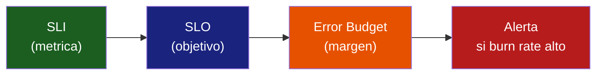

# Alerting para Sistemas IA

> [!abstract] Resumen
> Las alertas para sistemas de IA requieren dimensiones que no existen en software tradicional: ==degradacion de calidad== (caida de faithfulness), ==picos de coste==, ==saturacion de ventana de contexto==, ==rate limiting inminente==, y ==aumento de tasa de alucinaciones==. El diseno de alertas debe ser ==accionable y no ruidoso==. [[architect-overview]] implementa el hook `budget_warning` como mecanismo de alerta para costes. Este documento cubre alertas especificas de IA, niveles de severidad, integracion con *PagerDuty*/*OpsGenie*, y la importancia de links a *runbooks* en cada alerta.
> ^resumen

---

## Por que las alertas de IA son diferentes

Los sistemas de IA introducen modos de fallo que no existen en software convencional. Las alertas tradicionales (CPU > 90%, disco > 85%, 5xx > 1%) siguen siendo necesarias, pero no son suficientes[^1].

> [!warning] Modos de fallo unicos de la IA
> | Modo de Fallo | ==Detectable por Alertas Tradicionales?== | Ejemplo |
> |--------------|------------------------------------------|---------|
> | Alucinacion | ==No== | El agente inventa datos con confianza |
> | Degradacion de calidad | ==No== | Mismo prompt, peores respuestas tras update |
> | Pico de coste | ==No== | Agente en loop consume $50 en 10 min |
> | Context window overflow | ==No== | Respuestas truncadas por falta de contexto |
> | Rate limit inminente | Parcial | 80% del rate limit consumido |
> | Prompt injection | ==No== | Usuario manipula comportamiento del agente |
> | Model drift | ==No== | Proveedor actualiza modelo silenciosamente |

---

## Catalogo de alertas IA

### 1. Degradacion de calidad

> [!danger] Alerta critica: calidad por debajo de umbral
> **Condicion**: `avg(faithfulness_score) < 0.75` durante 1 hora
> **Severidad**: P2 (alta)
> **Accion**: Investigar cambio reciente de modelo, prompt, o datos

```yaml
# Prometheus alerting rule
groups:
  - name: ai_quality
    rules:
      - alert: QualityDegradation
        expr: |
          avg_over_time(agent_quality_faithfulness[1h]) < 0.75
        for: 30m
        labels:
          severity: high
          team: ai-platform
        annotations:
          summary: "Faithfulness score degradado"
          description: |
            El score de faithfulness ha caido por debajo de 0.75.
            Valor actual: {{ $value | printf "%.2f" }}
          runbook: "https://wiki/runbooks/ai-quality-degradation"
```

### 2. Picos de coste

[[architect-overview]] implementa `budget_warning` como mecanismo de alerta de coste a nivel de sesion. Pero tambien necesitas alertas a nivel de sistema.

| Alerta | ==Condicion== | Severidad | Ventana |
|--------|--------------|-----------|---------|
| Cost spike per session | ==session_cost > $1.00== | P2 | Inmediata |
| Cost spike per hour | ==hourly_cost > 2x baseline== | P2 | 15 min |
| Daily budget 80% | ==daily_cost > budget * 0.8== | P3 | 1h |
| Daily budget exceeded | ==daily_cost > budget== | ==P1== | Inmediata |
| Monthly projection over budget | projected > budget * 1.1 | P3 | 6h |

> [!example]- Alerta de coste en Prometheus
> ```yaml
> - alert: CostSpikePerHour
>   expr: |
>     increase(gen_ai_cost_usd_total[1h]) > 2 *
>     avg_over_time(increase(gen_ai_cost_usd_total[1h])[7d:1h])
>   for: 15m
>   labels:
>     severity: high
>   annotations:
>     summary: "Pico de coste detectado"
>     description: |
>       El coste de la ultima hora (${{ $value | printf "%.2f" }})
>       es mas del doble del baseline semanal.
>     runbook: "https://wiki/runbooks/ai-cost-spike"
> ```

### 3. Latencia elevada

```yaml
- alert: HighLatencyP95
  expr: |
    histogram_quantile(0.95,
      rate(gen_ai_latency_ms_bucket[5m])
    ) > 15000
  for: 5m
  labels:
    severity: high
  annotations:
    summary: "Latencia p95 > 15s"
    runbook: "https://wiki/runbooks/ai-high-latency"
```

> [!info] Causas comunes de latencia elevada en agentes
> 1. **Modelo lento**: el proveedor tiene problemas de rendimiento
> 2. **Agente en muchos pasos**: la tarea requiere mas pasos de lo normal
> 3. **Herramienta lenta**: una tool especifica esta tardando
> 4. **Rate limiting**: el agente espera por throttling
> 5. **Contexto grande**: prompts grandes aumentan la latencia

### 4. Tasa de error de modelo

| Tipo de Error | ==Umbral Alerta== | Accion |
|--------------|-------------------|--------|
| HTTP 429 (rate limit) | ==> 5/min== | Reducir concurrencia, agregar backoff |
| HTTP 500 (server) | > 3/min | Verificar status del proveedor |
| HTTP 400 (bad request) | > 1/min | Bug en formacion de requests |
| Timeout | ==> 3/min== | Aumentar timeout, investigar modelo |
| JSON parse error | > 5/min | Modelo genera formato invalido |

### 5. Saturacion de ventana de contexto

> [!warning] Alerta: ventana de contexto saturada
> Cuando el prompt se acerca al limite de tokens del modelo, las respuestas se truncan o degradan.
>
> **Condicion**: `input_tokens / max_context_tokens > 0.85`
> **Accion**: Reducir contexto, summarizar historial, usar modelo con ventana mayor

```yaml
- alert: ContextWindowSaturation
  expr: |
    gen_ai_usage_input_tokens
    / on(model) gen_ai_model_max_tokens > 0.85
  for: 5m
  labels:
    severity: warning
  annotations:
    summary: "Ventana de contexto al {{ $value | printf '%.0f' }}%"
    runbook: "https://wiki/runbooks/context-window-saturation"
```

### 6. Rate limit inminente

```yaml
- alert: RateLimitApproaching
  expr: |
    rate(gen_ai_calls_total[1m]) * 60
    / gen_ai_rate_limit_rpm > 0.80
  for: 2m
  labels:
    severity: warning
  annotations:
    summary: "Acercandose al rate limit ({{ $value | printf '%.0f' }}%)"
```

### 7. Aumento de tasa de alucinaciones

> [!danger] Esta alerta requiere evaluacion automatizada
> Para detectar alucinaciones en tiempo real necesitas un pipeline de evaluacion. Opciones:
> - LLM-as-judge ejecutado en muestreo de respuestas
> - Verificacion automatica contra fuentes de verdad
> - Deteccion de patrones de alucinacion comunes
>
> Ver [[prompt-monitoring]] y [[drift-detection]] para tecnicas de deteccion.

---

## Diseno de alertas accionables

> [!tip] Las 5 preguntas de una buena alerta
> Cada alerta debe responder:
> 1. **Que** esta pasando? (summary claro)
> 2. **Desde cuando**? (timestamp, duracion)
> 3. **Que tan grave** es? (severidad con criterio)
> 4. **Que hacer**? (link a runbook)
> 5. **Quien** es responsable? (equipo/persona)

### Niveles de severidad

| Severidad | ==Definicion== | Respuesta | Notificacion |
|-----------|---------------|-----------|--------------|
| P1 - Critical | ==Servicio caido o datos corruptos== | Inmediata, 24/7 | PagerDuty call |
| P2 - High | ==Degradacion significativa== | < 1 hora, horario | Slack + oncall |
| P3 - Warning | Anomalia que requiere atencion | < 4 horas, horario | Slack |
| P4 - Info | Informativo, no requiere accion | Proximo sprint | Email/dashboard |

### Mapeo de alertas IA a severidades

| Alerta | ==Severidad== |
|--------|---------------|
| Budget diario excedido | ==P1== |
| Faithfulness < 0.5 por > 1h | ==P1== |
| Error rate > 10% por > 5 min | ==P1== |
| Cost spike > 3x baseline | ==P2== |
| Faithfulness < 0.75 por > 1h | P2 |
| Latencia p95 > 20s por > 10 min | P2 |
| Rate limit > 80% | P3 |
| Context window > 85% | P3 |
| Tool failure rate > 15% | P3 |
| Cost proyectado > budget mensual | P4 |

---

## Reduccion de ruido

> [!failure] El mayor enemigo: alert fatigue
> Si tu equipo recibe 50 alertas al dia, dejaran de prestar atencion. Las alertas ==deben ser raras, claras y accionables==.

### Tecnicas anti-ruido

| Tecnica | ==Descripcion== | Ejemplo |
|---------|-----------------|---------|
| **Inhibition** | ==Suprimir alertas derivadas== | Si API caida, suprimir alertas de latencia |
| **Grouping** | Agrupar alertas relacionadas | Todos los errores 429 en una notificacion |
| **Silence windows** | No alertar durante mantenimiento | Silenciar durante deploy |
| **Hysteresis** | Esperar antes de alertar y antes de resolver | Alert for: 5m |
| **Rate limiting** | Limitar frecuencia de notificaciones | Max 1 alerta igual cada 30 min |

> [!example]- Configuracion de Alertmanager con inhibicion
> ```yaml
> # alertmanager.yml
> inhibit_rules:
>   # Si el servicio esta completamente caido, no alertar sobre latencia
>   - source_matchers:
>       - alertname = "ServiceDown"
>     target_matchers:
>       - alertname =~ "HighLatency|QualityDegradation|CostSpike"
>     equal: ['service']
>
>   # Si el proveedor LLM esta caido, no alertar sobre errores del agente
>   - source_matchers:
>       - alertname = "LLMProviderDown"
>     target_matchers:
>       - alertname =~ "ErrorRate|ToolFailure"
>     equal: ['provider']
>
> route:
>   group_by: ['alertname', 'service']
>   group_wait: 30s
>   group_interval: 5m
>   repeat_interval: 4h
>   receiver: 'slack-ai-team'
>
>   routes:
>     - matchers:
>         - severity = "critical"
>       receiver: 'pagerduty-ai-oncall'
>       repeat_interval: 15m
>
>     - matchers:
>         - severity = "warning"
>       receiver: 'slack-ai-team'
>       repeat_interval: 2h
> ```

---

## Runbooks para alertas de IA

Cada alerta debe tener un link a un *runbook* que guie al oncall a traves del diagnostico y la resolucion.

> [!success] Estructura de un runbook de IA
> 1. **Descripcion**: que significa esta alerta
> 2. **Impacto**: que afecta al usuario
> 3. **Diagnostico rapido** (< 5 min):
>    - Verificar dashboard de [[dashboards-ia|observabilidad]]
>    - Revisar logs recientes con el `session_id` afectado
>    - Verificar status del proveedor LLM
> 4. **Mitigacion inmediata**:
>    - Switchear a modelo de fallback
>    - Reducir rate limits
>    - Activar circuit breaker
> 5. **Investigacion profunda**:
>    - Revisar trazas en Jaeger ([[tracing-agentes]])
>    - Comparar con baseline historico
>    - Verificar cambios recientes (deploy, prompt update)
> 6. **Resolucion y post-mortem**: documentar en [[ai-postmortems]]

> [!example]- Runbook: Cost Spike
> ```markdown
> # Runbook: Cost Spike Detectado
>
> ## Diagnostico Rapido (< 5 min)
> 1. Abrir dashboard de coste: [link]
> 2. Identificar modelo responsable del spike
> 3. Verificar si hay sesiones individuales con coste anormalmente alto:
>    - Query: `topk(5, agent_session_cost_usd)`
> 4. Verificar si el trafico aumento (spike legitimo vs anomalia)
>
> ## Mitigacion Inmediata
> 1. Si hay una sesion individual con coste > $10:
>    - Identificar session_id
>    - Terminar sesion si esta activa: `POST /api/sessions/{id}/cancel`
> 2. Si el coste es distribuido entre muchas sesiones:
>    - Reducir max_steps temporalmente
>    - Switchear a modelo mas barato (gpt-4o-mini)
>    - Reducir rate limit de nuevas sesiones
>
> ## Investigacion
> 1. Buscar trazas de sesiones costosas en Jaeger
> 2. Verificar si hay loops (tool calls repetidos)
> 3. Verificar si hubo cambio de prompt reciente
> 4. Verificar si el proveedor cambio precios
>
> ## Escalacion
> - Si coste > $100 en 1h: escalar a P1, notificar engineering manager
> ```

---

## Integracion con PagerDuty/OpsGenie

### PagerDuty

> [!example]- Configuracion de PagerDuty para alertas de IA
> ```yaml
> # alertmanager.yml - receiver PagerDuty
> receivers:
>   - name: 'pagerduty-ai-oncall'
>     pagerduty_configs:
>       - routing_key: '<AI_TEAM_INTEGRATION_KEY>'
>         severity: '{{ .CommonLabels.severity }}'
>         description: '{{ .CommonAnnotations.summary }}'
>         details:
>           service: '{{ .CommonLabels.service }}'
>           model: '{{ .CommonLabels.model }}'
>           runbook: '{{ .CommonAnnotations.runbook }}'
>           dashboard: 'https://grafana/d/ai-overview'
>         # Incluir link a runbook como accion
>         links:
>           - href: '{{ .CommonAnnotations.runbook }}'
>             text: 'Runbook'
> ```

### Architect: budget_warning hook

[[architect-overview]] implementa un mecanismo de alerta propio para costes a nivel de sesion:

```python
# Hook budget_warning en architect
class CostTracker:
    def _fire_budget_warning(self):
        """Se dispara cuando total_cost >= warn_at_usd."""
        warning_data = {
            "event": "budget_warning",
            "total_cost_usd": self.total_cost,
            "warn_at_usd": self.warn_at_usd,
            "budget_usd": self.budget_usd,
            "steps_executed": len(self.steps),
            "session_id": self.session_id,
        }
        # Emitir log WARNING
        logger.warning("budget_warning_triggered", **warning_data)
        # Invocar hooks registrados
        for hook in self._budget_hooks:
            hook(warning_data)
```

> [!info] El budget_warning de architect como patron
> Este hook es un patron que cualquier sistema de agentes deberia implementar:
> - **warn_at_usd**: alerta temprana (ej: 80% del budget)
> - **budget_usd**: limite duro que detiene al agente
> - **Hooks registrables**: permiten enviar notificaciones a cualquier canal
>
> Ver [[cost-tracking]] para el detalle completo.

---

## Alertas basadas en SLOs

Las alertas basadas en *SLOs* (*Service Level Objectives*) son mas efectivas que las alertas basadas en umbrales estaticos porque alertan sobre ==impacto en el usuario==[^2].



> [!tip] Ejemplo de alerta basada en error budget
> - **SLO**: 95% de respuestas con faithfulness > 0.8
> - **Error budget**: 5% de respuestas pueden estar por debajo
> - **Alerta**: si el burn rate del error budget en 1h es > 10x lo normal
>
> Ver [[sla-slo-ai]] para definir SLOs especificos para sistemas de IA.

---

## Relacion con el ecosistema

- **[[intake-overview]]**: las alertas de intake (cola de ingesta creciendo, errores de parsing, datos corruptos) deben integrarse con el sistema de alertas del agente para evitar falsos positivos cuando la causa raiz esta en la capa de datos
- **[[architect-overview]]**: el hook `budget_warning` es el mecanismo de alerta a nivel de sesion. Los exporters OTel de architect alimentan las reglas de alerta a nivel de sistema en Prometheus/Grafana
- **[[vigil-overview]]**: hallazgos de seguridad de alta severidad (SARIF severity = error) deben generar alertas P2. La deteccion de *prompt injection* por vigil debe generar alertas inmediatas P1
- **[[licit-overview]]**: gaps de compliance detectados por licit deben generar alertas P3 para revision en horario de oficina, excepto violaciones criticas que requieren P1

---

## Enlaces y referencias

> [!quote]- Bibliografia y recursos
> - [^1]: Rob Ewaschuk. "My Philosophy on Alerting". Google SRE, 2015.
> - [^2]: Google SRE Workbook. Capitulo 5: "Alerting on SLOs".
> - [^3]: PagerDuty Incident Response Documentation. https://response.pagerduty.com/
> - [^4]: Prometheus Alerting Rules. https://prometheus.io/docs/prometheus/latest/configuration/alerting_rules/
> - [^5]: Alertmanager Configuration. https://prometheus.io/docs/alerting/latest/configuration/

[^1]: La filosofia de Rob Ewaschuk sobre alertas sigue siendo la referencia principal 10 anos despues.
[^2]: Las alertas basadas en SLOs son mas eficientes porque miden impacto real, no umbrales arbitrarios.
[^3]: PagerDuty proporciona el proceso de incident response mas maduro del mercado.
[^4]: Prometheus alerting rules son el estandar de facto para alertas basadas en metricas.
[^5]: Alertmanager gestiona la deduplicacion, agrupacion y routing de alertas.
