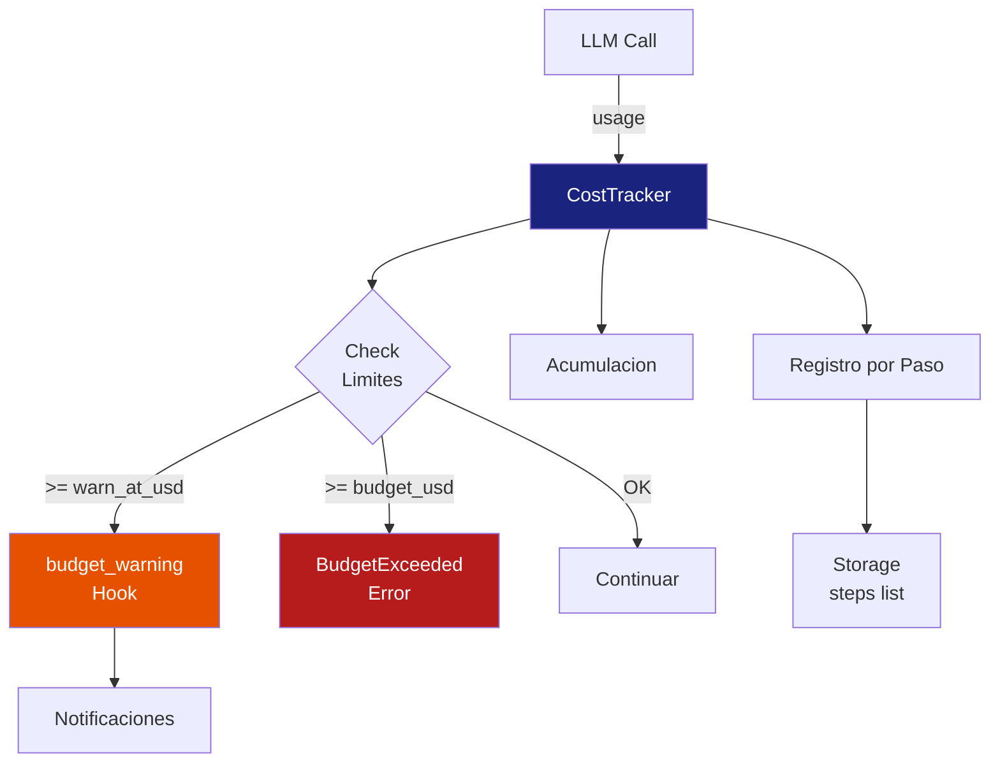
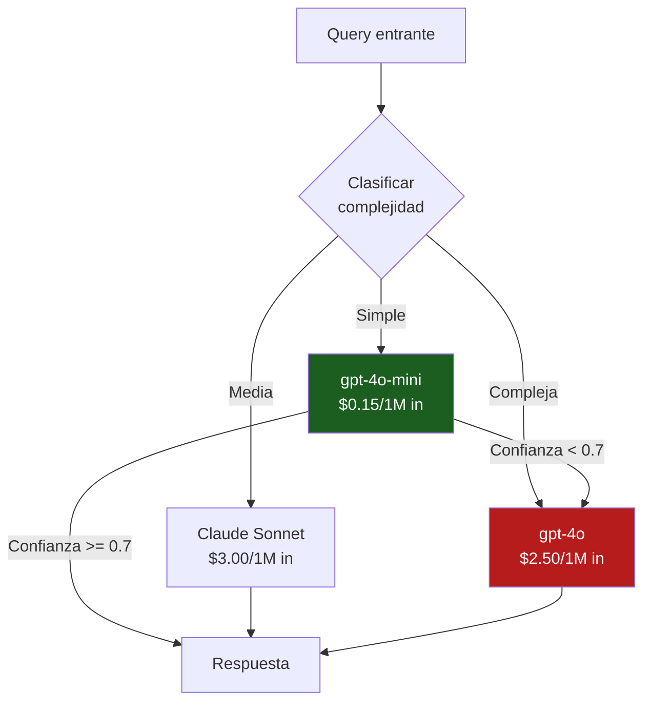

# Cost Tracking en Tiempo Real para Sistemas IA

> [!abstract] Resumen
> El *cost tracking* en tiempo real es ==vital== para sistemas de IA porque cada llamada LLM tiene un ==coste variable y significativo==. La formula base es: `input_tokens * precio_input + output_tokens * precio_output + cached_tokens * precio_cache`. [[architect-overview]] implementa `CostTracker` con registro por paso, umbral de advertencia (`warn_at_usd`), y limite duro (`budget_usd`). La agregacion por usuario, feature, modelo y dia permite optimizar costes. Los dashboards de *cost burn rate* y *projected monthly spend* son esenciales. Herramientas como *Helicone* y *Portkey* ofrecen soluciones llave en mano.
> ^resumen

---

## Formula de coste por request

El coste de cada llamada LLM se calcula con una formula directa pero con matices importantes[^1]:

```
coste_total = (input_tokens * precio_input_por_token)
            + (output_tokens * precio_output_por_token)
            + (cached_tokens * precio_cache_por_token)
```

### Precios por modelo (referencia 2025)

> [!warning] Precios sujetos a cambio
> Los precios de los proveedores LLM cambian frecuentemente. Estos valores son de referencia.

| Modelo | ==Input ($/1M tokens)== | ==Output ($/1M tokens)== | Cache ($/1M tokens) |
|--------|------------------------|-------------------------|---------------------|
| GPT-4o | ==$2.50== | ==$10.00== | $1.25 |
| GPT-4o-mini | $0.15 | $0.60 | $0.075 |
| Claude Sonnet 4 | ==$3.00== | ==$15.00== | $0.30 |
| Claude Haiku 3.5 | $0.80 | $4.00 | $0.08 |
| Gemini 1.5 Pro | $1.25 | $5.00 | $0.315 |
| Gemini 1.5 Flash | $0.075 | $0.30 | $0.01875 |

> [!tip] El output siempre es mas caro
> Los tokens de salida cuestan ==3-5x mas== que los de entrada. Optimizar la verbosidad de las respuestas tiene impacto directo en costes. Tecnicas:
> - Instruir al modelo a ser conciso
> - Limitar `max_tokens` adecuadamente
> - Usar modelos mas baratos para tareas simples

---

## CostTracker de architect

[[architect-overview]] implementa `CostTracker`, un componente de referencia para rastreo de costes en agentes.

### Arquitectura



### Implementacion

> [!example]- CostTracker completo
> ```python
> from dataclasses import dataclass, field
> from typing import Callable, Optional
> import logging
>
> logger = logging.getLogger(__name__)
>
> # Precios por modelo (USD por token)
> MODEL_PRICES = {
>     "gpt-4o": {
>         "input": 2.50 / 1_000_000,
>         "output": 10.00 / 1_000_000,
>         "cached": 1.25 / 1_000_000,
>     },
>     "gpt-4o-mini": {
>         "input": 0.15 / 1_000_000,
>         "output": 0.60 / 1_000_000,
>         "cached": 0.075 / 1_000_000,
>     },
>     "claude-sonnet-4-20250514": {
>         "input": 3.00 / 1_000_000,
>         "output": 15.00 / 1_000_000,
>         "cached": 0.30 / 1_000_000,
>     },
> }
>
> @dataclass
> class StepCost:
>     step: int
>     model: str
>     input_tokens: int
>     output_tokens: int
>     cached_tokens: int
>     cost_usd: float
>     cumulative_cost_usd: float
>
> class BudgetExceededError(Exception):
>     pass
>
> class CostTracker:
>     def __init__(
>         self,
>         budget_usd: float = 5.0,
>         warn_at_usd: Optional[float] = None,
>         session_id: str = "",
>     ):
>         self.budget_usd = budget_usd
>         self.warn_at_usd = warn_at_usd or budget_usd * 0.8
>         self.session_id = session_id
>         self.total_cost = 0.0
>         self.steps: list[StepCost] = []
>         self._budget_hooks: list[Callable] = []
>         self._warning_fired = False
>
>     def on_budget_warning(self, hook: Callable):
>         self._budget_hooks.append(hook)
>
>     def record_step(
>         self, step: int, model: str,
>         input_tokens: int, output_tokens: int,
>         cached_tokens: int = 0,
>     ) -> StepCost:
>         cost = self._calculate_cost(
>             model, input_tokens, output_tokens, cached_tokens
>         )
>         self.total_cost += cost
>
>         step_cost = StepCost(
>             step=step, model=model,
>             input_tokens=input_tokens,
>             output_tokens=output_tokens,
>             cached_tokens=cached_tokens,
>             cost_usd=cost,
>             cumulative_cost_usd=self.total_cost,
>         )
>         self.steps.append(step_cost)
>
>         # Check limites
>         if self.total_cost >= self.budget_usd:
>             logger.error("budget_exceeded",
>                         total=self.total_cost,
>                         budget=self.budget_usd)
>             raise BudgetExceededError(
>                 f"Budget exceeded: ${self.total_cost:.4f} "
>                 f">= ${self.budget_usd:.2f}"
>             )
>
>         if (not self._warning_fired and
>             self.total_cost >= self.warn_at_usd):
>             self._fire_budget_warning()
>
>         return step_cost
>
>     def _calculate_cost(
>         self, model: str, input_tokens: int,
>         output_tokens: int, cached_tokens: int,
>     ) -> float:
>         prices = MODEL_PRICES.get(model, MODEL_PRICES["gpt-4o"])
>         return (
>             input_tokens * prices["input"]
>             + output_tokens * prices["output"]
>             + cached_tokens * prices["cached"]
>         )
>
>     def _fire_budget_warning(self):
>         self._warning_fired = True
>         warning_data = {
>             "event": "budget_warning",
>             "total_cost_usd": self.total_cost,
>             "warn_at_usd": self.warn_at_usd,
>             "budget_usd": self.budget_usd,
>             "steps_executed": len(self.steps),
>             "session_id": self.session_id,
>         }
>         logger.warning("budget_warning_triggered",
>                       extra=warning_data)
>         for hook in self._budget_hooks:
>             hook(warning_data)
> ```

---

## Agregacion de costes

La agregacion permite entender ==donde se gasta el dinero== y tomar decisiones de optimizacion.

### Dimensiones de agregacion

| Dimension | ==Pregunta que responde== | Accion posible |
|-----------|--------------------------|----------------|
| Por usuario | ==Quien consume mas?== | Limites por usuario, tier de servicio |
| Por feature | ==Que funcionalidad cuesta mas?== | Optimizar o restringir features costosas |
| Por modelo | ==Que modelo consume mas presupuesto?== | Migrar tareas simples a modelos baratos |
| Por dia/hora | ==Cuando se gasta mas?== | Planificar capacidad, batch processing |
| Por tipo de tarea | Que tareas son mas costosas? | Optimizar prompts para tareas caras |
| Por equipo | Que equipo consume mas? | Chargeback interno |

### Esquema de base de datos

> [!example]- Esquema SQL para cost tracking
> ```sql
> CREATE TABLE llm_costs (
>     id SERIAL PRIMARY KEY,
>     timestamp TIMESTAMPTZ NOT NULL DEFAULT NOW(),
>     session_id VARCHAR(100) NOT NULL,
>     step_number INTEGER NOT NULL,
>     model VARCHAR(100) NOT NULL,
>     input_tokens INTEGER NOT NULL,
>     output_tokens INTEGER NOT NULL,
>     cached_tokens INTEGER DEFAULT 0,
>     cost_usd DECIMAL(10, 6) NOT NULL,
>     cumulative_cost_usd DECIMAL(10, 6) NOT NULL,
>     user_id VARCHAR(100),
>     feature VARCHAR(100),
>     team VARCHAR(100),
>     trace_id VARCHAR(64),
>     -- Indices para consultas comunes
>     INDEX idx_timestamp (timestamp),
>     INDEX idx_session (session_id),
>     INDEX idx_user (user_id),
>     INDEX idx_model (model)
> );
>
> -- Vista: coste por dia y modelo
> CREATE VIEW daily_cost_by_model AS
> SELECT
>     DATE_TRUNC('day', timestamp) AS day,
>     model,
>     SUM(cost_usd) AS total_cost,
>     COUNT(*) AS total_calls,
>     AVG(cost_usd) AS avg_cost_per_call,
>     SUM(input_tokens) AS total_input_tokens,
>     SUM(output_tokens) AS total_output_tokens
> FROM llm_costs
> GROUP BY DATE_TRUNC('day', timestamp), model;
>
> -- Vista: coste por usuario (top consumers)
> CREATE VIEW user_cost_ranking AS
> SELECT
>     user_id,
>     SUM(cost_usd) AS total_cost,
>     COUNT(DISTINCT session_id) AS total_sessions,
>     AVG(cost_usd) AS avg_cost_per_call,
>     MAX(cumulative_cost_usd) AS max_session_cost
> FROM llm_costs
> WHERE timestamp > NOW() - INTERVAL '30 days'
> GROUP BY user_id
> ORDER BY total_cost DESC;
> ```

---

## Dashboards de coste

### Paneles esenciales

| Panel | ==Tipo de Grafico== | Ventana |
|-------|---------------------|---------|
| Cost burn rate | ==Time series con budget line== | 24h |
| Projected monthly spend | Gauge con zonas verde/rojo | Instantaneo |
| Cost by model | Stacked area | 7d |
| Cost per user (top 10) | Bar chart horizontal | 30d |
| Cost anomaly detection | Time series con bandas | 24h |
| Cost per query histogram | Histogram | 7d |

> [!example]- Queries para dashboard de coste
> ```promql
> # Cost burn rate (acumulado hoy)
> increase(gen_ai_cost_usd_total[1d])
>
> # Projected monthly spend (basado en ultimos 7 dias)
> avg_over_time(increase(gen_ai_cost_usd_total[1d])[7d:1d]) * 30
>
> # Cost por modelo (last 24h)
> increase(gen_ai_cost_usd_total[24h]) by (model)
>
> # Cost anomaly: current vs baseline
> increase(gen_ai_cost_usd_total[1h])
> / avg_over_time(increase(gen_ai_cost_usd_total[1h])[7d:1h])
>
> # Top 5 usuarios por coste
> topk(5, sum by (user_id) (increase(gen_ai_cost_usd_total[24h])))
> ```

> [!danger] Alerta de coste: la mas importante
> El dashboard de coste debe ser ==el primer panel que ves cada manana==. Un agente mal configurado puede consumir cientos de dolares en minutos. Configura alertas agresivas:
> - Alerta a 80% del budget diario
> - Alerta si coste/hora > 2x baseline
> - Alerta si una sesion individual > $1
>
> Ver [[alerting-ia]] para configuracion completa de alertas.

---

## Optimizacion de costes

### Estrategias de reduccion

> [!success] Tecnicas probadas de optimizacion
> | Estrategia | ==Ahorro Estimado== | Complejidad |
> |-----------|---------------------|-------------|
> | Prompt caching | ==40-60%== en input tokens | Baja |
> | Model routing (simple → mini, complejo → 4o) | ==30-50%== | Media |
> | Reducir verbosidad de output | ==15-25%== | Baja |
> | Batch processing | 10-15% | Media |
> | Optimizar context window | ==20-35%== | Media |
> | Cache de respuestas exactas | Variable | Alta |
> | Limitar max_steps | Variable | Baja |

### Model routing inteligente



> [!tip] Implementar model routing
> 1. Clasificar la complejidad del query (puede ser heuristico o con un modelo pequeno)
> 2. Enviar queries simples al modelo mas barato
> 3. Si la confianza de la respuesta es baja, ==escalar al modelo caro==
> 4. Monitorear que el routing no degrade calidad ([[metricas-agentes]])

### Prompt caching

El *prompt caching* reduce costes al reutilizar prefijos de prompt que no cambian entre llamadas:

| Proveedor | ==Soporte de Cache== | Ahorro |
|-----------|---------------------|--------|
| Anthropic | ==Automatico (prefix caching)== | Hasta 90% en input |
| OpenAI | ==Automatico== | 50% en input cacheado |
| Google | Context caching (manual) | Variable |

```python
# El caching funciona automaticamente si el prefijo del prompt es identico
# Optimizar: system prompt largo + user prompt corto = maximo cache hit

messages = [
    {"role": "system", "content": LARGE_SYSTEM_PROMPT},  # Cacheado
    {"role": "user", "content": short_user_query},        # No cacheado
]
```

---

## Herramientas especializadas

### Helicone

*Helicone* es un proxy de observabilidad que se coloca entre tu aplicacion y la API del LLM:

| Feature | ==Detalle== |
|---------|-------------|
| Proxy transparente | ==Cambiar solo base URL, sin cambio de codigo== |
| Cost tracking | Automatico, por request |
| Rate limiting | Configurable por usuario/feature |
| Caching | Cache de respuestas para queries identicas |
| Analytics | Dashboard con metricas y costes |
| Open source | Si (parcialmente) |

```python
# Solo cambiar base_url para usar Helicone
client = openai.OpenAI(
    base_url="https://oai.helicone.ai/v1",
    default_headers={
        "Helicone-Auth": f"Bearer {HELICONE_API_KEY}",
        "Helicone-User-Id": user_id,
    },
)
```

### Portkey

*Portkey* ofrece un gateway de IA con observabilidad integrada:

> [!info] Capacidades de Portkey
> - Gateway multi-proveedor (OpenAI, Anthropic, Google, etc.)
> - Cost tracking automatico
> - Fallback entre proveedores
> - Rate limiting y caching
> - Virtual keys para gestion de API keys
> - Guardrails integrados

### Solucion custom con OTel

Para equipos que ya usan [[opentelemetry-ia|OpenTelemetry]], el cost tracking puede implementarse como atributos de span y metricas:

```python
# Registrar coste como atributo de span
span.set_attribute("gen_ai.cost.total_usd", cost)
span.set_attribute("gen_ai.cost.input_usd", input_cost)
span.set_attribute("gen_ai.cost.output_usd", output_cost)

# Registrar como metrica para agregacion
cost_counter.add(cost, attributes={
    "model": model,
    "user_id": user_id,
    "feature": feature,
})
```

---

## Presupuestos y limites

### Niveles de presupuesto

| Nivel | ==Quien lo controla== | Ejemplo |
|-------|----------------------|---------|
| Por sesion | ==CostTracker del agente== | $5 por sesion |
| Por usuario/dia | Middleware de la API | $20/usuario/dia |
| Por equipo/mes | Administracion | $500/equipo/mes |
| Global/mes | Finance | $5,000/mes total |

> [!question] Como definir presupuestos adecuados?
> 1. Analiza el coste historico por sesion (p95)
> 2. Define el limite como ==3-5x el p95== (margen para outliers)
> 3. El warn_at deberia ser ==80% del budget==
> 4. Revisa y ajusta mensualmente
> 5. Diferencia entre entornos (dev: $1, staging: $5, prod: $20)

---

## Relacion con el ecosistema

- **[[intake-overview]]**: el coste de procesamiento de datos en intake (embedding generation, chunking, parsing) debe sumarse al coste total del sistema IA. Un pipeline de intake ineficiente puede consumir budget significativo en embeddings
- **[[architect-overview]]**: implementa `CostTracker` de referencia con registro por paso, `warn_at_usd` como soft limit, `budget_usd` como hard limit, y hooks registrables para notificaciones. Los datos de coste se exportan como atributos OTel y en logs JSON
- **[[vigil-overview]]**: las ejecuciones de vigil no tienen coste LLM directo (analisis estatico y SARIF), pero la correlacion de hallazgos con sesiones costosas puede revelar que las sesiones mas caras son tambien las mas riesgosas
- **[[licit-overview]]**: el cost tracking proporciona la dimension financiera de los audit trails de licit. Para compliance financiero, es necesario demostrar control sobre el gasto en IA con limites, alertas y registros de cada transaccion

---

## Enlaces y referencias

> [!quote]- Bibliografia y recursos
> - [^1]: OpenAI Pricing. https://openai.com/pricing
> - [^2]: Anthropic Pricing. https://www.anthropic.com/pricing
> - [^3]: Helicone Documentation. https://docs.helicone.ai/
> - [^4]: Portkey Documentation. https://docs.portkey.ai/
> - [^5]: "Managing LLM Costs in Production". Blog post, various authors, 2024.

[^1]: Los precios de OpenAI han bajado consistentemente, especialmente para modelos pequenos.
[^2]: Anthropic ofrece descuentos significativos para prompt caching (hasta 90% en entrada).
[^3]: Helicone es la solucion proxy mas popular para cost tracking de LLM.
[^4]: Portkey ofrece un gateway multi-proveedor con observabilidad integrada.
[^5]: La gestion de costes LLM es una disciplina emergente que combina FinOps con MLOps.
