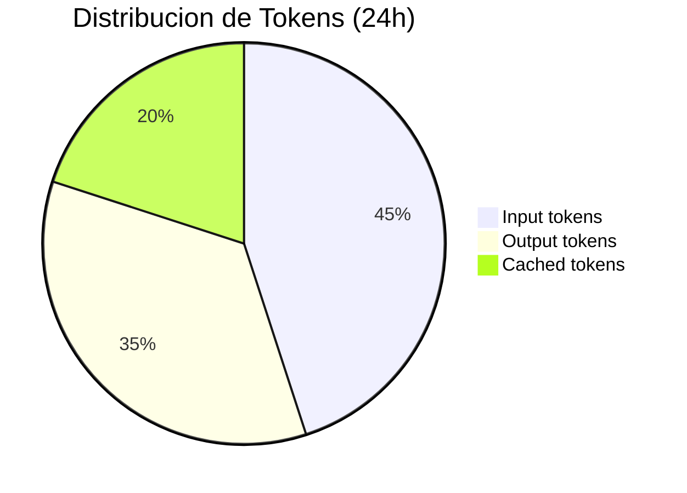

# Diseno de Dashboards para Sistemas IA

> [!abstract] Resumen
> Los dashboards para sistemas de IA deben cubrir paneles que no existen en software tradicional: ==token usage==, ==cost burn rate==, ==model comparison==, y ==quality metrics==. Este documento detalla el diseno de paneles esenciales, la diferencia entre dashboards ejecutivos y de ingenieria, herramientas como *Grafana* (con datasource OTel), *Datadog* (LLM Observability), y *New Relic AI Monitoring*. Se incluyen templates de dashboard y umbrales de alerta recomendados. Los dashboards son la ==capa de visualizacion== del stack de observabilidad descrito en [[observabilidad-agentes]].
> ^resumen

---

## Principios de diseno para dashboards de IA

Un buen dashboard no es una coleccion de graficos. Es una ==herramienta de diagnostico== que guia al operador desde la deteccion de un problema hasta su causa raiz[^1].

> [!tip] Principios fundamentales
> 1. **Jerarquia visual**: los paneles mas criticos arriba y a la izquierda
> 2. **Contexto temporal**: siempre mostrar comparacion con baseline (semana anterior)
> 3. **Drill-down**: de vision general a detalle especifico
> 4. **Accionable**: cada panel debe responder "necesito hacer algo?"
> 5. **Audiencia definida**: ejecutivo vs ingeniero tienen necesidades distintas

---

## Paneles esenciales

### 1. Request Rate (trafico)

El panel de trafico muestra el volumen de queries al sistema de agentes.

| Metrica | ==Tipo de Grafico== | Ventana |
|---------|---------------------|---------|
| Queries/minuto | ==Time series== | 24h |
| Queries por modelo | Stacked area | 24h |
| Queries por endpoint | Bar chart | 1h |
| Comparativa vs semana anterior | Overlay | 7d |

> [!info] Por que monitorear el request rate?
> - **Caida subita**: posible problema de acceso o fallo upstream
> - **Pico inusual**: posible ataque, bot, o feature viral
> - **Patron nuevo**: cambio en el uso por parte de los usuarios
>
> Ver [[alerting-ia]] para alertas basadas en anomalias de trafico.

### 2. Latencia (*Duration*)

```text
┌──────────────────────────────────────────┐
│ LATENCIA - Ultimo 24h                    │
│                                          │
│ p50: 2.3s  p95: 8.7s  p99: 23.1s       │
│                                          │
│  25s ┤                     ╭─            │
│  20s ┤                    ╭╯             │
│  15s ┤              ╭────╯              │
│  10s ┤         ╭───╯                    │
│   5s ┤   ╭────╯                         │
│   0s ┼───╯                              │
│      └──────────────────────────────────│
│       00:00  06:00  12:00  18:00  24:00 │
│                                          │
│ ▬ p50  ▬ p95  ▬ p99                     │
└──────────────────────────────────────────┘
```

> [!warning] La latencia en agentes tiene distribucion multimodal
> No esperes una curva suave. Los agentes producen dos picos:
> - **Pico 1** (2-5s): tareas simples, 1-2 pasos
> - **Pico 2** (15-45s): tareas complejas, 5+ pasos
>
> Usa histogramas en lugar de promedios para capturar esta bimodalidad.

### 3. Error Rate

| Tipo de Error | ==Color Panel== | Umbral Alerta |
|--------------|-----------------|---------------|
| API errors (4xx, 5xx) | ==Rojo== | > 5% |
| Tool failures | Naranja | > 10% |
| Parsing errors | Amarillo | > 15% |
| Budget exceeded | ==Rojo oscuro== | > 0 |
| Timeout | Naranja | > 3% |

### 4. Token Usage

Panel crucial que no existe en dashboards tradicionales:



| Sub-panel | Metrica | ==Utilidad== |
|-----------|---------|-------------|
| Tokens totales | Sum(input + output) / hora | ==Tendencia de consumo== |
| Ratio cached/total | cached / (input + output) | ==Eficiencia de cache== |
| Tokens por query | Histograma | ==Distribucion de complejidad== |
| Tokens por modelo | Stacked area | ==Mix de modelos== |

### 5. Cost Burn Rate

> [!danger] Este panel debe ser visible siempre
> El *cost burn rate* es la velocidad a la que se consume presupuesto. Es el ==equivalente financiero del error rate==.

```text
┌──────────────────────────────────────────┐
│ COSTE - Burn Rate                        │
│                                          │
│ Hoy: $47.23 / $66.67 diario (70.8%)    │
│ Mensual: $1,416 / $2,000 (70.8%)       │
│                                          │
│ $80 ┤         Budget diario              │
│ $67 ┤ ─ ─ ─ ─ ─ ─ ─ ─ ─ ─ ─ ─ ─ ─ ─  │
│ $50 ┤              ╭──────              │
│ $25 ┤     ╭───────╯                     │
│  $0 ┼────╯                              │
│     └───────────────────────────────────│
│      00:00  06:00  12:00  18:00  24:00  │
└──────────────────────────────────────────┘
```

Ver [[cost-tracking]] para el detalle de como calcular y rastrear costes.

### 6. Model Comparison

Panel para comparar rendimiento entre modelos:

| Modelo | ==Latencia p50== | Coste/Query | ==Quality Score== | Uso % |
|--------|-----------------|-------------|-------------------|-------|
| gpt-4o | ==2.3s== | $0.032 | ==0.92== | 65% |
| gpt-4o-mini | ==0.8s== | $0.003 | ==0.78== | 25% |
| claude-sonnet-4-20250514 | ==1.9s== | $0.028 | ==0.91== | 10% |

### 7. Quality Metrics

> [!question] Como medir calidad en un dashboard?
> La calidad requiere evaluaciones automatizadas. Opciones:
> - **Sampling**: evaluar un % de respuestas con LLM-as-judge
> - **User feedback**: thumbs up/down recopilados del UI
> - **Format compliance**: validacion programatica de formato
> - **Regression tests**: suite de tests ejecutada periodicamente
>
> Ver [[prompt-monitoring]] y [[drift-detection]] para tecnicas de monitoreo continuo de calidad.

---

## Dashboard ejecutivo vs ingenieria

### Dashboard ejecutivo

Disenado para stakeholders no tecnicos. Responde: "va bien el sistema de IA?"

> [!success] Paneles del dashboard ejecutivo
> 1. **Resumen de salud**: semaforo verde/amarillo/rojo
> 2. **Coste mensual** con tendencia y proyeccion
> 3. **Volumen de uso**: queries por dia, usuarios activos
> 4. **Satisfaccion del usuario**: CSAT o thumbs up/down ratio
> 5. **ROI estimado**: tiempo ahorrado x coste hora vs coste IA
> 6. **Incidentes**: numero y severidad en el periodo

### Dashboard de ingenieria

Disenado para el equipo tecnico. Responde: "que esta pasando y donde esta el problema?"

> [!example]- Layout del dashboard de ingenieria
> ```text
> ┌─────────────────────────────────────────────────────────────┐
> │ ROW 1: Vision General                                      │
> │ ┌──────────┐ ┌──────────┐ ┌──────────┐ ┌──────────┐       │
> │ │ QPS      │ │ Error %  │ │ p95 Lat  │ │ Cost/h   │       │
> │ │ 4.2/s    │ │ 0.3%     │ │ 8.7s     │ │ $1.97    │       │
> │ └──────────┘ └──────────┘ └──────────┘ └──────────┘       │
> ├─────────────────────────────────────────────────────────────┤
> │ ROW 2: Latencia y Errores                                  │
> │ ┌────────────────────────┐ ┌────────────────────────┐      │
> │ │ Latencia p50/95/99     │ │ Error Rate por tipo    │      │
> │ │ [time series]          │ │ [stacked area]         │      │
> │ └────────────────────────┘ └────────────────────────┘      │
> ├─────────────────────────────────────────────────────────────┤
> │ ROW 3: Tokens y Coste                                      │
> │ ┌────────────────────────┐ ┌────────────────────────┐      │
> │ │ Token Usage por modelo │ │ Cost Burn Rate         │      │
> │ │ [stacked area]         │ │ [time series + budget] │      │
> │ └────────────────────────┘ └────────────────────────┘      │
> ├─────────────────────────────────────────────────────────────┤
> │ ROW 4: Agente                                              │
> │ ┌────────────────────────┐ ┌────────────────────────┐      │
> │ │ Steps por sesion       │ │ Tool Success Rate      │      │
> │ │ [histogram]            │ │ [bar chart]            │      │
> │ └────────────────────────┘ └────────────────────────┘      │
> ├─────────────────────────────────────────────────────────────┤
> │ ROW 5: Calidad                                             │
> │ ┌────────────────────────┐ ┌────────────────────────┐      │
> │ │ Faithfulness trend     │ │ Stop Reason distrib.   │      │
> │ │ [time series]          │ │ [pie chart]            │      │
> │ └────────────────────────┘ └────────────────────────┘      │
> └─────────────────────────────────────────────────────────────┘
> ```

---

## Herramientas

### Grafana con OTel datasource

*Grafana* es la herramienta de dashboarding mas popular del ecosistema open source. Su integracion con *OpenTelemetry* permite visualizar trazas, metricas y logs en un solo lugar[^2].

> [!tip] Setup recomendado con Grafana
> 1. **Datasources**: Tempo (trazas), Prometheus (metricas), Loki (logs)
> 2. **Correlacion**: configurar links entre datasources (trace → log, metric → trace)
> 3. **Variables**: modelo, ambiente, periodo temporal como variables de dashboard
> 4. **Alertas**: Grafana Alerting con reglas basadas en metricas
>
> Ver [[opentelemetry-ia]] para la configuracion de OTel que alimenta estos datasources.

| Ventaja | ==Detalle== |
|---------|-------------|
| Open source | ==Gratis, auto-hospedable== |
| Ecosistema | ==200+ datasources== |
| Alerting integrado | Reglas, notificaciones, silencing |
| Correlacion | ==Trace ↔ Log ↔ Metric== |
| Comunidad | Dashboards compartidos en grafana.com |

### Datadog LLM Observability

*Datadog* ofrece un modulo especifico para LLM Observability que incluye dashboards predefinidos.

> [!info] Capacidades de Datadog LLM Observability
> - Tracing automatico de LangChain, OpenAI, Anthropic
> - Dashboard predefinido con latencia, tokens, errores
> - Evaluacion de calidad con LLM-as-judge
> - Correlacion con APM y logs existentes
> - **Desventaja**: coste significativo, vendor lock-in

### New Relic AI Monitoring

*New Relic* ofrece AI Monitoring como extension de su plataforma APM.

| Caracteristica | Datadog | ==New Relic== | Grafana |
|---------------|---------|---------------|---------|
| Dashboards IA predefinidos | Si | ==Si== | No (manual) |
| Coste | Alto | ==Alto== | Gratis (infra propia) |
| Auto-instrumentacion | Si | ==Si== | No |
| Customizacion | Media | ==Media== | Alta |
| Vendor lock-in | Alto | ==Alto== | ==Ninguno== |
| OTel nativo | Parcial | ==Si== | ==Si== |

> [!warning] Coste de herramientas SaaS
> Las plataformas SaaS como Datadog y New Relic cobran por volumen de datos. Un agente que genera muchas trazas y metricas puede ==duplicar el coste total del sistema== solo en observabilidad. Evalua cuidadosamente el ROI.

---

## Templates de dashboard

### Template: RED+CQ para agentes

Basado en el metodo RED+CQ de [[metricas-agentes]]:

> [!example]- Queries de Prometheus para paneles clave
> ```promql
> # Panel 1: Request Rate
> rate(gen_ai_calls_total[5m])
>
> # Panel 2: Error Rate
> rate(gen_ai_calls_total{status="error"}[5m])
> / rate(gen_ai_calls_total[5m]) * 100
>
> # Panel 3: Latency p95
> histogram_quantile(0.95, rate(gen_ai_latency_ms_bucket[5m]))
>
> # Panel 4: Cost per hour
> increase(gen_ai_cost_usd_total[1h])
>
> # Panel 5: Quality Score avg
> avg(agent_quality_score)
>
> # Panel 6: Tokens por minuto
> rate(gen_ai_tokens_total[1m])
>
> # Panel 7: Steps per session (histograma)
> histogram_quantile(0.5, rate(agent_steps_total_bucket[5m]))
>
> # Panel 8: Tool success rate
> rate(agent_tool_calls_total{success="true"}[5m])
> / rate(agent_tool_calls_total[5m]) * 100
>
> # Panel 9: Cost by model
> increase(gen_ai_cost_usd_total[24h]) by (model)
>
> # Panel 10: Stop reason distribution
> increase(agent_session_total[24h]) by (stop_reason)
> ```

### Umbrales de alerta por panel

| Panel | ==Verde== | ==Amarillo== | ==Rojo== |
|-------|----------|--------------|----------|
| Error Rate | ==< 1%== | 1-5% | ==> 5%== |
| Latencia p95 | ==< 10s== | 10-20s | ==> 20s== |
| Cost/hora | < Budget/24 | Budget/24 - Budget/12 | > Budget/12 |
| Quality Score | ==> 0.85== | 0.7-0.85 | ==< 0.7== |
| Tool Success | ==> 95%== | 85-95% | ==< 85%== |

---

## Mejores practicas

> [!success] Checklist de dashboard
> - [ ] No mas de 10-12 paneles por dashboard (evitar scroll infinito)
> - [ ] Variables para filtrar por modelo, ambiente, periodo
> - [ ] Comparacion con periodo anterior (overlay)
> - [ ] Anotaciones para deployments y cambios de modelo
> - [ ] Links a runbooks en cada panel de alerta
> - [ ] Actualizacion automatica cada 30-60 segundos
> - [ ] Version controlada en Git (dashboard as code)

> [!failure] Anti-patrones de dashboards
> - **Wall of graphs**: 50 paneles donde nadie mira ninguno
> - **Vanity metrics**: solo metricas que siempre se ven bien
> - **Sin contexto**: numeros sin baseline ni umbral
> - **Solo promedios**: los promedios ocultan problemas (usar percentiles)
> - **Datos stale**: dashboard con ultima actualizacion hace 2 horas

---

## Relacion con el ecosistema

- **[[intake-overview]]**: los dashboards deben incluir paneles de ingesta (documentos procesados, errores de parsing, tamano de cola) para tener visibilidad end-to-end
- **[[architect-overview]]**: las metricas de architect (pasos, coste, stop reasons, tool success) alimentan directamente los paneles del dashboard de ingenieria. Los tres exporters de OTel son la fuente de datos
- **[[vigil-overview]]**: un panel de seguridad muestra findings de vigil por severidad, tendencia de hallazgos, y correlacion con deployments. Los reportes SARIF y JUnit XML de vigil pueden parsearse para alimentar metricas de Prometheus
- **[[licit-overview]]**: un panel de compliance muestra estado de auditorias, evidencias pendientes, y gaps de cumplimiento. Estos datos complementan la vision operacional con la dimension regulatoria

---

## Enlaces y referencias

> [!quote]- Bibliografia y recursos
> - [^1]: Brath, Jonker. *Graph Design for the Eye and Mind*. 2005.
> - [^2]: Grafana Documentation. https://grafana.com/docs/
> - [^3]: Datadog LLM Observability. https://docs.datadoghq.com/llm_observability/
> - [^4]: New Relic AI Monitoring. https://docs.newrelic.com/docs/ai-monitoring/intro-to-ai-monitoring/
> - [^5]: Stephen Few. *Information Dashboard Design*. Analytics Press, 2013.

[^1]: El diseno visual de dashboards es una disciplina con fundamentos en la percepcion humana.
[^2]: Grafana es el estandar de facto para dashboarding en el ecosistema cloud native.
[^3]: Datadog ofrece la solucion SaaS mas completa pero a un coste significativo.
[^4]: New Relic AI Monitoring se integra con su plataforma APM existente.
[^5]: Stephen Few es la referencia principal para el diseno efectivo de dashboards.
