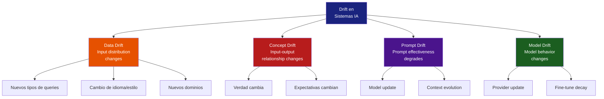
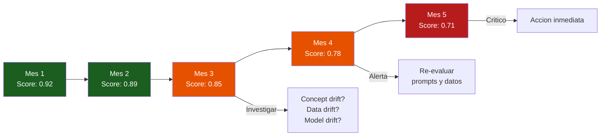
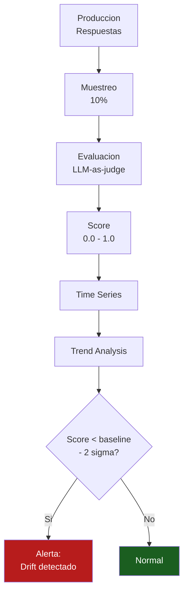
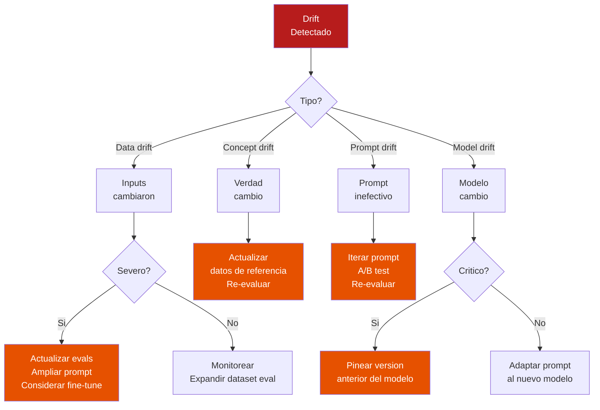

# Drift Detection para Sistemas IA

> [!abstract] Resumen
> El *drift* en sistemas IA se manifiesta en cuatro formas: ==data drift== (cambio en la distribucion de inputs), ==concept drift== (cambio en la relacion input-output), ==prompt drift== (degradacion de efectividad del prompt con el tiempo), y ==model drift== (cambio de comportamiento por actualizaciones del proveedor). Las tecnicas de deteccion incluyen tests estadisticos (*Kolmogorov-Smirnov*, *Population Stability Index*), ==monitoreo de distancia de embeddings==, y ==tendencias de scores de evaluacion==. Saber cuando re-evaluar, re-ajustar, o actualizar prompts es critico para mantener la calidad en produccion.
> ^resumen

---

## Tipos de drift en sistemas IA

El *drift* (deriva) ocurre cuando las condiciones bajo las cuales el sistema fue disenado y evaluado ==cambian en produccion==. En sistemas de IA, esto tiene cuatro manifestaciones distintas[^1].



---

## Data drift

El *data drift* ocurre cuando la ==distribucion de los inputs cambia== respecto al periodo de diseno o evaluacion del sistema.

### Causas comunes

| Causa | ==Ejemplo== | Deteccion |
|-------|-----------|-----------|
| Cambio de base de usuarios | ==Nuevos usuarios de otro pais/idioma== | Distribucion de idiomas, longitud de queries |
| Evolucion temporal | Preguntas sobre eventos recientes | Keywords nuevas, topics emergentes |
| Cambio de canal | De web a movil, diferente estilo de input | Longitud, formato, vocabulario |
| Ataque/abuso | ==Prompt injection, queries adversariales== | Anomalias en embeddings, patrones sospechosos |
| Integracion nueva | Nuevo sistema upstream envia datos diferentes | Schema validation, field distributions |

### Deteccion con tests estadisticos

#### Kolmogorov-Smirnov Test (KS Test)

El *KS test* compara dos distribuciones y determina si son significativamente diferentes[^2].

> [!example]- Implementacion de KS test para deteccion de data drift
> ```python
> from scipy import stats
> import numpy as np
>
> class DataDriftDetector:
>     """Detectar data drift usando KS test."""
>
>     def __init__(self, reference_data: np.ndarray,
>                  significance: float = 0.05):
>         self.reference = reference_data
>         self.significance = significance
>
>     def check_drift(self, current_data: np.ndarray) -> dict:
>         """Comparar distribucion actual vs referencia."""
>         statistic, p_value = stats.ks_2samp(
>             self.reference, current_data
>         )
>
>         return {
>             "test": "kolmogorov_smirnov",
>             "statistic": statistic,
>             "p_value": p_value,
>             "drift_detected": p_value < self.significance,
>             "severity": self._classify_severity(statistic),
>         }
>
>     def _classify_severity(self, statistic: float) -> str:
>         if statistic < 0.1:
>             return "none"
>         elif statistic < 0.2:
>             return "low"
>         elif statistic < 0.3:
>             return "medium"
>         else:
>             return "high"
>
> # Uso
> # Features: longitud de query, num tokens, etc.
> reference = np.array([len(q) for q in reference_queries])
> current = np.array([len(q) for q in current_queries])
>
> detector = DataDriftDetector(reference)
> result = detector.check_drift(current)
> print(f"Drift detected: {result['drift_detected']}")
> print(f"Severity: {result['severity']}")
> ```

#### Population Stability Index (PSI)

El *PSI* (*Population Stability Index*) mide cuanto ha cambiado una distribucion entre dos periodos[^3].

```python
def calculate_psi(reference: np.ndarray, current: np.ndarray,
                  n_bins: int = 10) -> float:
    """Calcular Population Stability Index."""
    # Crear bins basados en la referencia
    breakpoints = np.percentile(reference,
                                np.linspace(0, 100, n_bins + 1))

    ref_counts = np.histogram(reference, bins=breakpoints)[0]
    cur_counts = np.histogram(current, bins=breakpoints)[0]

    # Normalizar
    ref_pct = ref_counts / len(reference)
    cur_pct = cur_counts / len(current)

    # Evitar division por cero
    ref_pct = np.clip(ref_pct, 0.001, None)
    cur_pct = np.clip(cur_pct, 0.001, None)

    # PSI
    psi = np.sum((cur_pct - ref_pct) * np.log(cur_pct / ref_pct))
    return psi
```

| PSI | ==Interpretacion== | Accion |
|-----|---------------------|--------|
| < 0.1 | ==Sin drift significativo== | Ninguna |
| 0.1 - 0.2 | ==Drift moderado== | Monitorear, investigar |
| 0.2 - 0.5 | Drift significativo | Re-evaluar prompts |
| > 0.5 | ==Drift critico== | Accion inmediata, re-calibrar |

---

## Concept drift

El *concept drift* ocurre cuando la ==relacion entre inputs y outputs correctos cambia==. Es mas sutil y dificil de detectar que el data drift.

> [!danger] El concept drift es el mas peligroso
> El sistema puede seguir funcionando "correctamente" desde la perspectiva tecnica (sin errores, latencia normal) pero las ==respuestas ya no son correctas== porque el mundo cambio.

### Ejemplos

| Dominio | ==Antes== | ==Despues== | Tipo |
|---------|----------|-----------|------|
| Legal | Ley X vigente | ==Ley X derogada, nueva Ley Y== | Temporal |
| Medico | Protocolo A recomendado | ==Protocolo B es el nuevo estandar== | Institucional |
| Financiero | Tasa de interes 5% | ==Tasa de interes 8%== | Factual |
| Tecnico | Framework v2 es lo ultimo | ==Framework v3 lanzado con breaking changes== | Tecnologico |

### Deteccion

> [!question] Como detectar concept drift en produccion?
> 1. **Evaluacion periodica con datos frescos**: ejecutar eval suite con verdad actualizada
> 2. **Feedback de usuarios**: thumbs down aumenta aunque inputs son similares
> 3. **Monitoreo de scores de evaluacion**: degradacion gradual de faithfulness
> 4. **Comparacion temporal**: mismos inputs, diferentes outputs (correctos vs incorrectos)



---

## Prompt drift

El *prompt drift* ocurre cuando un prompt que funcionaba bien ==deja de ser efectivo== sin que el prompt mismo haya cambiado.

### Causas

> [!warning] El prompt no cambio, pero el mundo si
> | Causa | ==Mecanismo== | Frecuencia |
> |-------|-------------|-----------|
> | Model update silencioso | ==El proveedor actualiza el modelo== | Mensual |
> | Training data cutoff | Modelo no sabe sobre eventos recientes | Continua |
> | Context evolution | Los documentos RAG cambian | ==Variable== |
> | Emergent behaviors | El modelo desarrolla nuevos patrones | Impredecible |
> | Competencia de instrucciones | System prompt compite con user prompt | ==Cuando crece el contexto== |

### Deteccion

Ver [[prompt-monitoring]] para el framework completo de monitoreo de prompts.

```python
class PromptDriftDetector:
    """Detectar degradacion de rendimiento de un prompt."""

    def __init__(self, baseline_scores: list[float],
                 window_size: int = 100):
        self.baseline_mean = np.mean(baseline_scores)
        self.baseline_std = np.std(baseline_scores)
        self.window_size = window_size
        self.current_scores = []

    def add_score(self, score: float):
        self.current_scores.append(score)
        if len(self.current_scores) > self.window_size:
            self.current_scores.pop(0)

    def check_drift(self) -> dict:
        if len(self.current_scores) < self.window_size // 2:
            return {"status": "insufficient_data"}

        current_mean = np.mean(self.current_scores)
        z_score = ((current_mean - self.baseline_mean)
                   / (self.baseline_std / np.sqrt(len(self.current_scores))))

        return {
            "baseline_mean": self.baseline_mean,
            "current_mean": current_mean,
            "z_score": z_score,
            "drift_detected": abs(z_score) > 2.0,
            "direction": "degraded" if current_mean < self.baseline_mean
                        else "improved",
        }
```

> [!tip] Regla practica para prompt drift
> Si el score promedio de las ultimas ==100 evaluaciones== esta mas de ==2 desviaciones estandar== por debajo del baseline, hay drift significativo. Accion:
> 1. Verificar si el modelo cambio
> 2. Verificar si los datos de contexto cambiaron
> 3. Si nada cambio externamente, el prompt necesita actualizacion

---

## Model drift

El *model drift* ocurre cuando el ==proveedor del LLM actualiza el modelo==, cambiando su comportamiento de forma no documentada.

### El problema de las actualizaciones silenciosas

> [!danger] Los proveedores actualizan modelos sin aviso
> OpenAI, Anthropic y Google actualizan sus modelos periodicamente. Estos cambios pueden:
> - Mejorar el rendimiento general pero ==romper casos especificos==
> - Cambiar el formato de salida (JSON diferente, markdown distinto)
> - Alterar el comportamiento con ciertos tipos de instrucciones
> - Modificar los precios (generalmente a la baja)
>
> Ver [[ai-postmortems]] para un ejemplo real de incidente por model drift.

### Estrategias de deteccion

| Estrategia | ==Descripcion== | Complejidad |
|-----------|-----------------|-------------|
| Eval suite periodica | ==Ejecutar tests estandarizados diariamente== | Baja |
| Canary queries | Queries con respuesta conocida | Baja |
| Response fingerprinting | Comparar hash/embedding de respuestas | Media |
| A/B testing continuo | ==Comparar modelo pinned vs latest== | Media |
| Provider changelog | Suscribirse a actualizaciones | Baja |

> [!example]- Canary queries para deteccion de model drift
> ```python
> CANARY_QUERIES = [
>     {
>         "input": "Responde SOLO con el JSON: {\"status\": \"ok\"}",
>         "expected_output": '{"status": "ok"}',
>         "check": lambda output: json.loads(output) == {"status": "ok"},
>     },
>     {
>         "input": "Calcula 2+2 y responde solo con el numero",
>         "expected_output": "4",
>         "check": lambda output: output.strip() == "4",
>     },
>     {
>         "input": "Lista exactamente 3 colores, uno por linea",
>         "expected_output": None,  # Variable
>         "check": lambda output: len(output.strip().split("\n")) == 3,
>     },
> ]
>
> def run_canary_checks(model: str) -> dict:
>     """Ejecutar canary queries y reportar resultados."""
>     results = []
>     for canary in CANARY_QUERIES:
>         response = call_llm(model, canary["input"])
>         passed = canary["check"](response)
>         results.append({
>             "query": canary["input"][:50],
>             "passed": passed,
>             "output": response[:100],
>         })
>
>     pass_rate = sum(1 for r in results if r["passed"]) / len(results)
>     return {
>         "model": model,
>         "pass_rate": pass_rate,
>         "drift_detected": pass_rate < 1.0,
>         "failed_canaries": [r for r in results if not r["passed"]],
>     }
> ```

---

## Monitoreo de distancia de embeddings

La distancia entre embeddings de inputs es una tecnica poderosa para detectar data drift sin necesidad de labels[^4].

### Tecnicas

| Tecnica | ==Que compara== | Sensibilidad |
|---------|----------------|-------------|
| Cosine distance promedio | ==Embedding de inputs actuales vs referencia== | Media |
| Centroid shift | Centro de masa de la distribucion | Baja (detecta cambios grandes) |
| MMD (Maximum Mean Discrepancy) | ==Distribuciones completas== | Alta |
| Nearest neighbor distance | Distancia al vecino mas cercano en referencia | ==Alta== |

```python
from sklearn.metrics.pairwise import cosine_distances
import numpy as np

def detect_embedding_drift(
    reference_embeddings: np.ndarray,
    current_embeddings: np.ndarray,
    threshold: float = 0.3,
) -> dict:
    """Detectar drift usando distancia coseno de centroides."""

    ref_centroid = np.mean(reference_embeddings, axis=0)
    cur_centroid = np.mean(current_embeddings, axis=0)

    centroid_distance = cosine_distances(
        ref_centroid.reshape(1, -1),
        cur_centroid.reshape(1, -1),
    )[0][0]

    # Distancia promedio de cada punto al centroide de referencia
    avg_distance = np.mean(cosine_distances(
        current_embeddings, ref_centroid.reshape(1, -1)
    ))

    return {
        "centroid_distance": centroid_distance,
        "avg_point_distance": avg_distance,
        "drift_detected": centroid_distance > threshold,
        "severity": "high" if centroid_distance > 0.5
                    else "medium" if centroid_distance > 0.3
                    else "low",
    }
```

> [!info] Phoenix para visualizacion de drift
> [[phoenix-arize]] ofrece visualizacion interactiva de embeddings en 2D/3D que permite ==ver el drift visualmente==. Puedes comparar la distribucion de embeddings de referencia vs produccion y detectar clusters anomalos.

---

## Eval score trending

La tecnica mas simple y efectiva: ==monitorear las tendencias de los scores de evaluacion== a lo largo del tiempo.



### Metricas de tendencia

| Metrica | ==Formula== | Periodo |
|---------|-----------|---------|
| Score promedio movil | avg(scores, 7d) | ==Semanal== |
| Score slope | regression(scores, 30d) | ==Mensual== |
| Score percentil 10 | p10(scores, 7d) | Semanal |
| Tasa de "bad" scores | count(score < 0.7) / total | ==Diario== |

> [!success] La simplicidad es clave
> No necesitas tecnicas estadisticas sofisticadas para empezar. Un ==grafico de score promedio semanal== en [[dashboards-ia|Grafana]] con una ==alerta cuando baja 10%== respecto al baseline cubre el 80% de los casos de drift.

---

## Cuando tomar accion

### Arbol de decision



### Decisiones clave

| Situacion | ==Accion== | Urgencia |
|-----------|-----------|----------|
| Score bajo, datos cambiaron | ==Re-evaluar con datos frescos, ajustar prompt== | Media |
| Score bajo, modelo cambio | ==Pinear version anterior, adaptar prompt== | ==Alta== |
| Score bajo, nada cambio (aparentemente) | Investigar mas profundo: datos RAG? contexto? | Media |
| Score bajo gradualmente (semanas) | ==Re-disenar prompt, considerar fine-tuning== | Baja |
| Score cae abruptamente | ==Alerta P1, mitigar, post-mortem== | ==Critica== |

> [!warning] No re-fine-tunear prematuramente
> El *fine-tuning* es costoso y crea una nueva version del modelo que necesita su propia evaluacion y monitoreo. Antes de fine-tunear:
> 1. Optimiza el prompt (mucho mas barato)
> 2. Mejora el contexto RAG
> 3. Usa few-shot examples
> 4. Solo si nada de lo anterior funciona, considera fine-tuning

---

## Automatizacion del pipeline de drift

> [!example]- Pipeline automatizado de drift detection
> ```python
> class DriftPipeline:
>     """Pipeline automatizado de deteccion de drift."""
>
>     def __init__(self, config: DriftConfig):
>         self.data_detector = DataDriftDetector(
>             config.reference_features)
>         self.prompt_detector = PromptDriftDetector(
>             config.baseline_scores)
>         self.embedding_detector = EmbeddingDriftDetector(
>             config.reference_embeddings)
>         self.alerter = AlertManager(config.alert_config)
>
>     def run_daily_check(self):
>         """Ejecutar deteccion diaria de drift."""
>         results = {}
>
>         # 1. Data drift
>         current_features = self._get_current_features()
>         results["data_drift"] = self.data_detector.check_drift(
>             current_features)
>
>         # 2. Prompt drift (basado en eval scores)
>         recent_scores = self._get_recent_eval_scores()
>         for score in recent_scores:
>             self.prompt_detector.add_score(score)
>         results["prompt_drift"] = self.prompt_detector.check_drift()
>
>         # 3. Embedding drift
>         current_embeddings = self._get_current_embeddings()
>         results["embedding_drift"] = (
>             self.embedding_detector.detect_drift(
>                 current_embeddings))
>
>         # 4. Alertar si hay drift significativo
>         for drift_type, result in results.items():
>             if result.get("drift_detected"):
>                 self.alerter.send_alert(
>                     type=drift_type,
>                     severity=result.get("severity", "medium"),
>                     details=result,
>                 )
>
>         return results
> ```

---

## Relacion con el ecosistema

- **[[intake-overview]]**: el data drift frecuentemente se origina en la capa de intake. Cambios en las fuentes de datos, nuevos formatos de documentos, o nuevos idiomas en el contenido ingerido alteran la distribucion de inputs. Monitorear drift en intake es la primera linea de defensa
- **[[architect-overview]]**: las trazas OTel de architect proporcionan los datos necesarios para deteccion de drift: token counts, latencias, tool usage patterns. Cambios en estos patrones pueden indicar drift. El CostTracker de architect detecta drift de coste (aumento gradual)
- **[[vigil-overview]]**: vigil puede detectar drift de seguridad: nuevos patrones de prompt injection, nuevas vulnerabilidades que aparecen con cambios de modelo. Los scans periodicos de vigil funcionan como canary checks de seguridad
- **[[licit-overview]]**: el drift detection es un requisito de compliance en muchos frameworks de IA responsable. Licit necesita evidencia de que el sistema es monitoreado activamente y que los cambios de comportamiento se detectan y documentan

---

## Enlaces y referencias

> [!quote]- Bibliografia y recursos
> - [^1]: Rabanser et al. "Failing Loudly: An Empirical Study of Methods for Detecting Dataset Shift". NeurIPS 2019.
> - [^2]: Kolmogorov-Smirnov Test. Wikipedia. https://en.wikipedia.org/wiki/Kolmogorov%E2%80%93Smirnov_test
> - [^3]: Yurdakul, Bilal. "Statistical Properties of Population Stability Index". 2018.
> - [^4]: Arize AI. "ML Monitoring and Observability". Blog, 2024.
> - [^5]: Sculley et al. "Hidden Technical Debt in Machine Learning Systems". Google, NeurIPS 2015.

[^1]: Este paper proporciona una comparativa empirica de metodos de deteccion de dataset shift.
[^2]: El KS test es uno de los tests no parametricos mas usados para comparar distribuciones.
[^3]: PSI fue desarrollado originalmente para credit scoring y es ampliamente usado en ML monitoring.
[^4]: Arize AI (creadores de [[phoenix-arize]]) son referencia en monitoring de ML en produccion.
[^5]: El paper de Google sobre deuda tecnica en ML es lectura obligatoria para entender los riesgos de sistemas ML en produccion.
