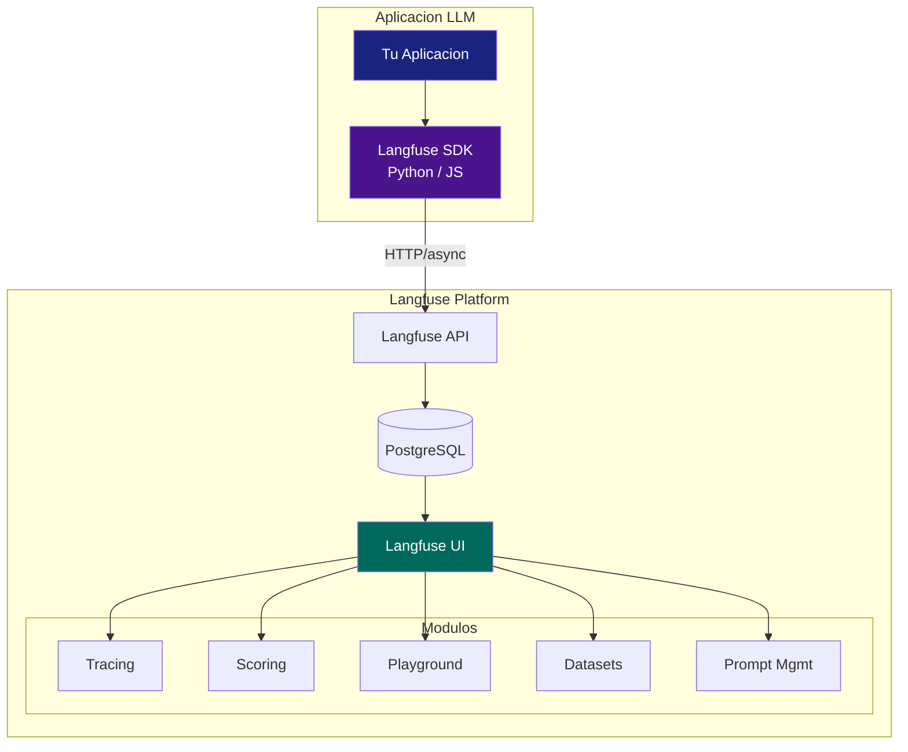
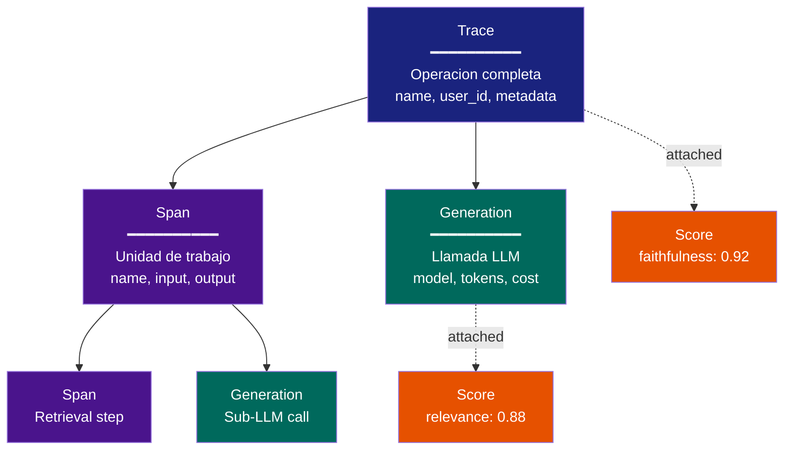

# Langfuse: Observabilidad Open Source para LLM

> [!abstract] Resumen
> *Langfuse* es una plataforma ==open source== de observabilidad para aplicaciones LLM que ofrece ==tracing==, ==scoring== (evaluacion), ==playground==, ==datasets== y ==prompt management==. Su modelo de trazas distingue entre *traces*, *spans*, *generations* (llamadas LLM) y *scores*. Se integra con OpenAI, LangChain, LlamaIndex y otros via SDK Python/JS. Puede ==auto-hospedarse== o usarse como SaaS. A diferencia de [[langsmith]], no tiene dependencia de un framework especifico. Es la alternativa open source mas madura para observabilidad LLM.
> ^resumen

---

## Arquitectura de Langfuse

*Langfuse* esta disenado como una plataforma modular que cubre el ciclo completo de observabilidad para aplicaciones LLM[^1].



### Componentes principales

| Componente | ==Funcion== | Detalle |
|-----------|-------------|---------|
| **Tracing** | ==Registrar ejecuciones== | Traces, spans, generations con atributos |
| **Scoring** | ==Evaluar calidad== | Humano, LLM-as-judge, programatico |
| **Playground** | ==Experimentar con prompts== | Probar prompts contra modelos |
| **Datasets** | ==Gestionar datos de eval== | Inputs/outputs esperados para benchmarks |
| **Prompt Management** | ==Versionar prompts== | Control de versiones de prompts en produccion |

---

## Modelo de datos de tracing

Langfuse define una jerarquia de objetos para representar la ejecucion de una aplicacion LLM:

### Jerarquia



| Objeto | ==Proposito== | Analogia OTel |
|--------|--------------|---------------|
| **Trace** | ==Operacion end-to-end== | Trace |
| **Span** | ==Suboperacion generica== | Span |
| **Generation** | ==Llamada LLM especificamente== | Span con atributos GenAI |
| **Score** | ==Evaluacion de calidad== | (No tiene equivalente) |
| **Event** | Evento puntual sin duracion | Event/Log |

> [!info] Generation vs Span
> La distincion entre *Generation* y *Span* es clave en Langfuse:
> - **Generation**: sabe de tokens, modelo, coste, prompt, completion. Es ==especifica de LLM==
> - **Span**: generica, para cualquier operacion (retrieval, tool call, procesamiento)
>
> Esta distincion no existe en [[opentelemetry-ia|OTel]], donde todo es un span con atributos.

---

## Integracion con SDKs

### Python SDK (bajo nivel)

> [!example]- Integracion con Python SDK
> ```python
> from langfuse import Langfuse
>
> langfuse = Langfuse(
>     public_key="pk-lf-...",
>     secret_key="sk-lf-...",
>     host="https://langfuse.your-domain.com",  # Self-hosted
> )
>
> # Crear trace
> trace = langfuse.trace(
>     name="agent-session",
>     user_id="user_123",
>     metadata={"model": "gpt-4o", "task_type": "code_review"},
> )
>
> # Span para retrieval
> span = trace.span(
>     name="document-retrieval",
>     input={"query": "arquitectura del sistema"},
> )
> # ... ejecutar retrieval ...
> span.end(output={"documents": retrieved_docs, "count": len(retrieved_docs)})
>
> # Generation para LLM call
> generation = trace.generation(
>     name="main-llm-call",
>     model="gpt-4o",
>     model_parameters={"temperature": 0.7, "max_tokens": 4096},
>     input=[{"role": "user", "content": "..."}],
> )
>
> # Llamar al LLM
> response = openai_client.chat.completions.create(...)
>
> # Completar generation con respuesta
> generation.end(
>     output=response.choices[0].message.content,
>     usage={
>         "input": response.usage.prompt_tokens,
>         "output": response.usage.completion_tokens,
>         "total": response.usage.total_tokens,
>     },
> )
>
> # Score
> trace.score(
>     name="faithfulness",
>     value=0.92,
>     comment="Respuesta fiel al contexto proporcionado",
> )
>
> # Flush (importante al final)
> langfuse.flush()
> ```

### Decorator pattern (alto nivel)

> [!example]- Integracion con decoradores
> ```python
> from langfuse.decorators import observe, langfuse_context
>
> @observe()
> def run_agent(task: str):
>     langfuse_context.update_current_trace(
>         user_id="user_123",
>         metadata={"task": task},
>     )
>
>     context = retrieve_context(task)
>     response = call_llm(task, context)
>     return response
>
> @observe()
> def retrieve_context(query: str):
>     # Automaticamente crea un span hijo
>     results = vector_db.search(query, top_k=5)
>     return results
>
> @observe(as_type="generation")
> def call_llm(task: str, context: list):
>     # Automaticamente crea una generation
>     langfuse_context.update_current_observation(
>         model="gpt-4o",
>         model_parameters={"temperature": 0.7},
>     )
>     response = openai_client.chat.completions.create(
>         model="gpt-4o",
>         messages=[...],
>     )
>     return response.choices[0].message.content
> ```

### Integracion con LangChain

```python
from langfuse.callback import CallbackHandler

langfuse_handler = CallbackHandler(
    public_key="pk-lf-...",
    secret_key="sk-lf-...",
)

# Pasar como callback a cualquier chain/agent de LangChain
result = chain.invoke(
    {"input": "..."},
    config={"callbacks": [langfuse_handler]},
)
```

### Integracion con LlamaIndex

```python
from langfuse.llama_index import LlamaIndexCallbackHandler

langfuse_handler = LlamaIndexCallbackHandler()
Settings.callback_manager = CallbackManager([langfuse_handler])
```

### OpenAI drop-in

```python
from langfuse.openai import openai  # Drop-in replacement

# Usa exactamente igual que openai normal
response = openai.chat.completions.create(
    model="gpt-4o",
    messages=[{"role": "user", "content": "..."}],
)
# Automaticamente registra generation en Langfuse
```

> [!tip] Que integracion elegir?
> - **Framework propio**: Python SDK o decoradores
> - **LangChain/LangGraph**: Callback handler
> - **LlamaIndex**: LlamaIndex handler
> - **Solo OpenAI**: Drop-in replacement (lo mas rapido)
> - **[[architect-overview]]**: Python SDK con instrumentacion manual para maximo control

---

## Scoring y evaluacion

El sistema de *scoring* de Langfuse permite evaluar la calidad de las respuestas usando tres metodos:

### 1. Human scoring

Los evaluadores humanos asignan puntuaciones directamente en la UI de Langfuse.

### 2. LLM-as-judge

> [!example]- Evaluacion con LLM-as-judge
> ```python
> from langfuse import Langfuse
>
> langfuse = Langfuse()
>
> # Obtener trazas para evaluar
> traces = langfuse.get_traces(limit=100)
>
> for trace in traces:
>     generations = trace.observations
>     for gen in generations:
>         if gen.type == "GENERATION":
>             # Evaluar con otro LLM
>             eval_result = evaluate_with_llm(
>                 question=gen.input,
>                 answer=gen.output,
>                 context=trace.metadata.get("context", ""),
>             )
>
>             # Registrar score
>             langfuse.score(
>                 trace_id=trace.id,
>                 observation_id=gen.id,
>                 name="faithfulness",
>                 value=eval_result.score,
>                 comment=eval_result.reasoning,
>             )
> ```

### 3. Evaluacion programatica

```python
# Evaluaciones basadas en reglas
def score_format_compliance(output: str) -> float:
    """Verificar si la salida cumple formato esperado."""
    try:
        json.loads(output)
        return 1.0
    except json.JSONDecodeError:
        return 0.0

# Registrar en Langfuse
trace.score(name="format_compliance", value=score_format_compliance(output))
```

> [!success] Ventaja de Langfuse en evaluacion
> A diferencia de herramientas que solo hacen tracing, Langfuse ==integra evaluacion y tracing en una sola plataforma==. Esto permite:
> - Ver scores junto a las trazas
> - Filtrar trazas por score (encontrar las peores)
> - Tracking de calidad en el tiempo
> - Comparar versiones de prompts por score

---

## Prompt Management

Langfuse ofrece versionamiento y gestion de prompts como feature integrado:

| Funcionalidad | ==Descripcion== |
|---------------|-----------------|
| Versioning | ==Cada cambio crea nueva version== |
| Labels | Marcar versiones como "production", "staging" |
| Variables | Templates con `{{variable}}` |
| Fetch at runtime | SDK obtiene prompt activo en produccion |
| Rollback | Volver a version anterior instantaneamente |

```python
# Obtener prompt de produccion
prompt = langfuse.get_prompt("agent-system-prompt", label="production")

# Compilar con variables
compiled = prompt.compile(
    task_description="Refactorizar el modulo X",
    available_tools="read_file, write_file, search",
)
```

Ver [[prompt-monitoring]] para estrategias de monitoreo de rendimiento de prompts.

---

## Self-hosting vs Cloud

| Aspecto | ==Self-hosted== | Cloud |
|---------|-----------------|-------|
| Coste | ==Infra propia (bajo)== | SaaS (pago por uso) |
| Control de datos | ==Total== | Datos en servidores de Langfuse |
| Mantenimiento | Tu responsabilidad | Langfuse se encarga |
| Actualizaciones | Manual | Automaticas |
| Escalabilidad | Tu infra | Gestionada |
| Compliance | ==GDPR/HIPAA mas facil== | Depende del plan |

> [!warning] Consideraciones de self-hosting
> Langfuse self-hosted requiere:
> - PostgreSQL (para datos)
> - Redis (opcional, para cache)
> - Docker o Kubernetes
> - Minimo 2 GB RAM, 2 CPU cores para produccion basica
>
> Para equipos con requisitos de compliance estrictos, el self-hosting es la ==unica opcion viable==.

> [!example]- Docker Compose para self-hosting
> ```yaml
> version: '3.8'
> services:
>   langfuse:
>     image: langfuse/langfuse:latest
>     ports:
>       - "3000:3000"
>     environment:
>       - DATABASE_URL=postgresql://langfuse:password@db:5432/langfuse
>       - NEXTAUTH_SECRET=your-secret-here
>       - NEXTAUTH_URL=http://localhost:3000
>       - SALT=your-salt-here
>     depends_on:
>       - db
>
>   db:
>     image: postgres:16
>     environment:
>       - POSTGRES_USER=langfuse
>       - POSTGRES_PASSWORD=password
>       - POSTGRES_DB=langfuse
>     volumes:
>       - langfuse_data:/var/lib/postgresql/data
>
> volumes:
>   langfuse_data:
> ```

---

## Comparacion con LangSmith

| Caracteristica | ==Langfuse== | [[langsmith|LangSmith]] |
|---------------|-------------|------------------------|
| Open source | ==Si (MIT)== | No |
| Self-hosting | ==Si== | No (enterprise plan) |
| Framework agnostico | ==Si== | No (LangChain primero) |
| Tracing | Si | Si |
| Evaluacion | ==Si (3 metodos)== | Si |
| Prompt management | ==Si== | Si (Hub) |
| Playground | Si | Si |
| Datasets | ==Si== | Si |
| Precio base | ==Gratis (self-hosted)== | Gratis (limitado) |
| OTel nativo | Parcial | No |
| Comunidad | ==Activa, creciendo== | Grande (LangChain) |

> [!question] Cuando elegir Langfuse sobre LangSmith?
> - Cuando ==no usas LangChain== como framework
> - Cuando necesitas ==self-hosting== por compliance
> - Cuando quieres evitar ==vendor lock-in==
> - Cuando el presupuesto es limitado
> - Cuando necesitas ==control total sobre tus datos==
>
> Ver [[langsmith]] para el analisis completo de LangSmith.

---

## Limitaciones

> [!failure] Limitaciones actuales de Langfuse
> - **Escala**: self-hosted puede tener problemas con alto volumen (>10M trazas/dia)
> - **Metricas**: no tiene dashboards de metricas agregadas tan maduros como [[dashboards-ia|Grafana]]
> - **Alerting**: no tiene sistema de alertas integrado (necesitas [[alerting-ia|Prometheus/Grafana]])
> - **OTel**: la integracion con OpenTelemetry es parcial, no nativa como en [[phoenix-arize]]
> - **SDK**: el SDK a veces pierde eventos bajo carga alta (batching agresivo)

---

## Relacion con el ecosistema

- **[[intake-overview]]**: Langfuse puede trazar el pipeline de ingesta si se instrumenta con su SDK, permitiendo ver como los datos fluyen desde intake hasta la respuesta del agente
- **[[architect-overview]]**: architect podria integrarse con Langfuse usando el Python SDK para enviar sus trazas (session, LLM calls, tools) como alternativa o complemento a sus exporters OTel nativos. Las 3 pipelines de logging de architect proporcionan datos mas granulares que Langfuse, pero Langfuse ofrece la UI de exploracion y evaluacion
- **[[vigil-overview]]**: los findings de vigil pueden registrarse como scores en Langfuse, permitiendo ver la correlacion entre calidad de seguridad y calidad de respuesta en una sola UI
- **[[licit-overview]]**: Langfuse puede servir como fuente de evidencia para audit trails de licit, proporcionando trazas detalladas de cada interaccion del agente

---

## Enlaces y referencias

> [!quote]- Bibliografia y recursos
> - [^1]: Langfuse Documentation. https://langfuse.com/docs
> - [^2]: Langfuse GitHub Repository. https://github.com/langfuse/langfuse
> - [^3]: "LLM Observability with Langfuse". Blog post, Langfuse team, 2024.
> - [^4]: Langfuse Self-Hosting Guide. https://langfuse.com/docs/deployment/self-host
> - [^5]: Langfuse Cookbook. https://langfuse.com/docs/guides

[^1]: La documentacion oficial de Langfuse es completa y bien mantenida.
[^2]: El repositorio esta bajo licencia MIT, permitiendo uso comercial sin restricciones.
[^3]: El blog de Langfuse documenta patrones de uso y mejores practicas.
[^4]: La guia de self-hosting incluye configuraciones para Docker, Kubernetes y Railway.
[^5]: El cookbook incluye ejemplos de integracion con los frameworks principales.
