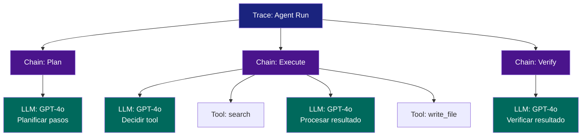
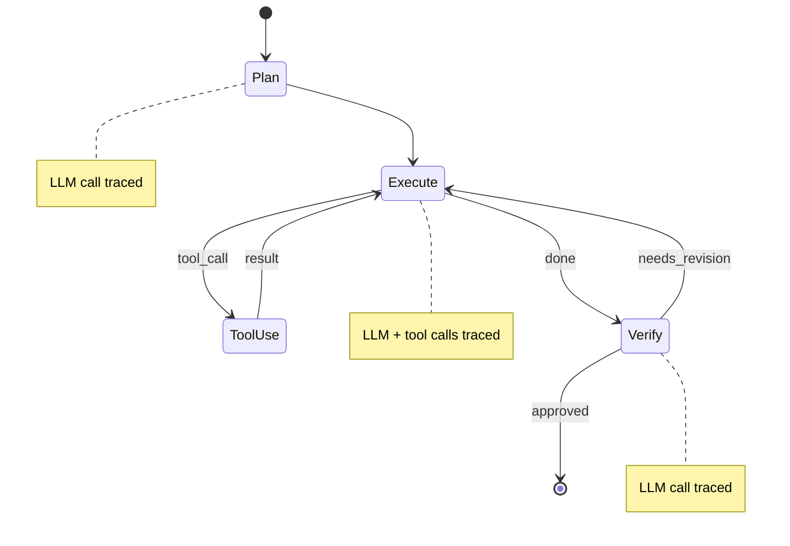

# LangSmith: Plataforma de Observabilidad de LangChain

> [!abstract] Resumen
> *LangSmith* es la plataforma de observabilidad desarrollada por LangChain Inc. para el ciclo de vida completo de aplicaciones LLM: ==tracing==, ==debugging==, ==testing==, ==monitoring== y ==prompt playground==. Ofrece *tracing* automatico para aplicaciones LangChain/LangGraph y *LangSmith Hub* para compartir prompts y chains. Su principal ventaja es la ==integracion profunda con el ecosistema LangChain==, pero su principal limitacion es el ==vendor lock-in== al mismo. A diferencia de [[langfuse]], es un producto propietario sin opcion de self-hosting real.
> ^resumen

---

## Funcionalidades principales

### 1. Tracing y debugging

*LangSmith* captura automaticamente trazas de todas las operaciones en una aplicacion LangChain/LangGraph: llamadas LLM, chains, agents, tools, retrievers[^1].

> [!success] Tracing automatico con LangChain
> Con solo configurar variables de entorno, ==toda la aplicacion LangChain se instrumenta automaticamente==:
> ```bash
> export LANGCHAIN_TRACING_V2=true
> export LANGCHAIN_API_KEY="ls-..."
> export LANGCHAIN_PROJECT="my-project"
> ```
> No se necesita cambiar ni una linea de codigo de la aplicacion.

La UI de tracing permite:

| Funcionalidad | ==Detalle== |
|---------------|-------------|
| Arbol de ejecucion | ==Visualizar la jerarquia completa de llamadas== |
| Input/Output | Ver entradas y salidas de cada paso |
| Latencia por paso | Identificar cuellos de botella |
| Token usage | Tokens consumidos por cada LLM call |
| Errores | Stack traces con contexto completo |
| Playground | ==Modificar y re-ejecutar un paso desde la traza== |



### 2. Testing y evaluacion

LangSmith ofrece un sistema de evaluacion integrado:

> [!example]- Evaluacion automatizada con LangSmith
> ```python
> from langsmith import Client
> from langsmith.evaluation import evaluate
>
> client = Client()
>
> # Crear dataset
> dataset = client.create_dataset("qa-benchmark")
> client.create_examples(
>     inputs=[
>         {"question": "Que es OpenTelemetry?"},
>         {"question": "Como funciona el tracing?"},
>     ],
>     outputs=[
>         {"answer": "Framework de observabilidad..."},
>         {"answer": "El tracing permite seguir..."},
>     ],
>     dataset_id=dataset.id,
> )
>
> # Funcion a evaluar
> def my_agent(inputs: dict) -> dict:
>     result = agent.invoke(inputs["question"])
>     return {"answer": result}
>
> # Evaluadores
> def correctness_evaluator(run, example):
>     prediction = run.outputs["answer"]
>     reference = example.outputs["answer"]
>     # LLM-as-judge
>     score = llm_judge(prediction, reference)
>     return {"score": score, "key": "correctness"}
>
> # Ejecutar evaluacion
> results = evaluate(
>     my_agent,
>     data=dataset.name,
>     evaluators=[correctness_evaluator],
>     experiment_prefix="v2-prompt",
> )
> ```

> [!info] Tipos de evaluadores en LangSmith
> - **LLM-as-judge**: un LLM evalua la calidad de la respuesta
> - **Heuristic**: reglas programaticas (longitud, formato, keywords)
> - **Human**: evaluadores humanos en la UI
> - **Custom**: cualquier funcion Python que retorne un score
>
> Ver [[prompt-monitoring]] para estrategias de monitoreo continuo de rendimiento.

### 3. Monitoring en produccion

LangSmith ofrece monitoreo en produccion con dashboards que muestran:

| Metrica | ==Tipo== | Ventana |
|---------|---------|---------|
| Trace count | Counter | ==24h, 7d, 30d== |
| Latencia (p50, p95, p99) | Histogram | 24h |
| Token usage | Counter | 24h |
| Error rate | Ratio | ==24h== |
| Feedback scores | Average | 7d |
| Cost | Sum | ==30d== |

> [!warning] Monitoreo limitado comparado con herramientas dedicadas
> El monitoreo de LangSmith es basico comparado con [[dashboards-ia|Grafana]] o Datadog. No soporta:
> - Alertas configurables
> - Correlacion con infraestructura
> - Metricas custom
> - Retention policies granulares
>
> Para produccion seria, complementa LangSmith con un stack de observabilidad completo.

### 4. LangSmith Hub

El *Hub* es un repositorio compartido de prompts, chains y tools:

> [!tip] Uso del Hub
> - Publicar y compartir prompts probados
> - Fork de prompts de la comunidad
> - Versionamiento de prompts
> - Descarga directa en codigo LangChain:
> ```python
> from langchain import hub
> prompt = hub.pull("owner/prompt-name:version")
> ```

### 5. Playground

El *Playground* permite experimentar con prompts directamente en la UI:

- Probar multiples modelos simultaneamente
- Comparar salidas lado a lado
- Ajustar parametros (temperatura, max_tokens)
- ==Re-ejecutar desde una traza existente== (modificar prompt y ver diferencia)

---

## Integracion con LangChain/LangGraph

### Tracing automatico

La integracion es ==transparente== para aplicaciones LangChain:

```python
# El tracing se activa con variables de entorno
# NO se necesita modificar el codigo de la aplicacion

from langchain_openai import ChatOpenAI
from langchain_core.prompts import ChatPromptTemplate

llm = ChatOpenAI(model="gpt-4o")
prompt = ChatPromptTemplate.from_messages([
    ("system", "Eres un asistente util."),
    ("human", "{question}"),
])

chain = prompt | llm
result = chain.invoke({"question": "Que es OTel?"})
# La traza completa se envia a LangSmith automaticamente
```

### LangGraph tracing

Para aplicaciones LangGraph (agentes con grafos de estado), el tracing captura el flujo completo del grafo:



> [!info] LangGraph + LangSmith
> LangGraph es donde LangSmith brilla mas. La visualizacion del flujo del grafo con sus nodos, edges y estados es ==unica de LangSmith== y no esta disponible en [[langfuse]] ni [[phoenix-arize]].

---

## Pricing

| Plan | ==Precio== | Trazas/mes | Features |
|------|----------|------------|----------|
| Developer | ==Gratis== | 5,000 | Basico |
| Plus | $39/user/mes | 50,000+ | + monitoring, datasets |
| Enterprise | Custom | Ilimitado | + SSO, audit log, SLA |

> [!danger] El coste puede escalar rapidamente
> Con un agente que genera 100 trazas/hora:
> - 100 * 24 * 30 = ==72,000 trazas/mes==
> - Esto excede el plan Developer y Plus basico
> - Enterprise es necesario para produccion real
>
> Compara con [[langfuse]] (gratis self-hosted) y [[phoenix-arize]] (gratis open source).

---

## Limitaciones

> [!failure] Limitaciones criticas de LangSmith
> 1. **Vendor lock-in**: la integracion profunda es solo con ==LangChain/LangGraph==. Si usas otro framework (como [[architect-overview]]), la integracion es manual y pierde valor
> 2. **No open source**: codigo propietario, dependes de LangChain Inc.
> 3. **Sin self-hosting real**: el plan Enterprise ofrece "VPC deployment" pero no self-hosting verdadero
> 4. **Sin OTel**: no soporta OpenTelemetry, no puedes enviar trazas a Jaeger o Tempo
> 5. **Datos en sus servidores**: riesgo de compliance para organizaciones con datos sensibles
> 6. **API changes**: la API ha cambiado varias veces, rompiendo integraciones
> 7. **Alerting limitado**: sin alertas configurables basadas en metricas

### Matriz de decision

| Criterio | LangSmith | ==Alternativa Recomendada== |
|----------|-----------|---------------------------|
| Framework no-LangChain | No recomendado | ==[[langfuse]]== |
| Self-hosting requerido | No posible | ==[[langfuse]] o [[phoenix-arize]]== |
| OTel nativo | No disponible | ==[[phoenix-arize]] o [[opentelemetry-ia\|OTel directo]]== |
| Alerting avanzado | Limitado | ==[[alerting-ia\|Prometheus + Grafana]]== |
| Presupuesto limitado | Plan gratis muy limitado | ==[[langfuse]] (gratis)== |
| LangChain + LangGraph | ==Excelente== | LangSmith es la mejor opcion |

---

## Comparacion detallada con Langfuse

| Aspecto | LangSmith | ==[[langfuse\|Langfuse]]== |
|---------|-----------|--------------------------|
| Licencia | Propietaria | ==MIT (open source)== |
| Self-hosting | Solo Enterprise | ==Si, Docker/K8s== |
| Framework agnostico | No (LangChain first) | ==Si== |
| Tracing automatico LangChain | ==Excelente== | Bueno (callback) |
| Tracing automatico LangGraph | ==Excelente (unico)== | Basico |
| UI de exploracion | Excelente | Buena |
| Evaluacion | Si (3 tipos) | ==Si (3 tipos)== |
| Prompt management | Si (Hub) | ==Si (integrado)== |
| Datasets | Si | ==Si== |
| Playground | Excelente | Bueno |
| OTel | No | Parcial |
| Alertas | Basicas | No (necesitas Grafana) |
| Precio | Desde gratis (limitado) | ==Gratis (self-hosted)== |

> [!question] Cuando elegir LangSmith?
> - Cuando usas ==LangChain o LangGraph== como framework principal
> - Cuando necesitas la ==visualizacion de grafos de LangGraph==
> - Cuando el equipo ya esta invertido en el ecosistema LangChain
> - Cuando el presupuesto no es una restriccion
> - Cuando no tienes requisitos estrictos de compliance/self-hosting

---

## Relacion con el ecosistema

- **[[intake-overview]]**: LangSmith puede trazar pipelines de ingesta si estan construidos con LangChain, pero no es la herramienta natural para esta capa. Mejor usar [[opentelemetry-ia|OTel directo]]
- **[[architect-overview]]**: architect no usa LangChain, por lo que LangSmith no es la herramienta ideal. La integracion seria manual y perderia las ventajas de tracing automatico. Las 3 pipelines de logging nativas de architect + OTel ofrecen mejor observabilidad para este caso
- **[[vigil-overview]]**: los findings SARIF de vigil no tienen integracion directa con LangSmith. Se necesitaria un adaptador custom para enviar findings como annotations en trazas
- **[[licit-overview]]**: el hecho de que LangSmith almacene datos en servidores de LangChain Inc. puede ser un problema de compliance para licit. La falta de self-hosting real limita su uso en entornos regulados

---

## Enlaces y referencias

> [!quote]- Bibliografia y recursos
> - [^1]: LangSmith Documentation. https://docs.smith.langchain.com/
> - [^2]: LangChain Blog. "Introducing LangSmith". 2023.
> - [^3]: LangSmith Hub. https://smith.langchain.com/hub
> - [^4]: LangGraph Documentation. https://langchain-ai.github.io/langgraph/
> - [^5]: Harrison Chase. "Building LLM Applications for Production". Blog post, 2024.

[^1]: La documentacion de LangSmith ha mejorado significativamente, pero aun tiene gaps en areas avanzadas.
[^2]: LangSmith fue anunciado como "la herramienta que faltaba" para el desarrollo de aplicaciones LLM.
[^3]: El Hub permite compartir y reutilizar prompts, similar a Docker Hub para contenedores.
[^4]: LangGraph es el framework de agentes de LangChain, y su integracion con LangSmith es la mas profunda.
[^5]: Harrison Chase (CEO de LangChain) describe la vision de LangSmith como parte integral del stack.
