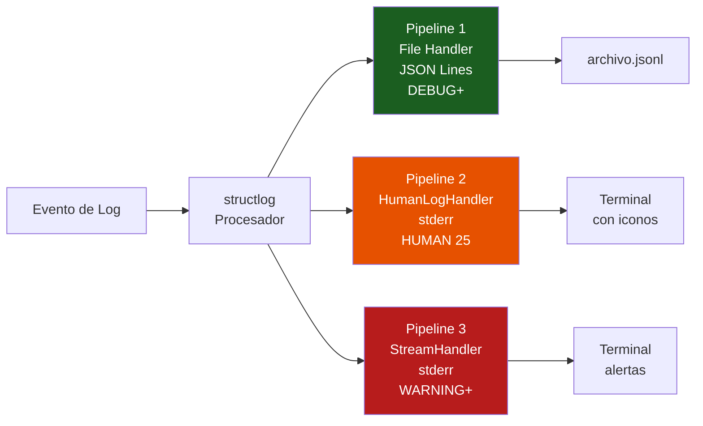
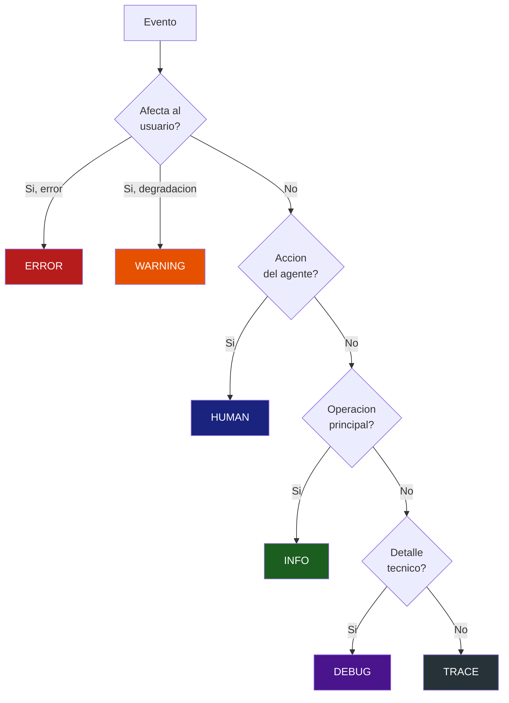

# Logging para Sistemas LLM

> [!abstract] Resumen
> El *structured logging* para sistemas LLM debe capturar dimensiones que no existen en software tradicional: ==tokens consumidos==, ==coste por llamada==, ==modelo utilizado==, ==temperatura==, ==razon de finalizacion== y ==latencia del modelo==. [[architect-overview]] implementa una arquitectura de referencia con 3 pipelines independientes: (1) *File handler* en JSON Lines para DEBUG+, (2) *HumanLogHandler* para nivel HUMAN (25) con iconos semanticos, (3) *StreamHandler* para WARNING+ en stderr. La gestion de PII en logs es ==critica== ya que los prompts pueden contener datos personales sensibles.
> ^resumen

---

## Que loguear en sistemas LLM

A diferencia del software convencional, los sistemas LLM tienen dimensiones unicas que deben registrarse. La siguiente tabla organiza los campos por categoria.

### Campos esenciales por llamada LLM

| Campo | Tipo | ==Prioridad== | Notas |
|-------|------|---------------|-------|
| `timestamp` | datetime | ==Critica== | ISO 8601 con zona horaria |
| `model` | string | ==Critica== | Modelo solicitado |
| `response_model` | string | Alta | Modelo que respondio (puede diferir) |
| `input_tokens` | int | ==Critica== | Tokens de entrada consumidos |
| `output_tokens` | int | ==Critica== | Tokens de salida generados |
| `cached_tokens` | int | Alta | Tokens servidos desde cache |
| `cost_usd` | float | ==Critica== | Coste en dolares de la llamada |
| `latency_ms` | int | ==Critica== | Tiempo total de la llamada |
| `temperature` | float | Media | Temperatura configurada |
| `max_tokens` | int | Media | Limite de tokens configurado |
| `stop_reason` | string | Alta | `stop`, `length`, `tool_calls` |
| `session_id` | string | ==Critica== | ID de la sesion del agente |
| `step_number` | int | Alta | Numero de paso en el agente |
| `trace_id` | string | Alta | ID de traza para correlacion |
| `tool_calls` | list[str] | Media | Herramientas invocadas |

> [!warning] Campos que NO debes loguear en produccion
> - **Prompt completo**: riesgo de PII, datos confidenciales, y volumen excesivo
> - **Respuesta completa**: mismos riesgos que el prompt
> - **API keys**: nunca, bajo ninguna circunstancia
> - **Datos de usuario sin sanitizar**: nombres, emails, documentos
>
> Ver la seccion de PII mas adelante para estrategias de mitigacion.

---

## Structured logging: por que JSON

El *structured logging* (logging estructurado) significa emitir logs como objetos JSON en lugar de texto plano. Es ==absolutamente esencial== para sistemas LLM.

> [!tip] Ventajas del logging estructurado
> 1. **Parseable**: herramientas como Loki, Elasticsearch, CloudWatch pueden indexar campos
> 2. **Consultable**: `SELECT * WHERE cost_usd > 0.05 AND model = 'gpt-4o'`
> 3. **Correlacionable**: `trace_id` y `session_id` conectan con trazas
> 4. **Agregable**: calcular coste total, tokens promedio, etc.
> 5. **Alertable**: alertas basadas en campos especificos

### Comparativa: texto plano vs JSON

```text
# Texto plano (NO HACER)
2025-06-01 10:23:45 INFO LLM call completed: gpt-4o, 1523 input tokens, 487 output tokens, cost $0.023

# JSON estructurado (CORRECTO)
{"timestamp":"2025-06-01T10:23:45.123Z","level":"INFO","event":"llm_call_completed","model":"gpt-4o","input_tokens":1523,"output_tokens":487,"cached_tokens":800,"cost_usd":0.023,"latency_ms":2341,"step":3,"session_id":"sess_abc123","trace_id":"4bf92f3577b34da6"}
```

> [!danger] El texto plano es una trampa
> Parece mas legible al principio, pero en produccion con miles de lineas por minuto, ==es imposible de analizar== programaticamente. El JSON es la unica opcion seria para sistemas LLM.

---

## Arquitectura de 3 pipelines de architect

[[architect-overview]] implementa una de las arquitecturas de logging mas bien disenadas para agentes IA. Usa `structlog` como libreria base y define 3 pipelines completamente independientes[^1].



### Pipeline 1: File Handler (JSON Lines)

- **Formato**: *JSON Lines* (un objeto JSON por linea, extension `.jsonl`)
- **Nivel**: DEBUG+ (captura absolutamente todo)
- **Destino**: fichero con rotacion automatica
- **Proposito**: depuracion post-mortem, analisis forense, replay

> [!example]- Configuracion del File Handler
> ```python
> import structlog
> import logging
> from logging.handlers import RotatingFileHandler
>
> # File handler para JSON Lines
> file_handler = RotatingFileHandler(
>     filename="agent.jsonl",
>     maxBytes=50 * 1024 * 1024,  # 50 MB
>     backupCount=10,
>     encoding="utf-8",
> )
> file_handler.setLevel(logging.DEBUG)
>
> # Formatter que produce JSON Lines
> class JsonLinesFormatter(logging.Formatter):
>     def format(self, record):
>         log_data = {
>             "timestamp": self.formatTime(record),
>             "level": record.levelname,
>             "event": record.getMessage(),
>             "logger": record.name,
>         }
>         # Agregar campos extra de structlog
>         if hasattr(record, '_structlog_extra'):
>             log_data.update(record._structlog_extra)
>         return json.dumps(log_data, default=str)
>
> file_handler.setFormatter(JsonLinesFormatter())
> ```

### Pipeline 2: HumanLogHandler (nivel HUMAN)

Este es el pipeline mas innovador de [[architect-overview]]. Define un nivel de log personalizado HUMAN (25) que esta ==entre INFO (20) y WARNING (30)==.

| Icono | Accion | ==Contexto== |
|-------|--------|-------------|
| Actualizar | Progreso del agente | ==Paso N de M completado== |
| Herramienta | Uso de herramienta | ==Nombre y resultado de la tool== |
| Red | Llamada de red | ==LLM call o API externa== |
| Exito | Operacion exitosa | ==Tarea completada== |
| Rapido | Operacion rapida | ==Cache hit, resultado inmediato== |
| Error | Fallo | ==Error con contexto== |
| Paquete | Dependencias | ==Instalacion o resolucion== |
| Buscar | Busqueda | ==Grep, find, search== |

> [!info] Por que un nivel personalizado?
> Los niveles estandar (DEBUG, INFO, WARNING, ERROR) no capturan la semantica de las acciones de un agente. El nivel HUMAN (25) permite:
> - Filtrar ==solo las acciones del agente== (no infra, no debug)
> - Mostrar al usuario humano un resumen legible de lo que hace el agente
> - No contaminar con detalles de implementacion

> [!example]- Definicion del nivel HUMAN en Python
> ```python
> import logging
>
> # Definir nivel personalizado
> HUMAN_LEVEL = 25
> logging.addLevelName(HUMAN_LEVEL, "HUMAN")
>
> class HumanLogHandler(logging.Handler):
>     """Handler que formatea logs para lectura humana con iconos."""
>
>     ICONS = {
>         "progress": "🔄",
>         "tool": "🔧",
>         "network": "🌐",
>         "success": "✅",
>         "fast": "⚡",
>         "error": "❌",
>         "package": "📦",
>         "search": "🔍",
>     }
>
>     def __init__(self):
>         super().__init__()
>         self.setLevel(HUMAN_LEVEL)
>
>     def emit(self, record):
>         if record.levelno != HUMAN_LEVEL:
>             return
>
>         icon = self.ICONS.get(
>             getattr(record, 'action_type', ''), '📋'
>         )
>         message = record.getMessage()
>         sys.stderr.write(f"{icon} {message}\n")
> ```

### Pipeline 3: StreamHandler (WARNING+)

- **Nivel**: WARNING+ (solo advertencias y errores)
- **Destino**: *stderr*
- **Proposito**: alertas criticas que siempre deben ser visibles

```python
stream_handler = logging.StreamHandler(sys.stderr)
stream_handler.setLevel(logging.WARNING)
stream_handler.setFormatter(logging.Formatter(
    "%(asctime)s [%(levelname)s] %(message)s"
))
```

---

## Niveles de log para sistemas IA

### Niveles de verbosidad en architect

[[architect-overview]] ofrece control fino de la verbosidad via flags de linea de comandos:

| Flag | Nivel | ==Que se ve== | Caso de uso |
|------|-------|---------------|-------------|
| (ninguno) | HUMAN | Solo acciones del agente con iconos | ==Uso normal== |
| `-v` | INFO | + operaciones principales | ==Desarrollo== |
| `-vv` | DEBUG | + detalle de LLM calls y tools | ==Depuracion== |
| `-vvv` | TRACE | + contenido de prompts y respuestas | ==Diagnostico profundo== |

> [!danger] TRACE (-vvv) solo en desarrollo
> El nivel TRACE incluye ==contenido completo de prompts y respuestas==. Esto puede exponer:
> - Datos personales de usuarios
> - Informacion confidencial de la organizacion
> - Secretos o credenciales mencionados en contexto
>
> ==Nunca== habilitar TRACE en produccion. Ver [[sla-slo-ai]] para politicas de retencion.

### Cuando usar cada nivel



> [!question] Cuando loguear a nivel HUMAN vs INFO?
> - **HUMAN**: el usuario humano necesita saber que esto paso (herramienta usada, paso completado, archivo modificado)
> - **INFO**: el desarrollador necesita saber que esto paso (conexion establecida, cache inicializado, config cargada)
>
> La diferencia es la ==audiencia==: HUMAN para usuarios del agente, INFO para operadores del sistema.

---

## PII en logs de sistemas LLM

Los logs de sistemas LLM tienen un riesgo elevado de contener *Personally Identifiable Information* (PII) porque los prompts frecuentemente incluyen datos de usuario[^2].

### Estrategias de mitigacion

> [!warning] El problema de PII en IA
> Un agente que analiza documentos legales podria recibir prompts con:
> - Nombres completos, DNI, numeros de cuenta
> - Informacion medica
> - Datos financieros
> - Comunicaciones privadas
>
> Si estos prompts se loguean sin sanitizar, tu sistema de logs se convierte en ==un repositorio de datos personales sujeto a GDPR, CCPA, etc.==

| Estrategia | ==Efectividad== | Impacto en Depuracion | Complejidad |
|-----------|----------------|----------------------|-------------|
| No loguear prompts | ==Alta== | Alto (pierdes contexto) | Baja |
| Truncar prompts | Media | Medio | Baja |
| Regex masking | Media | Bajo | Media |
| NER-based masking | ==Alta== | Bajo | Alta |
| Tokenizar y referenciar | ==Alta== | Bajo | Alta |
| Logs efimeros | Media | Variable | Media |

> [!example]- Implementacion de PII masking basico
> ```python
> import re
>
> class PIIMasker:
>     """Enmascarar PII comun en strings de log."""
>
>     PATTERNS = [
>         # Email
>         (r'[\w.+-]+@[\w-]+\.[\w.-]+', '[EMAIL_REDACTED]'),
>         # Telefono (formatos comunes)
>         (r'\b\d{3}[-.]?\d{3}[-.]?\d{4}\b', '[PHONE_REDACTED]'),
>         # SSN/DNI
>         (r'\b\d{3}-\d{2}-\d{4}\b', '[SSN_REDACTED]'),
>         # Tarjeta de credito
>         (r'\b\d{4}[-\s]?\d{4}[-\s]?\d{4}[-\s]?\d{4}\b', '[CARD_REDACTED]'),
>         # IP
>         (r'\b\d{1,3}\.\d{1,3}\.\d{1,3}\.\d{1,3}\b', '[IP_REDACTED]'),
>     ]
>
>     @classmethod
>     def mask(cls, text: str) -> str:
>         for pattern, replacement in cls.PATTERNS:
>             text = re.sub(pattern, replacement, text)
>         return text
>
> # Uso en structlog processor
> def pii_processor(logger, method_name, event_dict):
>     for key in ['prompt', 'response', 'user_input', 'context']:
>         if key in event_dict:
>             event_dict[key] = PIIMasker.mask(str(event_dict[key]))
>     return event_dict
> ```

### Politicas de retencion

| Nivel de Log | ==Retencion Recomendada== | Almacenamiento |
|-------------|--------------------------|----------------|
| ERROR/WARNING | ==90 dias== | Hot storage |
| HUMAN/INFO | ==30 dias== | Warm storage |
| DEBUG | ==7 dias== | Cold storage |
| TRACE (con prompts) | ==24 horas== | Efimero |

> [!tip] Implementar retencion automatica
> - Configura TTL (*Time To Live*) en tu backend de logs
> - Para Elasticsearch: *Index Lifecycle Management* (ILM)
> - Para Loki: retention policies en la config
> - Para ficheros: logrotate con maxage
>
> Ver [[sla-slo-ai]] para alinear retencion con requisitos de compliance.

---

## Herramientas de logging para IA

### structlog (Python)

*structlog* es la libreria recomendada para *structured logging* en Python. [[architect-overview]] la usa como base.

```python
import structlog

structlog.configure(
    processors=[
        structlog.contextvars.merge_contextvars,
        structlog.processors.add_log_level,
        structlog.processors.TimeStamper(fmt="iso"),
        pii_processor,  # Custom: sanitizar PII
        otel_processor,  # Custom: agregar trace_id
        structlog.processors.JSONRenderer(),
    ],
    wrapper_class=structlog.make_filtering_bound_logger(logging.INFO),
)

logger = structlog.get_logger()
logger.info("llm_call_completed",
            model="gpt-4o",
            input_tokens=1523,
            cost_usd=0.023)
```

> [!success] Por que structlog
> - Procesadores configurables en cadena (pipeline de transformacion)
> - Contexto automatico via contextvars (thread-safe)
> - Output JSON o texto segun ambiente
> - Integracion nativa con logging estandar de Python

---

## Relacion con el ecosistema

- **[[intake-overview]]**: los logs de ingesta deben seguir el mismo formato estructurado que los logs del agente, con `session_id` y `trace_id` compartidos para permitir correlacion end-to-end desde la ingesta hasta la respuesta
- **[[architect-overview]]**: implementacion de referencia con 3 pipelines independientes, nivel HUMAN personalizado, structlog como base, y verbosidad configurable via flags `-v`/`-vv`/`-vvv`
- **[[vigil-overview]]**: los hallazgos de seguridad de vigil deben loguearse con el mismo `session_id` y `trace_id` que la sesion del agente, permitiendo correlacion directa entre un finding SARIF y la linea de log que lo genero
- **[[licit-overview]]**: los *audit trails* de licit se construyen parcialmente a partir de logs estructurados. La consistencia en formato y campos entre los logs operacionales y los registros de auditoria es esencial

---

## Anti-patrones de logging en IA

> [!failure] Errores comunes
> 1. **Log text plano**: imposible de parsear, agregar o alertar
> 2. **Loguear todo a INFO**: sin granularidad, sin filtrado util
> 3. **Prompts en produccion**: riesgo de PII, volumen excesivo
> 4. **Sin session_id**: imposible correlacionar eventos de la misma sesion
> 5. **Sin coste**: el campo mas importante para IA y se olvida
> 6. **Logs sincronos a red**: agregan latencia a cada LLM call
> 7. **Sin rotacion**: ficheros de log que crecen hasta llenar disco
> 8. **Mezclar formatos**: JSON en un handler, texto en otro para el mismo destino

---

## Enlaces y referencias

> [!quote]- Bibliografia y recursos
> - [^1]: structlog documentation. https://www.structlog.org/
> - [^2]: OWASP. "Logging Cheat Sheet". https://cheatsheetseries.owasp.org/cheatsheets/Logging_Cheat_Sheet.html
> - [^3]: GDPR Article 5. Principios del procesamiento de datos personales.
> - [^4]: Honeycomb. "Structured Logging and Your Team". Blog post, 2023.
> - [^5]: Python logging HOWTO. https://docs.python.org/3/howto/logging.html

[^1]: structlog permite definir cadenas de procesadores que transforman el evento de log antes de emitirlo.
[^2]: Las guias de OWASP sobre logging son aplicables a sistemas de IA con consideraciones adicionales de PII.
[^3]: GDPR aplica a cualquier dato personal en logs, incluyendo prompts que contengan informacion de ciudadanos de la UE.
[^4]: El logging estructurado mejora la experiencia del equipo al facilitar la busqueda y correlacion.
[^5]: La documentacion oficial de Python logging es la base sobre la que se construyen arquitecturas como la de architect.
