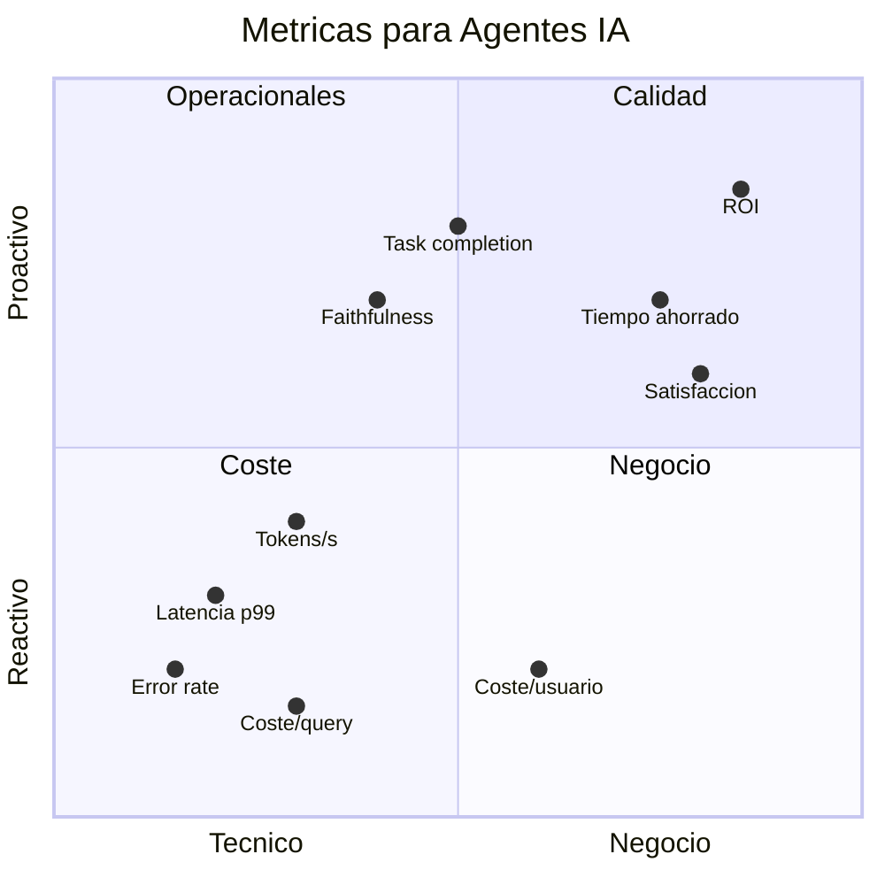
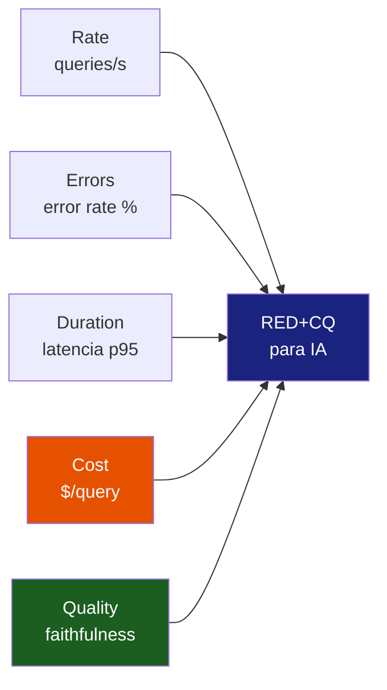

# Metricas Clave para Agentes IA

> [!abstract] Resumen
> Las metricas para sistemas de agentes IA se organizan en cuatro categorias: ==operacionales== (latencia, tokens/s, error rate), ==calidad== (task completion, faithfulness, relevancia), ==coste== (coste por query, por tarea, por usuario) y ==negocio== (satisfaccion, tiempo ahorrado, ROI). [[architect-overview]] implementa metricas concretas: conteo de pasos, coste total, distribucion de *stop reasons*, tasa de exito de herramientas. El metodo RED (*Rate, Errors, Duration*) se adapta para IA con dimensiones adicionales de calidad y coste.
> ^resumen

---

## Taxonomia de metricas para agentes IA

Las metricas de un sistema de agentes IA se organizan en cuatro cuadrantes. Cada cuadrante responde a una pregunta distinta.



---

## Metricas operacionales

Las metricas operacionales miden la ==salud tecnica== del sistema. Son las primeras que debes implementar.

### Latencia

| Percentil | ==Objetivo Tipico== | Que indica si se excede |
|-----------|---------------------|------------------------|
| p50 (mediana) | ==< 3s== | Experiencia normal degradada |
| p95 | ==< 10s== | Cola larga afecta a muchos usuarios |
| p99 | ==< 30s== | Casos extremos inaceptables |
| p99.9 | < 60s | Outliers (posible timeout) |

> [!warning] La latencia en agentes es compleja
> A diferencia de APIs REST, la latencia de un agente depende del ==numero de pasos== que decide ejecutar. Un agente puede responder en 2s (1 paso) o en 120s (20 pasos) para la misma clase de tarea. Necesitas medir:
> - Latencia total de sesion
> - Latencia por paso
> - Latencia de llamada LLM individual
> - Latencia de ejecucion de herramientas

### Tokens por segundo (throughput)

```python
# Metrica de throughput
tokens_per_second = meter.create_histogram(
    "gen_ai.throughput.tokens_per_second",
    description="Tokens generados por segundo",
    unit="tokens/s",
)

# Registrar despues de cada LLM call
tps = output_tokens / (latency_ms / 1000)
tokens_per_second.record(tps, attributes={
    "gen_ai.request.model": model,
    "gen_ai.system": "openai",
})
```

### Tasa de error

> [!info] Tipos de error en agentes IA
> No todos los errores son iguales. Clasificarlos correctamente es esencial:
>
> | Tipo de Error | ==Severidad== | Ejemplo |
> |--------------|---------------|---------|
> | Error de API (429, 500) | ==Alta== | Rate limit, servidor caido |
> | Error de herramienta | Media | Fichero no encontrado, permiso denegado |
> | Error de parsing | Media | LLM genera JSON invalido |
> | Agente atascado (loop) | ==Alta== | Repite misma accion >5 veces |
> | Presupuesto excedido | ==Critica== | Coste supera budget_usd |
> | Timeout | Alta | Sesion excede limite de tiempo |

### Disponibilidad

Para agentes IA, la disponibilidad tiene dos dimensiones:

- **Disponibilidad del servicio**: el agente esta accesible y responde
- **Disponibilidad funcional**: el agente responde Y ==produce resultados utiles==

> [!question] Como medir disponibilidad funcional?
> Una respuesta rapida pero incorrecta no cuenta como "disponible" desde la perspectiva del usuario. Combina:
> - Health checks tradicionales (servicio arriba)
> - Synthetic tests con tareas conocidas (respuesta correcta)
> - Metricas de calidad como proxy (faithfulness > umbral)
>
> Ver [[sla-slo-ai]] para definir SLOs que incluyan calidad.

---

## Metricas de calidad

Las metricas de calidad miden si el agente ==produce resultados correctos y utiles==. Son las mas dificiles de medir pero las mas importantes.

### Task completion rate

```
task_completion_rate = tareas_completadas_exitosamente / tareas_totales
```

> [!tip] Definir "completada exitosamente"
> La definicion depende del tipo de tarea:
> - **Generacion de codigo**: codigo compila y pasa tests
> - **Respuesta a preguntas**: respuesta es factualmente correcta
> - **Refactorizacion**: codigo equivalente, tests siguen pasando
> - **Analisis**: conclusiones verificables y relevantes
>
> Necesitas ==evaluaciones automatizadas== (evals) para medir esto a escala. Ver [[prompt-monitoring]] para monitoreo continuo de calidad.

### Faithfulness (fidelidad)

La *faithfulness* mide si la respuesta del agente es ==fiel a la informacion proporcionada== (no inventa datos).

```python
# Evaluacion programatica de faithfulness
def evaluate_faithfulness(response: str, context: str) -> float:
    """Score 0-1 de fidelidad de la respuesta al contexto."""
    claims = extract_claims(response)
    supported = 0
    for claim in claims:
        if is_supported_by_context(claim, context):
            supported += 1
    return supported / len(claims) if claims else 1.0
```

### Relevancia

Mide si la respuesta es ==pertinente a la pregunta== del usuario.

| Score | ==Significado== | Accion |
|-------|-----------------|--------|
| 0.9-1.0 | ==Excelente== | Ninguna |
| 0.7-0.9 | Buena | Monitorear tendencia |
| 0.5-0.7 | ==Preocupante== | Investigar, revisar prompts |
| < 0.5 | ==Inaceptable== | Alerta, intervencion inmediata |

### Formato compliance

Mide si la salida del agente cumple el formato esperado (JSON valido, Markdown correcto, codigo compilable):

```python
format_compliance_rate = meter.create_counter(
    "agent.quality.format_compliance",
    description="Respuestas que cumplen formato esperado",
)
```

---

## Metricas de coste

> [!danger] El coste es la metrica mas olvidada y mas dolorosa
> Muchos equipos descubren el impacto del coste solo cuando llega la factura. Las metricas de coste deben implementarse ==desde el dia uno==.

### Coste por query

```
coste_por_query = (input_tokens * precio_input + output_tokens * precio_output + cached_tokens * precio_cache)
```

### Coste por tarea completada

```
coste_por_tarea = sum(coste_por_query para cada query en la sesion)
```

> [!info] Diferencia entre coste por query y por tarea
> Un agente puede necesitar 5 queries (pasos) para completar una tarea. El coste por query es $0.02, pero el ==coste por tarea es $0.10==. Ambas metricas son utiles pero responden preguntas distintas.

### Metricas de coste de architect

[[architect-overview]] implementa `CostTracker` que registra:

| Metrica | ==Nivel== | Formula |
|---------|----------|---------|
| Coste por paso | ==Paso== | input_tokens * precio + output_tokens * precio |
| Coste acumulado | Sesion | sum(coste_por_paso) |
| Umbral de advertencia | Sesion | ==total >= warn_at_usd== |
| Limite duro | Sesion | ==total >= budget_usd== |

### Cost efficiency ratio

```
cost_efficiency = valor_generado / coste_total
```

> [!example]- Dashboard de metricas de coste
> ```text
> ┌─────────────────────────────────────────────┐
> │ COST DASHBOARD - Ultimo 24h                 │
> ├─────────────────────────────────────────────┤
> │ Coste total:        $47.23                  │
> │ Queries totales:    2,341                   │
> │ Coste/query avg:    $0.020                  │
> │ Coste/query p95:    $0.089                  │
> │ Coste/query max:    $1.23                   │
> │                                             │
> │ Por modelo:                                 │
> │   gpt-4o:     $38.50 (81.5%)               │
> │   gpt-4o-mini: $6.23 (13.2%)               │
> │   claude-3:    $2.50  (5.3%)               │
> │                                             │
> │ Proyeccion mensual: $1,416.90              │
> │ Budget mensual:     $2,000.00              │
> │ Utilizacion:        70.8%                  │
> └─────────────────────────────────────────────┘
> ```

Ver [[cost-tracking]] para el detalle completo de implementacion y herramientas.

---

## Metricas de negocio

Las metricas de negocio conectan el rendimiento tecnico con el ==impacto real en la organizacion==.

### Satisfaccion del usuario

- **Thumbs up/down**: feedback explicito (simple, baja tasa de respuesta)
- **CSAT score**: encuesta post-interaccion
- **NPS**: Net Promoter Score (trimestral)
- **Tasa de re-engagement**: usuarios que vuelven a usar el agente

### Tiempo ahorrado

```
tiempo_ahorrado = tiempo_manual_estimado - tiempo_con_agente
```

> [!success] Ejemplo de calculo de ROI
> - Un desarrollador gasta 30 min buscando y modificando codigo manualmente
> - Con el agente, la tarea se completa en 5 min (incluyendo revision)
> - Ahorro: 25 min por tarea
> - Si se hacen 20 tareas/dia: 500 min = 8.3 horas/dia
> - Coste del agente: $50/dia en tokens
> - Coste de 8.3 horas de desarrollador: ~$500
> - ==ROI: 10x==

### Tasa de adopcion

| Metrica | ==Que mide== | Frecuencia |
|---------|-------------|-----------|
| DAU/MAU | Usuarios activos | ==Diaria/Mensual== |
| Queries/usuario/dia | Intensidad de uso | Diaria |
| Feature usage | Que capacidades se usan | Semanal |
| Churn rate | Usuarios que dejan de usar | Mensual |
| Time to first value | Onboarding effectiveness | Por cohorte |

---

## El metodo RED adaptado para IA

El metodo RED (*Rate, Errors, Duration*) es un framework clasico para monitorear microservicios[^3]. Para agentes IA, necesita adaptaciones.

### RED clasico

- **R**ate: requests por segundo
- **E**rrors: porcentaje de requests con error
- **D**uration: latencia de requests

### RED+CQ para IA



| Componente | Metrica Principal | ==Umbral Sugerido== | Alerta |
|-----------|-------------------|---------------------|--------|
| **R**ate | queries/s | Baseline ± 2 stddev | Anomalia de trafico |
| **E**rrors | % error | ==< 1%== | Si > 5% por 5 min |
| **D**uration | p95 latency | ==< 10s== | Si > 15s por 5 min |
| **C**ost | $/query avg | ==< $0.05== | Si > $0.10 por 15 min |
| **Q**uality | faithfulness | ==> 0.85== | Si < 0.75 por 1 hora |

> [!tip] Implementar RED+CQ
> 1. Empieza con RED clasico (son las metricas mas faciles de instrumentar)
> 2. Agrega C (coste) en la primera semana (ver [[cost-tracking]])
> 3. Agrega Q (calidad) cuando tengas evals automatizados (ver [[prompt-monitoring]])
> 4. Crea un dashboard con los 5 paneles principales (ver [[dashboards-ia]])

---

## Metricas especificas de architect

[[architect-overview]] registra las siguientes metricas concretas:

### Conteo de pasos

```python
steps_histogram = meter.create_histogram(
    "agent.session.steps",
    description="Numero de pasos por sesion",
    unit="steps",
)
# Al finalizar sesion:
steps_histogram.record(total_steps, attributes={
    "agent.stop_reason": stop_reason,
    "gen_ai.request.model": model,
})
```

### Distribucion de stop reasons

| Stop Reason | ==Significado== | Accion si predomina |
|-------------|-----------------|---------------------|
| `end_turn` | ==Agente completo la tarea== | Normal, deseable |
| `max_steps` | Alcanzo limite de pasos | Revisar prompts, aumentar limite |
| `budget_exceeded` | ==Alcanzo limite de coste== | Optimizar, revisar tarea |
| `error` | Error no recuperable | Investigar, ver [[ai-postmortems]] |
| `user_cancel` | Usuario cancelo | Mejorar latencia o feedback |

### Tasa de exito de herramientas

```python
tool_success = meter.create_counter(
    "agent.tool.calls",
    description="Llamadas a herramientas",
)

# Por cada tool call:
tool_success.add(1, attributes={
    "agent.tool.name": tool_name,
    "agent.tool.success": str(success),
})
```

> [!warning] Una tasa alta de fallo en herramientas indica problemas
> Si `tool.success=false` supera el 10% para una herramienta:
> - La herramienta puede tener bugs
> - El agente puede estar usandola incorrectamente
> - Los permisos pueden ser insuficientes
>
> Ver [[alerting-ia]] para configurar alertas sobre tasa de fallo de herramientas.

---

## Instrumentacion practica

### Con OpenTelemetry (recomendado)

> [!example]- Setup completo de metricas OTel para agentes
> ```python
> from opentelemetry import metrics
> from opentelemetry.sdk.metrics import MeterProvider
> from opentelemetry.sdk.metrics.export import PeriodicExportingMetricReader
> from opentelemetry.exporter.otlp.proto.grpc.metric_exporter import OTLPMetricExporter
>
> # Configurar exporter
> metric_reader = PeriodicExportingMetricReader(
>     OTLPMetricExporter(endpoint="http://otel-collector:4317"),
>     export_interval_millis=30000,  # Cada 30s
> )
>
> provider = MeterProvider(metric_readers=[metric_reader])
> metrics.set_meter_provider(provider)
>
> meter = metrics.get_meter("architect.agent")
>
> # Definir metricas
> llm_calls = meter.create_counter("gen_ai.calls.total")
> llm_latency = meter.create_histogram("gen_ai.latency.ms")
> llm_tokens = meter.create_histogram("gen_ai.tokens.total")
> llm_cost = meter.create_counter("gen_ai.cost.usd")
> agent_steps = meter.create_histogram("agent.steps.total")
> tool_calls = meter.create_counter("agent.tool.calls")
> quality_score = meter.create_histogram("agent.quality.score")
> ```

---

## Relacion con el ecosistema

- **[[intake-overview]]**: las metricas de ingesta (documentos procesados/s, tamano medio, errores de parsing) deben complementar las metricas del agente para tener visibilidad end-to-end del pipeline de datos
- **[[architect-overview]]**: implementa metricas concretas via `CostTracker` (coste por paso, coste acumulado, limites), conteo de pasos, distribucion de stop reasons, y tasa de exito de herramientas. Es el componente con metricas mas granulares del ecosistema
- **[[vigil-overview]]**: las metricas de vigil (findings por severidad, findings por CWE, tasa de falsos positivos) se visualizan junto a las metricas operacionales para correlacionar calidad de seguridad con rendimiento del agente
- **[[licit-overview]]**: las metricas de compliance (auditorias completadas, evidencias generadas, gaps detectados) complementan las metricas de negocio para dar una vision holistica del valor y riesgo del sistema

---

## Enlaces y referencias

> [!quote]- Bibliografia y recursos
> - [^1]: Tom Wilkie. "The RED Method: key metrics for microservices architecture". Grafana Labs, 2018.
> - [^2]: Google SRE Book. Capitulo 6: "Monitoring Distributed Systems".
> - [^3]: Weaveworks. "The RED Method". https://www.weave.works/blog/the-red-method-key-metrics-for-microservices-architecture/
> - [^4]: Hamel Husain. "Your AI Product Needs Evals". Blog post, 2024.
> - [^5]: OpenTelemetry Metrics Specification. https://opentelemetry.io/docs/specs/otel/metrics/

[^1]: El metodo RED fue propuesto por Tom Wilkie como simplificacion de USE y los cuatro Golden Signals.
[^2]: Los principios de monitoreo del SRE Book aplican a IA con las extensiones de coste y calidad.
[^3]: RED se enfoca en servicios orientados a requests, que es exactamente lo que es un agente IA.
[^4]: Las evaluaciones automatizadas son la base de las metricas de calidad para IA.
[^5]: Las metricas OTel proporcionan un framework estandar para instrumentar cualquier sistema.
