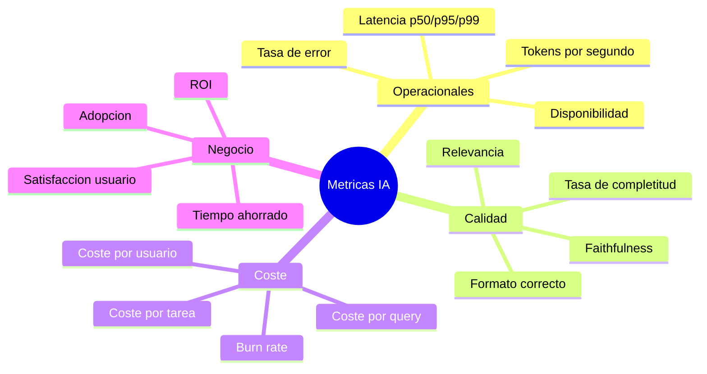
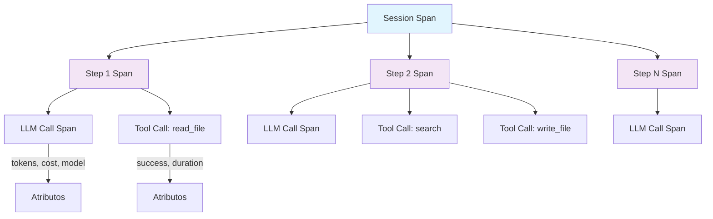
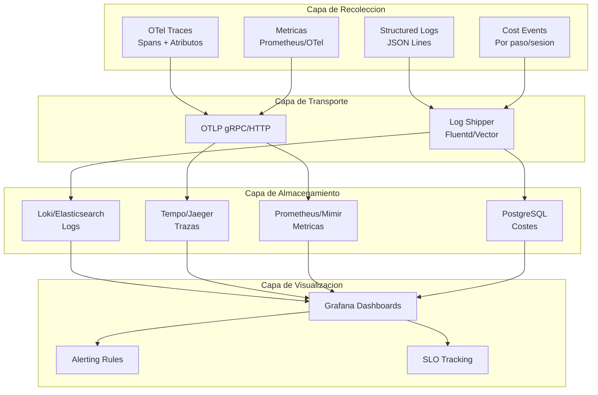
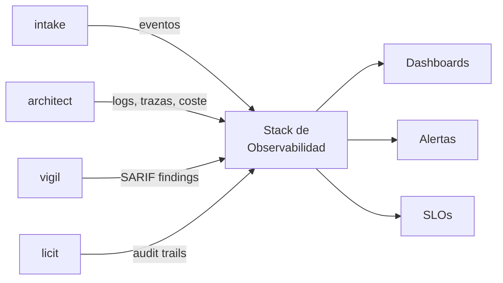

# Observabilidad para Agentes IA

> [!abstract] Resumen
> La ==observabilidad en sistemas de agentes IA== va mucho mas alla de los tres pilares clasicos (logs, metricas, trazas). Los agentes introducen ==no-determinismo==, ejecucion ==multi-paso==, y una ==dimension de coste== inexistente en software tradicional. Este documento establece el marco conceptual del *observability stack* completo para IA: *structured logging* + *distributed tracing* + metricas de negocio + *cost tracking*. Se analiza la arquitectura de 3 pipelines de [[architect-overview]] como caso de estudio de referencia.
> ^resumen

---

## Por que la observabilidad tradicional no alcanza

En sistemas de software clasicos, los tres pilares de la observabilidad (*logs*, *metrics*, *traces*) cubren la gran mayoria de necesidades de depuracion y monitoreo. Sin embargo, los agentes IA introducen desafios fundamentalmente distintos.

> [!warning] Desafios unicos de los agentes IA
> - **No-determinismo**: la misma entrada puede generar salidas completamente distintas entre ejecuciones
> - **Multi-paso**: un agente puede ejecutar 3 o 30 pasos para la misma tarea
> - **Dimension de coste**: cada llamada LLM tiene un coste monetario directo y variable
> - **Calidad subjetiva**: la "correccion" de una respuesta no es binaria
> - **Dependencia de contexto**: el comportamiento depende del historial de conversacion

### Comparativa: software tradicional vs agentes IA

| Dimension | Software Tradicional | ==Agentes IA== |
|-----------|---------------------|----------------|
| Determinismo | Entrada X produce salida Y | Entrada X produce salida Y, Z o W |
| Pasos de ejecucion | Predecibles y fijos | ==Variables y emergentes== |
| Coste por request | Fijo (compute) | ==Variable (tokens)== |
| Correccion | Binaria (pass/fail) | Espectro (faithfulness, relevance) |
| Depuracion | Stack trace | ==Trace + prompt + contexto + modelo== |
| Latencia | Milisegundos | Segundos a minutos |
| Estado | Explicito en BD | Distribuido en contexto LLM |

> [!info] Referencia clave
> La observabilidad para IA no reemplaza la observabilidad clasica, la ==extiende==. Necesitas ambas capas funcionando en conjunto. Ver [[metricas-agentes]] para el detalle de que medir.

---

## Los tres pilares clasicos, adaptados

### Pilar 1: Logs (*Structured Logging*)

Los *logs* en sistemas de agentes deben ser ==estructurados== (JSON) y capturar dimensiones adicionales que no existen en software convencional.

> [!example]- Ejemplo de log estructurado para una llamada LLM
> ```json
> {
>   "timestamp": "2025-06-01T10:23:45.123Z",
>   "level": "INFO",
>   "event": "llm_call_completed",
>   "model": "gpt-4o",
>   "session_id": "sess_abc123",
>   "step_number": 3,
>   "input_tokens": 1523,
>   "output_tokens": 487,
>   "cached_tokens": 800,
>   "cost_usd": 0.0234,
>   "latency_ms": 2341,
>   "temperature": 0.7,
>   "stop_reason": "end_turn",
>   "tool_calls": ["read_file", "search_code"],
>   "trace_id": "trace_def456",
>   "span_id": "span_ghi789"
> }
> ```

[[architect-overview]] implementa una arquitectura de 3 pipelines independientes de logging que sirve como referencia:

1. **File Handler**: formato *JSON Lines*, nivel DEBUG+, rotacion automatica
2. **HumanLogHandler**: salida a *stderr*, nivel personalizado HUMAN (25) con iconos semanticos
3. **StreamHandler**: salida a *stderr*, nivel WARNING+

> [!tip] Mejores practicas de logging para agentes
> - Usa ==*structured logging*== siempre (JSON, no texto plano)
> - Incluye `session_id`, `step_number`, `trace_id` en cada entrada
> - Registra tokens de entrada, salida y cacheados por separado
> - Nunca loguees prompts completos en produccion (riesgo de PII)
> - Usa niveles semanticos: HUMAN para trazabilidad de agente, DEBUG para desarrollo

Ver [[logging-llm]] para profundizar en estrategias de logging para sistemas LLM.

---

### Pilar 2: Metricas (*Metrics*)

Las metricas para agentes IA se organizan en cuatro categorias fundamentales:



> [!question] Que metricas son las mas criticas?
> Depende de la fase del producto:
> - **MVP/Prototipo**: latencia, tasa de error, coste por query
> - **Produccion temprana**: + calidad (faithfulness), coste por usuario
> - **Produccion madura**: + metricas de negocio (ROI, satisfaccion)
>
> Ver [[metricas-agentes]] para el catalogo completo y [[sla-slo-ai]] para definir SLOs.

---

### Pilar 3: Trazas (*Distributed Tracing*)

Las trazas en agentes IA tienen una estructura jerarquica particular:



[[architect-overview]] implementa esta jerarquia exacta usando *OpenTelemetry*:

- **Session Span**: envuelve toda la sesion del agente
- **LLM Call Spans**: tokens, coste, numero de paso, modelo
- **Tool Spans**: exito/fallo, duracion, tipo de herramienta

> [!success] Beneficios del tracing distribuido para agentes
> - Visualizar el flujo completo de ejecucion de un agente
> - Identificar cuellos de botella (que paso tardo mas?)
> - Correlacionar coste con pasos especificos
> - Depurar fallos en cadenas de herramientas

Ver [[tracing-agentes]] para la guia completa y [[opentelemetry-ia]] para la implementacion con OTel.

---

## El cuarto pilar: coste (*Cost Tracking*)

> [!danger] El coste es una dimension critica en IA
> A diferencia del software tradicional donde el coste de compute es relativamente fijo, en sistemas LLM ==cada request tiene un coste variable== que puede escalar dramaticamente. Un agente mal configurado puede gastar cientos de dolares en minutos.

El *cost tracking* en agentes IA requiere:

| Componente | Descripcion | ==Criticidad== |
|-----------|-------------|----------------|
| Calculo por request | `input_tokens * precio + output_tokens * precio + cached * precio_cache` | ==Alta== |
| Acumulacion por sesion | Suma de costes de todas las llamadas LLM en una sesion | ==Alta== |
| Limites y alertas | `budget_usd` como hard limit, `warn_at_usd` como soft limit | ==Critica== |
| Agregacion temporal | Coste por hora, dia, semana, mes | Media |
| Segmentacion | Por usuario, por feature, por modelo | Media |

[[architect-overview]] implementa `CostTracker` con:

- Registro por paso: tokens de entrada, salida, cacheados, coste en USD
- Umbral de advertencia (`warn_at_usd`)
- Limite duro de presupuesto (`budget_usd`)
- Hook `budget_warning` para notificaciones

> [!example]- Flujo de cost tracking en architect
> ```python
> # Pseudocodigo del flujo de CostTracker
> class CostTracker:
>     def __init__(self, budget_usd: float, warn_at_usd: float):
>         self.budget_usd = budget_usd
>         self.warn_at_usd = warn_at_usd
>         self.total_cost = 0.0
>         self.steps = []
>
>     def record_step(self, step: int, input_tokens: int,
>                     output_tokens: int, cached_tokens: int,
>                     model: str):
>         cost = self._calculate_cost(
>             input_tokens, output_tokens, cached_tokens, model
>         )
>         self.total_cost += cost
>         self.steps.append({
>             "step": step,
>             "input_tokens": input_tokens,
>             "output_tokens": output_tokens,
>             "cached_tokens": cached_tokens,
>             "cost_usd": cost,
>             "cumulative_cost_usd": self.total_cost
>         })
>
>         if self.total_cost >= self.budget_usd:
>             raise BudgetExceededError()
>         elif self.total_cost >= self.warn_at_usd:
>             self._fire_budget_warning()
> ```

Ver [[cost-tracking]] para el detalle completo de implementacion.

---

## El *observability stack* completo para IA

La observabilidad completa para agentes IA requiere la integracion de multiples capas:



> [!tip] Stack recomendado para equipos pequenos
> Para empezar, no necesitas toda la infraestructura. Un stack minimo viable:
> 1. **Logs**: ficheros JSON Lines locales (como [[architect-overview]])
> 2. **Trazas**: Jaeger en Docker para desarrollo
> 3. **Metricas**: Prometheus con pocos contadores clave
> 4. **Coste**: tabla en PostgreSQL o incluso un CSV
>
> Escala segun necesidad. Ver [[dashboards-ia]] para diseno de paneles.

---

## Caso de estudio: arquitectura de logging de architect

[[architect-overview]] ofrece un ejemplo concreto y bien disenado de observabilidad para agentes. Su arquitectura de 3 pipelines merece un analisis detallado.

### Pipeline 1: File Handler (JSON Lines)

- **Formato**: *JSON Lines* (un objeto JSON por linea)
- **Nivel**: DEBUG+ (captura todo)
- **Destino**: fichero rotado automaticamente
- **Proposito**: depuracion post-mortem, analisis forense

### Pipeline 2: HumanLogHandler

- **Nivel personalizado**: HUMAN (nivel 25, entre INFO y WARNING)
- **Destino**: *stderr*
- **Iconos semanticos**: cada tipo de accion tiene un icono dedicado

| Icono | Significado |
|-------|-------------|
| ==Actualizar== | Progreso, paso del agente |
| ==Herramienta== | Uso de tool |
| ==Red== | Llamada de red |
| ==Exito== | Operacion exitosa |
| ==Rapido== | Operacion rapida |
| ==Error== | Fallo |
| ==Paquete== | Gestion de dependencias |
| ==Buscar== | Busqueda |

### Pipeline 3: StreamHandler

- **Nivel**: WARNING+
- **Destino**: *stderr*
- **Proposito**: alertas criticas visibles siempre

> [!info] Niveles de verbosidad en architect
> - `-v` (INFO): operaciones principales del agente
> - `-vv` (DEBUG): detalle de llamadas LLM y herramientas
> - `-vvv` (TRACE): todo, incluyendo contenido de prompts
>
> Ver [[logging-llm]] para mejores practicas sobre que nivel usar cuando.

---

## Observabilidad por fase del ciclo de vida

| Fase | Foco de Observabilidad | Herramientas Clave |
|------|----------------------|-------------------|
| ==Desarrollo== | Trazas detalladas, logs verbose | Jaeger local, logs JSON |
| ==Testing== | Metricas de calidad, comparativas | [[langfuse]], evals automatizados |
| ==Staging== | Latencia, coste, calidad | Dashboards Grafana, alertas basicas |
| ==Produccion== | Todo + SLOs, alertas, cost tracking | Stack completo, [[sla-slo-ai]] |
| ==Post-incidente== | Trazas historicas, replay | [[ai-postmortems]], logs archivados |

> [!warning] Error comun: observabilidad solo en produccion
> Muchos equipos implementan observabilidad solo cuando ya estan en produccion. Para agentes IA, es ==critico== tener trazas y logs desde la fase de desarrollo. La depuracion de un agente sin trazas es practicamente imposible.

---

## Anti-patrones de observabilidad en IA

> [!failure] Anti-patrones a evitar
> 1. **Log-and-pray**: loguear todo sin estructura, esperar que sea util algun dia
> 2. **Metricas vanidosas**: medir solo tokens procesados sin correlacionar con calidad
> 3. **Alertas ruidosas**: alertar en cada error cuando los agentes tienen reintentos
> 4. **Ignorar el coste**: tratar las llamadas LLM como "gratis" hasta la factura
> 5. **Trazas sin contexto**: spans sin atributos de negocio (que tarea, que usuario)
> 6. **Prompts en logs**: loguear prompts completos sin sanitizar PII

---

## Relacion con el ecosistema

La observabilidad es transversal a todo el ecosistema de agentes IA:

- **[[intake-overview]]**: la ingesta de datos alimenta los pipelines de observabilidad. Los eventos de intake deben generar trazas y metricas que se correlacionen con las sesiones de agente
- **[[architect-overview]]**: implementa el *gold standard* de observabilidad para agentes con sus 3 pipelines de logging, integracion OTel completa, y `CostTracker`. Es el componente con la observabilidad mas madura del ecosistema
- **[[vigil-overview]]**: genera *findings* en formato SARIF y reportes JUnit XML. Estos artefactos deben integrarse con el stack de observabilidad para correlacionar hallazgos de seguridad con trazas de ejecucion
- **[[licit-overview]]**: los *audit trails* y *evidence bundles* de licit son una forma especializada de observabilidad enfocada en compliance. Deben complementar (no duplicar) los logs y trazas operacionales



---

## Checklist de implementacion

> [!success] Lista de verificacion para observabilidad de agentes
> - [ ] Logs estructurados en formato JSON con campos consistentes
> - [ ] *Distributed tracing* con propagacion de contexto
> - [ ] Metricas de latencia, error rate, y tokens
> - [ ] *Cost tracking* con limites y alertas
> - [ ] Dashboard con paneles esenciales
> - [ ] Alertas configuradas para anomalias de coste y calidad
> - [ ] SLOs definidos y monitoreados
> - [ ] Proceso de post-mortem establecido
> - [ ] Sanitizacion de PII en logs
> - [ ] Retencion de datos definida y automatizada

---

## Enlaces y referencias

> [!quote]- Bibliografia y recursos
> - [^1]: Charity Majors, Liz Fong-Jones, George Miranda. *Observability Engineering*. O'Reilly, 2022.
> - [^2]: OpenTelemetry Semantic Conventions for GenAI. https://opentelemetry.io/docs/specs/semconv/gen-ai/
> - [^3]: Anthropic. "Building observable AI systems". Blog post, 2024.
> - [^4]: Hamel Husain. "Your AI Product Needs Evals". Blog post, 2024.
> - [^5]: Google SRE Book. Capitulo 6: "Monitoring Distributed Systems".

[^1]: Majors, Fong-Jones, Miranda. *Observability Engineering*. O'Reilly, 2022.
[^2]: OpenTelemetry GenAI Semantic Conventions. Estandar emergente para instrumentacion de sistemas de IA generativa.
[^3]: La observabilidad como practica, no como producto: requiere cultura ademas de herramientas.
[^4]: Las evaluaciones automatizadas son el puente entre observabilidad y calidad.
[^5]: Los principios de SRE aplican a sistemas IA con adaptaciones especificas.
