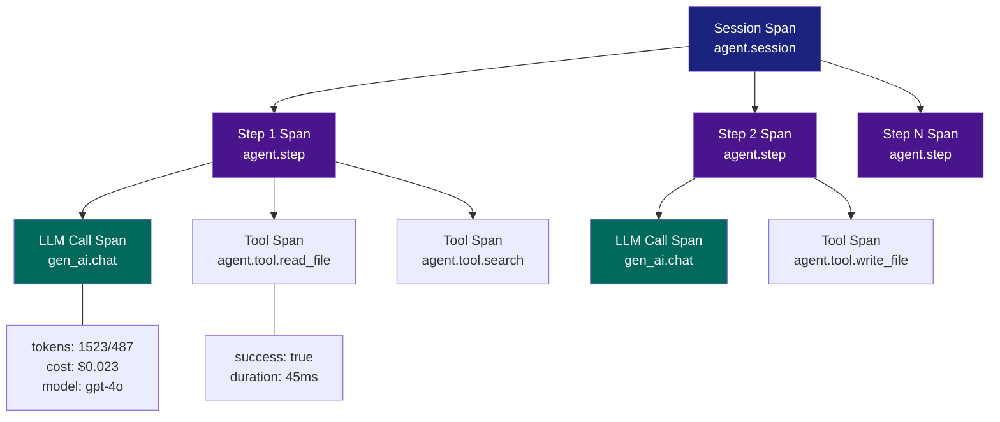
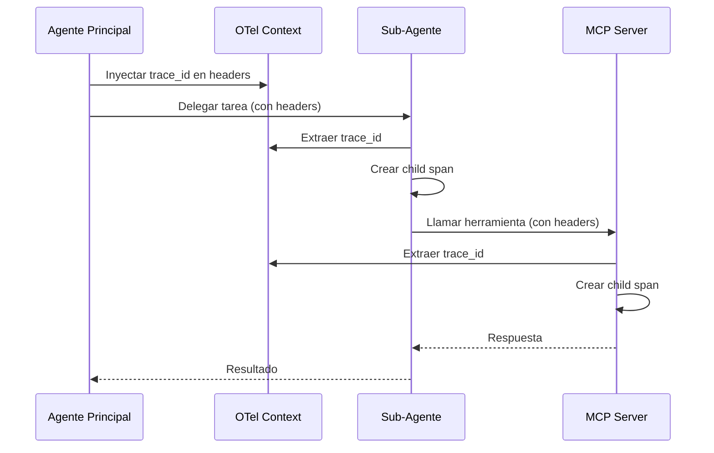

# OpenTelemetry para Sistemas IA/LLM

> [!abstract] Resumen
> *OpenTelemetry* (OTel) se esta consolidando como el ==estandar de facto para instrumentacion de sistemas de IA generativa==. Las *Semantic Conventions for GenAI* definen atributos como `gen_ai.system`, `gen_ai.request.model`, `gen_ai.usage.input_tokens` y `gen_ai.usage.output_tokens`. [[architect-overview]] implementa OTel de forma completa: ==session span que envuelve todo==, ==LLM call spans con atributos de tokens y coste==, ==tool spans con exito y duracion==. Los datos fluyen via *OTLP* a colectores como Jaeger o Grafana Tempo para visualizacion y analisis.
> ^resumen

---

## Que es OpenTelemetry

*OpenTelemetry* es un framework de observabilidad *open source*, parte de la CNCF (*Cloud Native Computing Foundation*), que proporciona APIs, SDKs y herramientas para generar, recolectar y exportar datos de telemetria: *traces*, *metrics* y *logs*[^1].

> [!info] Por que OTel para IA
> OTel ofrece tres ventajas criticas para sistemas de IA:
> 1. **Estandar abierto**: no dependes de un vendor especifico (a diferencia de [[langsmith]])
> 2. **Extensible**: las *Semantic Conventions* permiten atributos especificos de IA
> 3. **Ecosistema maduro**: integracion con Jaeger, Grafana, Prometheus, y decenas mas
>
> Ver [[observabilidad-agentes]] para el marco conceptual completo.

---

## Semantic Conventions para GenAI

Las *Semantic Conventions for Generative AI* son un estandar emergente dentro de OTel que define como instrumentar sistemas de IA generativa[^2].

### Atributos de span para llamadas LLM

| Atributo | Tipo | Descripcion | ==Ejemplo== |
|----------|------|-------------|-------------|
| `gen_ai.system` | string | Proveedor del modelo | ==`openai`==, `anthropic` |
| `gen_ai.request.model` | string | Modelo solicitado | ==`gpt-4o`==, `claude-sonnet-4-20250514` |
| `gen_ai.response.model` | string | Modelo que respondio | `gpt-4o-2024-05-13` |
| `gen_ai.request.temperature` | float | Temperatura configurada | `0.7` |
| `gen_ai.request.max_tokens` | int | Maximo de tokens solicitado | `4096` |
| `gen_ai.request.top_p` | float | Top-p configurado | `0.9` |
| `gen_ai.usage.input_tokens` | int | Tokens de entrada consumidos | ==`1523`== |
| `gen_ai.usage.output_tokens` | int | Tokens de salida generados | ==`487`== |
| `gen_ai.response.finish_reason` | string | Razon de finalizacion | `stop`, `length`, `tool_calls` |
| `gen_ai.request.stop_sequences` | string[] | Secuencias de parada | `["\n\n"]` |

> [!warning] Estado del estandar
> Las *Semantic Conventions for GenAI* estan en estado ==experimental== (a fecha de 2025). Los atributos pueden cambiar. Sin embargo, la estructura general es estable y ampliamente adoptada. [[phoenix-arize]] ya usa este estandar de forma nativa.

### Atributos extendidos (no estandar pero recomendados)

Ademas de los atributos estandar, los sistemas de agentes suelen necesitar atributos adicionales:

| Atributo Custom | Tipo | Descripcion |
|----------------|------|-------------|
| `gen_ai.usage.cached_tokens` | int | Tokens servidos desde cache |
| `gen_ai.cost.total_usd` | float | Coste total de la llamada en USD |
| `gen_ai.cost.input_usd` | float | Coste de tokens de entrada |
| `gen_ai.cost.output_usd` | float | Coste de tokens de salida |
| `agent.step_number` | int | Numero de paso del agente |
| `agent.session_id` | string | ID unico de sesion |
| `agent.tool.name` | string | Nombre de la herramienta invocada |
| `agent.tool.success` | bool | Si la herramienta tuvo exito |

---

## Implementacion en architect

[[architect-overview]] es un ejemplo de referencia de como implementar OTel en un sistema de agentes. Su arquitectura de trazas sigue una jerarquia clara.

### Jerarquia de spans



### Session Span

El *session span* es el span raiz que envuelve toda la ejecucion del agente:

> [!example]- Creacion del session span en architect
> ```python
> from opentelemetry import trace
> from opentelemetry.trace import StatusCode
>
> tracer = trace.get_tracer("architect.agent")
>
> def run_agent(task: str, session_id: str):
>     with tracer.start_as_current_span(
>         "agent.session",
>         attributes={
>             "agent.session_id": session_id,
>             "agent.task": task[:200],  # Truncar para no exceder limites
>             "agent.model": "gpt-4o",
>             "agent.max_steps": 50,
>         }
>     ) as session_span:
>         try:
>             result = execute_agent_loop(task)
>             session_span.set_attribute("agent.total_steps", result.steps)
>             session_span.set_attribute("agent.total_cost_usd", result.cost)
>             session_span.set_attribute("agent.stop_reason", result.stop_reason)
>             session_span.set_status(StatusCode.OK)
>         except Exception as e:
>             session_span.set_status(StatusCode.ERROR, str(e))
>             session_span.record_exception(e)
>             raise
> ```

### LLM Call Spans

Cada llamada al LLM genera un span con los atributos de la convencion GenAI:

> [!example]- Creacion de LLM call spans
> ```python
> def call_llm(messages: list, model: str, step: int):
>     with tracer.start_as_current_span(
>         "gen_ai.chat",
>         attributes={
>             "gen_ai.system": "openai",
>             "gen_ai.request.model": model,
>             "gen_ai.request.temperature": 0.7,
>             "gen_ai.request.max_tokens": 4096,
>             "agent.step_number": step,
>         }
>     ) as llm_span:
>         response = openai_client.chat.completions.create(
>             model=model,
>             messages=messages,
>             temperature=0.7,
>             max_tokens=4096,
>         )
>
>         usage = response.usage
>         llm_span.set_attribute("gen_ai.usage.input_tokens", usage.prompt_tokens)
>         llm_span.set_attribute("gen_ai.usage.output_tokens", usage.completion_tokens)
>         llm_span.set_attribute("gen_ai.usage.cached_tokens",
>                                getattr(usage, 'cached_tokens', 0))
>         llm_span.set_attribute("gen_ai.response.model", response.model)
>         llm_span.set_attribute("gen_ai.response.finish_reason",
>                                response.choices[0].finish_reason)
>
>         # Calcular y registrar coste
>         cost = calculate_cost(usage, model)
>         llm_span.set_attribute("gen_ai.cost.total_usd", cost)
>
>         return response
> ```

### Tool Spans

Las ejecuciones de herramientas generan spans con atributos de exito y duracion:

> [!example]- Creacion de tool spans
> ```python
> import time
>
> def execute_tool(tool_name: str, tool_input: dict):
>     with tracer.start_as_current_span(
>         f"agent.tool.{tool_name}",
>         attributes={
>             "agent.tool.name": tool_name,
>             "agent.tool.input_size": len(str(tool_input)),
>         }
>     ) as tool_span:
>         start = time.monotonic()
>         try:
>             result = tool_registry[tool_name].execute(tool_input)
>             duration_ms = (time.monotonic() - start) * 1000
>
>             tool_span.set_attribute("agent.tool.success", True)
>             tool_span.set_attribute("agent.tool.duration_ms", duration_ms)
>             tool_span.set_attribute("agent.tool.output_size", len(str(result)))
>             tool_span.set_status(StatusCode.OK)
>
>             return result
>         except Exception as e:
>             duration_ms = (time.monotonic() - start) * 1000
>             tool_span.set_attribute("agent.tool.success", False)
>             tool_span.set_attribute("agent.tool.duration_ms", duration_ms)
>             tool_span.set_attribute("agent.tool.error", str(e))
>             tool_span.set_status(StatusCode.ERROR, str(e))
>             tool_span.record_exception(e)
>             raise
> ```

---

## Configuracion de exporters

[[architect-overview]] soporta tres exporters de OTel, seleccionables por configuracion:

### OTLP (gRPC)

El exporter principal para entornos de produccion. Envia trazas via *gRPC* a un *OTel Collector* o directamente a backends como Jaeger o Grafana Tempo.

> [!example]- Configuracion del exporter OTLP
> ```python
> from opentelemetry.sdk.trace import TracerProvider
> from opentelemetry.sdk.trace.export import BatchSpanProcessor
> from opentelemetry.exporter.otlp.proto.grpc.trace_exporter import OTLPSpanExporter
> from opentelemetry.sdk.resources import Resource
>
> resource = Resource.create({
>     "service.name": "architect-agent",
>     "service.version": "1.2.0",
>     "deployment.environment": "production",
> })
>
> provider = TracerProvider(resource=resource)
>
> otlp_exporter = OTLPSpanExporter(
>     endpoint="http://otel-collector:4317",
>     insecure=True,  # Solo para desarrollo
> )
>
> provider.add_span_processor(
>     BatchSpanProcessor(otlp_exporter)
> )
>
> trace.set_tracer_provider(provider)
> ```

### Console (*stderr*)

Util para desarrollo y depuracion local:

```python
from opentelemetry.sdk.trace.export import ConsoleSpanExporter, SimpleSpanProcessor

provider.add_span_processor(
    SimpleSpanProcessor(ConsoleSpanExporter())
)
```

### JSON File

Para persistir trazas en fichero, util para analisis offline:

```python
from opentelemetry.sdk.trace.export import SimpleSpanProcessor

class JsonFileExporter(SpanExporter):
    def __init__(self, filepath: str):
        self.filepath = filepath

    def export(self, spans):
        with open(self.filepath, "a") as f:
            for span in spans:
                f.write(span.to_json() + "\n")
```

> [!tip] Seleccion de exporter
> - **Desarrollo**: Console o JSON File para inspeccion rapida
> - **Staging**: OTLP a Jaeger local para visualizacion
> - **Produccion**: OTLP a Collector con batching y retry
>
> Ver [[dashboards-ia]] para como visualizar estas trazas.

---

## Configuracion de Jaeger para trazas de IA

*Jaeger* es uno de los backends mas populares para visualizar *distributed traces*. Configurarlo para recibir trazas de agentes IA es directo.

> [!example]- Docker Compose para Jaeger con OTel
> ```yaml
> version: '3.8'
> services:
>   jaeger:
>     image: jaegertracing/all-in-one:1.54
>     ports:
>       - "16686:16686"    # UI
>       - "4317:4317"      # OTLP gRPC
>       - "4318:4318"      # OTLP HTTP
>     environment:
>       - COLLECTOR_OTLP_ENABLED=true
>       - SPAN_STORAGE_TYPE=badger
>       - BADGER_EPHEMERAL=false
>       - BADGER_DIRECTORY_VALUE=/badger/data
>       - BADGER_DIRECTORY_KEY=/badger/key
>     volumes:
>       - jaeger_data:/badger
>
>   otel-collector:
>     image: otel/opentelemetry-collector-contrib:0.96.0
>     command: ["--config=/etc/otel-collector-config.yaml"]
>     ports:
>       - "4317:4317"
>     volumes:
>       - ./otel-collector-config.yaml:/etc/otel-collector-config.yaml
>     depends_on:
>       - jaeger
>
> volumes:
>   jaeger_data:
> ```

### Configuracion del OTel Collector

> [!example]- otel-collector-config.yaml
> ```yaml
> receivers:
>   otlp:
>     protocols:
>       grpc:
>         endpoint: 0.0.0.0:4317
>       http:
>         endpoint: 0.0.0.0:4318
>
> processors:
>   batch:
>     timeout: 5s
>     send_batch_size: 1024
>
>   attributes:
>     actions:
>       # Eliminar atributos sensibles antes de almacenar
>       - key: gen_ai.request.messages
>         action: delete
>       - key: gen_ai.response.content
>         action: delete
>
> exporters:
>   otlp/jaeger:
>     endpoint: jaeger:4317
>     tls:
>       insecure: true
>
> service:
>   pipelines:
>     traces:
>       receivers: [otlp]
>       processors: [attributes, batch]
>       exporters: [otlp/jaeger]
> ```

> [!danger] Seguridad en trazas
> ==Nunca almacenes contenido de prompts o respuestas LLM en trazas de produccion==. Usa el procesador `attributes` del Collector para eliminar campos sensibles antes de que lleguen al backend. Ver [[logging-llm]] para politicas de PII.

---

## Grafana Tempo como alternativa

*Grafana Tempo* es una alternativa a Jaeger optimizada para alto volumen, especialmente cuando ya usas el stack de Grafana.

| Caracteristica | Jaeger | ==Grafana Tempo== |
|---------------|--------|-------------------|
| Almacenamiento | Badger, Cassandra, ES | ==Object storage (S3, GCS)== |
| Coste a escala | Alto | ==Bajo== |
| UI | Propia (buena) | Via Grafana (excelente) |
| Correlacion con metricas | Manual | ==Nativa en Grafana== |
| TraceQL | No | ==Si== |
| Configuracion | Simple | Media |

> [!tip] Recomendacion
> - **Equipo pequeno, desarrollo**: Jaeger all-in-one en Docker
> - **Produccion, alto volumen**: Grafana Tempo + Grafana
> - **Ya usas Grafana**: Tempo es la opcion natural
>
> Ambos soportan OTLP, asi que el cambio de backend es transparente para tu codigo.

---

## Metricas OTel para IA

Ademas de trazas, OTel permite generar metricas. Para sistemas de IA, las metricas clave son:

```python
from opentelemetry import metrics

meter = metrics.get_meter("architect.agent")

# Contadores
llm_calls_counter = meter.create_counter(
    "gen_ai.calls.total",
    description="Total LLM calls",
    unit="1",
)

tokens_counter = meter.create_counter(
    "gen_ai.tokens.total",
    description="Total tokens consumed",
    unit="tokens",
)

cost_counter = meter.create_counter(
    "gen_ai.cost.total",
    description="Total cost in USD",
    unit="usd",
)

# Histogramas
latency_histogram = meter.create_histogram(
    "gen_ai.latency",
    description="LLM call latency",
    unit="ms",
)

tokens_per_call = meter.create_histogram(
    "gen_ai.tokens.per_call",
    description="Tokens per LLM call",
    unit="tokens",
)
```

> [!info] Metricas vs Trazas
> Las metricas son para ==tendencias y alertas== (latencia p99, error rate). Las trazas son para ==depuracion individual== (por que esta request fue lenta). Necesitas ambas. Ver [[metricas-agentes]] para el catalogo completo.

---

## Patrones avanzados

### Propagacion de contexto en multi-agente

Cuando un agente delega a sub-agentes o llama a servidores MCP, el contexto de traza debe propagarse:



Ver [[tracing-agentes]] para la guia completa de propagacion de contexto.

### Sampling inteligente

En produccion, no puedes almacenar el 100% de las trazas. El *sampling* inteligente prioriza trazas interesantes:

> [!tip] Estrategias de sampling para IA
> - **Head-based**: decidir al inicio (rapido pero ciego)
> - **Tail-based**: decidir al final (mejor pero requiere Collector)
> - **Recomendado para IA**: tail-based con reglas:
>   - Siempre muestrear si `error = true`
>   - Siempre muestrear si `cost_usd > 0.10`
>   - Siempre muestrear si `latency_ms > 10000`
>   - Muestrear 10% del resto

---

## Relacion con el ecosistema

- **[[intake-overview]]**: los datos ingeridos por intake pueden instrumentarse con OTel para trazar el flujo desde la ingesta hasta el procesamiento por el agente. Los *span links* permiten conectar trazas de intake con trazas de sesiones de agente
- **[[architect-overview]]**: implementacion de referencia de OTel para agentes. Session spans, LLM call spans con atributos GenAI, tool spans con exito/duracion. Tres exporters configurables: OTLP, console, JSON file
- **[[vigil-overview]]**: los *findings* de vigil (SARIF) pueden enriquecerse con `trace_id` para correlacionar hallazgos de seguridad con la traza de ejecucion exacta que los genero
- **[[licit-overview]]**: los *audit trails* de licit pueden generarse a partir de trazas OTel, proporcionando evidencia de cumplimiento basada en datos de telemetria estandar

---

## Troubleshooting comun

> [!failure] Problemas frecuentes
> | Problema | Causa | Solucion |
> |----------|-------|----------|
> | No aparecen trazas en Jaeger | Exporter apuntando a endpoint incorrecto | Verificar `OTEL_EXPORTER_OTLP_ENDPOINT` |
> | Spans sin atributos | Atributos seteados despues de cerrar span | Setear atributos antes del `end()` |
> | Trazas incompletas | Proceso termina antes del flush | Llamar `provider.force_flush()` |
> | Alta latencia por OTel | `SimpleSpanProcessor` en produccion | Usar `BatchSpanProcessor` |
> | Demasiado almacenamiento | Sin sampling | Configurar tail-based sampling |

---

## Enlaces y referencias

> [!quote]- Bibliografia y recursos
> - [^1]: OpenTelemetry Documentation. https://opentelemetry.io/docs/
> - [^2]: OpenTelemetry Semantic Conventions for GenAI. https://opentelemetry.io/docs/specs/semconv/gen-ai/
> - [^3]: "Distributed Tracing in Practice". Austin Parker et al. O'Reilly, 2020.
> - [^4]: Jaeger Documentation. https://www.jaegertracing.io/docs/
> - [^5]: Grafana Tempo Documentation. https://grafana.com/docs/tempo/

[^1]: OTel es el segundo proyecto mas activo de la CNCF despues de Kubernetes.
[^2]: Las convenciones semanticas para GenAI fueron propuestas en 2024 y estan en desarrollo activo.
[^3]: El tracing distribuido es esencial para entender el flujo de ejecucion en sistemas complejos.
[^4]: Jaeger fue desarrollado originalmente por Uber y donado a la CNCF.
[^5]: Tempo usa almacenamiento de objetos (S3/GCS) lo que reduce costes a escala significativamente.
