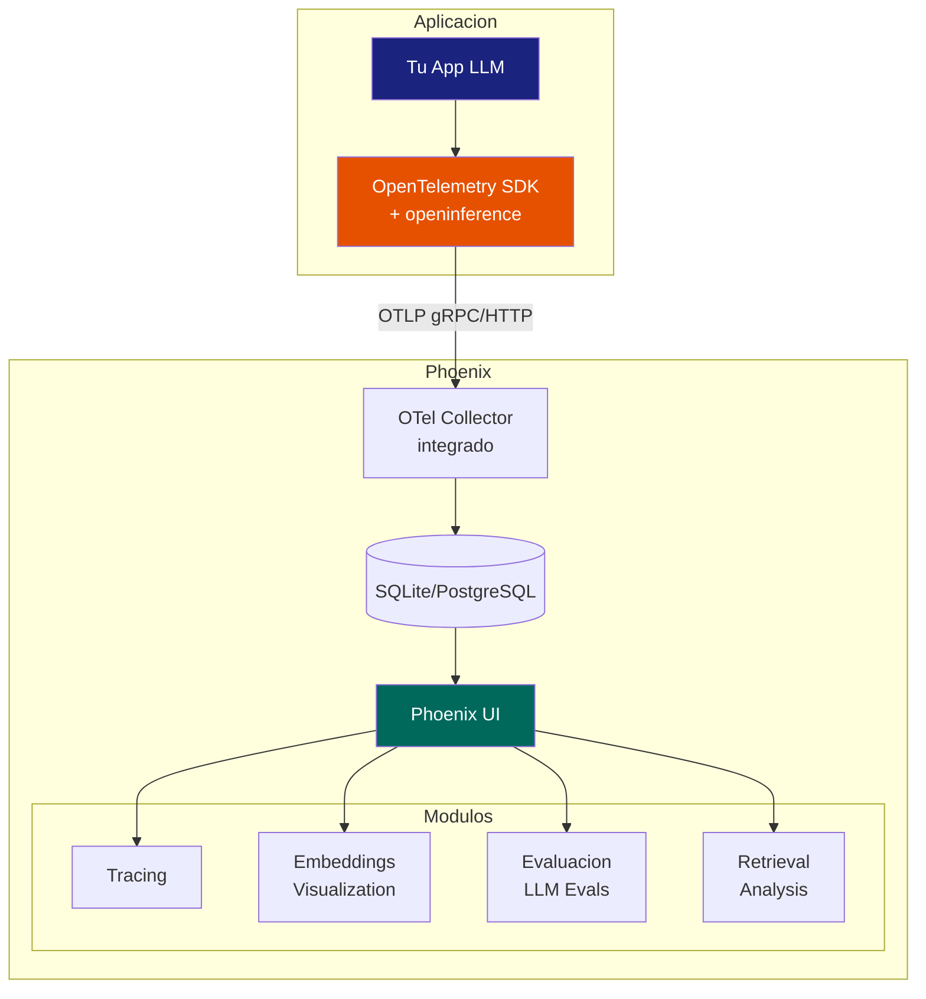

# Arize Phoenix: Observabilidad y Evaluacion Open Source

> [!abstract] Resumen
> *Arize Phoenix* es una plataforma ==open source== de observabilidad y evaluacion para aplicaciones LLM. Su diferenciador clave es ser ==OTel-native==: usa *OpenTelemetry* como capa de instrumentacion, alineandose con el estandar de la industria. Ofrece ==trazas==, ==visualizacion de embeddings==, ==evaluacion de LLM== (deteccion de alucinaciones, QA, summarization), y ==analisis de retrieval==. Se integra con OpenAI, LlamaIndex, LangChain y otros. Comparado con [[langfuse]] y [[langsmith]], Phoenix destaca en evaluacion automatizada y su arquitectura nativa de OTel.
> ^resumen

---

## Arquitectura

Phoenix esta disenado como una herramienta de desarrollo y observabilidad que corre localmente o en servidor, recibiendo trazas via OpenTelemetry[^1].



> [!info] OTel-native: la gran diferencia
> Phoenix usa ==OpenTelemetry como capa de instrumentacion==, no un SDK propietario. Esto significa:
> - Las trazas de Phoenix son ==compatibles con cualquier backend OTel== (Jaeger, Tempo, etc.)
> - Puedes enviar trazas a Phoenix Y a tu stack de observabilidad existente simultaneamente
> - La instrumentacion sigue el estandar `openinference` (basado en OTel semantic conventions)
>
> Ver [[opentelemetry-ia]] para el detalle de OTel en sistemas de IA.

---

## Tracing

### Instrumentacion con openinference

Phoenix usa `openinference-instrumentation`, una libreria basada en OTel con extensiones para IA:

> [!example]- Instrumentacion basica con Phoenix
> ```python
> import phoenix as px
> from openinference.instrumentation.openai import OpenAIInstrumentor
> from opentelemetry import trace
> from opentelemetry.sdk.trace import TracerProvider
> from opentelemetry.exporter.otlp.proto.http.trace_exporter import OTLPSpanExporter
>
> # Iniciar Phoenix
> session = px.launch_app()
>
> # Configurar OTel para enviar a Phoenix
> endpoint = "http://localhost:6006/v1/traces"
> tracer_provider = TracerProvider()
> tracer_provider.add_span_processor(
>     SimpleSpanProcessor(OTLPSpanExporter(endpoint))
> )
> trace.set_tracer_provider(tracer_provider)
>
> # Instrumentar OpenAI automaticamente
> OpenAIInstrumentor().instrument()
>
> # Ahora cualquier llamada OpenAI se traza automaticamente
> import openai
> client = openai.OpenAI()
> response = client.chat.completions.create(
>     model="gpt-4o",
>     messages=[{"role": "user", "content": "Hola"}],
> )
> # La traza aparece automaticamente en Phoenix UI
> ```

### Auto-instrumentadores disponibles

| Libreria | ==Instrumentador== | Cobertura |
|----------|---------------------|-----------|
| OpenAI | `OpenAIInstrumentor` | ==Completa== |
| Anthropic | `AnthropicInstrumentor` | ==Completa== |
| LlamaIndex | `LlamaIndexInstrumentor` | ==Completa== |
| LangChain | `LangChainInstrumentor` | Completa |
| Mistral | `MistralInstrumentor` | Completa |
| Bedrock | `BedrockInstrumentor` | Basica |
| Guardrails | `GuardrailsInstrumentor` | Basica |

> [!tip] Instrumentacion dual: Phoenix + tu stack
> Como Phoenix usa OTel, puedes enviar trazas a ==dos destinos== simultaneamente:
> ```python
> from opentelemetry.sdk.trace.export import BatchSpanProcessor
>
> # Enviar a Phoenix para desarrollo
> tracer_provider.add_span_processor(
>     SimpleSpanProcessor(OTLPSpanExporter("http://localhost:6006/v1/traces"))
> )
>
> # Enviar a Jaeger/Tempo para produccion
> tracer_provider.add_span_processor(
>     BatchSpanProcessor(OTLPSpanExporter("http://otel-collector:4318/v1/traces"))
> )
> ```
>
> Ver [[tracing-agentes]] para patrones avanzados de tracing.

---

## Visualizacion de embeddings

Una capacidad unica de Phoenix es la ==visualizacion de embeddings== en 2D/3D, util para entender como tu modelo organiza la informacion.

### Casos de uso

> [!success] Cuando usar visualizacion de embeddings
> 1. **Analisis de clusters**: ver si documentos similares estan cerca en el espacio de embeddings
> 2. **Deteccion de anomalias**: inputs que caen fuera de la distribucion esperada
> 3. **Drift detection**: comparar distribucion de embeddings entre periodos
> 4. **Retrieval quality**: ver si los documentos recuperados estan cerca del query
>
> Ver [[drift-detection]] para tecnicas de deteccion de drift usando embeddings.

```python
import phoenix as px

# Cargar embeddings para visualizacion
schema = px.Schema(
    prediction_id_column_name="id",
    prompt_column_names=px.EmbeddingColumnNames(
        vector_column_name="embedding",
        raw_data_column_name="text",
    ),
)

# Dataset de produccion
prod_ds = px.Inferences(
    dataframe=prod_df,
    schema=schema,
    name="production",
)

# Dataset de referencia (baseline)
ref_ds = px.Inferences(
    dataframe=ref_df,
    schema=schema,
    name="reference",
)

# Lanzar comparacion
session = px.launch_app(primary=prod_ds, reference=ref_ds)
```

| Tecnica de Proyeccion | ==Ventajas== | Uso |
|----------------------|-------------|-----|
| UMAP | ==Preserva estructura local y global== | General |
| t-SNE | Buena separacion de clusters | Clusters densos |
| PCA | Rapido, deterministico | Exploracion rapida |

---

## Evaluacion LLM

Phoenix ofrece un sistema de evaluacion robusto con evaluadores predefinidos para los casos mas comunes.

### Evaluadores disponibles

| Evaluador | ==Que mide== | Metodo |
|-----------|-------------|--------|
| Hallucination | ==Respuesta contiene informacion inventada== | LLM-as-judge |
| QA Correctness | ==Respuesta es factualmente correcta== | LLM-as-judge |
| Relevance | Respuesta es relevante a la pregunta | LLM-as-judge |
| Summarization | Resumen es fiel al documento original | LLM-as-judge |
| Toxicity | Respuesta contiene contenido toxico | LLM-as-judge |
| Code Readability | Codigo generado es legible | LLM-as-judge |
| SQL Correctness | SQL generado es valido | Programatico |
| Reference | Respuesta coincide con referencia | Programatico |

### Deteccion de alucinaciones

> [!danger] La deteccion de alucinaciones es critica
> Las alucinaciones son el riesgo #1 de los sistemas LLM en produccion. Phoenix ofrece evaluacion automatizada.

> [!example]- Evaluacion de alucinaciones con Phoenix
> ```python
> from phoenix.evals import (
>     HallucinationEvaluator,
>     OpenAIModel,
>     run_evals,
> )
>
> # Modelo para evaluacion
> eval_model = OpenAIModel(model="gpt-4o-mini")
>
> # Evaluador de alucinaciones
> hallucination_eval = HallucinationEvaluator(eval_model)
>
> # DataFrame con columnas: input, output, reference
> # (reference = contexto que se proporciono al LLM)
> results = run_evals(
>     dataframe=traces_df,
>     evaluators=[hallucination_eval],
>     provide_explanation=True,
> )
>
> # Resultados: score (0-1), label, explanation
> # score > 0.5 = probablemente alucinado
> print(results[["label", "score", "explanation"]].head())
> ```

### Evaluacion de QA

```python
from phoenix.evals import QAEvaluator

qa_eval = QAEvaluator(eval_model)
results = run_evals(
    dataframe=traces_df,
    evaluators=[qa_eval],
    provide_explanation=True,
)
```

> [!info] Coste de la evaluacion
> La evaluacion con LLM-as-judge tiene su propio coste en tokens. Para produccion:
> - Evalua un ==muestreo== (10-20%) en lugar del 100%
> - Usa un modelo mas barato para evaluacion (gpt-4o-mini)
> - Programa evaluaciones en batch (no en tiempo real)
>
> Ver [[prompt-monitoring]] para estrategias de monitoreo continuo.

---

## Analisis de retrieval

Phoenix incluye herramientas especificas para analizar la calidad del *retrieval* en sistemas RAG:

### Metricas de retrieval

| Metrica | ==Que mide== | Rango |
|---------|-------------|-------|
| NDCG | Calidad del ranking de documentos | 0-1 (1 = perfecto) |
| Precision@K | ==% de documentos relevantes en top-K== | 0-1 |
| Recall | % de documentos relevantes recuperados | 0-1 |
| Hit Rate | ==% de queries con al menos 1 doc relevante== | 0-1 |
| MRR | Posicion del primer documento relevante | 0-1 |

> [!question] Cuando investigar la calidad del retrieval?
> - Cuando la faithfulness baja pero el LLM no cambio (problema de contexto)
> - Cuando los usuarios reportan que el agente "no sabe" cosas que deberia
> - Cuando se agregan nuevos documentos y hay que verificar que se recuperan
>
> El analisis de retrieval de Phoenix es complementario al monitoreo de [[drift-detection|drift]].

---

## Comparacion con Langfuse y LangSmith

| Aspecto | Phoenix | ==[[langfuse\|Langfuse]]== | [[langsmith\|LangSmith]] |
|---------|---------|--------------------------|------------------------|
| Open source | Si (Apache 2.0) | ==Si (MIT)== | No |
| OTel nativo | ==Si (core design)== | Parcial | No |
| Tracing | Si | ==Si== | Si |
| Evaluacion | ==Excelente (pre-built)== | Buena | Buena |
| Embeddings viz | ==Si (unico)== | No | No |
| Retrieval analysis | ==Si (unico)== | No | No |
| Prompt management | No | ==Si== | Si |
| Datasets | Si | ==Si== | Si |
| Self-hosting | Si | ==Si== | No |
| UI/UX | Buena | ==Buena== | Excelente |
| Produccion-ready | En progreso | ==Si== | Si |
| Alerting | No | No | Basico |
| Framework agnostico | ==Si (OTel)== | Si | No (LangChain) |

> [!tip] Cuando elegir Phoenix
> - Cuando necesitas ==OTel nativo== y compatibilidad con tu stack existente
> - Cuando necesitas ==visualizacion de embeddings==
> - Cuando la ==evaluacion automatizada== es prioridad
> - Cuando trabajas con ==sistemas RAG== y necesitas analisis de retrieval
> - Cuando quieres enviar trazas a ==multiples backends== (Phoenix + Jaeger + Grafana)

---

## Limitaciones

> [!failure] Limitaciones actuales de Phoenix
> 1. **Madurez para produccion**: mas orientado a desarrollo y evaluacion que a monitoreo 24/7
> 2. **Sin prompt management**: a diferencia de [[langfuse]], no gestiona versiones de prompts
> 3. **UI menos pulida**: comparada con LangSmith, la UI es funcional pero menos refinada
> 4. **Documentacion**: en rapida evolucion, a veces desactualizada
> 5. **Sin alerting**: necesitas [[alerting-ia|herramientas externas]] para alertas
> 6. **Almacenamiento**: SQLite por defecto no escala para alto volumen

---

## Setup rapido

> [!example]- Instalacion y primer uso
> ```bash
> # Instalar Phoenix
> pip install arize-phoenix openinference-instrumentation-openai
>
> # Iniciar Phoenix
> python -c "import phoenix as px; px.launch_app()"
> # Phoenix UI disponible en http://localhost:6006
> ```
>
> ```python
> # Instrumentar tu aplicacion
> from openinference.instrumentation.openai import OpenAIInstrumentor
> from opentelemetry.exporter.otlp.proto.http.trace_exporter import OTLPSpanExporter
> from opentelemetry.sdk.trace import TracerProvider
> from opentelemetry.sdk.trace.export import SimpleSpanProcessor
> from opentelemetry import trace
>
> tracer_provider = TracerProvider()
> tracer_provider.add_span_processor(
>     SimpleSpanProcessor(
>         OTLPSpanExporter("http://localhost:6006/v1/traces")
>     )
> )
> trace.set_tracer_provider(tracer_provider)
>
> OpenAIInstrumentor().instrument()
>
> # Listo! Cualquier llamada OpenAI aparece en Phoenix
> ```

---

## Relacion con el ecosistema

- **[[intake-overview]]**: Phoenix puede analizar la calidad del retrieval de datos ingeridos por intake, verificando que los documentos procesados son recuperables y relevantes. La visualizacion de embeddings permite inspeccionar como se organizan los documentos ingeridos
- **[[architect-overview]]**: architect puede enviar sus trazas OTel a Phoenix para desarrollo y evaluacion, aprovechando que ambos usan OTel como capa de transporte. Los LLM call spans de architect son compatibles con los evaluadores de Phoenix
- **[[vigil-overview]]**: Phoenix puede evaluar si las respuestas del agente son seguras (toxicity evaluator) como complemento a los scans de vigil. Los findings SARIF pueden correlacionarse con scores de evaluacion de Phoenix
- **[[licit-overview]]**: las evaluaciones de Phoenix pueden servir como evidencia de calidad para los audit trails de licit, demostrando que el sistema mantiene umbrales de calidad aceptables

---

## Enlaces y referencias

> [!quote]- Bibliografia y recursos
> - [^1]: Arize Phoenix Documentation. https://docs.arize.com/phoenix
> - [^2]: Phoenix GitHub Repository. https://github.com/Arize-ai/phoenix
> - [^3]: OpenInference Specification. https://github.com/Arize-ai/openinference
> - [^4]: "Evaluating LLM Applications". Arize AI Blog, 2024.
> - [^5]: Arize AI. "The Future of AI Observability is Open". Blog post, 2024.

[^1]: La documentacion de Phoenix cubre desde instalacion hasta evaluaciones avanzadas.
[^2]: Phoenix es open source bajo licencia Apache 2.0 con desarrollo activo.
[^3]: OpenInference define convenciones semanticas para IA basadas en OTel.
[^4]: Las guias de evaluacion de Arize son una referencia excelente para implementar evals.
[^5]: La vision de Arize sobre observabilidad abierta alinea con el movimiento OTel.
