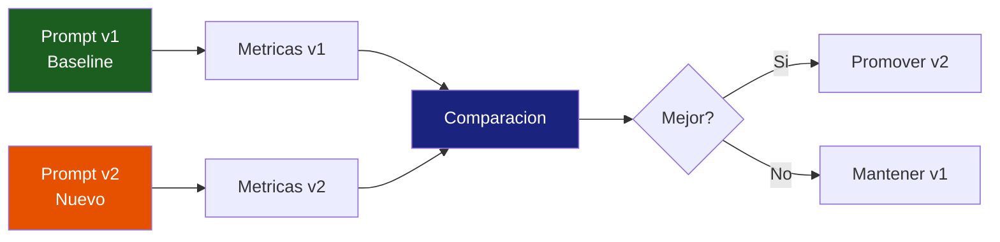
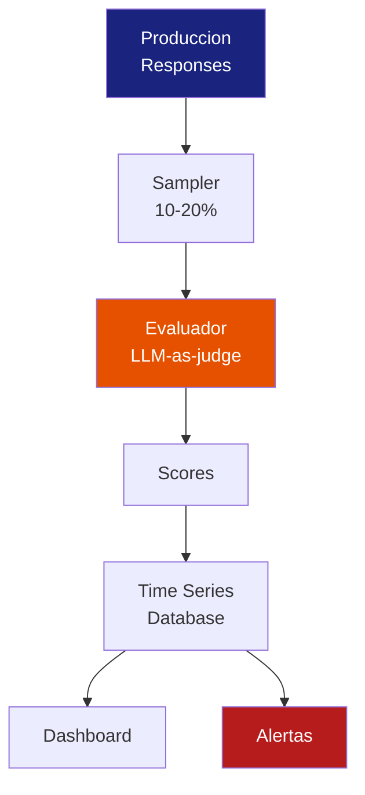
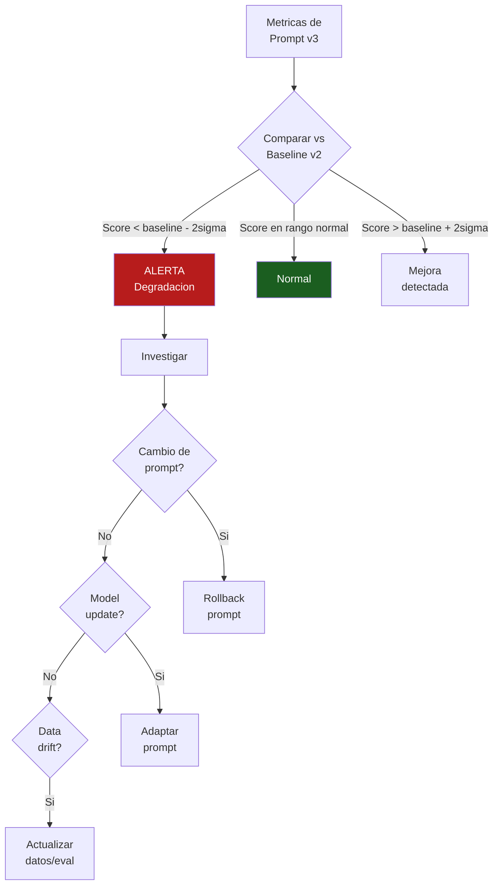
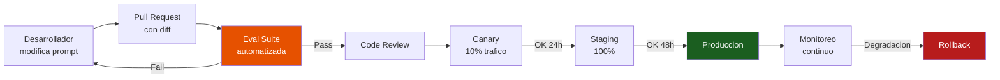

# Monitoreo de Prompts en Produccion

> [!abstract] Resumen
> El monitoreo de prompts en produccion cubre cuatro dimensiones criticas: ==rendimiento por version de prompt==, ==tendencias de token usage==, ==calidad de output a lo largo del tiempo==, y ==tasa de cumplimiento de formato==. El *version tracking* permite saber que prompt esta activo y comparar resultados entre versiones. La ==degradacion de rendimiento== puede ocurrir por actualizaciones del modelo, cambios en datos de entrada, o drift del prompt mismo. Herramientas como [[langfuse]] (prompt management), *Braintrust*, o soluciones custom permiten implementar este monitoreo.
> ^resumen

---

## Por que monitorear prompts

Los prompts son el ==componente mas fragil== de un sistema LLM. A diferencia del codigo compilado, un prompt puede degradarse sin que ningun test falle[^1].

> [!warning] Escenarios de degradacion silenciosa
> | Escenario | ==Causa== | Sintoma |
> |-----------|----------|---------|
> | Mismo prompt, peores resultados | ==Actualizacion del modelo por el proveedor== | Calidad baja gradualmente |
> | Prompt funciona mal con nuevos datos | ==Data drift en inputs== | Errores en cierto tipo de queries |
> | Prompt antes conciso, ahora verboso | ==Model drift== | Token usage aumenta |
> | Formato de salida inconsistente | Cambio en comportamiento del modelo | Parsing errors |
> | Alucinaciones nuevas | ==Cambio en training data del modelo== | Faithfulness baja |

> [!danger] El mayor riesgo: no saber que algo cambio
> Los proveedores de LLM (OpenAI, Anthropic, Google) actualizan sus modelos ==sin previo aviso==. Un prompt que funcionaba perfectamente ayer puede degradarse manana sin que cambies una sola linea de codigo. El monitoreo continuo es la unica defensa.

---

## Que monitorear

### 1. Rendimiento por version de prompt

Cada cambio en un prompt debe tratarse como un ==deployment== que requiere monitoreo.



| Metrica | ==Que indica== | Como medir |
|---------|---------------|-----------|
| Faithfulness score | ==Precision de la respuesta== | LLM-as-judge o evaluacion programatica |
| Token usage promedio | ==Eficiencia del prompt== | Promedio de input_tokens + output_tokens |
| Latencia promedio | Velocidad de respuesta | Tiempo desde request hasta respuesta |
| Coste promedio | Eficiencia economica | input_tokens * precio + output_tokens * precio |
| Format compliance | ==Respuestas en formato correcto== | Validacion programatica |
| Task completion rate | ==Tasa de exito== | Evaluacion automatizada o feedback |

### 2. Tendencias de token usage

El *token usage* es un proxy de la complejidad y eficiencia del prompt:

> [!info] Tendencias a observar
> - **Aumento gradual de output tokens**: el modelo se esta volviendo mas verboso (posible model drift)
> - **Pico subito de input tokens**: cambio en el prompt o en los datos de contexto
> - **Disminucion de cached tokens**: cambios frecuentes en el prompt reducen hit rate de cache
> - **Ratio input/output cambiante**: el modelo esta procesando diferente

> [!example]- Panel de Grafana para token trends
> ```promql
> # Token usage promedio por version de prompt (7 dias)
> avg_over_time(
>   gen_ai_usage_input_tokens{prompt_version=~"v.*"}[1d]
> ) by (prompt_version)
>
> # Ratio output/input tokens (deberia ser estable)
> avg(gen_ai_usage_output_tokens) by (prompt_version)
> / avg(gen_ai_usage_input_tokens) by (prompt_version)
>
> # Cache hit rate por version
> sum(gen_ai_usage_cached_tokens) by (prompt_version)
> / sum(gen_ai_usage_input_tokens) by (prompt_version)
> ```

### 3. Calidad de output a lo largo del tiempo

La calidad debe medirse ==continuamente==, no solo al momento del deploy del prompt.



> [!tip] Sampling inteligente para evaluacion
> Evaluar el 100% de respuestas con LLM-as-judge es costoso. Estrategias:
> - **Random sampling**: 10-20% de todas las respuestas
> - **Stratified sampling**: asegurar representacion de todos los tipos de tarea
> - **Error-biased sampling**: evaluar mas respuestas que tuvieron indicios de problema
> - **New prompt sampling**: evaluar 100% las primeras 24h de un prompt nuevo

### 4. Tasa de cumplimiento de formato

Para agentes que deben producir output estructurado (JSON, Markdown, codigo):

```python
# Evaluador de formato
def check_format_compliance(output: str, expected_format: str) -> bool:
    if expected_format == "json":
        try:
            json.loads(output)
            return True
        except json.JSONDecodeError:
            return False
    elif expected_format == "markdown":
        return output.startswith("#") or output.startswith("-")
    elif expected_format == "code":
        return "```" in output
    return True

# Registrar como metrica
format_compliance.add(1, attributes={
    "prompt_version": version,
    "expected_format": expected_format,
    "compliant": str(check_format_compliance(output, expected_format)),
})
```

---

## Version tracking

### Control de versiones de prompts

Cada prompt en produccion debe tener:

| Campo | ==Proposito== | Ejemplo |
|-------|--------------|---------|
| `prompt_id` | ==Identificador unico== | `agent-system-prompt` |
| `version` | ==Version especifica== | `v3.2.1` |
| `created_at` | Fecha de creacion | `2025-06-01T10:00:00Z` |
| `deployed_at` | Fecha de activacion | `2025-06-01T14:30:00Z` |
| `author` | Quien hizo el cambio | `@developer` |
| `change_description` | Que cambio | "Agregar instrucciones de formato" |
| `hash` | ==Hash del contenido== | `sha256:abc123...` |

> [!success] Mejores practicas de versionamiento
> - Versionar prompts en ==Git== junto al codigo
> - Usar *semantic versioning*: MAJOR.MINOR.PATCH
> - MAJOR: cambio fundamental en el comportamiento
> - MINOR: mejora o extension
> - PATCH: correccion de typo o formato
> - Incluir `prompt_version` como atributo en ==cada traza y log==
> - Nunca modificar un prompt en produccion sin crear nueva version

### A/B testing de prompts

> [!example]- Implementacion de A/B test de prompts
> ```python
> import random
> from datetime import datetime
>
> class PromptABTest:
>     def __init__(self, prompt_a: str, prompt_b: str,
>                  split_ratio: float = 0.5):
>         self.prompt_a = prompt_a  # Control
>         self.prompt_b = prompt_b  # Tratamiento
>         self.split_ratio = split_ratio
>         self.results = {"a": [], "b": []}
>
>     def get_prompt(self, session_id: str) -> tuple[str, str]:
>         """Deterministic assignment basado en session_id."""
>         # Usar hash para asignacion deterministica
>         bucket = hash(session_id) % 100
>         if bucket < self.split_ratio * 100:
>             return self.prompt_a, "control"
>         else:
>             return self.prompt_b, "treatment"
>
>     def record_result(self, variant: str, score: float):
>         self.results[variant[0]].append(score)
>
>     def analyze(self) -> dict:
>         """Analisis estadistico del A/B test."""
>         from scipy import stats
>         a_scores = self.results["a"]
>         b_scores = self.results["b"]
>
>         t_stat, p_value = stats.ttest_ind(a_scores, b_scores)
>         return {
>             "a_mean": sum(a_scores) / len(a_scores),
>             "b_mean": sum(b_scores) / len(b_scores),
>             "p_value": p_value,
>             "significant": p_value < 0.05,
>             "winner": "b" if sum(b_scores)/len(b_scores) >
>                       sum(a_scores)/len(a_scores) else "a",
>         }
> ```

> [!warning] Requisitos para A/B testing confiable
> - Minimo ==100 muestras por variante== para significancia estadistica
> - Asignacion ==deterministica== (mismo usuario siempre ve mismo prompt)
> - Mismas condiciones de evaluacion para ambas variantes
> - Duracion minima de ==1 semana== para capturar variabilidad temporal
> - Controlar por tipo de tarea (no comparar tareas diferentes)

---

## Deteccion de degradacion de rendimiento

### Alertas de degradacion



> [!danger] Mismo prompt, peores resultados
> Este es el escenario mas dificil de diagnosticar. Posibles causas:
> 1. **Model update silencioso**: el proveedor actualizo el modelo
> 2. **Data drift**: los inputs cambiaron de distribucion
> 3. **Context drift**: los documentos de RAG cambiaron
> 4. **Rate limiting diferente**: throttling cambia el comportamiento
>
> Ver [[drift-detection]] para tecnicas de deteccion especificas.

---

## Herramientas

### Langfuse Prompt Management

[[langfuse]] ofrece gestion de prompts integrada con tracing:

| Feature | ==Detalle== |
|---------|-------------|
| Versionamiento | ==Cada cambio crea nueva version== |
| Labels | `production`, `staging`, `experiment` |
| Variables | Templates con `{{variable}}` |
| Fetch en runtime | ==SDK obtiene prompt activo automaticamente== |
| Metricas por version | ==Scores correlacionados con version de prompt== |

### Braintrust

*Braintrust* es una plataforma especializada en evaluacion y monitoreo de prompts:

> [!info] Capacidades de Braintrust
> - Evaluacion automatizada con multiples evaluadores
> - Comparacion de rendimiento entre versiones de prompt
> - CI/CD para prompts (eval como gate de deploy)
> - Playground para experimentacion
> - Open source parcial (eval library)

### Solucion custom

Para equipos que no quieren depender de herramientas externas:

> [!example]- Sistema basico de monitoreo de prompts
> ```python
> class PromptMonitor:
>     """Monitoreo basico de rendimiento de prompts."""
>
>     def __init__(self, db_connection):
>         self.db = db_connection
>
>     def record(self, prompt_version: str, metrics: dict):
>         """Registrar metricas de una ejecucion."""
>         self.db.insert("prompt_metrics", {
>             "timestamp": datetime.utcnow(),
>             "prompt_version": prompt_version,
>             "faithfulness": metrics.get("faithfulness"),
>             "input_tokens": metrics.get("input_tokens"),
>             "output_tokens": metrics.get("output_tokens"),
>             "cost_usd": metrics.get("cost_usd"),
>             "latency_ms": metrics.get("latency_ms"),
>             "format_compliant": metrics.get("format_compliant"),
>         })
>
>     def compare_versions(self, v1: str, v2: str,
>                         window_days: int = 7) -> dict:
>         """Comparar metricas entre dos versiones."""
>         metrics_v1 = self.db.query(
>             "SELECT * FROM prompt_metrics "
>             "WHERE prompt_version = ? AND timestamp > ?",
>             [v1, datetime.utcnow() - timedelta(days=window_days)]
>         )
>         metrics_v2 = self.db.query(
>             "SELECT * FROM prompt_metrics "
>             "WHERE prompt_version = ? AND timestamp > ?",
>             [v2, datetime.utcnow() - timedelta(days=window_days)]
>         )
>
>         return {
>             "faithfulness_delta": avg(metrics_v2, "faithfulness") -
>                                  avg(metrics_v1, "faithfulness"),
>             "cost_delta_pct": (avg(metrics_v2, "cost_usd") -
>                               avg(metrics_v1, "cost_usd")) /
>                              avg(metrics_v1, "cost_usd") * 100,
>             "token_delta_pct": ...,
>             "sample_size": (len(metrics_v1), len(metrics_v2)),
>         }
>
>     def detect_degradation(self, prompt_version: str,
>                           baseline_version: str,
>                           threshold_sigma: float = 2.0) -> bool:
>         """Detectar si la version actual esta degradada."""
>         comparison = self.compare_versions(
>             baseline_version, prompt_version
>         )
>         return comparison["faithfulness_delta"] < -threshold_sigma
> ```

---

## Pipeline de CI/CD para prompts

> [!tip] Tratar prompts como codigo
> Los prompts deben pasar por el mismo rigor que el codigo:
> 1. **Version control**: Git con diffs legibles
> 2. **Code review**: revision por pares del cambio de prompt
> 3. **Automated tests**: suite de evaluacion como gate
> 4. **Staged rollout**: canary → staging → produccion
> 5. **Monitoring**: metricas en produccion con alertas
> 6. **Rollback**: capacidad de revertir instantaneamente



---

## Relacion con el ecosistema

- **[[intake-overview]]**: los datos ingeridos por intake afectan directamente la calidad de los prompts en sistemas RAG. Cambios en la calidad de datos de intake pueden causar degradacion del prompt sin que el prompt mismo haya cambiado
- **[[architect-overview]]**: los prompts de architect (system prompt, tool descriptions) deben monitorearse como cualquier otro prompt en produccion. Las 3 pipelines de logging de architect facilitan el rastreo de `prompt_version` en cada interaccion
- **[[vigil-overview]]**: vigil puede detectar prompts que introducen vulnerabilidades (prompt injection susceptibility). Los cambios de prompt deben pasar por scan de vigil antes de deploy
- **[[licit-overview]]**: el versionamiento de prompts es un requisito de compliance: licit necesita saber que prompt estaba activo cuando se tomo una decision. El historial de versiones alimenta los audit trails

---

## Enlaces y referencias

> [!quote]- Bibliografia y recursos
> - [^1]: Hamel Husain. "Your AI Product Needs Evals". Blog post, 2024.
> - [^2]: Braintrust Documentation. https://www.braintrust.dev/docs
> - [^3]: Langfuse Prompt Management. https://langfuse.com/docs/prompts
> - [^4]: Eugene Yan. "Patterns for Building LLM-based Systems & Products". Blog post, 2023.
> - [^5]: Shreya Shankar et al. "Rethinking LLM Monitoring". 2024.

[^1]: Hamel Husain argumenta que las evaluaciones son el componente mas importante y mas descuidado de los sistemas LLM.
[^2]: Braintrust ofrece una libreria open source de evaluacion que funciona independientemente de su plataforma.
[^3]: El prompt management de Langfuse integra versionamiento con tracing para correlacion directa.
[^4]: Eugene Yan describe patrones practicos para construir y mantener sistemas LLM.
[^5]: Investigacion sobre como repensar el monitoreo tradicional para sistemas LLM.
