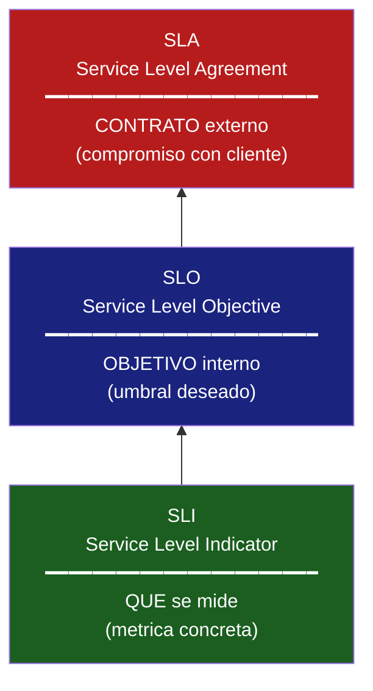
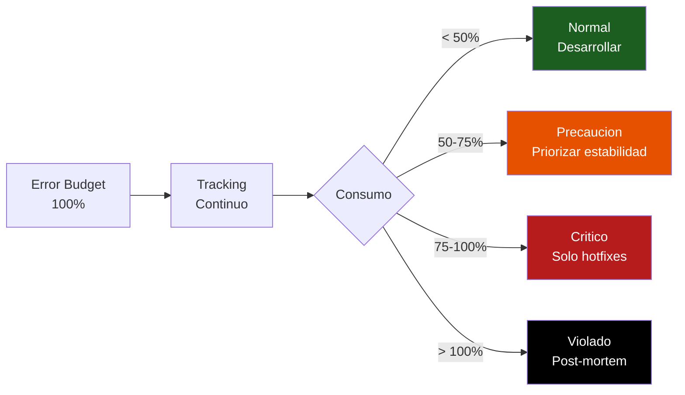
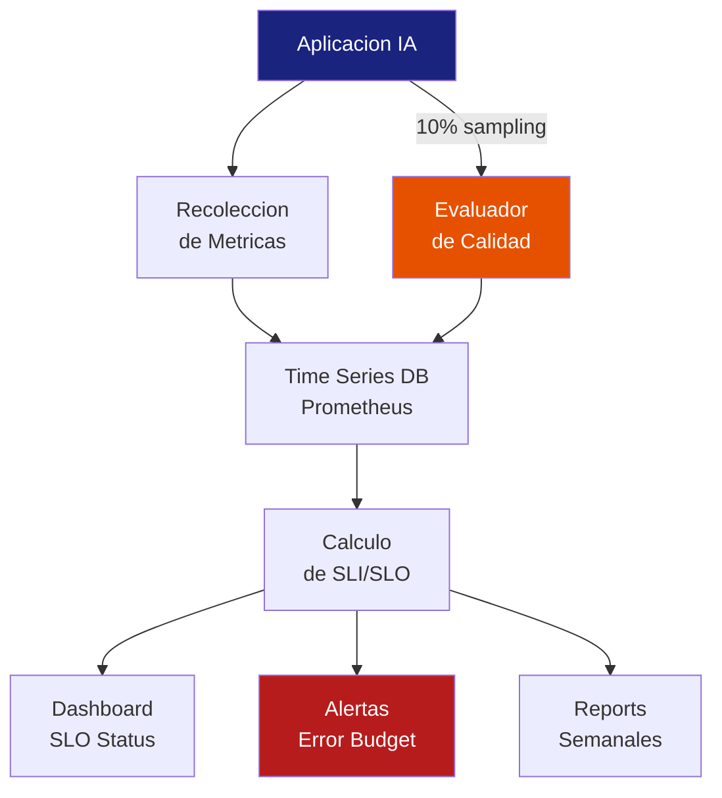

# SLAs y SLOs para Sistemas IA

> [!abstract] Resumen
> Los *Service Level Objectives* para sistemas IA deben incluir metricas que no existen en software tradicional: ==calidad de respuesta== (faithfulness > X), ==coste por query==, y ==tasa de alucinaciones==. Los *SLIs* (*Service Level Indicators*) se miden con evaluacion automatizada, feedback de usuario, y validacion programatica. Los ==error budgets== definen cuanta degradacion de calidad es aceptable. Este documento proporciona SLOs de ejemplo para distintos tipos de productos IA, consideraciones contractuales para *SLAs*, y la conexion con [[metricas-agentes]] y [[alerting-ia]].
> ^resumen

---

## Conceptos fundamentales

### La piramide SLI → SLO → SLA



| Concepto | ==Definicion== | Ejemplo IA |
|----------|---------------|------------|
| **SLI** | ==Metrica que indica la salud del servicio== | % de respuestas con faithfulness > 0.8 |
| **SLO** | ==Objetivo interno para ese SLI== | 95% de respuestas con faithfulness > 0.8 |
| **SLA** | ==Compromiso contractual con consecuencias== | 99% disponibilidad o creditos |
| **Error Budget** | ==Margen de degradacion permitido== | 5% de respuestas pueden estar por debajo |

> [!warning] SLO != SLA
> El SLO es un ==objetivo interno== que tu equipo se propone. El SLA es un ==contrato legal== con consecuencias financieras. Los SLOs deben ser ==mas estrictos== que los SLAs para tener margen.

---

## SLIs para sistemas IA

Los SLIs para IA se dividen en cuatro categorias:

### 1. Disponibilidad

```
availability = requests_exitosos / requests_totales
```

> [!info] Que cuenta como "exitoso" en IA?
> A diferencia de APIs REST donde 200 = exitoso, en IA un 200 con respuesta alucinada ==no es exitoso==. Necesitas definir criterios mas ricos:
> - HTTP 200 Y
> - Respuesta no vacia Y
> - Formato valido Y
> - (Opcionalmente) Calidad > umbral

### 2. Latencia

```
latency_p99 = percentile(99, response_times)
```

| Tipo de Latencia | ==SLI== | Medicion |
|-----------------|---------|----------|
| Time to first token | ==p95 < 1s== | Desde request hasta primer token |
| Time to complete | ==p95 < 15s== | Desde request hasta respuesta completa |
| Per-step latency | p95 < 5s | Por cada paso del agente |

### 3. Calidad

Los SLIs de calidad son ==unicos de sistemas IA== y requieren evaluacion:

| SLI de Calidad | ==Como medir== | Frecuencia |
|---------------|----------------|------------|
| Faithfulness | ==LLM-as-judge (muestreo 10%)== | Continua |
| Relevance | LLM-as-judge | Continua |
| Format compliance | ==Validacion programatica (100%)== | Cada request |
| Hallucination rate | Evaluacion automatizada | Continua |
| Task completion | Feedback de usuario + heuristicas | Diaria |

> [!example]- Evaluador de SLI de calidad
> ```python
> class QualitySLIEvaluator:
>     """Evaluar SLIs de calidad para sistema IA."""
>
>     def __init__(self, sample_rate: float = 0.1):
>         self.sample_rate = sample_rate
>         self.results = []
>
>     def should_evaluate(self, request_id: str) -> bool:
>         """Deterministic sampling basado en request_id."""
>         return hash(request_id) % 100 < self.sample_rate * 100
>
>     def evaluate(self, response: str, context: str,
>                  question: str) -> dict:
>         """Evaluar calidad de una respuesta."""
>         return {
>             "faithfulness": self._eval_faithfulness(
>                 response, context),
>             "relevance": self._eval_relevance(
>                 response, question),
>             "format_compliant": self._check_format(response),
>             "has_hallucination": self._detect_hallucination(
>                 response, context),
>         }
>
>     def compute_sli(self, window_hours: int = 24) -> dict:
>         """Calcular SLIs sobre la ventana temporal."""
>         recent = [r for r in self.results
>                   if r["timestamp"] > now() - hours(window_hours)]
>
>         return {
>             "faithfulness_sli": len([r for r in recent
>                 if r["faithfulness"] > 0.8]) / len(recent),
>             "format_compliance_sli": len([r for r in recent
>                 if r["format_compliant"]]) / len(recent),
>             "hallucination_rate": len([r for r in recent
>                 if r["has_hallucination"]]) / len(recent),
>         }
> ```

### 4. Coste

| SLI de Coste | ==Umbral== | Medicion |
|-------------|-----------|----------|
| Cost per query (avg) | ==< $0.05== | Promedio sobre 24h |
| Cost per query (p95) | < $0.20 | Percentil 95 |
| Daily cost | < $budget/30 | Suma diaria |
| Cost efficiency | > 10x ROI | Valor generado / coste |

Ver [[cost-tracking]] para la implementacion completa de cost tracking.

---

## SLOs de ejemplo por tipo de producto

### Chatbot de atencion al cliente

| SLO | ==Objetivo== | Error Budget |
|-----|-------------|-------------|
| Disponibilidad | ==> 99.5%== | 3.6 horas/mes |
| Latencia p95 | ==< 5s== | - |
| Faithfulness | ==> 90%== | 10% de respuestas |
| Hallucination rate | ==< 2%== | - |
| Format compliance | > 98% | - |
| Cost per query | < $0.03 | - |

### Agente de codigo (tipo architect)

| SLO | ==Objetivo== | Error Budget |
|-----|-------------|-------------|
| Disponibilidad | ==> 99%== | 7.2 horas/mes |
| Latencia total sesion p95 | ==< 120s== | - |
| Task completion rate | ==> 80%== | 20% de tareas |
| Cost per session p95 | < $0.50 | - |
| Tool success rate | ==> 95%== | 5% de tool calls |

### Sistema RAG empresarial

| SLO | ==Objetivo== | Error Budget |
|-----|-------------|-------------|
| Disponibilidad | ==> 99.9%== | 43 min/mes |
| Latencia p99 | ==< 10s== | - |
| Faithfulness | ==> 95%== | 5% de respuestas |
| Retrieval precision@5 | > 80% | - |
| Hallucination rate | ==< 1%== | - |
| Cost per query | < $0.02 | - |

> [!tip] Como elegir SLOs
> 1. Empieza midiendo sin SLO (establecer baseline)
> 2. Analiza la distribucion real de tus metricas durante 2-4 semanas
> 3. Define el SLO como el ==percentil 95 de tu rendimiento actual==
> 4. Ajusta basandote en requisitos de negocio y feedback de usuario
> 5. Revisa trimestralmente

---

## Error budgets

El *error budget* es la cantidad de "mal servicio" que puedes tolerar dentro del SLO[^2].

```
error_budget = 1 - SLO_target

# Ejemplo: SLO de 95% faithfulness
error_budget = 1 - 0.95 = 0.05 = 5%
# Puedes tener hasta 5% de respuestas con faithfulness < 0.8
```

### Politicas de error budget

> [!danger] Que hacer cuando se agota el error budget
> | Consumo del Error Budget | ==Accion== |
> |--------------------------|-----------|
> | 0-50% | ==Normal==, continuar desarrollo |
> | 50-75% | ==Precaucion==, priorizar estabilidad |
> | 75-90% | ==Alerta==, freeze de features, focus en calidad |
> | 90-100% | ==Critico==, solo hotfixes, investigacion de causa raiz |
> | > 100% | ==SLO violado==, post-mortem obligatorio, plan de accion |



> [!question] Error budget en calidad de IA: es diferente?
> Si. En software tradicional, el error budget es sobre ==disponibilidad==. En IA, tienes ==multiples error budgets==:
> - Error budget de disponibilidad (clasico)
> - Error budget de calidad (faithfulness, relevance)
> - Error budget de coste (no exceder budget)
> - Error budget de latencia
>
> Cada uno se consume independientemente y tiene su propia politica.

---

## Medicion de SLOs

### Pipeline de medicion



### Ventanas temporales

| Ventana | ==Uso== | Sensibilidad |
|---------|---------|-------------|
| 5 minutos | ==Alertas rapidas== | Muy alta (ruidosa) |
| 1 hora | Monitoreo operacional | Alta |
| 24 horas | ==Dashboard diario== | Media |
| 7 dias | ==Error budget tracking== | Baja (recomendada) |
| 30 dias | Reportes mensuales, SLA | Muy baja |

> [!tip] Multi-window alerting
> Usa ==alertas multi-ventana== para balancear velocidad y ruido:
> - **Alerta rapida**: 5% del error budget en 1 hora (alerta P2)
> - **Alerta sostenida**: 10% del error budget en 6 horas (alerta P2)
> - **Alerta critica**: 50% del error budget en 24 horas (alerta P1)
>
> Ver [[alerting-ia]] para la implementacion de alertas basadas en SLOs.

---

## Consideraciones contractuales para SLAs

> [!warning] SLAs de IA tienen complejidades unicas
> Los SLAs tradicionales son sobre disponibilidad y latencia (facil de medir). Los SLAs de IA incluyen ==calidad== (dificil de medir, subjetivo, costoso de evaluar).

### Que incluir en un SLA de IA

| Clausula | ==Incluir== | ==Evitar== |
|----------|-----------|-----------|
| Disponibilidad | 99.5%+ del API | 99.99% (inalcanzable con dependencia de LLM providers) |
| Latencia | p95 < X segundos | Garantias sobre p99.9 |
| Calidad | ==Tasa de "respuestas utiles" > X%== | ==Garantia de 0% alucinaciones== |
| Coste | Precio por query maximo | Coste fijo (impredecible) |
| Datos | Retencion, privacidad | Garantia de no-leakage absoluta |
| Responsabilidad | ==Disclaimer sobre naturaleza probabilistica== | Garantia de precision absoluta |

> [!danger] Nunca garantices 0% alucinaciones
> Los LLM son ==inherentemente probabilisticos==. Prometer cero alucinaciones es como prometer cero bugs. En su lugar, comprometete a:
> - Tasa de alucinaciones < X% (medible)
> - Sistema de deteccion y correccion
> - Proceso de reporte y resolucion
> - Mejora continua demostrable

### Template de clausula de calidad

> [!example]- Ejemplo de clausula SLA para calidad de IA
> ```text
> CLAUSULA 5: CALIDAD DE RESPUESTA
>
> 5.1. El Proveedor garantiza que al menos el 90% de las
> respuestas generadas por el Sistema IA, medidas mediante
> evaluacion automatizada independiente, cumpliran con los
> criterios de calidad definidos en el Anexo A.
>
> 5.2. La evaluacion de calidad se realizara mediante muestreo
> aleatorio del 10% de las interacciones, utilizando la
> metodologia LLM-as-judge descrita en el Anexo B.
>
> 5.3. El Cliente reconoce que el Sistema IA es de naturaleza
> probabilistica y que no es posible garantizar precision
> absoluta en todas las respuestas.
>
> 5.4. En caso de incumplimiento del SLA de calidad durante
> un periodo mensual, el Cliente tendra derecho a un credito
> del 10% de la factura mensual por cada punto porcentual
> por debajo del objetivo.
>
> 5.5. La responsabilidad total del Proveedor bajo esta
> clausula no excedera el 50% de la factura mensual.
> ```

---

## SLO tracking con Prometheus/Grafana

> [!example]- Recording rules para SLOs
> ```yaml
> groups:
>   - name: ai_slo_recording
>     interval: 1m
>     rules:
>       # SLI: disponibilidad
>       - record: ai:sli:availability:rate5m
>         expr: |
>           sum(rate(gen_ai_requests_total{status="success"}[5m]))
>           / sum(rate(gen_ai_requests_total[5m]))
>
>       # SLI: latencia (% bajo umbral)
>       - record: ai:sli:latency:rate5m
>         expr: |
>           sum(rate(gen_ai_latency_bucket{le="15000"}[5m]))
>           / sum(rate(gen_ai_latency_count[5m]))
>
>       # SLI: calidad (% con faithfulness > 0.8)
>       - record: ai:sli:quality:rate5m
>         expr: |
>           sum(rate(agent_quality_total{faithfulness="good"}[5m]))
>           / sum(rate(agent_quality_total[5m]))
>
>       # Error budget remaining (30d window)
>       - record: ai:error_budget:availability:remaining
>         expr: |
>           1 - (
>             (1 - avg_over_time(ai:sli:availability:rate5m[30d]))
>             / (1 - 0.995)  # SLO target: 99.5%
>           )
> ```

---

## Relacion con el ecosistema

- **[[intake-overview]]**: los SLOs de intake (latencia de procesamiento, tasa de error de parsing, disponibilidad del pipeline) deben coordinarse con los SLOs del agente. Si intake esta degradado, el agente puede funcionar bien tecnicamente pero dar malas respuestas por falta de contexto actualizado
- **[[architect-overview]]**: los SLOs de architect se definen en torno a disponibilidad, latencia de sesion, tasa de exito de tareas, y coste por sesion. Las metricas OTel de architect alimentan directamente los calculos de SLI
- **[[vigil-overview]]**: los SLOs de seguridad se basan en los findings de vigil: tasa de vulnerabilidades criticas < X%, tiempo de remediacion < Y dias. Los reportes JUnit XML de vigil pueden usarse para tracking automatizado
- **[[licit-overview]]**: los SLAs contractuales deben alinearse con los SLOs internos. Licit necesita evidencia de cumplimiento de SLOs para audit trails. La documentacion de error budgets y sus politicas forma parte del framework de compliance

---

## Enlaces y referencias

> [!quote]- Bibliografia y recursos
> - [^1]: Google SRE Book. Capitulo 4: "Service Level Objectives". https://sre.google/sre-book/service-level-objectives/
> - [^2]: Google SRE Workbook. Capitulo 2: "Implementing SLOs". https://sre.google/workbook/implementing-slos/
> - [^3]: Alex Hidalgo. *Implementing Service Level Objectives*. O'Reilly, 2020.
> - [^4]: Sloth: SLO as Code. https://github.com/slok/sloth
> - [^5]: OpenSLO Specification. https://openslo.com/

[^1]: El capitulo de SLOs del SRE Book de Google es la referencia fundacional para SLOs.
[^2]: El Workbook proporciona guias practicas de implementacion que complementan la teoria.
[^3]: El libro de Alex Hidalgo es la guia mas completa sobre implementacion de SLOs.
[^4]: Sloth permite definir SLOs como codigo y genera reglas de Prometheus automaticamente.
[^5]: OpenSLO es un intento de estandarizar la definicion de SLOs como YAML.
