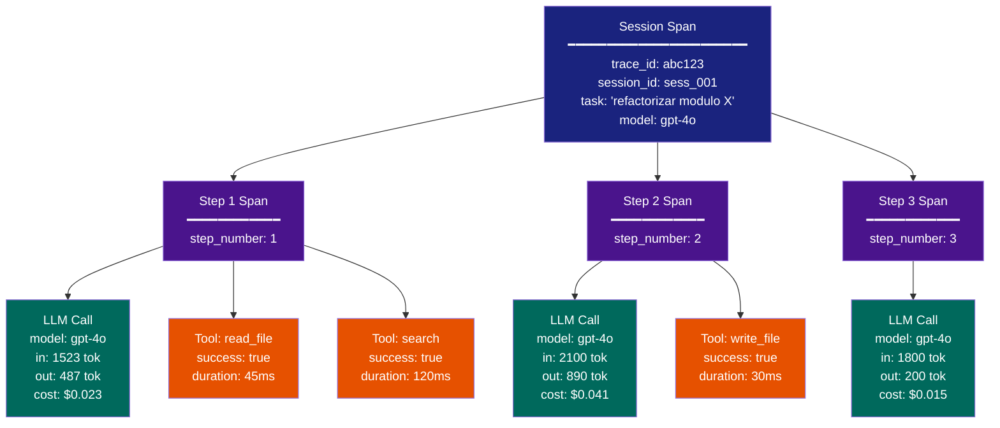
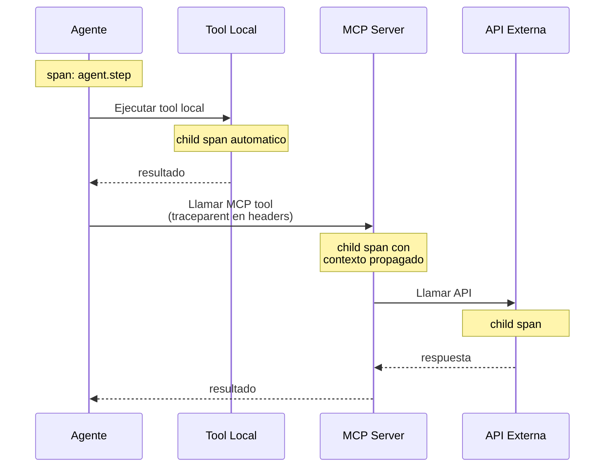
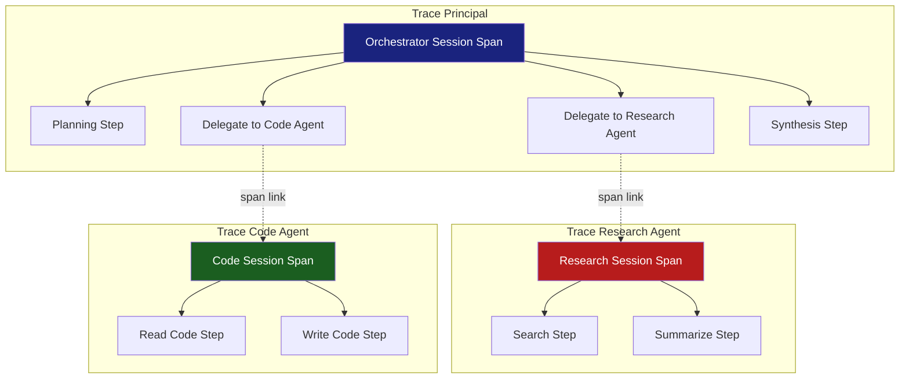

# Distributed Tracing para Agentes IA

> [!abstract] Resumen
> El *distributed tracing* para agentes IA requiere modelar jerarquias de spans especificas: ==session → step → LLM call / tool call → sub-operaciones==. La propagacion de contexto de traza debe cruzar llamadas LLM, ejecuciones de herramientas, delegaciones a sub-agentes y llamadas a servidores MCP. Este documento detalla la estructura de spans de [[architect-overview]], tecnicas de *correlation IDs*, propagacion en sistemas multi-agente, y como visualizar trazas de agentes en *Jaeger*. El tracing es ==la herramienta mas poderosa para depurar agentes== en produccion.
> ^resumen

---

## Fundamentos del tracing distribuido

El *distributed tracing* permite seguir el flujo de una operacion a traves de multiples servicios y componentes. En el contexto de agentes IA, esto es especialmente valioso porque los agentes ejecutan secuencias complejas y variables de operaciones[^1].

### Conceptos clave

> [!info] Terminologia esencial
> - **Trace**: el conjunto completo de spans que representan una operacion end-to-end
> - **Span**: una unidad de trabajo con inicio, fin, atributos y relaciones
> - **Parent Span**: el span que contiene a otro (relacion jerarquica)
> - **Span Link**: conexion entre spans de distintas trazas (causalidad sin jerarquia)
> - **Trace Context**: los IDs (`trace_id`, `span_id`) que se propagan entre componentes
> - **Baggage**: datos de contexto que viajan con la traza (como `session_id`)

---

## Jerarquia de spans para agentes

La estructura de spans para un agente IA sigue un patron jerarquico bien definido. [[architect-overview]] implementa esta estructura con [[opentelemetry-ia|OpenTelemetry]].

### Modelo de spans



### Niveles de la jerarquia

| Nivel | Span Name | Atributos Clave | ==Duracion Tipica== |
|-------|-----------|-----------------|---------------------|
| 0 (raiz) | `agent.session` | session_id, task, model, total_cost | ==Segundos a minutos== |
| 1 | `agent.step` | step_number, action_type | ==1-30 segundos== |
| 2a | `gen_ai.chat` | model, tokens, cost, finish_reason | ==1-15 segundos== |
| 2b | `agent.tool.*` | tool_name, success, duration | ==Milisegundos a segundos== |
| 3 | Sub-operaciones | Especificas del contexto | Variable |

> [!tip] Granularidad adecuada
> No crees un span para cada linea de codigo. La regla general:
> - Crea spans para ==operaciones que cruzan limites== (red, I/O, procesos externos)
> - Crea spans para ==operaciones costosas== en tiempo o dinero
> - No crees spans para logica interna rapida (<1ms)

---

## Propagacion de contexto de traza

La propagacion de *trace context* es el mecanismo que permite que spans de diferentes componentes se agrupen en la misma traza.

### Propagacion en llamadas LLM

Las llamadas a APIs de LLM no soportan nativamente la propagacion de contexto OTel. Sin embargo, podemos mantener la jerarquia dentro del mismo proceso:

```python
# El contexto se propaga automaticamente dentro del mismo proceso
with tracer.start_as_current_span("agent.session") as session:
    with tracer.start_as_current_span("agent.step") as step:
        with tracer.start_as_current_span("gen_ai.chat") as llm_call:
            # llm_call es hijo de step, que es hijo de session
            response = call_openai(messages)
```

> [!warning] Las APIs de LLM no propagan contexto
> A diferencia de microservicios HTTP donde el `traceparent` header viaja en cada request, las APIs de OpenAI/Anthropic ==no reenvian headers de traza==. El tracing funciona porque todo ocurre dentro del mismo proceso. Para sistemas multi-agente con agentes en procesos separados, necesitas propagacion explicita.

### Propagacion en ejecuciones de herramientas

Las herramientas pueden ser locales (mismo proceso) o remotas (MCP, API):



> [!example]- Propagacion de contexto a servidor MCP
> ```python
> from opentelemetry.context import get_current
> from opentelemetry.propagate import inject
>
> def call_mcp_tool(server_url: str, tool_name: str, params: dict):
>     with tracer.start_as_current_span(
>         f"agent.tool.mcp.{tool_name}",
>         attributes={"agent.tool.name": tool_name}
>     ) as span:
>         # Inyectar contexto de traza en headers HTTP
>         headers = {}
>         inject(headers)  # Agrega traceparent, tracestate
>
>         # El MCP server extrae el contexto y crea child spans
>         response = http_client.post(
>             f"{server_url}/tools/{tool_name}",
>             json=params,
>             headers=headers,
>         )
>
>         span.set_attribute("agent.tool.success", response.status_code == 200)
>         return response.json()
> ```

### Propagacion en delegaciones a sub-agentes

Cuando un agente delega a otro agente (posiblemente en otro proceso):

> [!example]- Propagacion a sub-agente
> ```python
> def delegate_to_sub_agent(sub_agent_url: str, task: str):
>     with tracer.start_as_current_span(
>         "agent.delegation",
>         attributes={
>             "agent.delegation.target": sub_agent_url,
>             "agent.delegation.task": task[:200],
>         }
>     ) as span:
>         headers = {}
>         inject(headers)
>
>         # El sub-agente crea su session span como hijo de este span
>         response = http_client.post(
>             f"{sub_agent_url}/run",
>             json={"task": task},
>             headers=headers,
>         )
>
>         result = response.json()
>         span.set_attribute("agent.delegation.steps", result["steps"])
>         span.set_attribute("agent.delegation.cost_usd", result["cost_usd"])
>         return result
> ```

---

## Correlation IDs

Los *correlation IDs* permiten asociar eventos de diferentes sistemas que pertenecen a la misma operacion logica.

### Tipos de IDs en un sistema de agentes

| ID | Ambito | ==Proposito== | Ejemplo |
|----|--------|---------------|---------|
| `trace_id` | Traza completa | ==Agrupar spans== | `4bf92f3577b34da6a3ce929d0e0e4736` |
| `span_id` | Span individual | Identificar operacion | `00f067aa0ba902b7` |
| `session_id` | Sesion de agente | ==Correlacionar con negocio== | `sess_abc123` |
| `request_id` | Request HTTP | Trazabilidad de API | `req_def456` |
| `user_id` | Usuario | ==Segmentar por usuario== | `user_789` |
| `conversation_id` | Conversacion | Agrupar turnos | `conv_012` |

> [!tip] Mejores practicas para correlation IDs
> - Genera `session_id` al inicio y propagalo a todos los componentes
> - Incluye `session_id` como atributo en el session span Y como campo en logs
> - Usa el mismo `trace_id` de OTel como correlation ID principal
> - Almacena la relacion `session_id ↔ trace_id` para busquedas bidireccionales
> - Incluye `user_id` para poder rastrear todas las sesiones de un usuario

### Correlacion entre logs y trazas

Para que logs y trazas sean complementarios, deben compartir IDs:

```python
import structlog
from opentelemetry import trace

def get_logger():
    """Logger que automaticamente incluye trace context."""
    current_span = trace.get_current_span()
    ctx = current_span.get_span_context()

    return structlog.get_logger().bind(
        trace_id=format(ctx.trace_id, '032x'),
        span_id=format(ctx.span_id, '016x'),
    )

# Uso
logger = get_logger()
logger.info("llm_call_started", model="gpt-4o", step=3)
# Output: {"event": "llm_call_started", "model": "gpt-4o",
#          "step": 3, "trace_id": "4bf92f...", "span_id": "00f067..."}
```

> [!info] De log a traza y viceversa
> Con el `trace_id` en cada linea de log, puedes:
> 1. Encontrar un error en los logs
> 2. Copiar el `trace_id`
> 3. Buscarlo en Jaeger para ver la traza completa
> 4. Identificar exactamente en que paso y operacion ocurrio el error
>
> Ver [[logging-llm]] para la configuracion completa de structured logging.

---

## Trazas en sistemas multi-agente

Los sistemas multi-agente presentan desafios adicionales para el tracing porque multiples agentes colaboran en una tarea.

### Patron: orquestador con sub-agentes



> [!warning] Span Links vs Parent-Child
> Cuando los sub-agentes corren en ==procesos o servicios separados==, usa **span links** en lugar de relaciones parent-child:
> - **Parent-child**: el hijo no puede terminar despues del padre (semantica incorrecta para agentes autonomos)
> - **Span link**: conexion causal sin restriccion temporal (semantica correcta)

> [!example]- Implementacion de span links para multi-agente
> ```python
> from opentelemetry.trace import Link
>
> def orchestrate(task: str):
>     with tracer.start_as_current_span("orchestrator.session") as orch_span:
>         # Planning
>         plan = plan_task(task)
>
>         # Delegar a research agent
>         research_trace_id = delegate_async("research-agent", plan.research_task)
>
>         # Delegar a code agent
>         code_trace_id = delegate_async("code-agent", plan.code_task)
>
>         # Esperar resultados
>         research_result = await_result(research_trace_id)
>         code_result = await_result(code_trace_id)
>
>         # Crear links a las trazas de los sub-agentes
>         orch_span.add_link(
>             Link(research_result.span_context,
>                  attributes={"link.type": "delegation"})
>         )
>         orch_span.add_link(
>             Link(code_result.span_context,
>                  attributes={"link.type": "delegation"})
>         )
>
>         # Sintesis
>         return synthesize(research_result, code_result)
> ```

---

## Visualizacion de trazas de agentes en Jaeger

### Que buscar en una traza de agente

> [!success] Senales clave al analizar trazas
> 1. **Numero de pasos**: mas pasos de lo esperado indica confundimiento del agente
> 2. **Duracion de LLM calls**: latencia inusualmente alta puede indicar throttling
> 3. **Tool failures**: spans de herramienta en estado ERROR
> 4. **Coste acumulado**: verificar que no excede expectativas
> 5. **Patron de herramientas**: herramientas repetidas pueden indicar loops

### Queries utiles en Jaeger

| Query | Proposito | ==Frecuencia de Uso== |
|-------|-----------|----------------------|
| `service=architect-agent operation=agent.session` | Todas las sesiones | ==Diaria== |
| `service=architect-agent tag=agent.tool.success:false` | Fallos en herramientas | ==Alta== |
| `service=architect-agent minDuration=30s` | Sesiones lentas | ==Alta== |
| `service=architect-agent tag=gen_ai.cost.total_usd>0.10` | Sesiones costosas | ==Media== |
| `service=architect-agent tag=agent.stop_reason:error` | Sesiones con error | ==Critica== |

> [!example]- Flujo de depuracion con trazas
> ```text
> 1. Alerta: "sesion con coste > $1.00"
>    ↓
> 2. Buscar en Jaeger: tag=agent.session_id:sess_abc123
>    ↓
> 3. Examinar traza: 47 pasos (esperado: ~10)
>    ↓
> 4. Identificar: pasos 15-35 son un loop de read_file → llm_call → read_file
>    ↓
> 5. Examinar span del LLM call en paso 15: el agente pide un archivo que no existe
>    ↓
> 6. Root cause: el agente alucino un nombre de archivo y entra en loop de reintentos
>    ↓
> 7. Accion: agregar limite de reintentos por herramienta, mejorar prompt
> ```

---

## Patrones avanzados de tracing

### Trace-based testing

Usar trazas para validar el comportamiento del agente en tests:

```python
def test_agent_uses_search_before_write():
    """Verificar que el agente busca antes de escribir."""
    with trace_capture() as traces:
        run_agent("refactoriza la funcion X")

    session_trace = traces[0]
    tool_spans = [s for s in session_trace.spans
                  if s.name.startswith("agent.tool")]

    tool_names = [s.attributes["agent.tool.name"] for s in tool_spans]

    # Debe buscar antes de escribir
    search_idx = tool_names.index("search")
    write_idx = tool_names.index("write_file")
    assert search_idx < write_idx, "Agent should search before writing"
```

### Replay de trazas

Las trazas almacenadas pueden usarse para ==reproducir sesiones de agente== para depuracion o evaluacion:

> [!question] Cuando usar replay de trazas?
> - **Post-mortem**: reproducir exactamente que hizo el agente durante un incidente
> - **Evaluacion**: comparar el comportamiento del agente con diferentes prompts
> - **Regresion**: verificar que un cambio no empeora el comportamiento en casos conocidos
>
> Ver [[ai-postmortems]] para el proceso completo de post-mortem con trazas.

---

## Relacion con el ecosistema

- **[[intake-overview]]**: las trazas de ingesta de datos deben conectarse con las trazas del agente via *span links*. Cuando intake procesa un documento y luego un agente lo utiliza, el link entre ambas trazas permite rastrear el flujo completo
- **[[architect-overview]]**: implementacion de referencia del modelo de spans para agentes. Session span como raiz, LLM call spans con atributos GenAI, tool spans con exito/duracion. Exporters configurables para OTLP, console y JSON file
- **[[vigil-overview]]**: los hallazgos de seguridad de vigil en formato SARIF pueden enriquecerse con `trace_id` y `span_id` para correlacionar exactamente en que paso de la ejecucion del agente se detecto un problema de seguridad
- **[[licit-overview]]**: las trazas proporcionan la evidencia tecnica que licit necesita para construir *audit trails*. Cada span con sus atributos puede servir como registro de auditoria de las acciones del agente

---

## Instrumentacion automatica vs manual

| Aspecto | Automatica | ==Manual== |
|---------|-----------|-----------|
| Esfuerzo | Bajo | ==Alto== (pero controlado) |
| Granularidad | Generica | ==Especifica del dominio== |
| Atributos custom | Limitados | ==Completos== |
| Mantenimiento | Actualizaciones del SDK | Codigo propio |
| Recomendacion para IA | Complemento | ==Principal== |

> [!danger] La instrumentacion automatica no es suficiente para IA
> Los auto-instrumentadores de OTel capturan HTTP calls, DB queries, etc. Pero ==no entienden la semantica de tu agente==: pasos, costes, calidad, herramientas. Necesitas instrumentacion manual para los spans especificos de IA, complementada opcionalmente con auto-instrumentacion para infraestructura.

---

## Enlaces y referencias

> [!quote]- Bibliografia y recursos
> - [^1]: Austin Parker et al. *Distributed Tracing in Practice*. O'Reilly, 2020.
> - [^2]: OpenTelemetry Tracing Specification. https://opentelemetry.io/docs/specs/otel/trace/
> - [^3]: W3C Trace Context. https://www.w3.org/TR/trace-context/
> - [^4]: Jaeger Documentation. https://www.jaegertracing.io/docs/
> - [^5]: "Dapper, a Large-Scale Distributed Systems Tracing Infrastructure". Google, 2010.

[^1]: El libro de referencia para entender tracing distribuido en la practica.
[^2]: Especificacion oficial de OTel para trazas, base de las convenciones GenAI.
[^3]: El estandar W3C que define el formato del header `traceparent`.
[^4]: Jaeger es el backend mas popular para visualizar trazas de desarrollo.
[^5]: Dapper de Google es el paper fundacional del tracing distribuido moderno.
