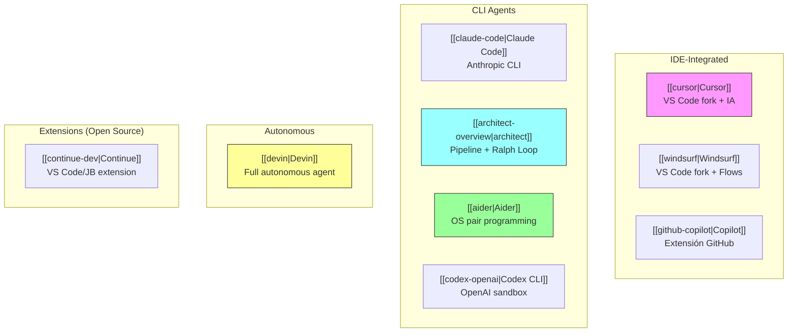
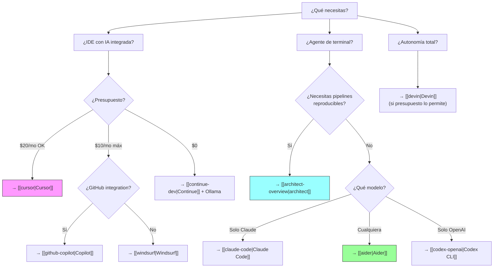
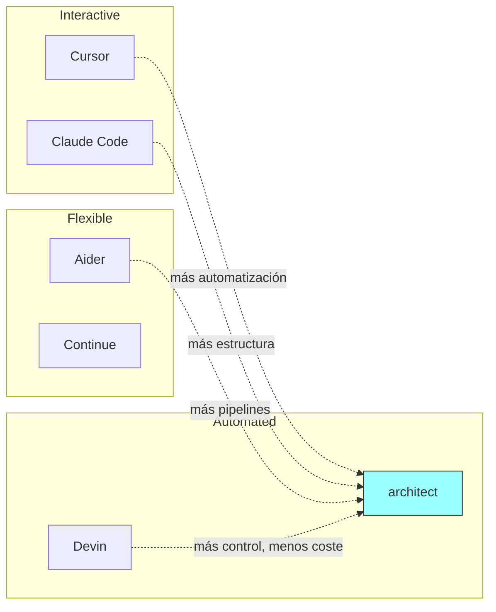

# Comparación de herramientas de código con IA

> [!abstract] Resumen
> Mega-comparación de ==todas las herramientas de codificación con IA== del ecosistema actual. Cubre IDEs integrados ([[cursor]], [[windsurf]], [[github-copilot]]), agentes CLI ([[claude-code]], [[architect-overview]], [[aider]], [[codex-openai]]), agentes autónomos ([[devin]]), y extensiones open source ([[continue-dev]]). Incluye tablas comparativas de features, pricing, modelos soportados, fortalezas y debilidades, además de un ==framework de decisión== para elegir la herramienta correcta según el caso de uso. Esta nota es ==volatile== — el espacio evoluciona rápidamente. ^resumen

---

## Categorías de herramientas

---

## Tabla maestra de comparación

### Features principales

| Feature | [[cursor\|Cursor]] | [[windsurf\|Windsurf]] | [[github-copilot\|Copilot]] | [[claude-code\|CC]] | [[architect-overview\|architect]] | [[aider\|Aider]] | [[codex-openai\|Codex]] | [[devin\|Devin]] | [[continue-dev\|Continue]] |
|---|---|---|---|---|---|---|---|---|---|
| Tab complete | ==A+== | A | B+ | N/A | N/A | N/A | N/A | N/A | B |
| Chat | A | A | B+ | ==A+== | A+ | A | A | B | B+ |
| Multi-file | A (Composer) | A (Cascade) | B (Workspace) | A | ==A+ (worktrees)== | A | A | A | C |
| Agent mode | B+ | B+ | B | ==A== | A+ | B | A | ==A+== | N/A |
| Git integration | C | C | ==A (GitHub)== | B | A+ | ==A+== | B | B | B |
| Terminal exec | B | B | B | ==A== | A | B | A (sandbox) | A | N/A |
| Pipelines | N/A | N/A | N/A | N/A | ==A (YAML)== | N/A | N/A | N/A | N/A |
| Cost tracking | N/A | N/A | N/A | N/A | ==A== | B | N/A | N/A | N/A |

> [!info] Escala de puntuación
> - **A+**: Excepcional, mejor en su clase
> - **A**: Excelente
> - **B+/B**: Bueno / Adecuado
> - **C**: Básico o limitado
> - **N/A**: No aplica o no tiene la funcionalidad

### Pricing (junio 2025)

| Herramienta | Gratis | Plan más barato | Modelo de coste | ==Coste mensual típico== |
|---|---|---|---|---|
| [[cursor\|Cursor]] | Limitado | ==$20/mo== | Suscripción | $20 |
| [[windsurf\|Windsurf]] | Limitado | ==$10/mo== | Suscripción | $10 |
| [[github-copilot\|Copilot]] | 50 chats/mo | $10/mo | Suscripción | $10-39 |
| [[claude-code\|CC]] | No | Pay-per-use | ==Tokens== | $10-100+ |
| [[architect-overview\|architect]] | Sí (OS) | Pay-per-use (LLM) | Tokens | $10-100+ |
| [[aider\|Aider]] | ==Sí (OS)== | Pay-per-use (LLM) | Tokens | $5-60 |
| [[codex-openai\|Codex]] | No | Pay-per-use | Tokens + sandbox | $15-100+ |
| [[devin\|Devin]] | No | ==$500/mo== | ACUs | $500+ |
| [[continue-dev\|Continue]] | ==Sí (OS)== | $0 (modelos locales) | Configurable | ==$0-50== |

### Modelos y flexibilidad

| Herramienta | Open Source | Multi-modelo | Modelos locales | ==Modelo default== |
|---|---|---|---|---|
| [[cursor\|Cursor]] | No | Limitado | Via API key | GPT-4o / Claude |
| [[windsurf\|Windsurf]] | No | Limitado | No | Propios + GPT/Claude |
| [[github-copilot\|Copilot]] | No | Limitado | No | GPT-4o |
| [[claude-code\|CC]] | No | ==Solo Claude== | No | Claude Opus/Sonnet |
| [[architect-overview\|architect]] | ==Sí== | ==Sí (100+ via LiteLLM)== | ==Sí (Ollama)== | Configurable |
| [[aider\|Aider]] | ==Sí== | ==Sí (cualquiera)== | ==Sí (Ollama)== | Claude Sonnet |
| [[codex-openai\|Codex]] | Parcial | Solo OpenAI | No | GPT-4o |
| [[devin\|Devin]] | No | No | No | Propietario |
| [[continue-dev\|Continue]] | ==Sí== | ==Sí (cualquiera)== | ==Sí (Ollama)== | Configurable |

---

## Framework de decisión

> [!question] ¿Qué herramienta elegir?

### Árbol de decisión

### Por caso de uso

| Caso de uso | ==Recomendación principal== | Alternativas |
|---|---|---|
| Desarrollador individual, presupuesto | [[continue-dev]] + [[ollama]] | [[aider]] + Ollama |
| Desarrollador individual, mejor calidad | ==[[cursor]]== | [[windsurf]] |
| Equipo pequeño, GitHub-centric | [[github-copilot]] Business | [[cursor]] Business |
| Tareas complejas, reproducibilidad | ==[[architect-overview]]== | [[aider]] |
| Exploración de codebases | [[claude-code]] (Opus) | [[cursor]] chat |
| Máxima autonomía | [[devin]] | [[architect-overview]] + CI/CD |
| Open source, privacidad | ==[[aider]]== / [[continue-dev]] | architect + Ollama |
| Enterprise, compliance | ==[[github-copilot]]== Enterprise | [[architect-overview]] + [[licit-overview\|licit]] |
| Refactoring masivo | [[architect-overview]] | [[claude-code]] |
| Learning / education | [[cursor]] (Free) | [[github-copilot]] (Free) |

---

## Dónde encaja architect

> [!tip] El nicho de architect en el paisaje
> [[architect-overview]] ocupa un espacio único que ==ninguna otra herramienta cubre completamente==:

| Necesidad | Quién más lo hace | ==Qué añade architect== |
|---|---|---|
| Multi-modelo | [[aider]], [[continue-dev]] | + Pipelines + Cost tracking |
| Agente CLI | [[claude-code]], [[codex-openai]] | + Ralph Loop + Worktrees |
| Git awareness | [[aider]] | + Worktrees aislados |
| Reproducibilidad | Nadie (en CLI) | ==YAML Pipelines== |
| CI/CD | [[github-copilot]] (limitado) | ==Integración nativa== |
| Fallbacks | [[litellm]] (infra) | Integrado en workflow |

---

## Tendencias del mercado (2024-2025)

> [!info] Hacia dónde se mueve el mercado

1. **Convergencia hacia agentes**: todas las herramientas están añadiendo ==modo agente==. La diferencia está en la calidad de ejecución
2. **IDE vs CLI**: los IDEs dominan en adopción masiva; las CLI dominan en ==power users y CI/CD==
3. **Open source ganando terreno**: [[aider]], [[continue-dev]], y architect demuestran que open source ==puede competir con cerrado==
4. **Multi-modelo es el futuro**: el lock-in a un solo modelo ([[claude-code]] solo Claude, [[codex-openai]] solo OpenAI) es una ==limitación cada vez menos aceptable==
5. **Precio a la baja**: la competencia está forzando precios más bajos. [[windsurf]] a $10/mo forzó a Copilot a lanzar un tier gratuito
6. **Especialización**: herramientas como architect (pipelines) y [[promptfoo]] (testing) muestran que la ==especialización aporta valor== vs herramientas generalistas

---

## Limitaciones honestas del mercado

> [!failure] Problemas comunes a TODAS las herramientas
> 1. **Alucinaciones**: ==ninguna herramienta genera código 100% correcto==. Siempre necesitas revisión humana
> 2. **Contexto limitado**: todos los modelos tienen ventanas de contexto finitas. Proyectos muy grandes desbordan cualquier herramienta
> 3. **Dependencia de LLMs**: la calidad depende del modelo subyacente, no de la herramienta. ==Una herramienta excelente con un modelo mediocre da resultados mediocres==
> 4. **Seguridad**: ninguna herramienta (excepto [[vigil-overview]]) verifica determinísticamente la seguridad del código generado
> 5. **Coste acumulado**: los costes de API pueden ==escalar inesperadamente== en uso intensivo
> 6. **Privacy**: excepto modelos locales ([[ollama]]), ==todo el código pasa por terceros==

> [!warning] No existe la herramienta perfecta
> Cada herramienta tiene trade-offs. La elección depende de:
> - Tu presupuesto
> - Tu experiencia técnica
> - Tus requisitos de privacidad
> - Si necesitas reproducibilidad
> - El tamaño de tu equipo
> - Tus herramientas existentes
>
> ==La mejor estrategia es combinar herramientas==: un IDE con IA para desarrollo diario + un agente CLI para tareas complejas + un escáner para seguridad.

---

## Relación con el ecosistema

Esta comparación conecta todas las herramientas de codificación con los pilares del ecosistema.

- **[[intake-overview]]**: las herramientas de esta comparación ==consumen las especificaciones== que intake genera. La calidad de las specs impacta directamente la calidad del código generado por cualquiera de estas herramientas.
- **[[architect-overview]]**: architect es una de las herramientas comparadas, pero también ==orquesta a otras==: usa [[litellm]] para modelos, puede triggerearse desde CI/CD, y produce artefactos que pasan por [[vigil-overview]].
- **[[vigil-overview]]**: vigil es el ==complemento necesario== para cualquier herramienta de esta lista. Ninguna genera código seguro por defecto. vigil proporciona la verificación determinista que falta.
- **[[licit-overview]]**: el uso de cualquiera de estas herramientas tiene ==implicaciones de compliance==: qué datos se envían a qué proveedor, qué licencias tienen los modelos, y cómo se documenta el uso de IA generativa en el desarrollo.

---

## Estado de mantenimiento

> [!success] Nota meta activamente actualizada
> Esta comparación se actualiza cuando hay cambios significativos en el mercado. Marcada como `status: volatile` porque ==el espacio de herramientas de IA cambia mensualmente==.
> - Última actualización: junio 2025
> - Próxima revisión recomendada: septiembre 2025

---

## Enlaces y referencias

> [!quote]- Bibliografía y recursos
> - Notas individuales de cada herramienta (linked arriba)
> - "The AI IDE Wars: 2025 Edition" — The Pragmatic Engineer
> - "State of AI Coding Tools" — Stack Overflow Developer Survey, 2025
> - SWE-bench leaderboard — [swe-bench.github.io](https://swe-bench.github.io)
> - r/programming — discusiones de usuarios sobre herramientas
> - [[litellm]] — infraestructura compartida por varias herramientas
> - [[promptfoo]] — testing complementario a todas estas herramientas
