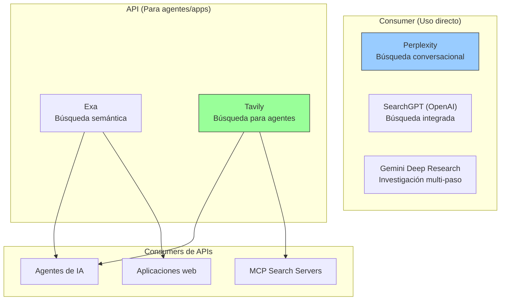
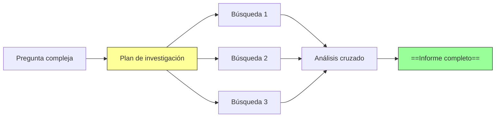
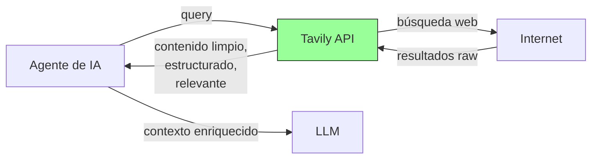
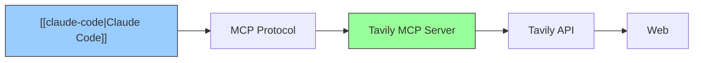

# Motores de búsqueda con IA

> [!abstract] Resumen
> Los motores de búsqueda con IA representan un cambio fundamental en cómo accedemos a información: en lugar de ==10 links azules==, obtenemos ==respuestas sintetizadas con citas==. Este espacio incluye: **Perplexity** (búsqueda conversacional con citas), **SearchGPT** (búsqueda integrada de OpenAI), **Gemini Deep Research** (investigación multi-paso de Google), **Exa** (API de búsqueda semántica), y **Tavily** (API de búsqueda optimizada para agentes de IA). La elección entre ellos depende de si los usas como ==usuario final (Perplexity, SearchGPT)== o como ==componente de un agente (Exa, Tavily)==. ^resumen

---

## El panorama de búsqueda con IA



---

## Perplexity

**Perplexity**[^1] es el ==líder en búsqueda conversacional con IA==. Su propuesta: hacer una pregunta y obtener una respuesta sintetizada con citas verificables.

### Cómo funciona

1. Recibe la pregunta del usuario
2. ==Busca en la web en tiempo real==
3. Lee y procesa las fuentes relevantes
4. Sintetiza una respuesta con citas numeradas
5. Permite follow-up questions

| Feature | Descripción |
|---|---|
| Web search | Búsqueda en tiempo real con ==citas== |
| Focus modes | Académico, Reddit, YouTube, Writing |
| Spaces | ==Colecciones organizadas== de investigación |
| Collections | Guardar y organizar búsquedas |
| API | API para integración programática |
| Mobile | Apps iOS y Android |

> [!tip] Perplexity como herramienta de investigación técnica
> Para desarrolladores, Perplexity es especialmente útil para:
> - Investigar librerías y frameworks (==respuestas actualizadas== vs docs oficiales desactualizados)
> - Comparar tecnologías con datos recientes
> - Encontrar soluciones a errores específicos
> - Investigar estado del arte en ML/AI
>
> La ventaja sobre Google: ==no necesitas abrir 10 tabs y sintetizar tú mismo==.

> [!warning] Limitaciones de Perplexity
> - Las citas a veces ==no soportan la afirmación que referencian==
> - Puede ==alucinar datos estadísticos== con citas que no contienen esos datos
> - El modelo subyacente puede tener sesgos
> - Los resultados ==dependen de la calidad de las fuentes indexadas==

**Pricing** (junio 2025):
| Plan | Precio | Búsquedas Pro |
|---|---|---|
| Free | $0 | 5/día |
| Pro | ==$20/mo== | 600/día |
| Enterprise | Custom | Ilimitado |

---

## SearchGPT (OpenAI)

**SearchGPT** es la integración de búsqueda web de OpenAI en ChatGPT y via API.

> [!info] Integración profunda con ChatGPT
> A diferencia de Perplexity que es un producto separado, SearchGPT está ==integrado directamente en ChatGPT==. Cuando preguntas algo que requiere información actualizada, ChatGPT automáticamente busca en la web.

| Aspecto | SearchGPT |
|---|---|
| Integración | ==Dentro de ChatGPT== |
| Modelo | GPT-4o |
| Citas | Sí, con preview de fuentes |
| API | Via ChatGPT API (tool: browsing) |
| Independiente | No — requiere ChatGPT/API |

> [!question] ¿SearchGPT o Perplexity?
> - **SearchGPT**: si ya usas ChatGPT y quieres búsqueda integrada en la conversación
> - **Perplexity**: si quieres ==búsqueda dedicada con mejor UX de citas== y focus modes

---

## Gemini Deep Research

**Gemini Deep Research** es la funcionalidad de investigación multi-paso de Google[^2]:



> [!tip] Para investigación profunda
> Deep Research es la mejor opción cuando necesitas ==investigación exhaustiva sobre un tema==:
> - Ejecuta múltiples búsquedas iterativas
> - Cruza información de múltiples fuentes
> - Genera un informe estructurado y largo
> - Ideal para: "Estado del arte de X", "Comparación exhaustiva de Y"

**Pricing**: incluido en Google One AI Premium (==$19.99/mo==).

---

## Exa

**Exa**[^3] es una API de ==búsqueda semántica== diseñada para ser usada por aplicaciones y agentes de IA.

### Diferencia con búsqueda tradicional

| Aspecto | Google/Bing API | ==Exa== |
|---|---|---|
| Tipo de query | Keywords | ==Lenguaje natural / semántico== |
| Resultados | URLs + snippets | ==Contenido completo== extraído |
| Embeddings | No | ==Sí (búsqueda por similitud)== |
| Filtros | Básicos | Dominio, fecha, ==tipo de contenido== |
| Orientación | Usuarios humanos | ==Agentes de IA== |

> [!example]- Ejemplo de uso de Exa API
> ```python
> from exa_py import Exa
>
> exa = Exa(api_key="exa-...")
>
> # Búsqueda semántica
> results = exa.search_and_contents(
>     "mejores prácticas para RAG con documentos largos",
>     type="neural",  # búsqueda semántica (vs keyword)
>     num_results=5,
>     text=True,  # incluir texto completo
>     highlights=True,  # incluir highlights relevantes
>     use_autoprompt=True,  # optimizar query automáticamente
>     start_published_date="2024-01-01",  # solo resultados recientes
> )
>
> for result in results.results:
>     print(f"Title: {result.title}")
>     print(f"URL: {result.url}")
>     print(f"Highlights: {result.highlights}")
>     print(f"Text (first 500 chars): {result.text[:500]}")
>     print("---")
>
> # Búsqueda por similitud (encontrar páginas similares)
> similar = exa.find_similar_and_contents(
>     url="https://docs.anthropic.com/claude/docs",
>     num_results=5,
>     text=True
> )
> ```

**Pricing** (junio 2025): Free tier (1,000 búsquedas/mes). Pro desde ==$99/mo==.

---

## Tavily

**Tavily**[^4] es una API de búsqueda ==diseñada específicamente para agentes de IA== y frameworks como LangChain.

### Por qué Tavily es popular en agentes

1. **Respuestas pre-procesadas**: en lugar de devolver HTML raw, Tavily devuelve ==contenido limpio y estructurado==
2. **Optimizado para contexto de LLM**: el output está diseñado para ser ==inyectado directamente en el prompt== de un LLM
3. **Integración nativa**: plugins oficiales para LangChain, LlamaIndex, CrewAI, AutoGen



> [!tip] Tavily como MCP server
> Tavily tiene un ==MCP server oficial== que permite integrarlo con [[claude-code]] y herramientas que soporten MCP:
> ```json
> {
>   "mcpServers": {
>     "tavily": {
>       "command": "npx",
>       "args": ["-y", "tavily-mcp-server"],
>       "env": {
>         "TAVILY_API_KEY": "tvly-..."
>       }
>     }
>   }
> }
> ```
> Esto permite que Claude Code ==busque en la web== automáticamente durante sesiones de codificación.

**Pricing** (junio 2025):
| Plan | Precio | Búsquedas/mes |
|---|---|---|
| Free | $0 | ==1,000== |
| Researcher | $100/mo | 20,000 |
| Scale | Custom | Ilimitado |

---

## Comparación completa

| Aspecto | Perplexity | SearchGPT | Gemini DR | ==Exa== | ==Tavily== |
|---|---|---|---|---|---|
| Tipo | Consumer | Consumer | Consumer | ==API== | ==API== |
| Uso principal | Búsqueda directa | Chat + búsqueda | Investigación | Apps/Agentes | ==Agentes== |
| Citas | ==Excelente== | Buenas | Buenas | URLs | Incluidas |
| Contenido completo | No | No | Sí (informe) | ==Sí== | ==Sí== |
| Búsqueda semántica | Parcial | Parcial | Parcial | ==Sí== | Parcial |
| API | Sí | Via OpenAI | No | ==Sí== | ==Sí== |
| MCP server | No oficial | No | No | No oficial | ==Sí== |
| Precio entrada | $0 | $20/mo | $19.99/mo | $0 | ==$0== |
| Mejor para | Investigación rápida | Usuarios ChatGPT | Investigación profunda | Desarrollo | ==Agentes== |

---

## Cómo los agentes usan búsqueda

> [!info] Patrones de uso de búsqueda en agentes de IA

### Via tool calling

```python
# Patrón: el LLM decide cuándo buscar
tools = [
    {
        "type": "function",
        "function": {
            "name": "web_search",
            "description": "Busca información actualizada en la web",
            "parameters": {
                "type": "object",
                "properties": {
                    "query": {"type": "string", "description": "Query de búsqueda"}
                }
            }
        }
    }
]

# El LLM decide si necesita buscar y qué buscar
response = client.chat.completions.create(
    model="gpt-4o",
    messages=[{"role": "user", "content": "¿Cuál es la última versión de React?"}],
    tools=tools
)
```

### Via MCP



---

## Limitaciones honestas

> [!failure] Problemas comunes de la búsqueda con IA
> 1. **Alucinaciones con citas**: las herramientas pueden ==generar citas que no soportan== la afirmación. Siempre verificar fuentes
> 2. **Sesgo de recencia**: priorizan contenido reciente, lo que puede ==ignorar fuentes clásicas== más relevantes
> 3. **Calidad de fuentes**: buscan en la web general, que incluye ==contenido de baja calidad, SEO spam, y desinformación==
> 4. **Cobertura limitada**: no acceden a contenido detrás de paywalls, bases de datos académicas, o documentación privada
> 5. **Latencia**: la búsqueda en tiempo real ==añade 1-5 segundos== a cada request, lo que puede ser problemático en flujos rápidos
> 6. **Coste en volumen**: para agentes que buscan frecuentemente, los ==costes de API se acumulan==
> 7. **Resultados no deterministas**: la misma query puede dar ==resultados diferentes en momentos diferentes==
> 8. **No reemplazan investigación**: para investigación académica o técnica profunda, siguen siendo ==inferiores a búsqueda especializada== (Google Scholar, arxiv, etc.)

> [!danger] Verificar siempre las fuentes
> ==NUNCA confíes ciegamente en las citas de herramientas de búsqueda con IA==. Los modelos pueden:
> - Fabricar URLs que no existen
> - Citar una fuente pero extraer información de otra
> - Interpretar incorrectamente lo que dice una fuente
> - Mezclar información de múltiples fuentes de forma incorrecta

---

## Relación con el ecosistema

Las herramientas de búsqueda con IA son ==componentes que enriquecen el contexto== de los agentes del ecosistema.

- **[[intake-overview]]**: intake puede usar búsqueda (via Tavily/Exa) para ==investigar tecnologías mencionadas en requisitos==, encontrar documentación de APIs referenciadas, o verificar viabilidad técnica durante el proceso de especificación.
- **[[architect-overview]]**: architect puede integrar búsqueda via MCP o tool calling para que el agente ==busque documentación actualizada== durante la implementación. Esto es útil para APIs que cambian frecuentemente o para resolver errores desconocidos.
- **[[vigil-overview]]**: vigil no usa búsqueda directamente, pero los resultados de búsqueda ==podrían informar las reglas de vigil== (e.g., buscar CVEs conocidos para dependencias).
- **[[licit-overview]]**: la búsqueda con IA puede ayudar a licit a ==investigar regulaciones actualizadas== y precedentes legales relevantes para compliance.

---

## Estado de mantenimiento

> [!success] Todas activamente mantenidas
> | Herramienta | Empresa | Financiación | Estado |
> |---|---|---|---|
> | Perplexity | Perplexity AI | $500M+ | Activo, creciendo rápido |
> | SearchGPT | OpenAI | $13B+ | Integrado en ChatGPT |
> | Gemini DR | Google | Alphabet | Integrado en Gemini |
> | Exa | Exa AI | $22M+ | Activo |
> | Tavily | Tavily | $10M+ | Activo |

---

## Enlaces y referencias

> [!quote]- Bibliografía y recursos
> - [^1]: Perplexity — [perplexity.ai](https://perplexity.ai)
> - [^2]: Gemini Deep Research — [gemini.google.com](https://gemini.google.com)
> - [^3]: Exa — [exa.ai](https://exa.ai)
> - [^4]: Tavily — [tavily.com](https://tavily.com)
> - "AI Search: The New Paradigm" — análisis de mercado, 2025
> - [[claude-code]] — usa búsqueda via MCP
> - [[architect-overview]] — puede integrar búsqueda en pipelines

[^1]: Perplexity AI, fundada en 2022. Líder en búsqueda conversacional.
[^2]: Google Gemini Deep Research, funcionalidad de Google AI.
[^3]: Exa, API de búsqueda semántica para agentes de IA.
[^4]: Tavily, API de búsqueda optimizada para agentes.
