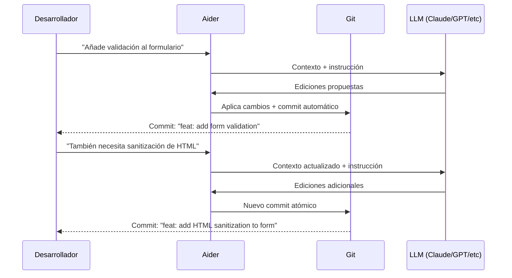

# Aider

> [!abstract] Resumen
> **Aider** es una herramienta ==open source== de *AI pair programming* en terminal que destaca por su ==integración profunda con git==, soporte para múltiples LLMs via [[litellm]], edición de múltiples archivos, y una comunidad activa. Funciona como un programador par que entiende tu repositorio, hace commits atómicos, y soporta voice coding. Su rendimiento en ==SWE-bench es competitivo con herramientas cerradas y más costosas==. Es la alternativa open source más madura a [[claude-code]] y la base filosófica sobre la que se construyen herramientas como [[architect-overview]]. ^resumen

---

## Qué es Aider

Aider[^1] es un proyecto open source creado por Paul Gauthier que implementa *AI pair programming* — programación en par con una IA — directamente en la terminal. A diferencia de herramientas que requieren un IDE específico ([[cursor]], [[windsurf]]) o están atadas a un proveedor ([[claude-code]], [[codex-openai]]), Aider es ==agnóstico tanto en editor como en modelo==.

> [!info] Filosofía open source
> Aider es completamente open source bajo licencia Apache 2.0. Esto significa que puedes:
> - Inspeccionar exactamente qué hace con tu código
> - Modificarlo para tus necesidades específicas
> - Contribuir mejoras a la comunidad
> - Ejecutarlo sin dependencia de ningún vendor
>
> En un espacio dominado por productos cerrados, esto es un ==diferenciador fundamental==.

---

## Características principales

### Integración con Git

La integración con git es la ==funcionalidad estrella== de Aider y lo que lo distingue de la mayoría de alternativas:

- **Commits automáticos**: cada cambio que Aider hace se committea automáticamente con un mensaje descriptivo
- **Git-aware editing**: Aider entiende el estado de git (cambios staged, unstaged, branches)
- **Undo fácil**: como cada cambio es un commit, puedes hacer `git revert` o `git diff` para ver exactamente qué cambió
- **Compatibilidad con branches**: funciona con cualquier branch workflow



> [!tip] Commits atómicos = seguridad
> Los commits automáticos de Aider significan que ==nunca pierdes trabajo== y siempre puedes volver atrás. Si Aider hace un cambio que no te gusta:
> ```bash
> git revert HEAD  # Revierte el último cambio de Aider
> # O
> git diff HEAD~1  # Ve exactamente qué cambió
> ```

### Soporte multi-modelo

Aider soporta ==prácticamente cualquier LLM== via [[litellm]] y configuración directa:

| Proveedor | Modelos | Configuración |
|---|---|---|
| OpenAI | GPT-4o, GPT-4 Turbo | API key directa |
| Anthropic | ==Claude Opus, Sonnet, Haiku== | API key directa |
| Google | Gemini Pro, Ultra | API key directa |
| Local | Llama, Mistral, Phi | Via [[ollama]] + litellm |
| Azure | Modelos OpenAI en Azure | Azure endpoint |
| AWS Bedrock | Claude, Llama | Credenciales AWS |
| [[openrouter]] | ==200+ modelos== | API key OpenRouter |
| Cualquier otro | Via [[litellm]] | Configuración litellm |

> [!example]- Configuración multi-modelo
> ```bash
> # Usar Claude Sonnet (recomendado para coding)
> aider --model claude-3-5-sonnet-20241022
>
> # Usar GPT-4o
> aider --model gpt-4o
>
> # Usar modelo local via Ollama
> aider --model ollama/deepseek-coder-v2
>
> # Usar OpenRouter
> export OPENROUTER_API_KEY="sk-or-..."
> aider --model openrouter/anthropic/claude-3.5-sonnet
>
> # Usar modelo de editor diferente al de chat
> aider --model claude-3-5-sonnet-20241022 --editor-model gpt-4o-mini
>
> # Configuración en archivo
> # .aider.conf.yml
> model: claude-3-5-sonnet-20241022
> editor-model: gpt-4o-mini
> auto-commits: true
> dark-mode: true
> ```

### Edición multi-archivo

Aider puede editar múltiples archivos en una sola interacción. Utiliza dos formatos de edición principales:

- **Whole file**: reemplaza archivos completos (más fiable para cambios grandes)
- **Diff/Edit format**: envía solo los diffs (==más eficiente en tokens==)

> [!info] Selección automática de formato
> Aider selecciona automáticamente el mejor formato de edición según el modelo. Claude funciona mejor con *diff format*; algunos modelos más pequeños funcionan mejor con *whole file format*. Puedes override esto con `--edit-format`.

### Voice Coding

Aider soporta ==entrada por voz== para instrucciones:

```bash
# Activar voice coding
aider --voice

# Aider escucha tu instrucción por micrófono
# La transcribe usando Whisper de OpenAI
# Y la ejecuta como si la hubieras escrito
```

> [!question] ¿El voice coding es práctico?
> Para instrucciones largas y descriptivas, el voice coding puede ser más rápido que escribir. Es especialmente útil para:
> - Describir cambios complejos de lógica de negocio
> - Dictar documentación
> - Trabajar ==mientras tienes las manos ocupadas== (compilando, revisando otro código)
>
> Sin embargo, para instrucciones técnicas con nombres de funciones/variables específicas, escribir suele ser más preciso.

### Browser Integration

Aider puede leer contenido de URLs:

```bash
# Pegar una URL y Aider la lee como contexto
/web https://fastapi.tiangolo.com/tutorial/first-steps/
# "Implementa un API similar a lo descrito en esta página"
```

---

## SWE-bench Performance

Aider mantiene un ==leaderboard público== de rendimiento en SWE-bench[^2]:

| Configuración | SWE-bench Lite (%) | Notas |
|---|---|---|
| Aider + Claude Opus | ==26.3%== | Mejor configuración open source |
| Aider + Claude Sonnet 3.5 | 24.1% | ==Mejor relación calidad/coste== |
| Aider + GPT-4o | 20.5% | Bueno pero inferior a Claude |
| Aider + DeepSeek V2 | 18.2% | Notable para modelo open source |

> [!success] Rendimiento competitivo
> Lo notable de Aider es que su rendimiento en SWE-bench es ==competitivo o superior a herramientas cerradas== como [[devin]] (~20%) y comparable a [[claude-code]] (~30%). Esto demuestra que el framework open source puede igualar o superar soluciones propietarias más costosas.

---

## Pricing

> [!warning] Precios de los LLMs — junio 2025
> Aider es gratuito. Solo pagas por los LLMs que uses.

| Configuración | Coste/hora estimado | Notas |
|---|---|---|
| Aider + Claude Sonnet | ==$0.50-3/hora== | Mejor relación calidad/coste |
| Aider + Claude Opus | $3-15/hora | Para tareas complejas |
| Aider + GPT-4o | $1-5/hora | Alternativa sólida |
| Aider + Ollama (local) | ==$0== | Sin coste de LLM, requiere GPU |
| Aider + DeepSeek | $0.10-1/hora | Económico y capable |

Comparación de coste mensual estimado (uso moderado, ~20 horas/mes):

| Herramienta | Coste mensual estimado |
|---|---|
| Aider + Sonnet | ==$10-60== |
| [[cursor]] Pro | $20 (fijo) |
| [[claude-code]] | $30-100 |
| [[github-copilot\|Copilot]] Individual | $10 (fijo) |
| [[devin]] | ==$500+== (fijo) |

---

## Quick Start

> [!example]- Instalación y configuración de Aider
> ### Instalación
> ```bash
> # Via pip (recomendado)
> pip install aider-chat
>
> # Via pipx (aislado)
> pipx install aider-chat
>
> # Via brew
> brew install aider
>
> # Verificar
> aider --version
> ```
>
> ### Configurar API keys
> ```bash
> # Anthropic (recomendado)
> export ANTHROPIC_API_KEY="sk-ant-..."
>
> # OpenAI
> export OPENAI_API_KEY="sk-..."
>
> # O en archivo de configuración
> # ~/.aider.conf.yml
> anthropic-api-key: sk-ant-...
> openai-api-key: sk-...
> ```
>
> ### Primer uso
> ```bash
> # Navega a tu proyecto (debe ser un repo git)
> cd /path/to/git/project
>
> # Inicia Aider con Claude Sonnet
> aider --model claude-3-5-sonnet-20241022
>
> # Añadir archivos al contexto
> /add src/main.py src/utils.py
>
> # Dar instrucción
> > Refactoriza main.py para usar async/await y actualiza utils.py
>
> # Ver qué archivos están en contexto
> /tokens
>
> # Remover archivo del contexto
> /drop src/utils.py
>
> # Deshacer último cambio
> /undo
>
> # Ejecutar comando
> /run pytest tests/
> ```
>
> ### Comandos slash esenciales
> | Comando | Función |
> |---|---|
> | `/add file` | Añadir archivo al contexto |
> | `/drop file` | Quitar archivo del contexto |
> | `/undo` | Deshacer último cambio |
> | `/diff` | Ver último diff |
> | `/run cmd` | Ejecutar comando |
> | `/tokens` | Ver uso de tokens |
> | `/web url` | Leer URL |
> | `/voice` | Activar voz |
> | `/help` | Ayuda |
>
> ### Configuración avanzada (.aider.conf.yml)
> ```yaml
> model: claude-3-5-sonnet-20241022
> auto-commits: true
> dark-mode: true
> stream: true
> edit-format: diff
> map-tokens: 1024
> map-refresh: auto
> show-diffs: true
> git: true
> gitignore: true
> ```

---

## Comparación con alternativas

| Aspecto | ==Aider== | [[claude-code]] | [[architect-overview\|architect]] | [[cursor]] |
|---|---|---|---|---|
| Open source | ==Sí (Apache 2.0)== | No | Sí | No |
| Multi-modelo | ==Sí (cualquiera)== | Solo Claude | Sí (LiteLLM) | Sí (limitado) |
| Git integration | ==Nativa, profunda== | Básica | Profunda + worktrees | Ninguna |
| Voice coding | ==Sí== | No | No | No |
| Auto-commits | ==Sí== | No | Sí | No |
| Interfaz | CLI | CLI | CLI + Pipeline | ==IDE== |
| Extended thinking | Depende del modelo | Sí (nativo) | Depende del modelo | No |
| Pipelines | No | No | ==YAML== | No |
| Coste herramienta | ==Gratis== | Gratis | Gratis | $20/mo |
| Browser context | Sí | Via MCP | No | @web |

---

## Limitaciones honestas

> [!failure] Lo que Aider NO hace bien
> 1. **Curva de aprendizaje CLI**: para desarrolladores acostumbrados a IDEs, la ==interfaz de terminal puede ser intimidante== al principio
> 2. **Sin IDE integration nativa**: no tienes autocompletado Tab ni highlights visuales. Necesitas usar Aider junto a tu editor
> 3. **Contexto limitado por modelo**: Aider está limitado por la ==ventana de contexto del modelo== que uses. En proyectos grandes, debes gestionar manualmente qué archivos están en contexto
> 4. **Sin ejecución agentica completa**: a diferencia de [[claude-code]], Aider ==no ejecuta comandos automáticamente==. Puedes usar `/run` pero es manual
> 5. **Repository map impreciso**: el *repo map* (que da al modelo una visión general del proyecto) puede ser ==impreciso en proyectos muy grandes== o con muchos archivos
> 6. **Dependencia de API keys**: aunque es open source, ==necesitas API keys de algún proveedor== (excepto con modelos locales vía Ollama)
> 7. **Sin guardrails de seguridad**: no verifica si el código generado tiene vulnerabilidades
> 8. **Documentación fragmentada**: la documentación oficial es buena pero distribuida entre el sitio web, GitHub, y FAQs

> [!warning] Gestión manual del contexto
> La mayor diferencia práctica entre Aider y [[claude-code]] es que Aider requiere que ==manualmente añadas archivos al contexto== con `/add`. Claude Code busca archivos automáticamente. Esto da más control pero requiere que entiendas qué archivos son relevantes.

---

## Relación con el ecosistema

Aider es la herramienta open source que ==democratiza el AI pair programming==, haciéndolo accesible sin vendor lock-in.

- **[[intake-overview]]**: Aider puede procesar especificaciones como contexto (pegando texto o usando `/web` para leer docs), pero ==no tiene integración formal== con el proceso de requisitos de intake. Es ad-hoc por naturaleza.
- **[[architect-overview]]**: architect se inspira filosóficamente en herramientas como Aider pero añade capas de ==automatización, reproducibilidad y calidad==: *Ralph Loop* para iteración automática, pipelines YAML para flujos reproducibles, worktrees para aislamiento, y [[litellm]] como backend compartido. Aider es mejor para sesiones interactivas; architect para ejecución autónoma.
- **[[vigil-overview]]**: Aider no incluye escaneo de seguridad, pero puedes integrarlo manualmente:
  ```bash
  # Después de que Aider haga cambios
  /run vigil scan --sarif .
  ```
  Esto es manual comparado con la integración que ofrece architect.
- **[[licit-overview]]**: como herramienta open source, Aider tiene ==ventajas de transparencia para compliance==. Puedes auditar exactamente qué datos se envían al LLM. Para proyectos que requieren trazabilidad, los commits automáticos de Aider proporcionan un log detallado de qué cambió y por qué.

---

## Estado de mantenimiento

> [!success] Muy activamente mantenido — comunidad vibrante
> - **Creador**: Paul Gauthier
> - **Licencia**: Apache 2.0
> - **GitHub stars**: 20K+ (junio 2025)
> - **Contribuidores**: 100+
> - **Cadencia**: releases frecuentes (varias por semana)
> - **Comunidad**: Discord activo, issues responsivos
> - **Última versión verificada**: 0.6x.x (junio 2025)

---

## Enlaces y referencias

> [!quote]- Bibliografía y recursos
> - [^1]: Aider oficial — [aider.chat](https://aider.chat)
> - [^2]: Aider SWE-bench leaderboard — [aider.chat/docs/leaderboards](https://aider.chat/docs/leaderboards/)
> - GitHub repo — [github.com/paul-gauthier/aider](https://github.com/paul-gauthier/aider)
> - Aider Discord — comunidad activa de usuarios
> - "AI Pair Programming in Practice" — blog de Paul Gauthier
> - [[ai-code-tools-comparison]] — comparación completa
> - [[litellm]] — backend de modelos que Aider usa

[^1]: Aider, creado por Paul Gauthier. Open source bajo Apache 2.0.
[^2]: Aider SWE-bench leaderboard, mantenido en [aider.chat](https://aider.chat).
