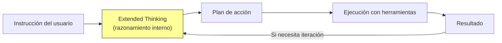
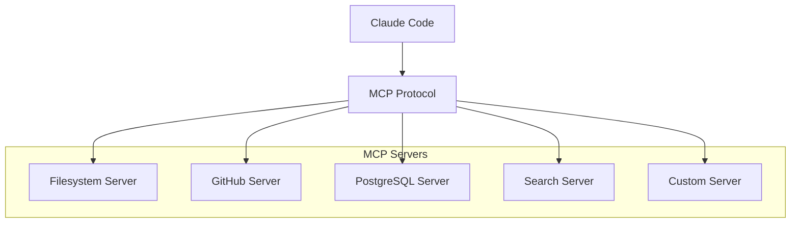
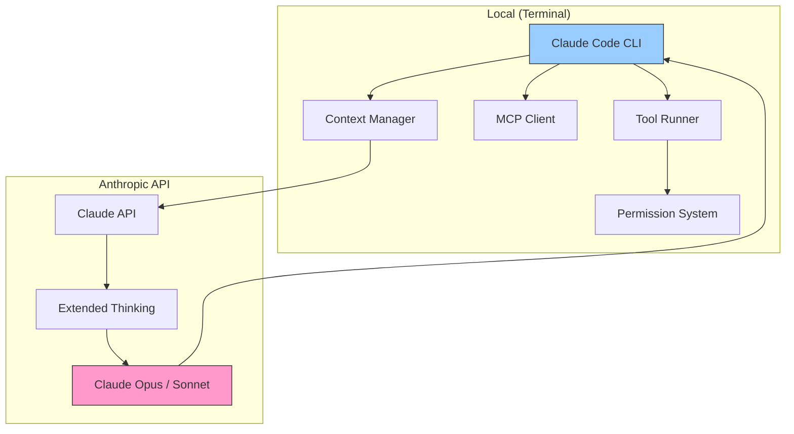

# Claude Code

> [!abstract] Resumen
> **Claude Code** es la CLI oficial de Anthropic para codificación agentica. Funciona ==directamente en la terminal==, sin IDE, ejecutando tareas de codificación mediante herramientas de lectura/escritura/edición de archivos, ejecución de bash, búsqueda en codebase, y conversación multi-turno. Su capacidad de ==razonamiento extendido (*extended thinking*)== con Claude Opus y Sonnet lo convierte en una de las herramientas de codificación con IA más potentes disponibles. Es extensible via *MCP* (*Model Context Protocol*). La comparación más relevante es con [[architect-overview]], que añade pipelines, *Ralph Loop*, worktrees y control de costes sobre un concepto similar. ^resumen

---

## Qué es Claude Code

Claude Code[^1] es la apuesta de Anthropic por entrar directamente en el flujo de trabajo del desarrollador. A diferencia de [[cursor]] o [[windsurf]] que son IDEs completos, Claude Code es una ==herramienta de terminal pura== — se ejecuta donde el desarrollador ya trabaja.

> [!info] Filosofía: la terminal como IDE
> La decisión de Anthropic de hacer Claude Code como CLI no es casual. La terminal es el denominador común de todo desarrollador profesional. No requiere aprender un editor nuevo, no tiene conflictos con extensiones, y funciona en cualquier entorno: local, SSH, contenedores, CI/CD.

Claude Code se lanzó en febrero 2025 y rápidamente se convirtió en una de las herramientas más discutidas en la comunidad de desarrollo por su capacidad de razonamiento superior, especialmente con el modelo Claude Opus.

---

## Características principales

### Ejecución agentica

Claude Code no solo genera código — lo ejecuta. Tiene acceso a un conjunto de herramientas (*tools*) que le permiten interactuar con el sistema:

| Herramienta | Función | Permisos |
|---|---|---|
| `Read` | Lee archivos del sistema | Automático |
| `Write` | ==Escribe archivos nuevos== | Requiere aprobación |
| `Edit` | Edita archivos existentes (diff) | Requiere aprobación |
| `Bash` | ==Ejecuta comandos en terminal== | Requiere aprobación |
| `Grep` | Búsqueda por contenido | Automático |
| `Glob` | Búsqueda por nombre de archivo | Automático |
| `WebSearch` | Busca en la web | Automático |
| `WebFetch` | Obtiene contenido de URLs | Automático |

> [!tip] Sistema de permisos
> Claude Code tiene un ==sistema de permisos granular== que te permite controlar qué puede hacer sin preguntar. Puedes configurarlo para auto-aprobar lecturas y búsquedas mientras requiere confirmación para escrituras y ejecución de bash. Esto es fundamental para la seguridad.

### Conversación multi-turno

A diferencia de herramientas de "un solo disparo", Claude Code mantiene una ==conversación continua== donde puedes:
- Refinar instrucciones basándote en resultados previos
- Pedir correcciones incrementales
- Explorar antes de implementar
- Cambiar de dirección sin perder contexto

### Extended Thinking

*Extended thinking* permite que Claude "piense" de forma estructurada antes de responder:



> [!example]- Ejemplo de extended thinking en acción
> ```
> Usuario: "Refactoriza el módulo de autenticación para soportar
>           OAuth2 además de JWT, manteniendo backward compatibility"
>
> [Extended Thinking - no visible al usuario]
> - Necesito entender la estructura actual de autenticación
> - Leer los archivos de auth existentes
> - Identificar todos los puntos de uso de JWT
> - Diseñar una abstracción que soporte ambos métodos
> - Implementar OAuth2 provider sin romper JWT
> - Actualizar la configuración
> - Modificar los tests existentes y añadir nuevos
> - Verificar que los tests existentes siguen pasando
> [Fin Extended Thinking]
>
> Claude Code ejecuta:
> 1. Glob: busca archivos de auth → encuentra auth/, middleware/auth.ts, etc.
> 2. Read: lee cada archivo relevante
> 3. Analiza la estructura y forma un plan detallado
> 4. Edit: crea interfaz AuthProvider abstracta
> 5. Edit: refactoriza JWTProvider para implementar interfaz
> 6. Write: crea OAuthProvider implementando la misma interfaz
> 7. Edit: modifica middleware para usar la interfaz abstracta
> 8. Edit: actualiza configuración para seleccionar provider
> 9. Bash: ejecuta tests → npm test
> 10. Si fallan tests → lee errores → corrige → re-ejecuta
> ```

### MCP (Model Context Protocol)

*MCP*[^2] es un protocolo abierto de Anthropic que permite conectar Claude Code con ==herramientas y fuentes de datos externas==.

> [!info] MCP como estándar
> MCP aspira a ser el "USB de la IA" — un estándar para conectar modelos de lenguaje con herramientas. Claude Code soporta MCP nativamente, permitiendo instalar *MCP servers* que exponen nuevas capacidades: bases de datos, APIs, herramientas especializadas, etc.

Ejemplos de MCP servers útiles:
- **Filesystem**: acceso controlado a archivos
- **GitHub**: interacción con repos, issues, PRs
- **PostgreSQL**: queries directas a la base de datos
- **Brave Search**: búsqueda web
- **Slack**: envío de mensajes y lectura de canales



---

## Arquitectura



> [!warning] Dependencia de la API de Anthropic
> Claude Code ==depende exclusivamente de la API de Anthropic==. No puedes usar otros modelos (OpenAI, Mistral, etc.) con Claude Code. Esto es una limitación significativa comparada con [[aider]] (que soporta cualquier modelo via [[litellm]]) o [[architect-overview]] (que usa LiteLLM para 100+ proveedores).

---

## Comparación: Claude Code vs architect

Esta comparación es particularmente relevante porque ambos son agentes de codificación basados en terminal que usan modelos Claude.

| Aspecto | ==Claude Code== | [[architect-overview\|architect]] |
|---|---|---|
| Desarrollador | Anthropic | Comunidad / Independiente |
| Modelo | ==Solo Claude== | Cualquiera (via [[litellm]]) |
| Interfaz | CLI | CLI + Pipeline YAML |
| Iteración | Manual multi-turno | ==Ralph Loop (automático)== |
| Aislamiento | Directorio actual | ==Worktrees git== |
| Coste | No tracking | ==Tracking y presupuesto== |
| CI/CD | No nativo | ==Integración nativa== |
| MCP | ==Sí== | Varía |
| Extended thinking | ==Sí (nativo)== | Depende del modelo |
| Pipelines | No | ==YAML pipelines== |
| Open source | No | Sí |
| Escalabilidad | Sesión individual | ==Multi-tarea, paralelo== |

> [!tip] Cuándo elegir cada uno
> - **Claude Code**: exploración interactiva, tareas ad-hoc, cuando quieres razonamiento profundo de Claude Opus
> - **architect**: tareas complejas que requieren iteración automática, reproducibilidad, control de costes, y ejecución en CI/CD

---

## Pricing

> [!warning] Precios verificados en junio 2025 — modelo de pricing basado en uso de API
> Claude Code usa directamente la API de Anthropic. No tiene precio fijo mensual.

| Modelo | Input (1M tokens) | Output (1M tokens) | Caso de uso |
|---|---|---|---|
| Claude Opus | ==$15== | $75 | Tareas complejas, razonamiento profundo |
| Claude Sonnet 3.5 | $3 | $15 | ==Balance calidad/coste== |
| Claude Haiku | $0.25 | $1.25 | Tareas simples, búsqueda |

> [!danger] El coste puede escalar rápidamente
> Una sesión larga de Claude Code con Opus puede ==costar $5-20+ fácilmente==. El extended thinking consume tokens adicionales que no son visibles pero se cobran. Sin herramientas de tracking (como las que ofrece [[architect-overview]]), es fácil perder el control del gasto.

Estimación de costes típicos por sesión:

| Tipo de tarea | Modelo | Duración | ==Coste estimado== |
|---|---|---|---|
| Bug fix simple | Sonnet | 5-10 min | $0.10-0.50 |
| Feature mediana | Sonnet | 30-60 min | $1-5 |
| Refactoring complejo | Opus | 1-2 horas | ==$5-20== |
| Exploración de codebase | Opus + Thinking | 30 min | $3-10 |

---

## Quick Start

> [!example]- Instalación y primer uso de Claude Code
> ### Instalación
> ```bash
> # Via npm (recomendado)
> npm install -g @anthropic-ai/claude-code
>
> # Verificar instalación
> claude --version
> ```
>
> ### Configuración de API key
> ```bash
> # Opción 1: variable de entorno
> export ANTHROPIC_API_KEY="sk-ant-..."
>
> # Opción 2: configuración interactiva
> claude config set api_key sk-ant-...
> ```
>
> ### Primer uso
> ```bash
> # Navega al directorio de tu proyecto
> cd /path/to/your/project
>
> # Inicia Claude Code
> claude
>
> # Escribe tu primera instrucción
> > Explica la estructura de este proyecto y sugiere mejoras
> ```
>
> ### Configurar MCP servers
> ```json
> // ~/.claude/mcp_settings.json
> {
>   "mcpServers": {
>     "github": {
>       "command": "npx",
>       "args": ["-y", "@modelcontextprotocol/server-github"],
>       "env": {
>         "GITHUB_TOKEN": "ghp_..."
>       }
>     },
>     "filesystem": {
>       "command": "npx",
>       "args": ["-y", "@modelcontextprotocol/server-filesystem", "/path/to/allowed/dir"]
>     }
>   }
> }
> ```
>
> ### Configurar permisos
> ```bash
> # Auto-aprobar lecturas, preguntar para escrituras
> claude config set auto_approve_reads true
> claude config set auto_approve_writes false
> claude config set auto_approve_bash false
> ```

---

## Casos de uso ideales

> [!success] Donde Claude Code brilla
> 1. **Exploración de codebases desconocidos**: el razonamiento de Opus + extended thinking es ==imbatible para entender código complejo==
> 2. **Refactorizaciones profundas**: puede mantener contexto de toda la refactorización en la conversación
> 3. **Debugging complejo**: puede leer logs, código, ejecutar tests, y razonar sobre la causa raíz
> 4. **Prototyping rápido**: crear un prototipo funcional desde cero con iteración rápida
> 5. **Tareas de terminal**: ideal para usuarios que prefieren ==no salir de la terminal==

---

## Limitaciones honestas

> [!failure] Lo que Claude Code NO hace bien
> 1. **Solo Claude**: ==no puedes usar GPT-4, Mistral, Llama, o cualquier otro modelo==. Si Claude tiene un punto ciego, no hay alternativa dentro de Claude Code
> 2. **Sin IDE**: no hay autocompletado, syntax highlighting interactivo, ni integración visual. Es puramente textual
> 3. **Coste no controlado**: sin tracking de costes integrado, las sesiones largas pueden ser caras sin que te des cuenta
> 4. **Sin pipelines**: no puedes definir un flujo reproducible. Cada sesión es ==ad-hoc==
> 5. **Sin worktrees**: trabaja directamente en tu directorio, sin aislamiento. Un error puede ==afectar tu branch de trabajo==
> 6. **Sin CI/CD nativo**: no se integra nativamente con pipelines de CI/CD
> 7. **Contexto limitado por ventana**: aunque la ventana es grande (200K tokens), proyectos muy grandes pueden excederla
> 8. **Closed source**: no puedes inspeccionar ni modificar el comportamiento interno

> [!warning] Extended thinking y costes ocultos
> El *extended thinking* consume ==tokens que no ves en la respuesta pero que sí se cobran==. Una respuesta corta puede haber requerido miles de tokens de "pensamiento". Monitorea tu uso en la dashboard de Anthropic.

---

## Relación con el ecosistema

Claude Code es el ==puente entre el desarrollador individual y los modelos de Anthropic==, pero no cubre el ciclo de vida completo del desarrollo.

- **[[intake-overview]]**: Claude Code puede ayudar a analizar requisitos y explorar código existente, pero ==no tiene un framework estructurado== para la fase de requisitos→especificaciones que ofrece intake. Sin embargo, via MCP podrías conectarlo con herramientas de intake.
- **[[architect-overview]]**: architect se puede ver como ==Claude Code + pipelines + Ralph Loop + worktrees + cost tracking + CI/CD==. Si Claude Code es un cuchillo suizo, architect es un taller completo. Claude Code es mejor para exploración interactiva; architect para ejecución autónoma de tareas complejas y reproducibles.
- **[[vigil-overview]]**: Claude Code no incluye escaneo de seguridad. Sin embargo, puedes pedirle que ==ejecute vigil como parte de su flujo==: `"Ejecuta vigil sobre los archivos que acabas de modificar"`. Esto es manual y ad-hoc, comparado con la integración automática que ofrece architect.
- **[[licit-overview]]**: Claude Code no tiene funcionalidad de compliance. Para proyectos que requieren trazabilidad y cumplimiento regulatorio, licit proporciona la estructura que Claude Code no ofrece.

---

## Estado de mantenimiento

> [!success] Activamente mantenido — producto core de Anthropic
> - **Empresa**: Anthropic
> - **Lanzamiento**: febrero 2025
> - **Cadencia**: actualizaciones frecuentes (semanal/bisemanal)
> - **MCP**: ecosistema en crecimiento activo
> - **Documentación**: [docs.anthropic.com/claude-code](https://docs.anthropic.com/en/docs/claude-code)

---

## Enlaces y referencias

> [!quote]- Bibliografía y recursos
> - [^1]: Claude Code oficial — [docs.anthropic.com/claude-code](https://docs.anthropic.com/en/docs/claude-code)
> - [^2]: Model Context Protocol — [modelcontextprotocol.io](https://modelcontextprotocol.io)
> - Anthropic Blog — anuncios y actualizaciones de Claude Code
> - MCP Servers directory — [github.com/modelcontextprotocol/servers](https://github.com/modelcontextprotocol/servers)
> - [[ai-code-tools-comparison]] — comparación con todas las alternativas
> - [[architect-overview]] — alternativa con pipelines y worktrees

[^1]: Claude Code, lanzado por Anthropic en febrero 2025.
[^2]: Model Context Protocol (MCP), estándar abierto de Anthropic para interoperabilidad de herramientas con LLMs.
