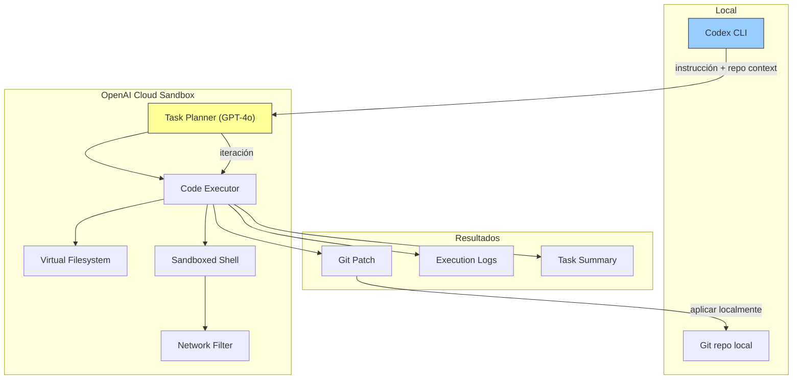

# OpenAI Codex CLI

> [!abstract] Resumen
> **OpenAI Codex CLI** es el agente de codificación de OpenAI que ejecuta tareas en un ==sandbox cloud aislado==. A diferencia de [[claude-code]] que opera localmente, Codex ejecuta todo en la infraestructura de OpenAI, proporcionando aislamiento total pero ==sacrificando control local==. Utiliza GPT-4o y modelos posteriores para planificación y ejecución de código. Su fortaleza es el sandbox seguro; su debilidad es la dependencia total del cloud y la personalización limitada comparada con [[architect-overview]] o [[aider]]. ^resumen

---

## Qué es OpenAI Codex CLI

OpenAI Codex CLI[^1] es la respuesta de OpenAI a la tendencia de agentes de codificación autónomos. No debe confundirse con el modelo original "Codex" (2021, basado en GPT-3), que fue deprecated. El Codex CLI moderno es un ==agente completo== que:

1. Recibe instrucciones en lenguaje natural
2. Planifica la implementación
3. Ejecuta código en un sandbox seguro
4. Itera basándose en resultados
5. Entrega cambios listos para integrar

> [!info] Evolución del nombre "Codex"
> - **Codex (2021)**: modelo de OpenAI para generación de código, basado en GPT-3. Fue el motor detrás de la primera versión de [[github-copilot]]. Deprecated en 2023.
> - **Codex CLI (2025)**: agente de codificación completamente nuevo que usa GPT-4o. ==No tiene relación técnica con el Codex original== excepto el nombre.

---

## Arquitectura

La arquitectura de Codex se distingue por su ==ejecución completamente en la nube==:



> [!warning] Tu código se envía al cloud
> Para ejecutar tareas, Codex ==envía el contenido relevante de tu repositorio a los servidores de OpenAI==. Aunque ejecuta en un sandbox aislado, el código pasa por la infraestructura de OpenAI. Para proyectos con código propietario sensible, esto puede ser un bloqueante. Verifica las políticas de data retention de OpenAI.

### Sandbox vs ejecución local

| Aspecto | Codex (Sandbox) | [[claude-code]] (Local) | [[architect-overview\|architect]] (Local) |
|---|---|---|---|
| Ejecución | ==Cloud de OpenAI== | Terminal local | Terminal local + worktree |
| Seguridad | Sandbox aislado | Permisos del usuario | Worktree aislado |
| Acceso red | Filtrado | Completo | Completo |
| Latencia | Alta | ==Baja== | Baja |
| Privacidad | Código en cloud | Código local | ==Código local== |
| Reproducibilidad | Sesión efímera | Sesión efímera | Pipelines YAML |

---

## Características principales

### Planificación automática

Codex descompone tareas complejas en pasos ejecutables:

> [!example]- Ejemplo de planificación de Codex
> ```
> Instrucción: "Añade rate limiting a la API REST"
>
> Plan generado por Codex:
> ┌─────────────────────────────────────────┐
> │ Step 1: Analyze existing API structure  │
> │ - Read route files                      │
> │ - Identify middleware pattern           │
> │ - Check for existing rate limiting      │
> ├─────────────────────────────────────────┤
> │ Step 2: Install dependencies            │
> │ - npm install express-rate-limit        │
> │ - npm install rate-limit-redis (if Redis│
> │   detected)                             │
> ├─────────────────────────────────────────┤
> │ Step 3: Implement rate limiter          │
> │ - Create middleware/rateLimiter.ts      │
> │ - Configure limits based on route type  │
> │ - Add store configuration               │
> ├─────────────────────────────────────────┤
> │ Step 4: Apply to routes                 │
> │ - Add middleware to API routes          │
> │ - Skip rate limiting for health checks │
> ├─────────────────────────────────────────┤
> │ Step 5: Add tests                       │
> │ - Test rate limit headers               │
> │ - Test limit exceeded response          │
> │ - Test rate limit reset                 │
> ├─────────────────────────────────────────┤
> │ Step 6: Run tests and verify            │
> │ - Execute existing tests (no regression)│
> │ - Execute new tests                     │
> └─────────────────────────────────────────┘
> ```

### Ejecución en sandbox

El sandbox de Codex proporciona:
- **Aislamiento**: el código se ejecuta en un ==contenedor efímero==
- **Seguridad de red**: acceso a internet filtrado (solo paquetes de registros conocidos)
- **Reproducibilidad**: cada ejecución parte de un estado limpio
- **Timeout**: las ejecuciones tienen límite de tiempo para evitar loops infinitos

### Integración con GitHub

Codex se integra con GitHub para:
- Leer issues y PRs como contexto
- Crear branches y commits
- Generar Pull Requests
- Responder a code review comments

> [!tip] Flujo GitHub optimizado
> La integración más fluida de Codex es el flujo:
> 1. Issue en GitHub → 2. Codex analiza y ejecuta → 3. PR automático
>
> Esto es similar a [[devin]] pero con la ventaja de que Codex usa ==modelos de OpenAI de última generación== en lugar de modelos propietarios menos probados.

---

## Pricing

> [!warning] Precios verificados en junio 2025 — basado en uso de API
> Consulta [platform.openai.com](https://platform.openai.com) para información actualizada.

Codex CLI se factura como uso de la API de OpenAI, más un cargo por tiempo de computación en el sandbox:

| Componente | Coste | Notas |
|---|---|---|
| GPT-4o (input) | $2.50/1M tokens | Para planificación y razonamiento |
| GPT-4o (output) | $10/1M tokens | Para generación de código |
| Sandbox compute | ==$0.50/hora== | Tiempo de ejecución del sandbox |
| Almacenamiento | Incluido | Efímero por sesión |

Estimación de coste por tipo de tarea:

| Tarea | Tiempo estimado | ==Coste estimado== |
|---|---|---|
| Bug fix simple | 5-15 min | $0.50-2 |
| Feature mediana | 30-60 min | $3-8 |
| Refactoring complejo | 1-3 horas | ==$8-25== |
| Migración grande | 3-8 horas | $25-60 |

> [!danger] Costes de sandbox se acumulan
> A diferencia de [[claude-code]] donde ==solo pagas por tokens==, Codex cobra también por tiempo de sandbox. Si el agente entra en un loop de debug, el reloj sigue corriendo. Monitorea activamente las sesiones largas.

---

## Comparación con alternativas

| Aspecto | ==Codex CLI== | [[claude-code]] | [[architect-overview\|architect]] | [[devin]] |
|---|---|---|---|---|
| Modelo | GPT-4o | ==Claude Opus/Sonnet== | Cualquiera | Propietario |
| Ejecución | Cloud sandbox | Local | ==Local + worktree== | Cloud sandbox |
| Coste fijo | No | No | No | ==$500/mo== |
| Open source | Parcial (CLI) | No | ==Sí== | No |
| GitHub integración | ==Buena== | Via MCP | Via git | Buena |
| Multi-modelo | No (solo OpenAI) | No (solo Claude) | ==Sí (LiteLLM)== | No |
| Pipelines | No | No | ==YAML== | No |
| Navegador | No | No | No | ==Sí== |
| Privacidad | Cloud | ==Local== | Local | Cloud |

---

## Quick Start

> [!example]- Instalación y primer uso de Codex CLI
> ### Instalación
> ```bash
> # Via npm
> npm install -g @openai/codex
>
> # Via pip
> pip install openai-codex
>
> # Verificar
> codex --version
> ```
>
> ### Configuración
> ```bash
> # API key de OpenAI
> export OPENAI_API_KEY="sk-..."
>
> # O configuración interactiva
> codex auth login
> ```
>
> ### Primer uso
> ```bash
> # Navega a tu proyecto
> cd /path/to/project
>
> # Ejecutar una tarea
> codex "Añade validación de inputs a todas las rutas POST"
>
> # Modo interactivo
> codex --interactive
>
> # Especificar modelo
> codex --model gpt-4o "Refactoriza el módulo de auth"
> ```
>
> ### Configuración avanzada
> ```yaml
> # .codex/config.yaml
> model: gpt-4o
> sandbox:
>   timeout: 3600  # 1 hora máximo
>   network: restricted  # solo registros de paquetes
> output:
>   format: patch  # git patch, branch, o pr
> github:
>   auto_pr: false  # crear PR automáticamente
>   branch_prefix: codex/
> ```

---

## Limitaciones honestas

> [!failure] Lo que Codex CLI NO hace bien
> 1. **Solo modelos de OpenAI**: ==no puedes usar Claude, Mistral, Llama==, o cualquier otro modelo. Estás limitado al ecosistema de OpenAI
> 2. **Cloud-only**: toda la ejecución ocurre en la nube. No hay opción de ejecución local. Esto significa ==latencia inherente== y dependencia de conectividad
> 3. **Privacidad**: tu código pasa por los servidores de OpenAI. Aunque tienen políticas de no-training para API, ==la confianza es necesaria==
> 4. **Personalización limitada**: comparado con [[aider]] o [[architect-overview]], las opciones de configuración son restringidas
> 5. **Sin pipelines**: no puedes definir flujos reproducibles. Cada ejecución es ad-hoc
> 6. **Network filtering**: el sandbox ==no puede acceder a todos los recursos de red==. Si tu proyecto depende de registros privados o APIs internas, puede fallar
> 7. **Sin MCP**: a diferencia de [[claude-code]], no soporta el *Model Context Protocol* para extensibilidad
> 8. **Debugging limitado**: cuando algo falla en el sandbox, la visibilidad es limitada comparada con ejecución local

> [!warning] Competencia con GitHub Copilot
> OpenAI tiene una posición peculiar: alimenta [[github-copilot]] (propiedad de Microsoft) y a la vez compite con su propio Codex CLI. Esto crea ==tensión estratégica== que podría afectar el desarrollo futuro de Codex.

---

## Relación con el ecosistema

Codex CLI es la propuesta de OpenAI para competir en el espacio de agentes de codificación autónomos.

- **[[intake-overview]]**: Codex puede procesar especificaciones como input, pero ==no tiene integración nativa== con frameworks de requisitos. La conexión es manual.
- **[[architect-overview]]**: architect ofrece ventajas significativas sobre Codex: ejecución local (privacidad), [[litellm]] para cualquier modelo (flexibilidad), pipelines YAML (reproducibilidad), worktrees (aislamiento), y *Ralph Loop* (calidad). ==Codex tiene la ventaja del sandbox== que proporciona seguridad inherente.
- **[[vigil-overview]]**: el sandbox de Codex proporciona cierto aislamiento de seguridad, pero ==no verifica el código generado== por vulnerabilidades. La integración con vigil post-ejecución es necesaria.
- **[[licit-overview]]**: al ejecutar en la nube de OpenAI, hay ==implicaciones de compliance== sobre dónde se procesa el código. licit puede ayudar a documentar y evaluar estos riesgos bajo regulaciones como el EU AI Act.

---

## Estado de mantenimiento

> [!success] Activamente mantenido — producto de OpenAI
> - **Empresa**: OpenAI
> - **Financiación**: $13B+ (múltiples rondas)
> - **Lanzamiento**: 2025
> - **Cadencia**: actualizaciones frecuentes
> - **Documentación**: [platform.openai.com/docs/codex](https://platform.openai.com/docs/codex)

---

## Enlaces y referencias

> [!quote]- Bibliografía y recursos
> - [^1]: OpenAI Codex CLI — [platform.openai.com/docs/codex](https://platform.openai.com/docs/codex)
> - OpenAI Blog — anuncios y actualizaciones
> - "Codex vs Claude Code: A Practical Comparison" — varios blogs técnicos, 2025
> - [[ai-code-tools-comparison]] — comparación completa
> - [[claude-code]] — alternativa local con Claude
> - [[architect-overview]] — alternativa con pipelines y multi-modelo

[^1]: OpenAI Codex CLI, lanzado en 2025 por OpenAI.
