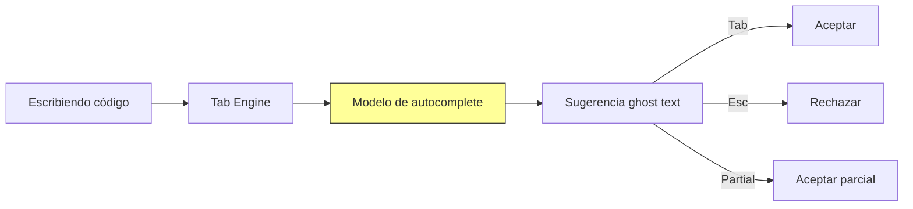
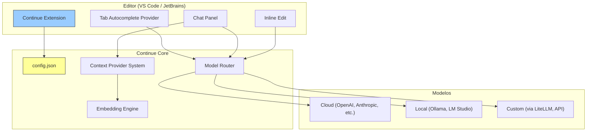

# Continue

> [!abstract] Resumen
> **Continue** es un asistente de código con IA ==open source== que funciona como extensión para VS Code y JetBrains. Su diferenciador principal es la ==flexibilidad radical==: soporta cualquier modelo (cloud o local), es altamente configurable, y no requiere un IDE específico. Ofrece autocompletado, chat contextual, y edición inline. Es la mejor opción para desarrolladores que quieren ==control total sobre sus herramientas de IA== sin sacrificar la comodidad de su editor favorito. Su debilidad es que requiere más configuración que [[cursor]] o [[windsurf]]. ^resumen

---

## Qué es Continue

Continue[^1] es un proyecto open source que nació de la frustración con la falta de flexibilidad de las herramientas cerradas de codificación con IA. En lugar de crear otro IDE fork de VS Code, los creadores de Continue decidieron ==construir una extensión== que trae las mejores capacidades de IA a los editores existentes.

> [!info] Filosofía: extensión, no IDE
> La decisión de ser una extensión (no un IDE completo como [[cursor]]) tiene ventajas e inconvenientes:
> - **Ventaja**: no necesitas cambiar de editor. Funciona en tu VS Code o JetBrains existente
> - **Ventaja**: actualizaciones del editor base no dependen de Continue
> - **Inconveniente**: ==no puede controlar aspectos profundos== del editor que un fork sí podría
> - **Inconveniente**: la experiencia de Tab completion es menos pulida que en Cursor

---

## Características principales

### Chat contextual

El chat de Continue entiende el contexto de tu proyecto mediante *context providers*:

| Context Provider | Descripción | Configuración |
|---|---|---|
| `@file` | ==Archivo específico== | Integrado |
| `@code` | Bloque de código seleccionado | Integrado |
| `@terminal` | Output del terminal | Integrado |
| `@docs` | Documentación indexada | Requiere setup |
| `@codebase` | Búsqueda semántica en el proyecto | Requiere embeddings |
| `@web` | Búsqueda web | Requiere API key |
| `@folder` | Contenido de carpeta | Integrado |
| `@diff` | ==Cambios git pendientes== | Integrado |
| `@issue` | Issues de GitHub/GitLab | Requiere token |

> [!tip] Context providers personalizados
> Una de las funcionalidades más poderosas de Continue es la capacidad de crear ==context providers personalizados==. Puedes crear un provider que lea de tu base de datos, API interna, sistema de documentación, o cualquier otra fuente de datos relevante para tu equipo.

### Autocompletado (Tab)

Continue ofrece autocompletado similar al de [[github-copilot]]:



Modelos recomendados para autocompletado:

| Modelo | Tipo | Latencia | Calidad | Coste |
|---|---|---|---|---|
| Codestral | Cloud (Mistral) | Baja | ==Excelente== | Gratis (API key) |
| StarCoder2 | ==Local (Ollama)== | Muy baja | Buena | $0 |
| DeepSeek Coder | Local/Cloud | Baja | Muy buena | Bajo |
| GPT-4o-mini | Cloud | Media | Buena | Bajo |
| Claude Haiku | Cloud | Media | Buena | Bajo |

> [!warning] Tab completion vs Cursor
> Siendo honestos: la Tab completion de Continue ==no iguala a la de [[cursor]]== en calidad y fluidez. Cursor ha invertido enormemente en optimizar esta experiencia con modelos propietarios. Continue compensa con flexibilidad de modelo y precio.

### Edición inline

Selecciona código, presiona `Cmd+I`, y describe los cambios:

> [!example]- Ejemplo de edición inline con Continue
> ```python
> # Seleccionas este código:
> def get_users(db):
>     return db.query("SELECT * FROM users")
>
> # Prompt: "añade paginación, filtro por rol, y manejo de errores"
>
> # Continue genera:
> from typing import Optional, List
> from dataclasses import dataclass
>
> @dataclass
> class PaginatedResult:
>     users: List[dict]
>     total: int
>     page: int
>     per_page: int
>
> def get_users(
>     db,
>     page: int = 1,
>     per_page: int = 20,
>     role: Optional[str] = None
> ) -> PaginatedResult:
>     """Obtiene usuarios con paginación y filtro opcional por rol."""
>     try:
>         query = "SELECT * FROM users"
>         count_query = "SELECT COUNT(*) FROM users"
>         params = []
>
>         if role:
>             query += " WHERE role = %s"
>             count_query += " WHERE role = %s"
>             params.append(role)
>
>         query += " LIMIT %s OFFSET %s"
>         params.extend([per_page, (page - 1) * per_page])
>
>         users = db.query(query, params)
>         total = db.query_one(count_query, params[:1] if role else [])[0]
>
>         return PaginatedResult(
>             users=users,
>             total=total,
>             page=page,
>             per_page=per_page
>         )
>     except Exception as e:
>         logger.error(f"Error fetching users: {e}")
>         raise DatabaseError(f"Failed to fetch users: {e}") from e
> ```

### Soporte para modelos locales

Continue se integra nativamente con [[ollama]], LM Studio, y otros providers locales:

> [!success] Sin enviar código al cloud
> Con modelos locales, tu código ==nunca sale de tu máquina==. Esto es ideal para:
> - Empresas con políticas estrictas de privacidad
> - Trabajo con código clasificado o sensible
> - Desarrollo offline (aviones, zonas sin internet)
> - Reducir costes a largo plazo (una vez tienes la GPU)

---

## Arquitectura



---

## Configuración

La configuración de Continue vive en `~/.continue/config.json` (o `.continue/config.json` en el proyecto):

> [!example]- Configuración completa de ejemplo
> ```json
> {
>   "models": [
>     {
>       "title": "Claude Sonnet (chat principal)",
>       "provider": "anthropic",
>       "model": "claude-3-5-sonnet-20241022",
>       "apiKey": "env:ANTHROPIC_API_KEY"
>     },
>     {
>       "title": "GPT-4o (alternativa)",
>       "provider": "openai",
>       "model": "gpt-4o",
>       "apiKey": "env:OPENAI_API_KEY"
>     },
>     {
>       "title": "Ollama Local (offline)",
>       "provider": "ollama",
>       "model": "deepseek-coder-v2:latest"
>     }
>   ],
>   "tabAutocompleteModel": {
>     "title": "Codestral (autocomplete)",
>     "provider": "mistral",
>     "model": "codestral-latest",
>     "apiKey": "env:MISTRAL_API_KEY"
>   },
>   "embeddingsProvider": {
>     "provider": "ollama",
>     "model": "nomic-embed-text"
>   },
>   "contextProviders": [
>     { "name": "code", "params": {} },
>     { "name": "docs", "params": {} },
>     { "name": "diff", "params": {} },
>     { "name": "terminal", "params": {} },
>     { "name": "codebase", "params": {} },
>     {
>       "name": "web",
>       "params": { "engine": "google" }
>     }
>   ],
>   "slashCommands": [
>     { "name": "edit", "description": "Editar código seleccionado" },
>     { "name": "comment", "description": "Añadir comentarios" },
>     { "name": "share", "description": "Compartir contexto" }
>   ],
>   "customCommands": [
>     {
>       "name": "test",
>       "prompt": "Genera tests unitarios para el código seleccionado usando pytest. Incluye edge cases.",
>       "description": "Generar tests"
>     }
>   ]
> }
> ```

---

## Pricing

> [!warning] Precios de junio 2025 — Continue es gratuito, pagas por modelos
> Continue en sí es ==100% gratuito y open source==. El coste depende de los modelos que uses.

| Configuración | Coste | Privacidad | Calidad |
|---|---|---|---|
| Continue + Ollama | ==$0== | ==Máxima (todo local)== | Buena |
| Continue + Codestral (gratis) | $0 | Media | Muy buena (autocomplete) |
| Continue + Claude Sonnet | Pay-per-use | Media | ==Excelente== |
| Continue + GPT-4o | Pay-per-use | Media | Excelente |
| Continue + Mixto | Variable | Configurable | Óptima |

> [!tip] La configuración más económica y poderosa
> 1. **Autocompletado**: Codestral (gratis) o StarCoder local
> 2. **Chat**: Claude Sonnet (pay-per-use)
> 3. **Embeddings**: nomic-embed-text local (via Ollama)
>
> Esto da una experiencia ==comparable a Cursor Pro por una fracción del coste==.

---

## Quick Start

> [!example]- Instalación rápida de Continue
> ### VS Code
> ```bash
> # Instalar extensión
> code --install-extension Continue.continue
>
> # O buscar "Continue" en el marketplace de VS Code
> ```
>
> ### JetBrains
> 1. Settings → Plugins → Marketplace
> 2. Buscar "Continue"
> 3. Install → Restart IDE
>
> ### Configuración mínima
> ```bash
> # 1. Instalar Ollama para modelos locales (opcional)
> curl -fsSL https://ollama.ai/install.sh | sh
> ollama pull codestral
> ollama pull nomic-embed-text
>
> # 2. Configurar API key (para modelos cloud)
> export ANTHROPIC_API_KEY="sk-ant-..."
> ```
>
> ### Primer uso
> 1. Abre VS Code con la extensión instalada
> 2. Panel lateral izquierdo → ícono de Continue
> 3. Selecciona un bloque de código
> 4. `Cmd+L` → el código se añade al chat
> 5. Escribe tu pregunta o instrucción
>
> ### Atajos
> | Atajo | Acción |
> |---|---|
> | `Cmd+L` | Añadir selección al chat |
> | `Cmd+I` | Edición inline |
> | `Tab` | Aceptar autocompletado |
> | `Cmd+Shift+L` | Añadir al chat y enfocar |

---

## Comparación con alternativas

| Aspecto | ==Continue== | [[cursor]] | [[github-copilot\|Copilot]] | [[windsurf]] |
|---|---|---|---|---|
| Tipo | ==Extensión== | IDE fork | Extensión | IDE fork |
| Open source | ==Sí== | No | No | No |
| Multi-modelo | ==Total== | Limitado | Limitado | Limitado |
| Modelos locales | ==Nativo== | Via API key | No | No |
| Personalización | ==Máxima== | Media | Baja | Media |
| Tab quality | Buena | ==Excelente== | Buena | Buena |
| Setup requerido | ==Medio-alto== | Mínimo | Mínimo | Mínimo |
| Precio tool | ==Gratis== | $20/mo | $10/mo | $10/mo |
| VS Code + JetBrains | ==Ambos== | Solo (fork) | Ambos | Solo (fork) |
| Context providers | ==Extensible== | Fijo | Fijo | Fijo |
| Custom commands | ==Sí== | No | No | No |

---

## Limitaciones honestas

> [!failure] Lo que Continue NO hace bien
> 1. **Requiere configuración**: a diferencia de [[cursor]] que funciona out-of-the-box, Continue ==necesita configuración manual== del modelo, API keys, embeddings, etc.
> 2. **Tab completion inferior**: siendo extensión, no puede igualar la ==optimización de Tab que logra [[cursor]]== como fork del editor
> 3. **Sin modo agente**: Continue no tiene un modo agente que ejecute comandos en terminal, busque archivos, y haga ediciones autónomas como [[claude-code]] o Cursor Agent
> 4. **Sin Composer/Cascade**: ==no tiene edición multi-archivo coordinada==. Es archivo por archivo
> 5. **Fragmentación de configuración**: la configuración entre `config.json`, variables de entorno, y settings del editor puede ser confusa
> 6. **Dependencia de extensión**: las actualizaciones del editor base (VS Code, JetBrains) pueden ==romper compatibilidad temporalmente==
> 7. **Sin indexación de codebase nativa**: necesitas configurar embeddings manualmente para `@codebase`
> 8. **Documentación mejorable**: buena pero dispersa entre GitHub, docs.continue.dev, y FAQs

> [!danger] No es para todos
> Si buscas una experiencia "instala y funciona" sin configuración, ==Continue no es para ti==. Está diseñado para desarrolladores que valoran el control y la personalización sobre la conveniencia. Si prefieres conveniencia, [[cursor]] o [[github-copilot]] son mejores opciones.

---

## Relación con el ecosistema

Continue representa el enfoque ==open source y descentralizado== para la IA en el desarrollo de software.

- **[[intake-overview]]**: Continue puede usar context providers personalizados para integrar documentación de requisitos generada por intake. Se podría crear un ==custom context provider== que lea especificaciones directamente.
- **[[architect-overview]]**: Continue y architect son complementarios. Continue para desarrollo interactivo en el IDE; architect para ejecución autónoma de tareas complejas. Ambos pueden usar [[litellm]] como backend de modelos, lo que permite ==consistencia en el modelo== usado.
- **[[vigil-overview]]**: Continue no incluye escaneo de seguridad. Sin embargo, su extensibilidad permite crear ==custom slash commands== que ejecuten vigil sobre el código modificado.
- **[[licit-overview]]**: como herramienta open source, Continue tiene ventajas para compliance: ==auditabilidad completa del código==, control sobre qué datos se envían a qué modelo, y la posibilidad de usar exclusivamente modelos locales para datos sensibles.

---

## Estado de mantenimiento

> [!success] Activamente mantenido — comunidad creciente
> - **Empresa**: Continue Dev, Inc.
> - **Licencia**: Apache 2.0
> - **GitHub stars**: 18K+ (junio 2025)
> - **Contribuidores**: 200+
> - **Cadencia**: releases semanales
> - **Financiación**: Seed round ($10M+, 2024)

---

## Enlaces y referencias

> [!quote]- Bibliografía y recursos
> - [^1]: Continue oficial — [continue.dev](https://continue.dev)
> - Documentación — [docs.continue.dev](https://docs.continue.dev)
> - GitHub — [github.com/continuedev/continue](https://github.com/continuedev/continue)
> - Discord — comunidad activa
> - "Continue vs Cursor: The Open Source Alternative" — blog posts, 2024-2025
> - [[ai-code-tools-comparison]] — comparación completa
> - [[ollama]] — para modelos locales con Continue

[^1]: Continue, extensión open source para VS Code y JetBrains. Disponible en [continue.dev](https://continue.dev).
