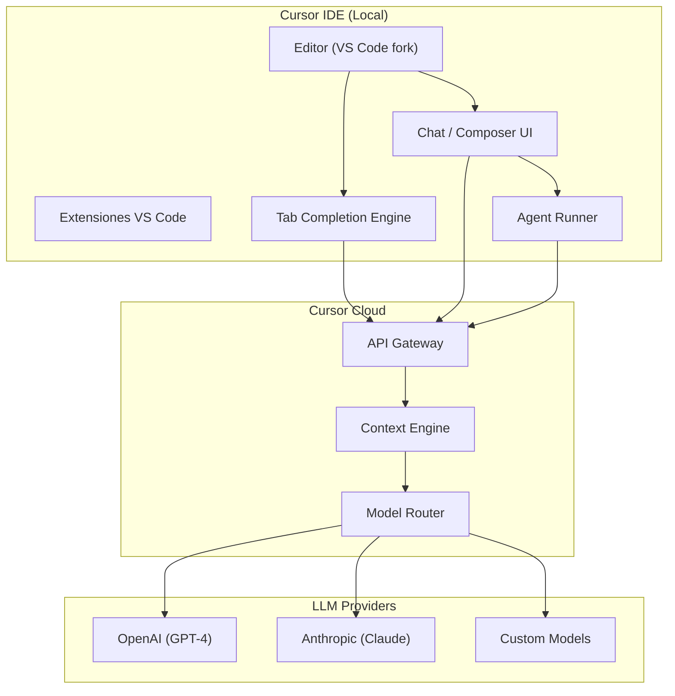
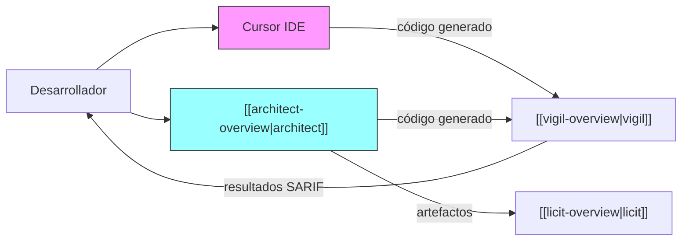

# Cursor IDE

> [!abstract] Resumen
> **Cursor** es un ==fork de VS Code== con integración nativa de IA que ha redefinido cómo los desarrolladores interactúan con modelos de lenguaje durante la codificación. Ofrece *Tab completion*, edición inline con Cmd+K, chat contextual, *Composer* para ediciones multi-archivo y un ==modo agente== que ejecuta tareas complejas de forma autónoma. Su principal ventaja es la experiencia fluida dentro del IDE; su principal desventaja es ser ==código cerrado con dependencia de la nube==. ^resumen

---

## Qué es Cursor

Cursor[^1] es un IDE desarrollado por Anysphere Inc. que tomó el código base de *Visual Studio Code* y le añadió capacidades de inteligencia artificial como ciudadano de primera clase. A diferencia de extensiones como [[github-copilot]] o [[continue-dev]], Cursor controla toda la experiencia del editor, lo que le permite ofrecer interacciones más profundas con el código.

> [!info] Origen y filosofía
> Cursor nació de la premisa de que los editores de código necesitaban ser rediseñados desde cero para la era de la IA. En lugar de añadir IA como una extensión, la integraron en el núcleo del editor. Esto les permite optimizar la experiencia de formas que las extensiones no pueden lograr.

El hecho de ser un fork de VS Code significa que:
- Todas las extensiones de VS Code funcionan en Cursor
- Los atajos de teclado son familiares
- La configuración de `settings.json` es compatible
- Los temas y fuentes se importan directamente

---

## Características principales

### Tab Completion

La *Tab completion* de Cursor va mucho más allá del autocompletado tradicional. Utiliza el contexto del archivo actual, archivos abiertos, y el historial reciente de ediciones para predecir ==no solo la siguiente línea, sino ediciones multi-línea completas==.

> [!tip] Consejo de productividad
> La Tab completion funciona mejor cuando acabas de hacer una edición repetitiva. Cursor detecta el patrón y sugiere aplicar la misma transformación en ubicaciones similares. Esto es especialmente útil para refactorizaciones manuales.

```
Ejemplo de flujo:
1. Editas manualmente una función para añadir un parámetro
2. Te mueves a la siguiente función similar
3. Tab sugiere la misma transformación adaptada al contexto
4. Presionas Tab para aceptar
```

### Cmd+K — Edición Inline

*Cmd+K* (o *Ctrl+K* en Linux/Windows) permite dar instrucciones en lenguaje natural para editar el código seleccionado o generar código nuevo en la posición del cursor.

> [!example]- Ejemplo de uso de Cmd+K
> ```python
> # Seleccionas esta función:
> def calcular_total(items):
>     total = 0
>     for item in items:
>         total += item.precio
>     return total
>
> # Escribes en Cmd+K: "añadir descuento porcentual opcional y manejo de items vacíos"
>
> # Cursor genera:
> def calcular_total(items: list, descuento: float = 0.0) -> float:
>     """Calcula el total de una lista de items con descuento opcional.
>
>     Args:
>         items: Lista de items con atributo precio.
>         descuento: Porcentaje de descuento (0-100).
>
>     Returns:
>         Total calculado con descuento aplicado.
>
>     Raises:
>         ValueError: Si el descuento está fuera de rango.
>     """
>     if not items:
>         return 0.0
>
>     if not 0 <= descuento <= 100:
>         raise ValueError(f"Descuento debe estar entre 0 y 100, recibido: {descuento}")
>
>     total = sum(item.precio for item in items)
>     return total * (1 - descuento / 100)
> ```

### Chat contextual

El chat de Cursor tiene acceso al contexto completo del proyecto. Puedes referenciar archivos con `@archivo`, símbolos con `@símbolo`, documentación con `@docs`, y la web con `@web`.

| Referencia | Sintaxis | Uso |
|---|---|---|
| Archivo | `@filename.py` | ==Incluir archivo completo== en contexto |
| Símbolo | `@functionName` | Referenciar función/clase específica |
| Carpeta | `@src/` | Incluir estructura de carpeta |
| Docs | `@docs` | Buscar en documentación indexada |
| Web | `@web` | Buscar información actualizada |
| Git | `@git` | ==Historial de cambios== |
| Codebase | `@codebase` | Búsqueda semántica en todo el proyecto |

### Composer — Ediciones multi-archivo

*Composer* es la funcionalidad que distingue a Cursor de la mayoría de alternativas. Permite hacer ==ediciones coordinadas en múltiples archivos== simultáneamente, mostrando un diff unificado que puedes aceptar o rechazar por fragmentos.

> [!tip] Cuándo usar Composer vs Chat
> - **Chat**: preguntas, exploración, entender código existente
> - **Composer**: cuando necesitas que Cursor ==escriba o modifique código== en uno o más archivos
> - **Cmd+K**: ediciones rápidas en un solo lugar del archivo actual

### Modo Agente

El modo agente de Cursor (disponible desde 2025) permite que el modelo:
1. Analice el problema
2. Busque en el codebase
3. Edite múltiples archivos
4. Ejecute comandos en terminal
5. Itere basándose en errores

> [!warning] Limitaciones del modo agente
> El modo agente de Cursor es potente pero tiene limitaciones importantes:
> - No tiene persistencia de estado entre sesiones
> - No maneja flujos complejos de CI/CD
> - No tiene concepto de "pipeline" como [[architect-overview]]
> - La ejecución en terminal es limitada comparada con [[claude-code]]
> - ==No puede trabajar en worktrees== separados

---

## Arquitectura



> [!info] Modelo de contexto
> Cursor utiliza un *context engine* en la nube que indexa tu codebase y construye embeddings para búsqueda semántica. Esto permite que `@codebase` funcione eficientemente incluso en proyectos grandes. Los embeddings se recalculan incrementalmente cuando los archivos cambian.

---

## Modelos disponibles

Cursor soporta múltiples modelos de lenguaje:

| Modelo | Proveedor | Uso principal | Disponibilidad |
|---|---|---|---|
| GPT-4o | OpenAI | Chat, Composer | ==Todos los planes== |
| GPT-4 Turbo | OpenAI | Chat complejo | Pro+ |
| Claude 3.5 Sonnet | Anthropic | ==Mejor para código== | Pro+ |
| Claude 3 Opus | Anthropic | Razonamiento complejo | Pro+ |
| cursor-small | Cursor | Tab completion | Todos los planes |
| Modelos custom | Varios | Via API key propia | Todos los planes |

> [!question] Puedo usar mis propias API keys?
> Sí. Cursor permite configurar API keys propias de OpenAI, Anthropic, Google y Azure. Esto es útil si ya tienes créditos o necesitas control sobre qué modelo se usa. Sin embargo, las ==optimizaciones de Tab completion dependen de los modelos propios de Cursor==.

---

## Pricing

> [!warning] Precios verificados en junio 2025 — pueden cambiar
> Los precios de herramientas de IA cambian con frecuencia. Verifica siempre en [cursor.com/pricing](https://cursor.com/pricing).

| Plan | Precio | Tab completions | Solicitudes premium | Solicitudes lentas |
|---|---|---|---|---|
| **Hobby** | Gratis | 2,000/mes | 50/mes | Ilimitadas |
| **Pro** | ==$20/mes== | Ilimitadas | 500/mes | Ilimitadas |
| **Business** | $40/mes | Ilimitadas | 500/mes | Ilimitadas |

El plan *Business* añade:
- Administración centralizada de equipo
- *Privacy mode* forzado (no se entrenan modelos con tu código)
- SSO / SAML
- Facturación centralizada

---

## Quick Start

> [!example]- Guía rápida de instalación y configuración
> ### Instalación
> ```bash
> # macOS
> brew install --cask cursor
>
> # Linux (AppImage)
> wget https://download.cursor.com/linux/appImage/x64 -O cursor.AppImage
> chmod +x cursor.AppImage
> ./cursor.AppImage
>
> # Windows
> # Descargar desde cursor.com
> ```
>
> ### Importar configuración de VS Code
> 1. Abre Cursor
> 2. `Cmd+Shift+P` → "Import VS Code Settings"
> 3. Selecciona extensiones, temas, keybindings y settings
>
> ### Configurar modelo preferido
> 1. `Cmd+Shift+P` → "Cursor Settings"
> 2. En "Models", selecciona tu modelo preferido
> 3. Opcionalmente, añade API keys propias
>
> ### Primer uso del Chat
> 1. `Cmd+L` para abrir el chat
> 2. Escribe: "Explica qué hace este proyecto"
> 3. Usa `@codebase` para dar contexto completo
>
> ### Primer uso de Composer
> 1. `Cmd+I` para abrir Composer
> 2. Describe los cambios que necesitas
> 3. Revisa el diff generado
> 4. Acepta o rechaza por fragmentos
>
> ### Atajos esenciales
> | Atajo | Acción |
> |---|---|
> | `Tab` | Aceptar sugerencia de autocompletado |
> | `Cmd+K` | Edición inline con IA |
> | `Cmd+L` | Abrir chat |
> | `Cmd+I` | Abrir Composer |
> | `Cmd+Shift+I` | Modo agente |
> | `Escape` | Rechazar sugerencia |

---

## Comparación con alternativas

| Característica | ==Cursor== | [[windsurf]] | [[github-copilot\|Copilot]] |
|---|---|---|---|
| Base | VS Code fork | VS Code fork | Extensión |
| Tab completion | Excelente | Buena | Buena |
| Edición multi-archivo | ==Composer== | Cascade | Copilot Workspace |
| Modo agente | Sí | Sí | Sí (preview) |
| Modelos | GPT-4, Claude, custom | Modelos propios | GPT-4, Claude |
| Precio Pro | $20/mo | $10/mo | $10/mo |
| Open source | ==No== | No | No |
| Extensiones VS Code | Completas | Completas | N/A (es extensión) |
| Indexación codebase | Sí | Sí | Limitada |
| Privacy mode | Business plan | Sí | Enterprise |

> [!tip] Cuándo elegir Cursor
> Cursor es la mejor opción cuando:
> - Quieres la ==mejor experiencia de Tab completion== disponible
> - Necesitas ediciones multi-archivo coordinadas frecuentemente
> - Ya usas VS Code y quieres una transición suave
> - El presupuesto de $20/mo es aceptable
>
> No es la mejor opción cuando:
> - Necesitas control total sobre los modelos y la infraestructura
> - Trabajas en un entorno sin internet
> - Requieres reproducibilidad de los resultados (ver [[architect-overview]])

---

## Limitaciones honestas

> [!failure] Lo que Cursor NO hace bien
> 1. **Código cerrado**: no puedes auditar qué datos se envían a la nube. Aunque tienen *Privacy mode*, ==requieres confiar en su implementación==
> 2. **Dependencia de la nube**: sin conexión a internet, pierdes todas las funcionalidades de IA. Solo queda un VS Code básico
> 3. **Coste impredecible**: los "slow requests" ilimitados suenan bien hasta que esperas 30-60 segundos por cada respuesta en horas punta
> 4. **Sin pipelines**: no puedes definir flujos de trabajo reproducibles como en [[architect-overview]]
> 5. **Contexto limitado**: aunque @codebase es potente, en proyectos muy grandes (>100K archivos) la indexación puede ser lenta o incompleta
> 6. **Vendor lock-in**: tu flujo de trabajo depende completamente de Anysphere Inc.
> 7. **No hay API**: no puedes integrar Cursor en pipelines de CI/CD
> 8. **Actualizaciones forzadas**: al ser un producto cloud-first, las actualizaciones pueden cambiar comportamiento sin previo aviso

> [!danger] Consideraciones de privacidad
> Por defecto, Cursor ==puede usar tu código para mejorar sus modelos==. Esto se desactiva con Privacy Mode (activado por defecto en Business). Si trabajas con código propietario sensible, asegúrate de:
> 1. Activar Privacy Mode en la configuración
> 2. Verificar que tu organización permite el uso de IDEs cloud-connected
> 3. Revisar los ToS actualizados periódicamente

---

## Relación con el ecosistema

Cursor se posiciona como el ==punto de entrada== más accesible para desarrolladores que quieren usar IA en su flujo de trabajo diario.

- **[[intake-overview]]**: Cursor puede usarse durante la fase de captura de requisitos para explorar código existente y entender la arquitectura actual. Sin embargo, ==no tiene un flujo estructurado== para convertir requisitos en especificaciones como intake.
- **[[architect-overview]]**: Cursor y architect son complementarios, no competidores directos. Cursor es un IDE interactivo; architect es un agente autónomo con pipelines, [[litellm]] para 100+ proveedores, *Ralph Loop* para iteración, y worktrees para aislamiento. Un desarrollador podría usar Cursor para exploración y architect para ejecución de tareas complejas.
- **[[vigil-overview]]**: Cursor no incluye escaneo de seguridad determinista. El código generado por Cursor debería pasar por vigil u otro escáner antes de merge. Cursor genera código que ==puede contener vulnerabilidades== sin advertencia.
- **[[licit-overview]]**: Cursor no tiene funcionalidad de compliance. Para proyectos que requieren cumplimiento del *EU AI Act* u otras regulaciones, licit proporciona el marco necesario que Cursor no ofrece.



---

## Estado de mantenimiento

> [!success] Activamente mantenido
> - **Empresa**: Anysphere Inc.
> - **Financiación**: Serie B ($400M+ en 2025)[^2]
> - **Equipo**: ~50 ingenieros (estimado)
> - **Cadencia de releases**: semanal o bisemanal
> - **Última versión verificada**: 0.45.x (junio 2025)

---

## Enlaces y referencias

> [!quote]- Bibliografía y recursos
> - [^1]: Cursor oficial — [cursor.com](https://cursor.com)
> - [^2]: Anysphere funding — Crunchbase, 2025
> - Documentación oficial — [docs.cursor.com](https://docs.cursor.com)
> - Cursor Changelog — [cursor.com/changelog](https://cursor.com/changelog)
> - "The AI IDE Wars" — análisis comparativo, The Pragmatic Engineer, 2025
> - [[ai-code-tools-comparison]] — comparación detallada con todas las alternativas
> - r/cursor — subreddit con experiencias reales de usuarios

[^1]: Cursor, desarrollado por Anysphere Inc. Disponible en [cursor.com](https://cursor.com).
[^2]: Datos de financiación de Crunchbase, verificados en junio 2025.
