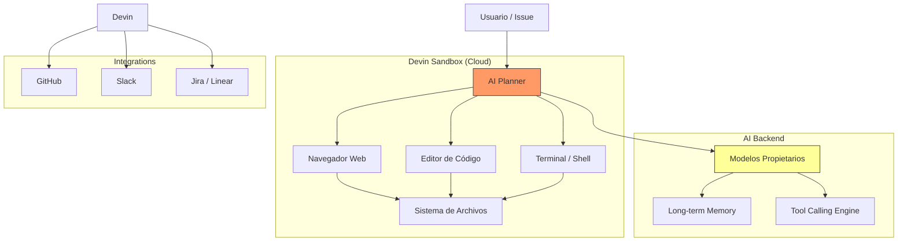

# Devin (Cognition AI)

> [!abstract] Resumen
> **Devin** es un "ingeniero de software autónomo" desarrollado por Cognition AI que opera en un ==sandbox completo con navegador, editor y terminal==. Fue el primer producto en intentar automatizar el ciclo completo de desarrollo: desde un issue hasta un PR listo para merge. La realidad es más matizada que el marketing: su rendimiento en ==SWE-bench es notable pero sus resultados en producción real son inconsistentes==. Es caro, orientado a enterprise, y representa el extremo del espectro de autonomía en herramientas de codificación con IA. ^resumen

---

## Qué es Devin

Devin[^1] fue presentado por Cognition AI en marzo de 2024 con un demo viral que mostraba a una IA completando tareas de desarrollo de forma completamente autónoma. Se posicionó como el ==primer "AI software engineer"==, un agente capaz de:

1. Recibir una tarea en lenguaje natural
2. Planificar la implementación
3. Escribir código
4. Depurar errores
5. Ejecutar tests
6. Crear un Pull Request

> [!info] El hype y la realidad
> Devin generó un nivel de expectativa sin precedentes en la industria. El demo original mostró capacidades impresionantes. Sin embargo, análisis posteriores revelaron que ==muchos de los demos estaban cuidadosamente curados==, y el rendimiento real en tareas diversas es significativamente menos consistente[^2].

---

## Arquitectura

Lo que distingue a Devin arquitecturalmente es que opera en un ==entorno sandbox completo==:



> [!tip] ¿Por qué un sandbox?
> El sandbox resuelve un problema fundamental: ==seguridad==. Dar a una IA acceso directo al sistema del desarrollador es arriesgado. Devin ejecuta todo en un entorno aislado en la nube, lo que significa que:
> - No puede dañar tu máquina local
> - Tiene un entorno controlado y reproducible
> - Puede acceder a internet para documentación
> - Los errores están contenidos

El sandbox incluye:
- **Navegador**: para buscar documentación, leer APIs, entender librerías
- **Editor**: para escribir y modificar código con syntax highlighting
- **Terminal**: para ejecutar comandos, instalar dependencias, correr tests
- **Planificador**: el "cerebro" que coordina todas las acciones

---

## SWE-bench: rendimiento real

*SWE-bench*[^3] es un benchmark que evalúa la capacidad de agentes de IA para resolver issues reales de repositorios open source.

| Agente | SWE-bench Lite (%) | SWE-bench Full (%) | Fecha |
|---|---|---|---|
| Devin (original) | ==13.86== | — | Mar 2024 |
| Devin (mejorado) | ~20 | — | Jun 2025 |
| [[claude-code]] (Opus) | ~30 | ~20 | Jun 2025 |
| [[architect-overview\|architect]] | Similar a Claude Code | — | Jun 2025 |
| [[aider]] (Opus) | ~26 | ~18 | Jun 2025 |
| OpenAI Codex | ~25 | — | Jun 2025 |

> [!warning] Interpretar benchmarks con cautela
> SWE-bench tiene limitaciones importantes:
> - Los issues son de ==repositorios open source populares== — no representan todo tipo de desarrollo
> - La métrica es binaria (resuelto o no) — no mide ==calidad del código==
> - Los agentes pueden "hacer trampa" parcialmente (e.g., escribir tests que pasen sin resolver el issue)
> - El rendimiento en SWE-bench ==no predice directamente el rendimiento en tu codebase==

---

## Flujo de trabajo

> [!example]- Ejemplo completo de uso de Devin
> ```
> Escenario: Migrar una API de Express a Fastify
>
> 1. ASIGNACIÓN
>    - Asignas un issue de Linear/Jira/GitHub a Devin
>    - O le das la instrucción directamente vía Slack/interfaz web
>
> 2. PLANIFICACIÓN
>    Devin analiza el repositorio y genera un plan:
>    - "Voy a migrar las rutas de Express a Fastify"
>    - "Necesito actualizar: server.js, routes/, middleware/, tests/"
>    - "Dependencias a cambiar: express → fastify, body-parser → @fastify/formbody"
>    - Presenta el plan para aprobación
>
> 3. EJECUCIÓN
>    Devin trabaja en su sandbox:
>    a. Clona el repo
>    b. Crea un branch: devin/migrate-express-to-fastify
>    c. Lee todos los archivos relevantes
>    d. Instala Fastify: npm install fastify
>    e. Reescribe server.js para usar Fastify
>    f. Migra cada ruta adaptando la sintaxis
>    g. Actualiza middleware para plugin system de Fastify
>    h. Ejecuta tests: npm test
>    i. Tests fallan → lee errores → corrige → re-ejecuta
>    j. Repite hasta que tests pasen
>
> 4. ENTREGA
>    - Push al branch
>    - Crea Pull Request con descripción detallada
>    - Notifica vía Slack
>
> 5. REVISIÓN HUMANA
>    - El desarrollador revisa el PR
>    - Puede pedir cambios a Devin vía comentarios
>    - Devin itera hasta aprobación
> ```

---

## Opiniones reales de usuarios

> [!question] ¿Qué dicen los usuarios reales?
> Recopilación de experiencias publicadas en foros, blogs y redes sociales (2024-2025):

**Positivas:**
- "Para tareas bien definidas y de complejidad media, Devin funciona sorprendentemente bien"
- "La integración con Slack permite asignar tareas como si fuera un junior developer"
- "Para migraciones y refactorizaciones mecánicas, ahorra horas"

**Negativas:**
- "En tareas complejas que requieren entender el dominio del negocio, ==falla frecuentemente=="
- "A veces entra en bucles infinitos intentando resolver un error"
- "El coste es prohibitivo para la calidad que entrega"
- "Los PRs requieren ==revisión exhaustiva== — no puedes confiar ciegamente"
- "Para mi equipo de 5 personas, $500/mes no justifica los resultados"

> [!danger] No confiar ciegamente
> Devin, como todo agente de codificación, puede generar código que:
> - ==Compila y pasa tests pero tiene bugs lógicos==
> - Introduce vulnerabilidades de seguridad (sin [[vigil-overview]])
> - Usa patrones no idiomáticos que dificultan mantenimiento
> - Resuelve el síntoma pero no la causa raíz
>
> **SIEMPRE** se necesita revisión humana del código generado.

---

## Pricing

> [!warning] Precios verificados en junio 2025 — Devin tiene modelo enterprise
> Consulta [cognition.ai](https://cognition.ai) para información actualizada.

| Plan | Precio | Incluye |
|---|---|---|
| **Team** | ==$500/mes== | ACUs (Agent Compute Units) limitados |
| **Enterprise** | Custom | ACUs escalados, SSO, soporte dedicado |

> [!info] ¿Qué son ACUs?
> Devin cobra por *Agent Compute Units* (ACUs), que representan tiempo de computación en el sandbox. Una tarea simple puede consumir 1-2 ACUs; una compleja puede consumir 10+. Los planes incluyen un número limitado de ACUs mensuales.

Comparación de coste por tarea (estimación):

| Tarea | Devin | [[claude-code]] | [[aider]] | [[architect-overview\|architect]] |
|---|---|---|---|---|
| Bug fix simple | ~$5 | ~$0.50 | ~$0.30 | ~$0.50 |
| Feature mediana | ~$15 | ~$3 | ~$2 | ~$3 |
| Refactoring complejo | ~$40 | ==~$15== | ~$10 | ~$15 |
| Migración grande | ~$80 | ~$25 | ~$15 | ==~$25 + reproducible== |

---

## Comparación con alternativas

| Aspecto | ==Devin== | [[claude-code]] | [[architect-overview\|architect]] | [[codex-openai\|Codex]] |
|---|---|---|---|---|
| Autonomía | ==Máxima== | Alta | Alta + Pipeline | Alta |
| Entorno | Sandbox cloud | Local terminal | Local + worktree | Cloud sandbox |
| Modelo | Propietario | Claude | ==Cualquiera== | GPT-4o |
| Integración | Slack, Jira | MCP | CI/CD, git | GitHub |
| Precio | ==$500+/mo== | Pay per use | Pay per use | Pay per use |
| Open source | No | No | ==Sí== | No |
| Navegador web | ==Sí== | Via MCP | No | Sí |
| Reproducibilidad | No | No | ==YAML pipelines== | No |
| SWE-bench | ~20% | ==~30%== | Similar | ~25% |

---

## Limitaciones honestas

> [!failure] Lo que Devin NO hace bien
> 1. **Coste prohibitivo**: a ==$500+/mes==, el ROI es cuestionable para la mayoría de equipos. Un developer junior cuesta más, pero produce trabajo más consistente
> 2. **Autonomía imperfecta**: la promesa de "asígnale un issue y te entrega un PR" funciona para tareas simples, pero ==falla frecuentemente en tareas complejas==
> 3. **Loops infinitos**: Devin puede entrar en ==ciclos de intento-error== que consumen ACUs sin resolver el problema
> 4. **Sin control del modelo**: no puedes elegir qué modelo usa. Los modelos propietarios de Cognition no siempre son los mejores disponibles
> 5. **Latencia**: como todo se ejecuta en un sandbox remoto, hay ==latencia significativa==. Una tarea que un desarrollador haría en 30 minutos puede tomar 2-3 horas en Devin
> 6. **Opacidad**: es difícil entender ==por qué Devin tomó ciertas decisiones==. La sesión es observable pero no siempre comprensible
> 7. **Vendor lock-in extremo**: toda la infraestructura y modelos son propietarios
> 8. **Sin ejecución local**: todo se ejecuta en la nube de Cognition. Para proyectos con requisitos de privacidad, esto es un ==bloqueante==

> [!warning] El "junior developer" que no aprende
> Devin se compara frecuentemente con un junior developer. Pero hay una diferencia fundamental: un junior developer ==aprende y mejora con el tiempo==. Devin comete los mismos tipos de errores consistentemente. No tiene memoria a largo plazo efectiva ni capacidad de aprendizaje del dominio de tu negocio.

---

## Relación con el ecosistema

Devin representa el extremo del espectro de autonomía, lo cual tiene implicaciones para el ecosistema.

- **[[intake-overview]]**: Devin puede consumir especificaciones generadas por intake, pero ==no tiene integración directa==. La traducción de specs a tareas de Devin es manual y propenso a ambigüedades.
- **[[architect-overview]]**: architect es una alternativa más pragmática y económica. No intenta ser completamente autónomo sino que ofrece ==pipelines reproducibles con control humano==. Donde Devin cobra $500/mes por resultados inconsistentes, architect usa [[litellm]] para cualquier modelo con tracking de costes.
- **[[vigil-overview]]**: Devin ==no incluye escaneo de seguridad determinista==. Los PRs de Devin necesitan pasar por vigil u otro escáner antes de merge. Esto es crítico porque código autónomo tiende a introducir más vulnerabilidades que código con supervisión humana.
- **[[licit-overview]]**: el uso de Devin plantea preguntas interesantes para compliance: ¿quién es responsable del código generado por un agente autónomo? licit puede ayudar a ==documentar y rastrear la procedencia== del código para regulaciones como el EU AI Act.

---

## ¿Para quién es Devin?

> [!success] Casos donde Devin puede aportar valor
> - Equipos enterprise con presupuesto holgado y muchas tareas mecánicas
> - Organizaciones que necesitan escalar desarrollo sin contratar
> - Tareas de migración/refactoring bien definidas y repetitivas
> - Como complemento (no reemplazo) de desarrolladores humanos

> [!tip] Recomendación pragmática
> Antes de invertir en Devin, prueba [[claude-code]] o [[aider]] para tareas similares. Si el 80% de tus tareas se resuelven con estas herramientas ==a una fracción del coste==, Devin probablemente no justifica la inversión. Si necesitas la autonomía completa del sandbox con navegador para el 20% restante, entonces evalúa Devin para esos casos específicos.

---

## Estado de mantenimiento

> [!success] Activamente desarrollado — startup bien financiada
> - **Empresa**: Cognition AI
> - **Financiación**: $175M+ (Serie A, 2024)[^4]
> - **Valoración**: $2B (2024)
> - **Equipo**: ~30 ingenieros (estimado)
> - **Estado**: producto en evolución activa, con mejoras frecuentes

---

## Enlaces y referencias

> [!quote]- Bibliografía y recursos
> - [^1]: Devin oficial — [cognition.ai](https://cognition.ai)
> - [^2]: "Is Devin Legit?" — análisis independiente, varios autores, 2024
> - [^3]: SWE-bench — [swe-bench.github.io](https://swe-bench.github.io)
> - [^4]: Cognition AI funding — TechCrunch, 2024
> - "Devin: 6 Months Later" — compilación de experiencias de usuarios
> - [[ai-code-tools-comparison]] — comparación completa de herramientas
> - [[claude-code]] — alternativa directa más económica

[^1]: Devin, lanzado por Cognition AI en marzo 2024.
[^2]: Múltiples análisis independientes del demo original de Devin revelaron discrepancias, 2024.
[^3]: SWE-bench: benchmark para evaluar agentes de codificación en issues reales.
[^4]: Financiación de Cognition AI reportada por TechCrunch, 2024.
