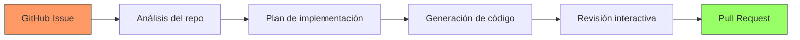

# GitHub Copilot

> [!abstract] Resumen
> **GitHub Copilot** es el asistente de codificación con IA más ampliamente adoptado del mundo, evolucionando desde un ==simple autocompletado== (2021) hasta un ==agente de codificación autónomo== (2025). Su integración profunda con el ecosistema GitHub (Issues, PRs, Actions, Codespaces) le da una ventaja única. Soporta VS Code, JetBrains, Neovim y la CLI de GitHub. Su principal limitación es la ==falta de personalización== comparado con herramientas más flexibles como [[aider]] o [[architect-overview]]. ^resumen

---

## Evolución de GitHub Copilot

GitHub Copilot ha pasado por varias generaciones desde su lanzamiento[^1]:

| Generación | Año | Capacidad | Modelo |
|---|---|---|---|
| Copilot v1 | 2021 | Autocompletado en línea | Codex |
| Copilot Chat | 2023 | Chat contextual en IDE | ==GPT-4== |
| Copilot Workspace | 2024 | Planificación y edición multi-archivo | GPT-4 Turbo |
| Copilot Agent | 2025 | ==Ejecución autónoma de tareas== | GPT-4o + Claude |
| Copilot Extensions | 2025 | Extensibilidad via terceros | Múltiples |

> [!info] El efecto GitHub
> La ventaja competitiva más grande de Copilot no es técnica sino de distribución. ==GitHub tiene 100M+ desarrolladores==. Copilot está integrado en el lugar donde los desarrolladores ya trabajan: repositorios, issues, pull requests, y CI/CD. Ningún competidor tiene esta distribución.

---

## Características principales

### Autocompletado (Ghost Text)

La funcionalidad original de Copilot: sugerencias de código en línea que aparecen como texto fantasma mientras escribes.

> [!tip] Maximizar la calidad del autocompletado
> - Escribe ==comentarios descriptivos== antes del código — Copilot los usa como contexto
> - Nombra funciones y variables de forma clara
> - Mantén abiertos los archivos relacionados en el editor
> - Las primeras líneas de un archivo influyen fuertemente en las sugerencias

### Copilot Chat

Chat integrado en el IDE que entiende:
- El archivo actual y la selección
- Los archivos abiertos
- La estructura del proyecto (con workspace indexing)
- El historial de la conversación

Los comandos slash aceleran tareas comunes:

| Comando | Función |
|---|---|
| `/explain` | ==Explica el código seleccionado== |
| `/fix` | Sugiere correcciones para errores |
| `/tests` | Genera tests unitarios |
| `/doc` | Genera documentación |
| `/optimize` | Sugiere optimizaciones |
| `/new` | Scaffold de nuevo proyecto |

### Copilot Workspace

*Copilot Workspace*[^2] es la evolución hacia un ==entorno de planificación y ejecución==:

1. Parte de un *Issue* de GitHub
2. Analiza el repositorio completo
3. Genera un plan de implementación
4. Crea los cambios necesarios
5. Permite revisión y edición interactiva
6. Genera el Pull Request



> [!warning] Estado de Copilot Workspace
> En junio 2025, Workspace sigue en ==Technical Preview==. La calidad es variable — funciona bien para cambios simples y moderados, pero puede generar planes incorrectos para cambios arquitecturales complejos. No es un reemplazo para [[architect-overview]] en tareas que requieren iteración profunda.

### Copilot Agent Mode

El modo agente (introducido en 2025) permite que Copilot:

- Ejecute comandos en terminal
- Itere basándose en errores de compilación/tests
- Haga ediciones multi-archivo autónomas
- Instale dependencias

> [!example]- Ejemplo de Agent Mode en acción
> ```
> Prompt: "Migra los tests de Jest a Vitest"
>
> Agent ejecuta:
> 1. Lee package.json → identifica dependencias de Jest
> 2. Lee jest.config.ts → entiende configuración actual
> 3. Lee tests existentes → cataloga patrones usados
> 4. Instala vitest y dependencias: npm install -D vitest @vitest/coverage-v8
> 5. Crea vitest.config.ts basándose en jest.config.ts
> 6. Modifica test files:
>    - jest.fn() → vi.fn()
>    - jest.mock() → vi.mock()
>    - describe/it/expect se mantienen (compatibles)
>    - beforeEach/afterEach se mantienen
> 7. Actualiza package.json scripts
> 8. Ejecuta: npx vitest run
> 9. Si hay errores → lee output → corrige → re-ejecuta
> 10. Muestra resumen de cambios realizados
> ```

### Copilot Extensions

Las *Extensions* permiten que terceros integren sus herramientas en el chat de Copilot:

- **@docker** — ayuda con Dockerfiles y composición
- **@azure** — deployment y configuración de Azure
- **@sentry** — análisis de errores en producción
- **Extensiones custom** — cualquier organización puede crear las suyas

> [!info] Extensiones como plataforma
> La estrategia de Extensions es convertir a Copilot en una ==plataforma==, no solo una herramienta. Esto es similar a cómo VS Code se convirtió en plataforma vía su marketplace. Si tiene éxito, podría crear un ecosistema difícil de replicar por competidores.

---

## Integraciones

### VS Code

La integración principal y más completa. Incluye:
- Ghost text (autocompletado)
- Chat panel y chat inline
- Agent mode
- Terminal integration

### JetBrains

Soporte para IntelliJ, PyCharm, WebStorm, etc.:
- Ghost text
- Chat (funcionalidad reducida vs VS Code)
- Sin agent mode completo (en junio 2025)

### Neovim

Via plugin oficial:
- Ghost text
- Chat limitado
- Configuración vía Lua

### CLI de GitHub

```bash
# Instalar la extensión Copilot para gh CLI
gh extension install github/gh-copilot

# Uso
gh copilot explain "git rebase --onto main feature~3 feature"
gh copilot suggest "find all Python files modified in the last week"
```

---

## Pricing

> [!warning] Precios verificados en junio 2025 — pueden cambiar
> Consulta [github.com/features/copilot](https://github.com/features/copilot) para información actualizada.

| Plan | Precio | Modelos | Funcionalidades |
|---|---|---|---|
| **Free** | $0 | Limitado | 2,000 completions/mes, 50 chats/mes |
| **Individual** | ==$10/mes== | GPT-4o, Claude | Ilimitado (fair use) |
| **Business** | $19/mes | GPT-4o, Claude | + Gestión org + ==excluir archivos== |
| **Enterprise** | ==$39/mes== | Todos | + Fine-tuning + knowledge bases |

> [!question] Vale la pena Enterprise?
> El plan Enterprise añade *knowledge bases* (indexa documentación interna) y *fine-tuning* (adapta el modelo a tu codebase). Para organizaciones grandes con codebases propietarios extensos, ==puede justificarse==. Para equipos pequeños, Business suele ser suficiente.

---

## Quick Start

> [!example]- Configuración rápida de Copilot
> ### Prerrequisitos
> - Cuenta de GitHub
> - Suscripción a Copilot (o free tier)
> - VS Code, JetBrains IDE, o Neovim
>
> ### VS Code
> ```bash
> # 1. Instalar extensión
> code --install-extension GitHub.copilot
> code --install-extension GitHub.copilot-chat
>
> # 2. Autenticar
> # Abre VS Code → Cmd+Shift+P → "GitHub Copilot: Sign In"
> # Sigue el flujo OAuth
> ```
>
> ### Neovim (con lazy.nvim)
> ```lua
> -- en tu configuración de plugins
> {
>   "zbirenbaum/copilot.lua",
>   cmd = "Copilot",
>   event = "InsertEnter",
>   config = function()
>     require("copilot").setup({
>       suggestion = { enabled = true, auto_trigger = true },
>       panel = { enabled = true },
>     })
>   end,
> }
> ```
>
> ### Configuración recomendada (VS Code settings.json)
> ```json
> {
>   "github.copilot.enable": {
>     "*": true,
>     "markdown": true,
>     "yaml": true
>   },
>   "github.copilot.advanced": {
>     "length": 500,
>     "temperature": ""
>   }
> }
> ```
>
> ### Verificar funcionamiento
> 1. Abre un archivo de código
> 2. Empieza a escribir un comentario: `// Función que calcula...`
> 3. Deberías ver sugerencias ghost text
> 4. `Tab` para aceptar, `Esc` para rechazar
> 5. `Cmd+I` para chat inline
> 6. `Cmd+Shift+I` para agent mode (VS Code)

---

## Comparación con alternativas

| Característica | ==GitHub Copilot== | [[cursor]] | [[claude-code]] | [[architect-overview\|architect]] |
|---|---|---|---|---|
| Tipo | Extensión | IDE | CLI | CLI + Pipeline |
| Autocompletado | Bueno | ==Excelente== | N/A | N/A |
| Chat | Bueno | Muy bueno | ==Excelente== | Excelente |
| Multi-archivo | Workspace | Composer | Sí | ==Sí + Worktrees== |
| Agent mode | Sí (nuevo) | Sí | ==Nativo== | Nativo + Ralph Loop |
| GitHub integration | ==Nativa== | Ninguna | Via git | Via git |
| Precio base | $10/mo | $20/mo | API usage | API usage |
| Open source | No | No | No | ==Sí== |
| Modelos custom | Enterprise | Sí | N/A (Claude) | ==Sí (LiteLLM)== |
| CI/CD | ==Actions== | No | No | Sí |

---

## Limitaciones honestas

> [!failure] Debilidades de Copilot
> 1. **Personalización limitada**: no puedes ==elegir libremente qué modelo usar== en todos los planes. Enterprise permite más control pero es caro
> 2. **Calidad de sugerencias variable**: el autocompletado de Copilot es bueno pero ==consistentemente inferior al Tab de [[cursor]]== según benchmarks independientes (2025)
> 3. **Agent mode inmaduro**: lanzado en 2025, el agent mode es ==menos robusto que [[claude-code]]== o [[architect-overview]]. Falla más frecuentemente en tareas complejas
> 4. **Lock-in a GitHub**: las mejores funcionalidades (Workspace, knowledge bases) ==requieren estar en el ecosistema GitHub==
> 5. **Privacy concerns**: el plan Individual no ofrece opt-out de entrenamiento de modelos con tu código. Necesitas Business o Enterprise
> 6. **Copilot Workspace limitado**: solo funciona para issues del repositorio actual, no para planificación cross-repo
> 7. **Sin pipeline reproducible**: no puedes definir un flujo de trabajo determinista como con [[architect-overview]]

> [!danger] Controversia legal
> GitHub Copilot ha enfrentado ==demandas por uso de código open source== en el entrenamiento. Aunque GitHub ofrece un "copyright filter" y un "IP indemnity" (Enterprise), el tema legal sigue activo[^3]. Esto es relevante si tu organización tiene requisitos estrictos de compliance — ver [[licit-overview]].

---

## Relación con el ecosistema

GitHub Copilot es la herramienta de codificación IA con ==mayor adopción== y por tanto la referencia contra la que se comparan las demás.

- **[[intake-overview]]**: Copilot Workspace intenta cubrir la fase de "issue a implementación", pero no tiene el rigor de intake para convertir requisitos en especificaciones formales. Workspace es ==más ad-hoc, menos estructurado==.
- **[[architect-overview]]**: architect ofrece lo que Copilot no puede: pipelines YAML reproducibles, *Ralph Loop* para iteración con criterios de calidad, worktrees para aislamiento, [[litellm]] para usar cualquier modelo. Copilot es mejor para desarrollo interactivo; architect para ==ejecución autónoma de tareas complejas==.
- **[[vigil-overview]]**: Copilot incluye un filtro básico de vulnerabilidades, pero no es un escáner de seguridad determinista como vigil. El código generado por Copilot ==debería pasar por vigil== antes de merge, especialmente en proyectos de seguridad crítica.
- **[[licit-overview]]**: la controversia de copyright de Copilot hace que licit sea especialmente relevante. Organizaciones que usan Copilot ==deben evaluar el riesgo legal== y documentar su uso bajo las regulaciones aplicables.

---

## Estado de mantenimiento

> [!success] Activamente mantenido — producto core de GitHub/Microsoft
> - **Empresa**: GitHub (Microsoft)
> - **Financiación**: recursos de Microsoft (~$3T market cap)
> - **Equipo**: dedicado, 200+ ingenieros (estimado)
> - **Cadencia**: releases mensuales para extensiones, continuo para backend
> - **Usuarios**: ==1.8M+ de pago== (Q1 2025)

---

## Enlaces y referencias

> [!quote]- Bibliografía y recursos
> - [^1]: GitHub Copilot oficial — [github.com/features/copilot](https://github.com/features/copilot)
> - [^2]: GitHub Copilot Workspace — [githubnext.com/projects/copilot-workspace](https://githubnext.com/projects/copilot-workspace)
> - [^3]: "GitHub Copilot litigation" — múltiples fuentes, 2022-2025
> - GitHub Copilot Docs — [docs.github.com/copilot](https://docs.github.com/copilot)
> - GitHub Blog — actualizaciones oficiales de Copilot
> - [[ai-code-tools-comparison]] — comparación completa de herramientas

[^1]: GitHub Copilot, lanzado en 2021 por GitHub (Microsoft) y OpenAI.
[^2]: Copilot Workspace anunciado en GitHub Universe 2024.
[^3]: La demanda colectiva Doe v. GitHub fue presentada en 2022 y sigue activa en 2025.
