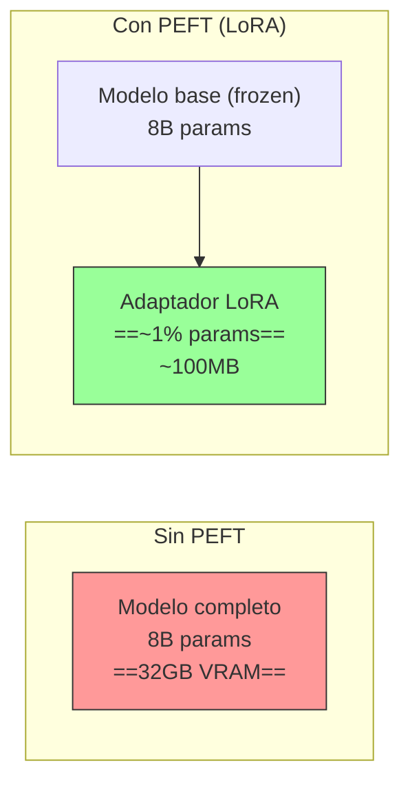
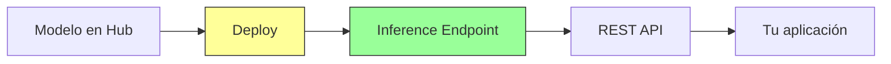

# HuggingFace Ecosystem

> [!abstract] Resumen
> **HuggingFace** es el ==ecosistema open source más grande para IA==, funcionando como el "GitHub de los modelos de machine learning". Su Hub aloja 1M+ modelos, 100K+ datasets, y miles de Spaces (demos). Las librerías principales — *Transformers*, *PEFT*, *TRL*, *Accelerate* — cubren desde inferencia hasta fine-tuning y entrenamiento con RLHF. Los *Inference Endpoints* permiten deployment managed. Su fortaleza es la ==comunidad y la amplitud del catálogo==; sus debilidades incluyen riesgos de seguridad en la supply chain de modelos y calidad variable. ^resumen

---

## Qué es HuggingFace

HuggingFace[^1] comenzó como una empresa de chatbots pero pivotó para convertirse en la ==plataforma central del ecosistema open source de IA==. Su propuesta de valor es simple: ser el lugar donde la comunidad comparte, descubre y utiliza modelos, datasets y aplicaciones de IA.

> [!info] Analogía con GitHub
> Si GitHub es para código, HuggingFace es para modelos de IA. La comparación es deliberada:
> - **Repositorios** → Modelos, Datasets, Spaces
> - **Git** → Git LFS para archivos grandes de modelos
> - **Actions** → Inference Endpoints, Spaces
> - **Marketplace** → Hub con modelos pre-entrenados
> - **Community** → Discusiones, pull requests en modelos

---

## Componentes principales

### Hub — El catálogo

El *Hub* es el repositorio central con:

| Tipo | Cantidad (junio 2025) | Ejemplos |
|---|---|---|
| Modelos | ==1,000,000+== | Llama 3, Mistral, BERT, GPT-2 |
| Datasets | 100,000+ | Wikipedia, Common Crawl, MMLU |
| Spaces | 300,000+ | Demos interactivas, apps Gradio |

> [!tip] Navegando el Hub efectivamente
> El Hub es enorme. Para encontrar modelos útiles:
> 1. Filtra por tarea (*text-generation*, *image-classification*, etc.)
> 2. Ordena por ==downloads o likes== (proxy de calidad)
> 3. Verifica la ==Model Card== (documentación del modelo)
> 4. Revisa los benchmarks reportados
> 5. Busca modelos de organizaciones confiables (Meta, Mistral, Google)

### Transformers — La librería core

*Transformers*[^2] es la librería de Python que permite cargar y usar modelos del Hub:

```python
from transformers import pipeline

# Sentiment analysis
classifier = pipeline("sentiment-analysis")
result = classifier("HuggingFace ha revolucionado el ecosistema de IA")
# [{'label': 'POSITIVE', 'score': 0.9998}]

# Text generation
generator = pipeline("text-generation", model="meta-llama/Llama-3.1-8B-Instruct")
response = generator("Explica qué es transformer en una frase:")
```

> [!example]- Usos avanzados de Transformers
> ```python
> from transformers import AutoModelForCausalLM, AutoTokenizer
> import torch
>
> # Cargar modelo y tokenizer
> model_name = "meta-llama/Llama-3.1-8B-Instruct"
> tokenizer = AutoTokenizer.from_pretrained(model_name)
> model = AutoModelForCausalLM.from_pretrained(
>     model_name,
>     torch_dtype=torch.float16,
>     device_map="auto",  # Distribución automática en GPUs
>     load_in_4bit=True,  # Cuantización 4-bit para menos VRAM
> )
>
> # Chat format
> messages = [
>     {"role": "system", "content": "Eres un asistente técnico."},
>     {"role": "user", "content": "Explica attention en transformers"}
> ]
>
> # Tokenizar
> input_ids = tokenizer.apply_chat_template(
>     messages, return_tensors="pt"
> ).to(model.device)
>
> # Generar
> outputs = model.generate(
>     input_ids,
>     max_new_tokens=512,
>     temperature=0.7,
>     do_sample=True,
>     top_p=0.9,
> )
>
> # Decodificar
> response = tokenizer.decode(outputs[0][input_ids.shape[-1]:])
> print(response)
> ```

### PEFT — Fine-tuning eficiente

*PEFT* (*Parameter-Efficient Fine-Tuning*) permite adaptar modelos grandes sin necesitar la VRAM completa:



Técnicas de PEFT soportadas:

| Técnica | Parámetros entrenados | VRAM requerida | Calidad |
|---|---|---|---|
| Full fine-tuning | 100% | ==Muy alta== | Máxima |
| LoRA | ~1-5% | Baja | ==Muy buena== |
| QLoRA | ~1-5% (cuantizado) | ==Mínima== | Buena |
| Prefix Tuning | <1% | Mínima | Aceptable |
| Prompt Tuning | <0.1% | Mínima | Limitada |

> [!tip] LoRA es el sweet spot
> Para la mayoría de casos de fine-tuning, ==LoRA (Low-Rank Adaptation)== ofrece el mejor balance entre calidad, coste y complejidad. QLoRA reduce aún más el requerimiento de VRAM (fine-tune modelos de 7B en una GPU de 8GB) con pérdida mínima de calidad.

### TRL — Entrenamiento con RLHF/DPO

*TRL* (*Transformer Reinforcement Learning*) proporciona herramientas para alinear modelos con preferencias humanas:

| Método | Descripción | Complejidad |
|---|---|---|
| SFT | *Supervised Fine-Tuning* — entrenamiento supervisado | Baja |
| RLHF | *Reinforcement Learning from Human Feedback* | ==Alta== |
| DPO | *Direct Preference Optimization* — alternativa simplificada a RLHF | ==Media== |
| ORPO | *Odds Ratio Preference Optimization* | Media |
| KTO | *Kahneman-Tversky Optimization* | Media |

> [!info] DPO vs RLHF
> RLHF requiere entrenar un modelo de reward separado y es complejo de estabilizar. DPO simplifica esto ==optimizando directamente las preferencias sin modelo de reward==. En la práctica, DPO produce resultados comparables con mucha menos complejidad. Es la técnica recomendada para la mayoría de equipos.

### Inference Endpoints

Deploy managed de modelos del Hub:



| Tipo | GPU | Coste/hora | Uso |
|---|---|---|---|
| CPU | - | $0.06 | Modelos pequeños, embeddings |
| GPU Small | T4 | $0.60 | Modelos hasta 7B |
| GPU Medium | A10G | ==~$1.30== | Modelos 7B-13B |
| GPU Large | A100 | ~$6.50 | Modelos 30B+ |

### Spaces — Demos y apps

*Spaces* permite hosting gratuito de aplicaciones de IA:
- **Gradio**: interfaces web para modelos ML
- **Streamlit**: dashboards y apps de datos
- **Docker**: cualquier aplicación containerizada

> [!success] Spaces como prototipado rápido
> Spaces es ==la forma más rápida de crear un demo interactivo== de un modelo. En minutos puedes tener una interfaz web que permita a cualquier persona probar tu modelo sin instalar nada.

---

## Pricing

> [!warning] Precios verificados en junio 2025
> Consulta [huggingface.co/pricing](https://huggingface.co/pricing) para información actualizada.

| Componente | Free | Pro ($9/mo) | Enterprise |
|---|---|---|---|
| Hub (modelos públicos) | ==Ilimitado== | Ilimitado | Ilimitado |
| Hub (modelos privados) | Limitado | ==Ilimitado== | Ilimitado |
| Spaces (CPU) | ==Gratuito== | Gratuito | Gratuito |
| Spaces (GPU) | No | ==T4 gratuito== | Configurable |
| Inference API (free) | Rate limited | ==Mayor rate== | Custom |
| Inference Endpoints | Pay-per-use | Pay-per-use | Descuentos |
| SSO / Org management | No | No | ==Sí== |

---

## Quick Start

> [!example]- Primeros pasos con HuggingFace
> ### Instalación
> ```bash
> # Librería core
> pip install transformers
>
> # Con soporte de PyTorch
> pip install transformers[torch]
>
> # CLI de HuggingFace
> pip install huggingface_hub
>
> # Login (necesario para modelos gated)
> huggingface-cli login
> # Introduce tu token de hf.co/settings/tokens
> ```
>
> ### Primer modelo
> ```python
> from transformers import pipeline
>
> # Text generation con modelo pequeño
> gen = pipeline("text-generation", model="gpt2")
> print(gen("La inteligencia artificial es"))
>
> # Sentiment analysis (no requiere GPU)
> sentiment = pipeline("sentiment-analysis")
> print(sentiment("Este producto es excelente"))
>
> # Traducción
> translator = pipeline("translation_en_to_es", model="Helsinki-NLP/opus-mt-en-es")
> print(translator("Hello, how are you?"))
> ```
>
> ### Subir un modelo al Hub
> ```python
> from huggingface_hub import HfApi
>
> api = HfApi()
> api.create_repo("mi-usuario/mi-modelo", private=True)
> api.upload_folder(
>     folder_path="./mi-modelo",
>     repo_id="mi-usuario/mi-modelo"
> )
> ```
>
> ### Fine-tuning rápido con PEFT
> ```bash
> pip install peft trl datasets
> ```
>
> ```python
> from peft import LoraConfig, get_peft_model
> from transformers import AutoModelForCausalLM
>
> model = AutoModelForCausalLM.from_pretrained("meta-llama/Llama-3.1-8B")
> lora_config = LoraConfig(
>     r=16,
>     lora_alpha=32,
>     target_modules=["q_proj", "v_proj"],
>     lora_dropout=0.05,
> )
> model = get_peft_model(model, lora_config)
> model.print_trainable_parameters()
> # trainable params: 6,553,600 (0.08% of 8B)
> ```

---

## Comparación con alternativas

| Aspecto | ==HuggingFace== | [[ollama]] | [[modal-replicate\|Replicate]] | GitHub Models |
|---|---|---|---|---|
| Catálogo | ==1M+ modelos== | ~100 modelos | ~5K modelos | Nuevo |
| Fine-tuning | ==Librerías completas== | No | Limitado | No |
| Deploy managed | Inference Endpoints | No (local) | ==Sí== | No |
| Local inference | Via Transformers | ==Nativo== | No | No |
| Gratuito | Mucho | ==Todo== | Limitado | Limitado |
| Comunidad | ==Enorme== | Grande | Media | Grande |
| Facilidad | Media | ==Fácil== | Fácil | Fácil |

---

## Limitaciones honestas

> [!failure] Lo que HuggingFace NO hace bien
> 1. **Model supply chain risk**: cualquiera puede subir modelos al Hub. Se han detectado ==modelos con código malicioso== (pickle exploits, backdoors). Siempre verifica la fuente
> 2. **Calidad variable**: de 1M+ modelos, muchos son ==de baja calidad, incompletos, o sin documentación==. La popularidad (downloads) es un proxy imperfecto
> 3. **Complejidad**: el ecosistema es vasto y puede ser ==abrumador para principiantes==. La documentación asume conocimiento previo de ML
> 4. **VRAM requirements**: muchos modelos interesantes requieren ==GPUs con mucha VRAM==. Sin hardware adecuado, la experiencia es limitada
> 5. **Velocidad de inferencia**: la librería Transformers prioriza ==flexibilidad sobre velocidad==. Para producción, considera vLLM, TGI, o TensorRT
> 6. **Breaking changes**: las actualizaciones de Transformers pueden ==romper scripts existentes==. Fijar versiones en producción
> 7. **Inference Endpoints coste**: el hosting managed ==no es barato comparado con alternativas== como [[modal-replicate|Modal]] o Replicate para modelos estándar

> [!danger] Seguridad de modelos
> ==NUNCA ejecutes un modelo descargado de HuggingFace sin verificar su origen==. Los archivos `.pkl` (pickle) pueden contener código arbitrario que se ejecuta al cargar el modelo. Preferir formatos seguros como *safetensors*. Verificar la organización que publicó el modelo. Usar escaneo de modelos cuando esté disponible.

---

## Relación con el ecosistema

HuggingFace es la ==fundación de modelo open source== sobre la que se construye gran parte del ecosistema.

- **[[intake-overview]]**: intake puede usar modelos de HuggingFace via [[litellm]] para procesar requisitos. Los modelos de NLP del Hub (summarización, clasificación) pueden alimentar el pipeline de intake.
- **[[architect-overview]]**: architect accede a modelos de HuggingFace indirectamente via [[litellm]] y [[ollama]]. Modelos alojados en el Hub que se sirven via Inference Endpoints o localmente son ==proveedores válidos para architect==.
- **[[vigil-overview]]**: vigil es un escáner determinista, no basado en ML. Sin embargo, herramientas de análisis estático basadas en modelos del Hub podrían ==complementar el enfoque determinista de vigil==.
- **[[licit-overview]]**: HuggingFace publica *Model Cards* con información de licencia, datos de entrenamiento, y limitaciones. Esta información es ==crucial para compliance== bajo regulaciones como el EU AI Act. licit puede usar Model Cards como input para evaluar riesgos legales.

---

## Estado de mantenimiento

> [!success] Activamente mantenido — pilar del ecosistema open source
> - **Empresa**: Hugging Face, Inc.
> - **Financiación**: $395M+ (Serie D, 2023, valoración $4.5B)
> - **Empleados**: 200+
> - **Cadencia**: releases frecuentes de todas las librerías
> - **Comunidad**: una de las más activas en IA open source

---

## Enlaces y referencias

> [!quote]- Bibliografía y recursos
> - [^1]: HuggingFace oficial — [huggingface.co](https://huggingface.co)
> - [^2]: Transformers library — [huggingface.co/docs/transformers](https://huggingface.co/docs/transformers)
> - PEFT docs — [huggingface.co/docs/peft](https://huggingface.co/docs/peft)
> - TRL docs — [huggingface.co/docs/trl](https://huggingface.co/docs/trl)
> - Hub docs — [huggingface.co/docs/hub](https://huggingface.co/docs/hub)
> - "The Hugging Face Hub: A Platform for AI Collaboration" — HF Blog, 2024
> - [[litellm]] — proxy que conecta con HuggingFace Inference
> - [[ollama]] — alternativa local para ejecutar modelos del Hub

[^1]: Hugging Face, Inc. fundada en 2016. Hub lanzado en 2019.
[^2]: Transformers library, primera versión lanzada en 2018 como pytorch-pretrained-bert.
