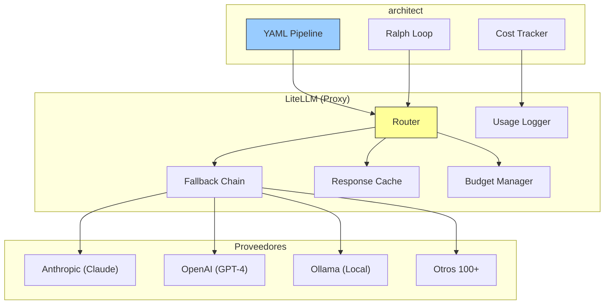
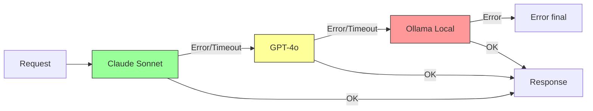
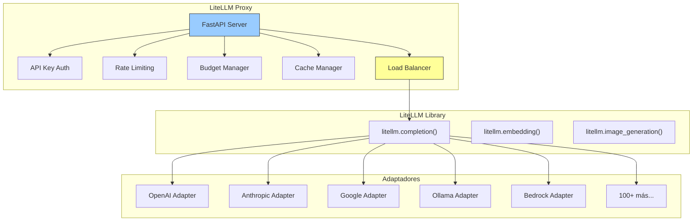

# LiteLLM

> [!abstract] Resumen
> **LiteLLM** es un ==proxy universal para 100+ proveedores de LLMs==, ofreciendo una API unificada compatible con OpenAI. Es el componente que permite a [[architect-overview]] usar ==cualquier modelo de cualquier proveedor== sin cambiar una línea de código. Ofrece funcionalidades empresariales: fallbacks automáticos, reintentos, caché, gestión de presupuesto, balanceo de carga, y tracking de costes. Funciona como librería Python o como ==servidor proxy independiente==. Es open source, activamente mantenido, y se ha convertido en infraestructura crítica para muchos proyectos de IA. ^resumen

---

## Qué es LiteLLM

LiteLLM[^1] resuelve un problema fundamental en el ecosistema de LLMs: la ==fragmentación de APIs==. Cada proveedor (OpenAI, Anthropic, Google, Mistral, etc.) tiene su propia API con diferentes formatos, autenticación, y peculiaridades. LiteLLM unifica todo esto bajo una sola interfaz compatible con OpenAI.

> [!info] El problema que resuelve
> Sin LiteLLM, cambiar de GPT-4 a Claude requiere:
> 1. Cambiar la librería cliente
> 2. Modificar el formato de mensajes
> 3. Actualizar la autenticación
> 4. Ajustar el manejo de streaming
> 5. Adaptar el parsing de respuestas
>
> Con LiteLLM, cambiar de modelo es ==cambiar un string==:
> ```python
> # De esto:
> response = litellm.completion(model="gpt-4o", messages=messages)
> # A esto:
> response = litellm.completion(model="claude-3-5-sonnet-20241022", messages=messages)
> ```

---

## Proveedores soportados

LiteLLM soporta ==100+ proveedores== con una API unificada:

| Proveedor | Modelos clave | Tipo |
|---|---|---|
| OpenAI | GPT-4o, GPT-4 Turbo, o1 | Cloud |
| Anthropic | ==Claude Opus, Sonnet, Haiku== | Cloud |
| Google | Gemini Pro, Ultra, Flash | Cloud |
| Mistral | Mistral Large, Codestral | Cloud |
| AWS Bedrock | Claude, Llama, Titan | Cloud (AWS) |
| Azure OpenAI | GPT-4, embeddings | Cloud (Azure) |
| Google Vertex AI | Gemini, PaLM | Cloud (GCP) |
| Cohere | Command R+ | Cloud |
| [[ollama]] | ==Llama, Mistral, Phi (local)== | Local |
| vLLM | Cualquier modelo HF | Local |
| HuggingFace Inference | Modelos en HF Hub | Cloud |
| [[openrouter]] | ==200+ modelos== | Marketplace |
| Together AI | Llama, Mixtral | Cloud |
| Groq | Llama, Mixtral (==ultra-rápido==) | Cloud |
| Fireworks AI | Llama, Mixtral | Cloud |
| DeepSeek | DeepSeek V2, Coder | Cloud |
| Replicate | Modelos open source | Cloud |

---

## Cómo architect usa LiteLLM

> [!tip] LiteLLM como backend de architect
> [[architect-overview]] usa LiteLLM como su ==capa de abstracción para modelos==. Esto significa que architect puede:
> 1. Usar cualquiera de los 100+ proveedores soportados
> 2. Cambiar de modelo sin modificar código
> 3. Configurar ==fallbacks automáticos== (si Claude falla, usar GPT-4)
> 4. Trackear costes por sesión y por tarea
> 5. Usar modelos locales via [[ollama]] para desarrollo
> 6. Aplicar presupuestos y límites



---

## Características principales

### API unificada (OpenAI-compatible)

```python
import litellm

# Todos usan la misma interfaz
response = litellm.completion(
    model="claude-3-5-sonnet-20241022",  # O cualquier otro modelo
    messages=[{"role": "user", "content": "Explica monads en Haskell"}],
    temperature=0.7,
    max_tokens=1000
)

# La respuesta siempre tiene el mismo formato (OpenAI-compatible)
print(response.choices[0].message.content)
```

### Proxy Server

LiteLLM puede funcionar como un ==servidor proxy independiente== que expone una API OpenAI-compatible:

> [!example]- Configuración del proxy server
> ```yaml
> # litellm_config.yaml
> model_list:
>   - model_name: "sonnet"
>     litellm_params:
>       model: "claude-3-5-sonnet-20241022"
>       api_key: "os.environ/ANTHROPIC_API_KEY"
>
>   - model_name: "gpt4"
>     litellm_params:
>       model: "gpt-4o"
>       api_key: "os.environ/OPENAI_API_KEY"
>
>   - model_name: "local"
>     litellm_params:
>       model: "ollama/llama3.1"
>       api_base: "http://localhost:11434"
>
>   - model_name: "cheap"
>     litellm_params:
>       model: "claude-3-haiku-20240307"
>       api_key: "os.environ/ANTHROPIC_API_KEY"
>
> # Fallback chain
> litellm_settings:
>   fallbacks:
>     - model_name: "sonnet"
>       fallback_models: ["gpt4", "local"]
>
>   # Cache
>   cache: true
>   cache_params:
>     type: "redis"
>     host: "localhost"
>     port: 6379
>
>   # Budget
>   max_budget: 100.0  # $100/mes
>   budget_duration: "1mo"
>
> # Iniciar el proxy
> # litellm --config litellm_config.yaml --port 4000
> ```
>
> ```bash
> # Uso del proxy (cualquier cliente OpenAI funciona)
> curl http://localhost:4000/v1/chat/completions \
>   -H "Content-Type: application/json" \
>   -H "Authorization: Bearer sk-litellm-key" \
>   -d '{
>     "model": "sonnet",
>     "messages": [{"role": "user", "content": "Hello"}]
>   }'
> ```

### Fallbacks y reintentos



> [!tip] Fallbacks inteligentes
> Los fallbacks de LiteLLM no son simples reintentos. Pueden:
> - Detectar ==tipos específicos de error== (rate limit, timeout, auth)
> - Usar modelos diferentes según el tipo de error
> - Respetar cooldown periods antes de reintentar
> - Mantener métricas de fiabilidad por proveedor

### Gestión de presupuesto

| Funcionalidad | Descripción |
|---|---|
| Budget por usuario | Límite de gasto ==por API key== |
| Budget por modelo | Límite por modelo específico |
| Budget temporal | ==Límite diario, semanal, mensual== |
| Alertas | Notificaciones al alcanzar % del budget |
| Hard limits | Bloqueo de requests al exceder budget |

### Tracking de costes

LiteLLM calcula y registra el ==coste exacto de cada request==:

```python
response = litellm.completion(model="claude-3-5-sonnet-20241022", messages=messages)

# Información de costes incluida en la respuesta
print(response._hidden_params["response_cost"])  # $0.0034
print(response.usage.prompt_tokens)               # 150
print(response.usage.completion_tokens)            # 250
```

> [!info] Cómo calcula costes
> LiteLLM mantiene una ==base de datos actualizada de precios== por modelo y proveedor. Los costes se calculan multiplicando tokens por precio unitario. Para modelos con pricing de input/output diferente (como Claude), calcula cada parte por separado.

### Caché de respuestas

| Tipo de caché | Backend | Uso |
|---|---|---|
| In-memory | Diccionario Python | ==Desarrollo, testing== |
| Redis | Redis server | ==Producción== |
| S3 | AWS S3 | Persistencia largo plazo |
| Disk | Sistema de archivos | Desarrollo offline |

> [!warning] Caché y determinismo
> El caché puede causar problemas si esperas respuestas diferentes para la misma pregunta (temperature > 0). ==Usa caché solo para requests donde quieras determinismo== (temperature=0, embeddings, etc.) o acepta respuestas cached como aceptables.

---

## Arquitectura



---

## Pricing

> [!warning] LiteLLM es gratuito y open source — junio 2025
> Solo pagas por los LLMs que uses a través de él.

| Componente | Coste |
|---|---|
| LiteLLM Library | ==$0 (open source)== |
| LiteLLM Proxy | $0 (self-hosted) |
| LiteLLM Enterprise | Custom (hosted, soporte) |
| Modelos via LiteLLM | ==Precio del proveedor== |

> [!info] LiteLLM Enterprise
> Para organizaciones que necesitan proxy managed, SSO, audit logs avanzados, y soporte dedicado, LiteLLM ofrece un plan enterprise hosted. Pero para la mayoría de equipos, la ==versión open source es más que suficiente==.

---

## Quick Start

> [!example]- Instalación y configuración rápida
> ### Como librería Python
> ```bash
> pip install litellm
> ```
>
> ```python
> import litellm
> import os
>
> # Configurar API keys
> os.environ["ANTHROPIC_API_KEY"] = "sk-ant-..."
> os.environ["OPENAI_API_KEY"] = "sk-..."
>
> # Usar cualquier modelo con la misma interfaz
> response = litellm.completion(
>     model="claude-3-5-sonnet-20241022",
>     messages=[{"role": "user", "content": "Hello!"}]
> )
> print(response.choices[0].message.content)
>
> # Cambiar a otro modelo — mismo código
> response = litellm.completion(
>     model="gpt-4o",
>     messages=[{"role": "user", "content": "Hello!"}]
> )
> ```
>
> ### Como proxy server
> ```bash
> # Instalar
> pip install 'litellm[proxy]'
>
> # Configurar (ver ejemplo de config.yaml arriba)
>
> # Iniciar
> litellm --config litellm_config.yaml --port 4000
>
> # Probar con curl
> curl http://localhost:4000/v1/chat/completions \
>   -H "Content-Type: application/json" \
>   -d '{"model": "sonnet", "messages": [{"role": "user", "content": "test"}]}'
> ```
>
> ### Con Docker
> ```bash
> docker run -d \
>   --name litellm-proxy \
>   -p 4000:4000 \
>   -v ./litellm_config.yaml:/app/config.yaml \
>   -e ANTHROPIC_API_KEY="sk-ant-..." \
>   -e OPENAI_API_KEY="sk-..." \
>   ghcr.io/berriai/litellm:main-latest \
>   --config /app/config.yaml
> ```
>
> ### Integración con herramientas
> ```bash
> # Con aider (usa la variable OPENAI_API_BASE)
> export OPENAI_API_BASE="http://localhost:4000/v1"
> aider --model sonnet
>
> # Con cualquier herramienta compatible con OpenAI API
> export OPENAI_API_BASE="http://localhost:4000/v1"
> export OPENAI_API_KEY="sk-litellm-key"
> ```

---

## Comparación con alternativas

| Aspecto | ==LiteLLM== | [[openrouter]] | Direct API | AWS Bedrock |
|---|---|---|---|---|
| Tipo | ==Self-hosted proxy== | Marketplace cloud | Directo | Cloud (AWS) |
| Open source | ==Sí== | No | N/A | No |
| Proveedores | ==100+== | 200+ | 1 | ~10 |
| Fallbacks | ==Sí== | No | No | No |
| Budget mgmt | ==Sí== | No | No | Via AWS |
| Caché | ==Sí== | No | No | No |
| Coste extra | ==$0== | Markup por request | $0 | $0 |
| Latencia extra | ==~1-5ms== | ~50-100ms | 0 | ~5-10ms |
| Load balancing | ==Sí== | Automático | No | No |
| Control | ==Total== | Limitado | Total | Limitado |

---

## Limitaciones honestas

> [!failure] Lo que LiteLLM NO hace bien
> 1. **Compatibilidad imperfecta**: no todas las funcionalidades de cada proveedor están soportadas. Funcionalidades muy nuevas o específicas ==pueden no estar disponibles== inmediatamente
> 2. **Versiones y breaking changes**: LiteLLM se actualiza frecuentemente y a veces ==introduce breaking changes== en minor versions. Fijar la versión en producción
> 3. **Latencia adicional**: aunque mínima (~1-5ms), hay ==latencia inherente== al pasar por un proxy
> 4. **Debugging complejo**: cuando algo falla, puede ser difícil determinar si el problema está en LiteLLM, en el proveedor, o en tu configuración
> 5. **Documentación inconsistente**: la documentación es extensa pero a veces ==desactualizada o contradictoria== entre versiones
> 6. **Proxy server complejidad**: el proxy requiere mantenimiento (actualizaciones, monitoreo, SSL, etc.) en producción
> 7. **No es un modelo**: LiteLLM ==no mejora la calidad de las respuestas==. Solo rutea requests. La calidad depende del modelo subyacente
> 8. **Token counting aproximado**: el conteo de tokens para presupuesto es ==aproximado, no exacto==, especialmente para modelos no-OpenAI

> [!danger] Pin your versions
> ```bash
> # MAL — puede romper en cualquier actualización
> pip install litellm
>
> # BIEN — versión fija
> pip install litellm==1.40.0
> ```
> Las actualizaciones frecuentes de LiteLLM son una espada de doble filo: ==nuevos proveedores rápidamente, pero riesgo de breaking changes==.

---

## Relación con el ecosistema

LiteLLM es ==infraestructura fundamental== que habilita la independencia de proveedor en todo el ecosistema.

- **[[intake-overview]]**: intake usa LiteLLM como backend cuando necesita procesar requisitos con diferentes modelos. La capacidad de ==cambiar entre modelos== permite experimentar con qué modelo produce mejores especificaciones.
- **[[architect-overview]]**: architect depende directamente de LiteLLM para toda su comunicación con LLMs. Esta dependencia le da a architect ==acceso a 100+ proveedores==, fallbacks automáticos, tracking de costes, y la capacidad de usar modelos locales via [[ollama]] para desarrollo. Sin LiteLLM, architect estaría atado a un solo proveedor.
- **[[vigil-overview]]**: vigil es un escáner determinista que no usa LLMs directamente, pero las herramientas que generan código (architect, [[aider]]) ==usan LiteLLM para acceder a los modelos== que generan el código que vigil luego escanea.
- **[[licit-overview]]**: LiteLLM proporciona logs detallados de qué modelos se usaron, cuántos tokens, y qué proveedores procesaron datos. Esto es ==información crucial para compliance==, especialmente bajo el EU AI Act donde la trazabilidad del procesamiento de datos por IA es importante.

---

## Estado de mantenimiento

> [!success] Muy activamente mantenido — infraestructura de la comunidad
> - **Empresa**: BerriAI
> - **Licencia**: MIT
> - **GitHub stars**: 15K+ (junio 2025)
> - **Contribuidores**: 300+
> - **Cadencia**: ==releases diarios== (a veces múltiples por día)
> - **Documentación**: [docs.litellm.ai](https://docs.litellm.ai)

---

## Enlaces y referencias

> [!quote]- Bibliografía y recursos
> - [^1]: LiteLLM oficial — [litellm.ai](https://litellm.ai)
> - GitHub — [github.com/BerriAI/litellm](https://github.com/BerriAI/litellm)
> - Documentación — [docs.litellm.ai](https://docs.litellm.ai)
> - "LiteLLM: The Universal LLM Proxy" — BerriAI blog
> - [[openrouter]] — alternativa cloud (marketplace)
> - [[architect-overview]] — principal consumidor en el ecosistema
> - [[ollama]] — proveedor local que LiteLLM soporta

[^1]: LiteLLM, desarrollado por BerriAI. Open source bajo MIT.
