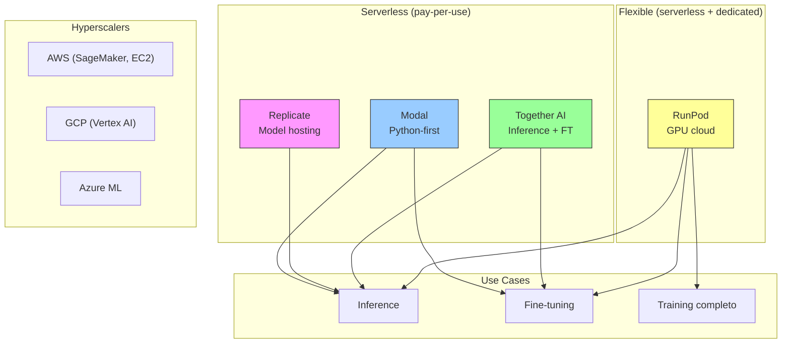
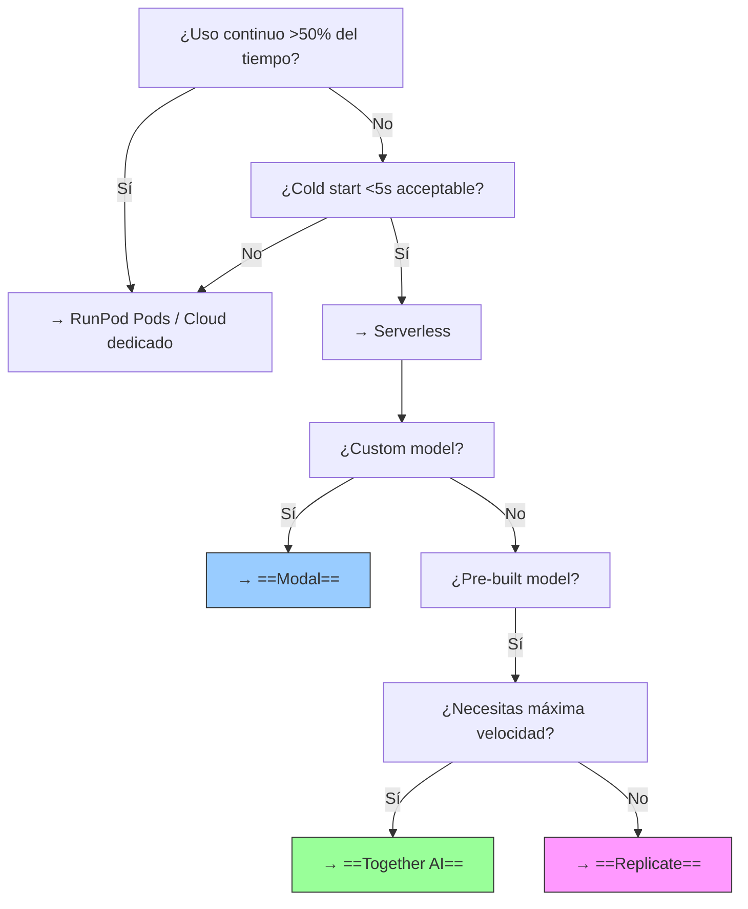

# Plataformas GPU Serverless

> [!abstract] Resumen
> Las plataformas de ==GPU serverless== permiten ejecutar modelos de IA sin gestionar infraestructura. **Modal** ofrece un enfoque Python-first con GPUs on demand. **Replicate** se especializa en hosting y API para modelos open source. **RunPod** proporciona GPUs cloud tanto serverless como dedicadas. **Together AI** combina inferencia optimizada con fine-tuning. La elección depende de si necesitas ==control (Modal/RunPod)== o ==simplicidad (Replicate/Together)==. Este espacio es ==volatile== — los precios y features cambian mensualmente. ^resumen

---

## El panorama de GPU cloud



---

## Modal

**Modal**[^1] es una plataforma de computación cloud ==Python-first== que hace que obtener GPUs sea tan fácil como decorar una función.

### Filosofía

Modal trata la infraestructura como código Python. No necesitas Dockerfiles, Kubernetes, ni configuración de servidores:

> [!example]- Ejemplo completo de Modal
> ```python
> import modal
>
> # Definir la imagen del contenedor
> image = modal.Image.debian_slim(python_version="3.11").pip_install(
>     "transformers", "torch", "accelerate", "bitsandbytes"
> )
>
> app = modal.App("mi-llm-api")
>
> @app.cls(
>     image=image,
>     gpu="A100",  # GPU tipo A100
>     timeout=300,
>     container_idle_timeout=60,  # Apagar si no se usa en 60s
>     secrets=[modal.Secret.from_name("huggingface-token")],
> )
> class LLMModel:
>     @modal.enter()  # Se ejecuta al iniciar el contenedor
>     def load_model(self):
>         from transformers import AutoModelForCausalLM, AutoTokenizer
>         import torch
>
>         self.tokenizer = AutoTokenizer.from_pretrained(
>             "meta-llama/Llama-3.1-8B-Instruct"
>         )
>         self.model = AutoModelForCausalLM.from_pretrained(
>             "meta-llama/Llama-3.1-8B-Instruct",
>             torch_dtype=torch.float16,
>             device_map="auto",
>         )
>
>     @modal.method()
>     def generate(self, prompt: str) -> str:
>         inputs = self.tokenizer(prompt, return_tensors="pt").to("cuda")
>         outputs = self.model.generate(**inputs, max_new_tokens=500)
>         return self.tokenizer.decode(outputs[0], skip_special_tokens=True)
>
>     @modal.web_endpoint(method="POST")
>     def api(self, request: dict) -> dict:
>         result = self.generate(request["prompt"])
>         return {"response": result}
>
> # Deploy: modal deploy mi_app.py
> # El endpoint se crea automáticamente
> ```

### Capacidades

| Feature | Descripción |
|---|---|
| GPU on demand | ==A100, H100, L4, T4== |
| Container caching | Imágenes cacheadas para cold start rápido |
| Web endpoints | ==REST API automática== |
| Cron jobs | Ejecución programada |
| Volumes | Almacenamiento persistente |
| Secrets | Gestión segura de secretos |
| Queues | Cola de trabajo asíncrona |
| Scaling | ==Auto-scaling a 0== (no pagas cuando no se usa) |

> [!tip] ¿Por qué Modal?
> Modal es la mejor opción cuando:
> - Quieres ==definir infraestructura en Python puro== sin YAML/Docker
> - Necesitas GPUs esporádicamente (auto-scaling a 0)
> - Quieres ==web endpoints== automáticos para tus modelos
> - Necesitas ejecutar ==jobs de procesamiento de datos== con GPU
> - Preferieres control total sobre el modelo y la configuración

---

## Replicate

**Replicate**[^2] se especializa en ==hosting de modelos open source con API==. Es el "Heroku de los modelos de IA".

### Modelo de uso

1. Busca un modelo en el catálogo de Replicate
2. Haz una llamada API
3. Recibe el resultado
4. Paga por el tiempo de GPU usado

```python
import replicate

# Ejecutar un modelo con una línea
output = replicate.run(
    "meta/llama-3.1-405b-instruct",
    input={"prompt": "Explica qué es Kubernetes en español"}
)
print(output)

# Imagen con Stable Diffusion
output = replicate.run(
    "stability-ai/stable-diffusion-xl",
    input={"prompt": "A futuristic city with flying cars, photorealistic"}
)
# output es una URL a la imagen generada
```

### Catálogo

| Categoría | Modelos ejemplo | Cantidad |
|---|---|---|
| Text generation | Llama, Mistral, Qwen | 500+ |
| Image generation | ==SDXL, DALL-E, Flux== | 1000+ |
| Audio | Whisper, MusicGen | 200+ |
| Video | Stable Video, AnimateDiff | 100+ |
| Code | CodeLlama, DeepSeek | 100+ |

> [!info] Modelos custom en Replicate
> Puedes subir tus ==propios modelos== a Replicate usando Cog (su framework de containerización):
> ```python
> # cog.yaml
> build:
>   gpu: true
>   python_version: "3.11"
>   python_packages:
>     - "transformers==4.40.0"
>     - "torch==2.3.0"
>
> predict: "predict.py:Predictor"
> ```

---

## RunPod

**RunPod**[^3] ofrece ==GPU cloud tanto serverless como dedicada==, con la mayor flexibilidad de precios y configuración.

### Tipos de servicio

| Tipo | Descripción | Uso |
|---|---|---|
| **Serverless** | Pay-per-second, auto-scaling | ==Inferencia, APIs== |
| **Pods** | GPU dedicada por hora | Training, desarrollo |
| **Community Cloud** | GPUs compartidas (más barato) | ==Desarrollo, experimentación== |
| **Secure Cloud** | GPUs dedicadas (más caro) | Producción |

### GPUs disponibles

| GPU | VRAM | Precio/hora (Community) | Precio/hora (Secure) |
|---|---|---|---|
| RTX 3090 | 24GB | ==$0.22== | $0.44 |
| RTX 4090 | 24GB | $0.39 | $0.69 |
| A100 (40GB) | 40GB | ==$0.79== | $1.64 |
| A100 (80GB) | 80GB | $1.19 | $2.21 |
| H100 | 80GB | ==$2.49== | $3.99 |

> [!tip] RunPod para fine-tuning
> RunPod es especialmente popular para ==fine-tuning de modelos== porque:
> - Los Pods dedicados dan acceso directo a la GPU
> - Puedes instalar cualquier framework
> - Los precios son ==más bajos que AWS/GCP/Azure==
> - Volumes persistentes para guardar checkpoints
> - Templates pre-configurados (PyTorch, Transformers, etc.)

---

## Together AI

**Together AI**[^4] combina ==inferencia optimizada con fine-tuning== en una sola plataforma.

### Diferenciador: inferencia ultra-rápida

Together AI ha optimizado la inferencia con técnicas propietarias que logran ==velocidades significativamente mayores== que self-hosting:

| Modelo | Together AI (tokens/s) | Self-hosted vLLM (tokens/s) |
|---|---|---|
| Llama 3.1 8B | ==180== | ~100 |
| Llama 3.1 70B | ==80== | ~40 |
| Mixtral 8x7B | ==120== | ~60 |

### Servicios

| Servicio | Descripción |
|---|---|
| Inference | ==API de inferencia optimizada== |
| Fine-tuning | LoRA y full fine-tuning managed |
| Chat UI | Interfaz web para probar modelos |
| Embeddings | Generación de embeddings |
| Custom deploy | Deploy de modelos custom |

> [!info] Together AI como proveedor en LiteLLM
> Together AI es uno de los ==proveedores soportados por [[litellm]]==, lo que significa que puedes usarlo transparentemente con [[architect-overview]] o [[aider]]:
> ```python
> # En LiteLLM config
> model_list:
>   - model_name: "llama-fast"
>     litellm_params:
>       model: "together_ai/meta-llama/Llama-3.1-70B-Instruct"
>       api_key: "os.environ/TOGETHER_API_KEY"
> ```

---

## Comparación completa

| Aspecto | ==Modal== | Replicate | RunPod | Together AI |
|---|---|---|---|---|
| Tipo | ==Compute platform== | Model hosting | ==GPU cloud== | Inference + FT |
| Foco | Custom workloads | Pre-built models | Flexibility | ==Speed== |
| Custom models | ==Sí (Python)== | Sí (Cog) | Sí (cualquier) | Limitado |
| Pre-built models | No | ==5K+ catálogo== | Templates | Catálogo |
| Serverless | ==Sí== | Sí | Sí | Sí |
| Dedicated GPU | No | No | ==Sí== | No |
| Fine-tuning | Sí (custom) | No | Sí (custom) | ==Sí (managed)== |
| Auto-scale to 0 | ==Sí== | Sí | Sí | Sí |
| Cold start | ~5s (cached) | ==~1s (popular models)== | ~10s | ==<1s (popular)== |
| DX | ==Excelente (Python)== | Buena (API) | Buena | Buena |
| GPU types | A100, H100, L4, T4 | Varía | ==Todos (3090-H100)== | Optimizado |
| Open source | No | Parcial (Cog) | No | No |

### Pricing comparativo (inferencia, Llama 3.1 70B)

| Plataforma | Precio/1M tokens (input) | Precio/1M tokens (output) | ==Coste estimado/hora== |
|---|---|---|---|
| Modal (A100) | GPU time (~$2.23/hr) | Incluido | $2.23 |
| Replicate | $0.65 | $2.75 | ~$1-3 |
| RunPod (serverless) | ~$0.50 | ~$1.50 | ~$1-2 |
| Together AI | ==$0.88== | $0.88 | ~$1-2 |
| OpenAI (GPT-4o, referencia) | $2.50 | $10.00 | ==$5-15== |
| Anthropic (Claude Sonnet, ref.) | $3.00 | $15.00 | $5-20 |

> [!warning] Precios muy volátiles — junio 2025
> El mercado de GPU cloud ==cambia de precios mensualmente== debido a la competencia y la disponibilidad de hardware. Siempre verificar precios actuales antes de tomar decisiones.

---

## Cuándo serverless vs dedicado

> [!question] Framework de decisión

| Criterio | Serverless | Dedicado |
|---|---|---|
| Uso | Esporádico (<50% del tiempo) | ==Continuo (>50%)== |
| Cold start acceptable | Sí | No (siempre caliente) |
| Coste para uso continuo | ==Más caro== | Más barato |
| Coste para uso esporádico | ==Más barato== | Más caro |
| Gestión | ==Nula== | Requiere mantenimiento |
| Escalabilidad | ==Automática== | Manual |
| Fine-tuning | Limitado | ==Sin restricciones== |
| Debugging | Limitado | ==Acceso completo== |



---

## Quick Start — Modal (recomendado para custom)

> [!example]- Primer deploy con Modal
> ```bash
> # Instalar
> pip install modal
>
> # Autenticar
> modal setup
>
> # Crear app
> # hello_gpu.py
> ```
>
> ```python
> import modal
>
> app = modal.App("hello-gpu")
>
> @app.function(gpu="T4")
> def gpu_test():
>     import torch
>     print(f"CUDA available: {torch.cuda.is_available()}")
>     print(f"GPU: {torch.cuda.get_device_name(0)}")
>     return "GPU works!"
>
> @app.local_entrypoint()
> def main():
>     result = gpu_test.remote()
>     print(result)
> ```
>
> ```bash
> # Ejecutar
> modal run hello_gpu.py
>
> # Deploy como servicio
> modal deploy hello_gpu.py
> ```

## Quick Start — Replicate (recomendado para modelos existentes)

> [!example]- Primer uso de Replicate
> ```bash
> pip install replicate
> export REPLICATE_API_TOKEN="r8_..."
> ```
>
> ```python
> import replicate
>
> # Text generation
> output = replicate.run(
>     "meta/llama-3.1-8b-instruct",
>     input={"prompt": "Escribe un haiku sobre programación"}
> )
> print("".join(output))
>
> # Image generation
> output = replicate.run(
>     "stability-ai/sdxl",
>     input={"prompt": "A robot writing code, digital art"}
> )
> print(output)  # URL de la imagen
> ```

---

## Limitaciones honestas

> [!failure] Problemas comunes de GPU serverless
> 1. **Cold starts**: cuando el contenedor no está caliente, ==el primer request puede tardar 5-60 segundos==. Esto es inaceptable para aplicaciones interactivas sin pre-warming
> 2. **Debugging difícil**: cuando algo falla en un contenedor serverless, ==la visibilidad es limitada== comparada con un servidor dedicado
> 3. **Coste en uso continuo**: si tu modelo está activo >50% del tiempo, ==serverless es más caro que dedicado== (estás pagando el premium de escalabilidad)
> 4. **GPU availability**: en periodos de alta demanda (post-lanzamiento de un modelo popular), ==las GPUs pueden no estar disponibles==
> 5. **Vendor lock-in**: cada plataforma tiene su API y formato. ==Migrar de Modal a RunPod requiere reescribir código==
> 6. **Network latency**: tu request viaja por internet → la plataforma → la GPU → de vuelta. ==Latencia inherente de ~100-500ms== además del tiempo de inferencia
> 7. **Storage costs**: almacenar modelos grandes (70B = ~40GB) ==tiene coste adicional== de storage
> 8. **Precios impredecibles**: los precios de GPU cloud ==fluctúan significativamente==, dificultando la planificación de presupuesto

> [!danger] No asumir disponibilidad
> Las GPUs de alta gama (A100, H100) pueden ==no estar disponibles cuando las necesitas==. Para producción crítica:
> 1. Configura fallbacks a GPUs menores
> 2. Considera reserved capacity (más caro, pero garantizado)
> 3. Ten un plan B (otro proveedor, modelo más pequeño)

---

## Relación con el ecosistema

Las plataformas GPU serverless son ==infraestructura de ejecución== para el ecosistema.

- **[[intake-overview]]**: intake no requiere GPUs directamente, pero si utiliza modelos locales para procesamiento de requisitos, ==Modal o RunPod podrían servir esos modelos==.
- **[[architect-overview]]**: architect usa LLMs via [[litellm]], que puede rutear a ==modelos servidos en estas plataformas==. Un modelo fine-tuned para tu dominio, servido en Modal, podría ser un backend de architect via LiteLLM.
- **[[vigil-overview]]**: vigil es determinista y no requiere GPU. Sin relación directa.
- **[[licit-overview]]**: el deploy de modelos en estas plataformas tiene ==implicaciones de compliance==: ¿dónde se procesan los datos? ¿qué datos persisten? licit debe documentar la ubicación geográfica y las políticas de data retention de la plataforma elegida.

---

## Estado de mantenimiento

> [!success] Todas activamente mantenidas — mercado competitivo
> | Plataforma | Financiación | Estado | Diferenciador |
> |---|---|---|---|
> | Modal | $100M+ (Serie B, 2024) | ==Crecimiento rápido== | Python-first DX |
> | Replicate | $60M+ (Serie B, 2024) | Estable | Catálogo de modelos |
> | RunPod | $20M+ (Serie A, 2023) | Creciendo | ==Precios agresivos== |
> | Together AI | $230M+ (Serie A, 2024) | Crecimiento rápido | ==Inference speed== |

---

## Enlaces y referencias

> [!quote]- Bibliografía y recursos
> - [^1]: Modal — [modal.com](https://modal.com)
> - [^2]: Replicate — [replicate.com](https://replicate.com)
> - [^3]: RunPod — [runpod.io](https://runpod.io)
> - [^4]: Together AI — [together.ai](https://together.ai)
> - "GPU Cloud Pricing Comparison 2025" — varios análisis
> - [[ollama]] — alternativa local (sin coste cloud)
> - [[litellm]] — proxy que puede rutear a estos proveedores

[^1]: Modal, plataforma de computación cloud Python-first.
[^2]: Replicate, plataforma de hosting de modelos con API.
[^3]: RunPod, proveedor de GPU cloud flexible.
[^4]: Together AI, plataforma de inferencia y fine-tuning optimizados.
