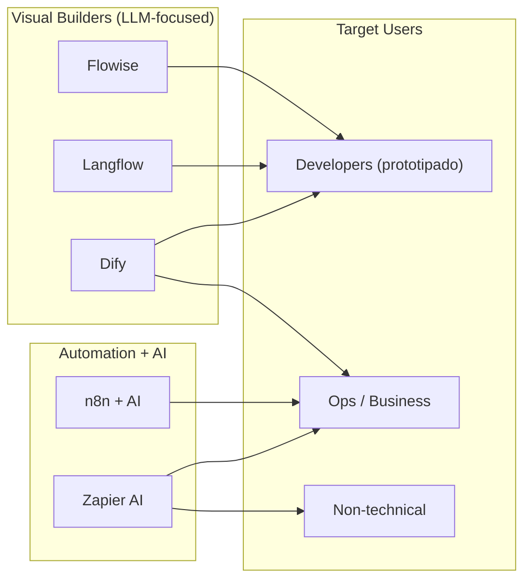
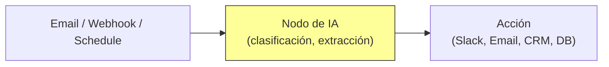

# Herramientas No-Code para IA

> [!abstract] Resumen
> Las herramientas *no-code* y *low-code* para IA permiten construir aplicaciones basadas en LLMs ==sin escribir código tradicional==. Este espacio incluye: **Flowise** (interfaz visual para LangChain), **Langflow** (constructor visual de flujos LLM), **n8n + AI** (automatización de workflows con nodos de IA), **Zapier AI** (acciones de IA en automatizaciones), y **Dify** (plataforma LLMOps con builder visual). Son útiles para ==prototipado rápido y automatizaciones simples==, pero tienen limitaciones importantes para producción. ^resumen

---

## El espacio no-code/low-code para IA

El auge de los LLMs ha creado una demanda de herramientas que permitan a ==no-programadores== (o programadores que quieren velocidad) construir aplicaciones de IA. Estas herramientas comparten una filosofía: conectar componentes visualmente en lugar de escribir código.

> [!info] ¿Por qué importa el no-code para IA?
> 1. **Democratización**: permite que analistas, PMs, y no-técnicos ==experimenten con LLMs==
> 2. **Velocidad de prototipado**: una demo que tomaría días en código puede construirse en ==horas con visual builders==
> 3. **Exploración**: facilita probar diferentes prompts, modelos y flujos sin commitment de código
> 4. **Automatización**: integra IA en workflows existentes de negocio (CRM, email, etc.)



---

## Flowise

**Flowise**[^1] es una ==interfaz visual drag-and-drop para LangChain==, el framework de Python/JavaScript para construir aplicaciones con LLMs.

### Características

| Feature | Descripción |
|---|---|
| UI Visual | ==Drag-and-drop== de nodos LangChain |
| Chatflows | Flujos de conversación multi-paso |
| Agentflows | Flujos agenticos con herramientas |
| Document loaders | PDF, Word, web scraping, etc. |
| Vector stores | ==Pinecone, Weaviate, Chroma== |
| Modelos | OpenAI, Anthropic, Ollama, HuggingFace |
| API Output | REST API automática para cada flow |
| Marketplace | Plantillas compartidas por la comunidad |

> [!example]- Ejemplo: RAG chatbot con Flowise
> ```
> Flujo visual (representación textual):
>
> [PDF Loader] → [Text Splitter (1000 chars)]
>       ↓
> [OpenAI Embeddings] → [Chroma Vector Store]
>       ↓
> [Conversational Retrieval Chain]
>       ↓
> [ChatOpenAI (gpt-4o)] → [Response]
>
> Configuración:
> - PDF: documentación técnica del producto
> - Chunk size: 1000 chars, overlap: 200
> - Embedding model: text-embedding-3-small
> - LLM: gpt-4o, temperature: 0.3
> - Vector store: Chroma (local)
>
> Resultado: chatbot que responde preguntas
> sobre tu documentación técnica en minutos.
> ```

> [!tip] Cuándo usar Flowise
> Flowise es ideal cuando:
> - Conoces LangChain conceptualmente pero quieres ==iterar rápido visualmente==
> - Necesitas un prototipo de RAG chatbot en horas, no días
> - Quieres experimentar con diferentes configuraciones de chunking, embeddings y prompts
> - Necesitas una API REST automática para el chatbot

**Pricing**: ==Gratis (open source, self-hosted)==. FlowiseAI Cloud disponible para hosting managed.

---

## Langflow

**Langflow**[^2] es otro constructor visual para flujos de LLM, originalmente basado en LangChain pero ahora con su ==propio runtime==.

### Diferencias con Flowise

| Aspecto | Flowise | ==Langflow== |
|---|---|---|
| Base | LangChain puro | Runtime propio (post-LangChain) |
| UI | Funcional | ==Más pulido== |
| Componentes custom | Limitado | ==Python code blocks== |
| Deploy | Docker | Docker + ==DataStax Cloud== |
| Comunidad | Grande | Creciente |
| Empresa | Open source community | ==DataStax (respaldado)== |

> [!info] De LangChain a runtime propio
> Langflow originalmente era un frontend para LangChain, pero ha evolucionado hacia un runtime propio que puede ejecutar componentes sin depender de LangChain. Esto le da ==más flexibilidad== pero también significa que no siempre soporta los últimos features de LangChain inmediatamente.

**Pricing**: ==Gratis (open source)==. DataStax Cloud ofrece hosting managed.

---

## n8n + AI

**n8n**[^3] es una plataforma de ==automatización de workflows== (similar a Zapier pero self-hosted y open source) que ha añadido nodos de IA.

### Nodos de IA disponibles

| Nodo | Función |
|---|---|
| AI Agent | Agente con herramientas (similar a LangChain agent) |
| Chat Model | ==Conexión a cualquier LLM== |
| Embeddings | Generación de embeddings |
| Vector Store | Almacenamiento y búsqueda vectorial |
| Document Loader | Carga de documentos |
| Text Splitter | Chunking de texto |
| Output Parser | ==Structured output== |
| Memory | Memoria conversacional |
| Tool | Herramientas custom para el agente |

> [!tip] n8n para automatización de negocio con IA
> La fortaleza de n8n no es construir chatbots (para eso Flowise/Langflow son mejores). Su fortaleza es ==integrar IA en workflows de negocio existentes==:
> - Email recibido → clasificar con IA → route al equipo correcto
> - Issue creado → generar respuesta draft con IA → enviar para review
> - Documento subido → extraer datos con IA → llenar CRM
> - Formulario recibido → analizar sentimiento → alertar si negativo



**Pricing**: ==Gratis (self-hosted)==. n8n Cloud desde $20/mo.

---

## Zapier AI

**Zapier**[^4] ha integrado capacidades de IA en su plataforma de automatización:

- **AI Actions**: ejecutar prompts de IA dentro de Zaps
- **Natural Language Automation**: crear Zaps describiendo lo que quieres
- **AI Chatbots**: crear chatbots sin código
- **AI by Zapier**: nodos de IA nativos

> [!warning] Limitaciones de Zapier AI
> Zapier AI es ==la opción menos técnica== de esta lista, lo cual es tanto su fortaleza como su debilidad:
> - **Fortaleza**: cualquier persona puede usarlo
> - **Debilidad**: personalización limitada, no puedes elegir modelo, no puedes ajustar prompts de forma avanzada
> - **Coste**: Zapier es ==significativamente más caro== que n8n para volumen alto

**Pricing**: Desde $19.99/mo (incluye AI credits limitados). Enterprise custom.

---

## Dify

**Dify**[^5] es una plataforma ==LLMOps== con builder visual que aspira a cubrir todo el ciclo de vida de aplicaciones de IA:

### Capacidades

| Feature | Descripción |
|---|---|
| Visual Builder | ==Drag-and-drop de flujos== |
| Prompt Engineering | Editor de prompts con variables |
| RAG Pipeline | Pipeline de RAG configurable |
| Agent Builder | Constructor de agentes con herramientas |
| Datasets | Gestión de datos para RAG |
| Monitoring | ==Logs, métricas, costes== |
| API Deployment | API REST automática |
| Multi-model | ==OpenAI, Anthropic, local, etc.== |

> [!success] Dify como plataforma completa
> Dify se distingue de Flowise y Langflow porque cubre ==más allá de la construcción==: incluye monitoring, logging, gestión de datasets, y deployment. Es más una plataforma LLMOps que un simple visual builder.

**Pricing**: ==Gratis (self-hosted, open source)==. Dify Cloud desde $59/mo.

---

## Comparación completa

| Aspecto | Flowise | Langflow | n8n + AI | Zapier AI | ==Dify== |
|---|---|---|---|---|---|
| Open source | ==Sí== | ==Sí== | ==Sí== | No | ==Sí== |
| Visual builder | Sí | Sí | Sí | Sí | ==Sí== |
| Self-hosted | ==Sí== | ==Sí== | ==Sí== | No | ==Sí== |
| Foco | LLM flows | LLM flows | ==Workflows== | Workflows | ==LLMOps== |
| RAG | ==Sí== | Sí | Sí | Básico | ==Avanzado== |
| Agentes | Sí | Sí | Sí | No | Sí |
| Monitoring | No | Básico | Sí | Sí | ==Avanzado== |
| Multi-model | Sí | Sí | Sí | Limitado | ==Sí== |
| Non-AI integrations | Pocas | Pocas | ==400+== | ==7,000+== | Algunas |
| Producción-ready | Básico | Medio | ==Sí== | Sí | ==Sí== |
| Precio (self-hosted) | $0 | $0 | $0 | N/A | $0 |

---

## Cuándo no-code funciona vs cuándo necesitas código

> [!tip] La regla del 80/20
> Las herramientas no-code resuelven el ==80% de los casos de uso simples en el 20% del tiempo==. Pero para el 20% restante (personalización profunda, escala, edge cases), necesitas código.

| Escenario | No-code funciona? | Recomendación |
|---|---|---|
| Prototipo de chatbot RAG | ==Sí== | Flowise o Dify |
| Automatización email + IA | ==Sí== | n8n |
| Clasificación de tickets | ==Sí== | Dify o n8n |
| Agente de codificación | ==No== | [[architect-overview]], [[claude-code]] |
| Pipeline de datos complejo | Parcialmente | Código + n8n |
| Aplicación web con IA | ==No== | [[vercel-ai-sdk]] |
| Fine-tuning de modelos | ==No== | [[huggingface-ecosystem]] |
| Escaneo de seguridad | ==No== | [[vigil-overview]] |
| Compliance | ==No== | [[licit-overview]] |

---

## Limitaciones honestas

> [!failure] Problemas comunes del no-code para IA
> 1. **Escala**: las herramientas no-code ==no escalan bien== bajo carga alta. Flowise y Langflow pueden tener problemas con 100+ requests/segundo
> 2. **Debugging**: cuando algo falla, ==debuggear flujos visuales es difícil==. Los logs son menos granulares que en código
> 3. **Versionado**: los flujos visuales ==no se versionan bien en git==. Algunos guardan en JSON, pero los diffs son difíciles de leer
> 4. **Testing**: ==no puedes escribir tests unitarios== para flujos visuales. La verificación es manual
> 5. **Vendor lock-in**: migrar de una herramienta no-code a otra (o a código) ==requiere reconstruir todo==
> 6. **Personalización limitada**: cuando necesitas lógica que no encaja en los nodos disponibles, ==te quedas atascado==
> 7. **Seguridad**: las herramientas no-code a menudo tienen ==gestión de secretos deficiente== (API keys en variables de entorno expuestas)
> 8. **Producción**: la mayoría ==no son production-ready== sin trabajo adicional (monitoring, alerting, scaling, failover)

> [!danger] No-code para producción
> ==No uses herramientas no-code para sistemas críticos de producción== sin:
> 1. Monitoring exhaustivo
> 2. Alertas configuradas
> 3. Plan de failover
> 4. Testing manual riguroso
> 5. Documentación del flujo
> 6. Plan de migración a código si escala

---

## Quick Start — Dify (recomendado)

> [!example]- Instalar y probar Dify en 5 minutos
> ```bash
> # Clonar el repo
> git clone https://github.com/langgenius/dify.git
> cd dify/docker
>
> # Copiar configuración
> cp .env.example .env
>
> # Editar .env para añadir API keys
> # OPENAI_API_KEY=sk-...
>
> # Iniciar con Docker Compose
> docker compose up -d
>
> # Acceder en http://localhost:3000
> # Crear cuenta de admin en primera visita
> ```
>
> ### Primer chatbot RAG
> 1. En el dashboard, crea una nueva app "Chatbot"
> 2. Añade un dataset: sube un PDF de documentación
> 3. Dify automáticamente:
>    - Chunking del documento
>    - Generación de embeddings
>    - Almacenamiento en vector store
> 4. Configura el prompt del sistema
> 5. Publica → obtienes un API endpoint + web widget
>
> Tiempo total: ~10 minutos (sin contar descarga de Docker)

---

## Relación con el ecosistema

Las herramientas no-code sirven como ==punto de entrada y prototipado== en el ecosistema.

- **[[intake-overview]]**: las herramientas no-code pueden usarse para ==prototipar la experiencia de usuario== de intake antes de implementar el código. Un flujo de Dify puede simular cómo intake procesaría requisitos.
- **[[architect-overview]]**: architect es la antítesis del no-code — es ==código y pipelines reproducibles==. Sin embargo, las herramientas no-code pueden complementar architect para tareas simples que no justifican un pipeline completo.
- **[[vigil-overview]]**: las herramientas no-code ==generalmente no incluyen guardrails de seguridad==. Si usas una herramienta no-code para generar código (poco común), vigil debería escanear el output.
- **[[licit-overview]]**: el uso de herramientas no-code con LLMs tiene ==implicaciones de compliance==: los datos pasan por múltiples servicios (la herramienta no-code + el proveedor de LLM), multiplicando los puntos de riesgo.

---

## Estado de mantenimiento

> [!success] Todas activamente mantenidas (junio 2025)
> | Herramienta | GitHub Stars | Cadencia | Financiación |
> |---|---|---|---|
> | Flowise | 30K+ | Semanal | Community + sponsors |
> | Langflow | 25K+ | Semanal | DataStax |
> | n8n | 45K+ | Semanal | $50M+ raised |
> | Dify | 40K+ | Semanal | $50M+ raised |
> | Zapier | N/A (closed) | Continuo | Profitable |

---

## Enlaces y referencias

> [!quote]- Bibliografía y recursos
> - [^1]: Flowise — [flowiseai.com](https://flowiseai.com)
> - [^2]: Langflow — [langflow.org](https://langflow.org)
> - [^3]: n8n — [n8n.io](https://n8n.io)
> - [^4]: Zapier AI — [zapier.com/ai](https://zapier.com/ai)
> - [^5]: Dify — [dify.ai](https://dify.ai)
> - "No-Code AI: Promise and Reality" — análisis de mercado, 2025
> - [[ai-code-tools-comparison]] — comparación de herramientas de código (no no-code)
> - [[vercel-ai-sdk]] — alternativa code-first para apps web con IA

[^1]: Flowise, interfaz visual para LangChain. Open source.
[^2]: Langflow, visual builder para flujos LLM. Respaldado por DataStax.
[^3]: n8n, plataforma de automatización de workflows. Open source.
[^4]: Zapier, plataforma de automatización SaaS.
[^5]: Dify, plataforma LLMOps open source.
