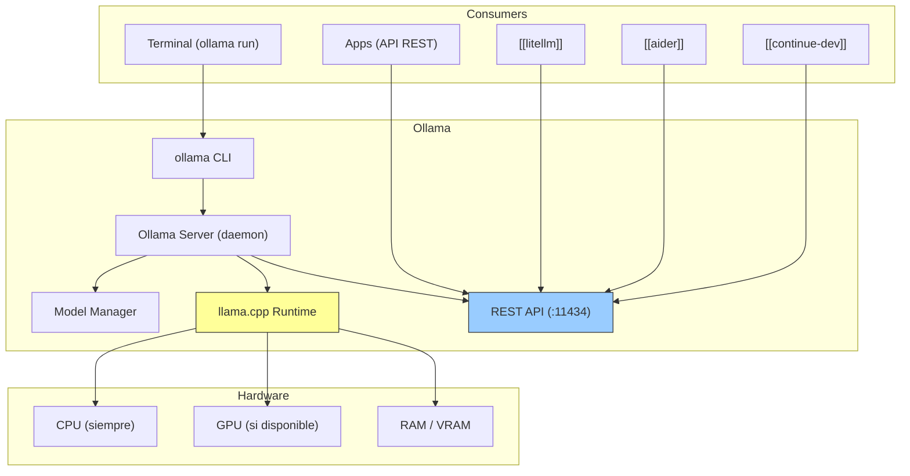
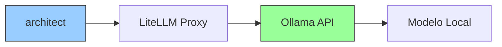

# Ollama

> [!abstract] Resumen
> **Ollama** es la forma ==más simple de ejecutar LLMs localmente==. Funciona como un "Docker para modelos de lenguaje": descargas modelos con un comando (`ollama pull`), los ejecutas con otro (`ollama run`), y expone una API REST compatible con OpenAI. Soporta Llama, Mistral, Phi, Gemma, Qwen, CodeLlama, DeepSeek, y docenas más. Su backend es *llama.cpp*, optimizado para CPU y GPU. Es ==clave para desarrollo local sin coste de API== y [[architect-overview]] puede usarlo via [[litellm]] para iteración rápida sin gastar tokens cloud. Limitaciones: inferencia más lenta que cloud, sin soporte multi-GPU real, y modelos grandes requieren hardware potente. ^resumen

---

## Qué es Ollama

Ollama[^1] democratiza el acceso a LLMs eliminando la complejidad de configurar modelos localmente. Antes de Ollama, ejecutar un modelo como Llama 2 localmente requería:
1. Descargar pesos del modelo de [[huggingface-ecosystem|HuggingFace]]
2. Instalar dependencias de Python (torch, transformers, etc.)
3. Configurar cuantización
4. Gestionar VRAM y GPU
5. Crear un script de inferencia

Con Ollama, todo se reduce a:
```bash
ollama run llama3.1
```

> [!info] El "Docker de los LLMs"
> La analogía con Docker es intencional y precisa:
> - `docker pull` → `ollama pull` (descargar)
> - `docker run` → `ollama run` (ejecutar)
> - `Dockerfile` → `Modelfile` (personalizar)
> - Docker Hub → Ollama Library (catálogo)
> - Container runtime → llama.cpp (motor)

---

## Modelos soportados

Ollama soporta una ==biblioteca creciente de modelos== pre-cuantizados y optimizados:

| Modelo | Parámetros | VRAM (4-bit) | Uso principal |
|---|---|---|---|
| Llama 3.1 | 8B / 70B / 405B | 5GB / 40GB / 230GB | ==General, mejor open source== |
| Mistral | 7B | 4.5GB | General, rápido |
| Mixtral | 8x7B (MoE) | 26GB | General, multi-experto |
| Phi-3 | 3.8B / 14B | 2.5GB / 8GB | ==Compacto, eficiente== |
| Gemma 2 | 2B / 9B / 27B | 1.5GB / 6GB / 16GB | Google, multilingüe |
| Qwen 2 | 7B / 72B | 4.5GB / 40GB | Multilingüe, código |
| CodeLlama | 7B / 34B | 4.5GB / 20GB | ==Código== |
| DeepSeek Coder V2 | 16B | 10GB | Código, muy capaz |
| StarCoder 2 | 3B / 15B | 2GB / 9GB | Código, autocomplete |
| Llava | 7B / 13B | 5GB / 8GB | ==Multimodal (texto + imagen)== |
| Nomic Embed | 137M | <1GB | Embeddings |

> [!tip] Qué modelo elegir
> - **Para chat general**: Llama 3.1 8B (==el mejor balance calidad/tamaño==)
> - **Para código**: DeepSeek Coder V2 16B o CodeLlama 34B
> - **Para hardware limitado**: Phi-3 3.8B (funciona hasta en 4GB RAM)
> - **Para embeddings**: nomic-embed-text
> - **Para multimodal**: Llava

---

## Arquitectura



> [!info] llama.cpp como motor
> Ollama usa ==llama.cpp== como su motor de inferencia. llama.cpp es una implementación en C/C++ optimizada para ejecutar modelos transformer en hardware consumer. Soporta:
> - Cuantización (4-bit, 5-bit, 8-bit)
> - Aceleración GPU (CUDA, Metal, ROCm, Vulkan)
> - CPU optimizado (AVX, AVX2, AVX-512)
> - Memory-mapping para carga rápida de modelos

---

## Cómo architect usa Ollama

> [!tip] Ollama + LiteLLM + architect: desarrollo local sin coste
> La integración de [[architect-overview]] con Ollama via [[litellm]] permite un flujo de desarrollo ==completamente local y sin coste de API==:



```yaml
# Configuración de LiteLLM para usar Ollama
model_list:
  - model_name: "local-dev"
    litellm_params:
      model: "ollama/llama3.1"
      api_base: "http://localhost:11434"

  - model_name: "local-code"
    litellm_params:
      model: "ollama/deepseek-coder-v2"
      api_base: "http://localhost:11434"

# Fallback a cloud cuando la calidad local no es suficiente
litellm_settings:
  fallbacks:
    - model_name: "local-dev"
      fallback_models: ["claude-sonnet"]  # Cloud backup
```

> [!warning] Calidad local vs cloud
> Los modelos locales via Ollama son ==significativamente menos capaces que Claude Opus/Sonnet o GPT-4o==. Para:
> - **Prototyping, testing, iteración rápida**: Ollama es excelente
> - **Tareas complejas de producción**: usa modelos cloud
> - **Desarrollo de pipelines**: Ollama para validar el flujo, cloud para ejecución final

---

## API REST

Ollama expone una API compatible con OpenAI en `http://localhost:11434`:

> [!example]- Endpoints principales de la API
> ```bash
> # Generar (completion)
> curl http://localhost:11434/api/generate -d '{
>   "model": "llama3.1",
>   "prompt": "Explica qué es Kubernetes en 3 frases",
>   "stream": false
> }'
>
> # Chat (format OpenAI-compatible)
> curl http://localhost:11434/v1/chat/completions -d '{
>   "model": "llama3.1",
>   "messages": [
>     {"role": "system", "content": "Eres un asistente técnico."},
>     {"role": "user", "content": "Explica Docker vs Kubernetes"}
>   ]
> }'
>
> # Embeddings
> curl http://localhost:11434/api/embeddings -d '{
>   "model": "nomic-embed-text",
>   "prompt": "Texto para crear embedding"
> }'
>
> # Listar modelos disponibles
> curl http://localhost:11434/api/tags
>
> # Información de un modelo
> curl http://localhost:11434/api/show -d '{"name": "llama3.1"}'
> ```

---

## Modelfile — Personalización

Los *Modelfiles* permiten crear modelos personalizados, similar a un Dockerfile:

> [!example]- Ejemplo de Modelfile personalizado
> ```dockerfile
> # Modelfile para un asistente de código
> FROM deepseek-coder-v2
>
> # Parámetros de generación
> PARAMETER temperature 0.2
> PARAMETER top_p 0.9
> PARAMETER top_k 40
> PARAMETER num_ctx 8192
>
> # System prompt
> SYSTEM """
> Eres un asistente de programación especializado en Python y TypeScript.
> Reglas:
> - Responde siempre en español
> - Incluye type hints en Python
> - Sigue PEP 8 para Python y Prettier para TypeScript
> - Si no sabes algo, dilo claramente
> - Incluye tests cuando sea apropiado
> """
>
> # Template personalizado (opcional)
> TEMPLATE """{{ if .System }}<|system|>
> {{ .System }}<|end|>
> {{ end }}{{ if .Prompt }}<|user|>
> {{ .Prompt }}<|end|>
> {{ end }}<|assistant|>
> {{ .Response }}<|end|>
> """
> ```
>
> ```bash
> # Crear el modelo personalizado
> ollama create mi-code-assistant -f Modelfile
>
> # Usar el modelo
> ollama run mi-code-assistant
> ```

---

## Requisitos de hardware

| Modelo (cuantizado 4-bit) | RAM mínima | GPU recomendada | CPU aceptable? |
|---|---|---|---|
| Phi-3 3.8B | ==4GB== | Cualquier | ==Sí== |
| Llama 3.1 8B | 8GB | 6GB+ VRAM | Sí (lento) |
| Mistral 7B | 8GB | 6GB+ VRAM | Sí (lento) |
| DeepSeek Coder V2 16B | ==16GB== | 10GB+ VRAM | Aceptable |
| Llama 3.1 70B | 48GB | ==48GB+ VRAM== | No práctico |
| Llama 3.1 405B | 256GB | Multi-GPU | No |

> [!question] CPU vs GPU para Ollama
> - **CPU**: funciona para ==todos los modelos==, pero la velocidad es de 2-15 tokens/segundo dependiendo del modelo y CPU. Aceptable para desarrollo, no para producción
> - **GPU (NVIDIA)**: 20-80+ tokens/segundo. ==Recomendado para uso frecuente==
> - **GPU (Apple Silicon)**: Metal acceleration es excelente. MacBook Pro M2/M3 con 32GB puede correr modelos de 13B cómodamente
> - **GPU (AMD)**: soporte via ROCm, menos maduro que CUDA

---

## Pricing

> [!warning] Ollama es 100% gratuito — junio 2025
> No hay coste de software. Solo el coste de tu hardware.

| Componente | Coste |
|---|---|
| Ollama software | ==$0== |
| Modelos | ==$0== (descargas gratuitas) |
| API usage | $0 (local) |
| Hardware | ==Tu inversión existente== |

Comparación de coste mensual (uso moderado):

| Configuración | Coste/mes |
|---|---|
| Ollama local (hardware existente) | ==$0== |
| Ollama local (GPU dedicada) | ~$8 electricidad |
| OpenAI API (uso moderado) | $30-100 |
| Anthropic API (uso moderado) | $20-80 |
| Cloud GPU (RunPod) | $50-200 |

---

## Quick Start

> [!example]- Instalación y primer uso de Ollama
> ### Instalación
> ```bash
> # Linux
> curl -fsSL https://ollama.ai/install.sh | sh
>
> # macOS
> brew install ollama
> # O descargar desde ollama.ai
>
> # Windows
> # Descargar instalador desde ollama.ai
>
> # Verificar
> ollama --version
> ```
>
> ### Descargar y ejecutar primer modelo
> ```bash
> # Descargar Llama 3.1 8B (~4.7GB)
> ollama pull llama3.1
>
> # Ejecutar interactivamente
> ollama run llama3.1
> # >>> Escribe tu mensaje aquí
>
> # Ejecutar con prompt directo
> ollama run llama3.1 "Explica qué es un transformer"
> ```
>
> ### Modelos útiles para desarrollo
> ```bash
> # Modelo general (recomendado)
> ollama pull llama3.1
>
> # Modelo para código
> ollama pull deepseek-coder-v2
>
> # Modelo para embeddings
> ollama pull nomic-embed-text
>
> # Modelo compacto (hardware limitado)
> ollama pull phi3
>
> # Modelo multimodal (texto + imagen)
> ollama pull llava
> ```
>
> ### Usar con herramientas del ecosistema
> ```bash
> # Con aider
> aider --model ollama/llama3.1
>
> # Con Continue (VS Code)
> # En config.json:
> # { "models": [{ "provider": "ollama", "model": "llama3.1" }] }
>
> # Con LiteLLM
> litellm --model ollama/llama3.1 --port 4000
>
> # Con Python
> import openai
> client = openai.OpenAI(base_url="http://localhost:11434/v1", api_key="unused")
> response = client.chat.completions.create(
>     model="llama3.1",
>     messages=[{"role": "user", "content": "Hola!"}]
> )
> ```
>
> ### Gestión de modelos
> ```bash
> # Listar modelos instalados
> ollama list
>
> # Ver info de un modelo
> ollama show llama3.1
>
> # Eliminar un modelo
> ollama rm llama3.1
>
> # Copiar/renombrar modelo
> ollama cp llama3.1 mi-llama
>
> # Actualizar modelo
> ollama pull llama3.1  # re-descarga si hay actualización
> ```

---

## Comparación con alternativas

| Aspecto | ==Ollama== | LM Studio | vLLM | [[huggingface-ecosystem\|Transformers]] | llama.cpp directo |
|---|---|---|---|---|---|
| Facilidad | ==Máxima== | Alta | Media | Baja | Baja |
| GUI | No (CLI) | ==Sí== | No | No | No |
| API REST | ==Sí (OpenAI compat)== | Sí | Sí | No nativa | No |
| Rendimiento | Bueno | Bueno | ==Máximo== | Bueno | Excelente |
| Multi-GPU | No | No | ==Sí== | Sí | Limitado |
| Batching | Básico | No | ==Continuo== | Manual | No |
| Producción | Dev/staging | Dev | ==Sí== | Sí | No |
| Custom models | Modelfile | Limitado | Sí | ==Total== | Manual |
| Plataformas | Linux, Mac, Win | Mac, Win, Linux | ==Linux== | Todas | Todas |

---

## Limitaciones honestas

> [!failure] Lo que Ollama NO hace bien
> 1. **Inferencia lenta en CPU**: sin GPU, los modelos grandes son ==demasiado lentos para uso interactivo==. Un modelo de 7B en CPU puede tardar 10-30 segundos por respuesta
> 2. **Sin multi-GPU**: Ollama ==no distribuye modelos entre múltiples GPUs==. Para modelos grandes que no caben en una GPU, necesitas vLLM o TGI
> 3. **Calidad inferior a cloud**: los modelos locales que Ollama ejecuta son ==significativamente menos capaces== que Claude Opus o GPT-4o. No es un reemplazo, es un complemento
> 4. **Sin batching eficiente**: Ollama procesa ==una request a la vez== (en su mayor parte). Para servir múltiples usuarios concurrentes, vLLM es mejor
> 5. **Catálogo limitado**: comparado con los 1M+ modelos de [[huggingface-ecosystem]], Ollama tiene ==~100 modelos optimizados==. Puedes importar desde HuggingFace, pero requiere conversión
> 6. **Sin fine-tuning**: Ollama ==solo hace inferencia==, no entrenamiento ni fine-tuning. Para eso, usa [[huggingface-ecosystem|Transformers + PEFT]]
> 7. **Modelos grandes = hardware caro**: correr Llama 3.1 70B requiere una GPU de ==48GB+ VRAM== ($2,000+ solo la GPU)
> 8. **Actualizaciones de modelos**: cuando sale una nueva versión de un modelo, necesitas ==re-descargar manualmente==

> [!danger] No para producción sin más
> Ollama está diseñado para ==desarrollo y experimentación==, no para servir tráfico de producción. Si necesitas servir modelos a usuarios finales:
> - Usa **vLLM** para inferencia eficiente con batching
> - Usa **TGI** (Text Generation Inference de HuggingFace) para deploy managed
> - Usa **[[modal-replicate|Modal/Replicate]]** para serverless
>
> Ollama en producción es un anti-patrón excepto para herramientas internas de bajo tráfico.

---

## Relación con el ecosistema

Ollama es el ==puente entre el mundo de modelos open source y las herramientas de desarrollo==.

- **[[intake-overview]]**: Ollama permite prototipar flujos de intake ==sin coste de API==, usando modelos locales para validar que el pipeline funciona antes de usar modelos cloud más capaces.
- **[[architect-overview]]**: architect accede a Ollama via [[litellm]], permitiendo ==iteración rápida y gratuita== durante el desarrollo de pipelines. El flujo recomendado es: desarrollar y testear con Ollama, desplegar en producción con modelos cloud.
- **[[vigil-overview]]**: vigil es determinista y no usa LLMs, pero ==los modelos servidos por Ollama generan código== que vigil puede necesitar escanear. La combinación es: generar con Ollama → escanear con vigil.
- **[[licit-overview]]**: Ollama tiene ==ventajas importantes para compliance==: todo se ejecuta localmente, no hay datos enviados a terceros, y los modelos usados son open source con licencias conocidas. licit puede documentar esto como mitigación de riesgos de privacidad.

---

## Estado de mantenimiento

> [!success] Muy activamente mantenido
> - **Empresa**: Ollama (startup independiente)
> - **Licencia**: MIT
> - **GitHub stars**: 90K+ (junio 2025)
> - **Contribuidores**: 400+
> - **Cadencia**: releases frecuentes, nuevos modelos semanalmente
> - **Comunidad**: Discord muy activo

---

## Enlaces y referencias

> [!quote]- Bibliografía y recursos
> - [^1]: Ollama oficial — [ollama.ai](https://ollama.ai)
> - GitHub — [github.com/ollama/ollama](https://github.com/ollama/ollama)
> - Biblioteca de modelos — [ollama.ai/library](https://ollama.ai/library)
> - llama.cpp — [github.com/ggerganov/llama.cpp](https://github.com/ggerganov/llama.cpp)
> - "Running LLMs Locally: A Practical Guide" — varios autores, 2024
> - [[litellm]] — proxy para usar Ollama con herramientas externas
> - [[architect-overview]] — usa Ollama para desarrollo local

[^1]: Ollama, herramienta open source para ejecutar LLMs localmente.
