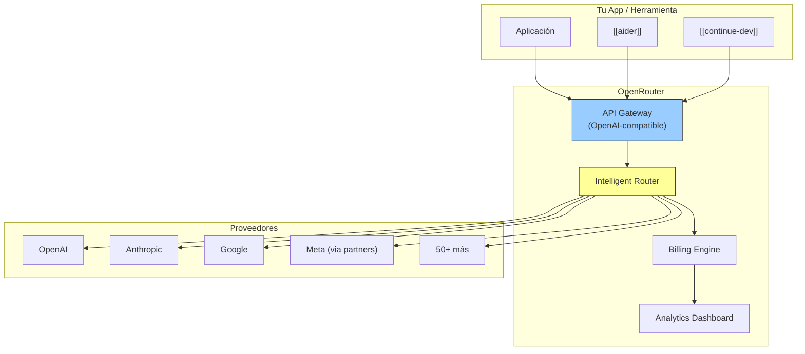

# OpenRouter

> [!abstract] Resumen
> **OpenRouter** es un ==marketplace y API unificada para 200+ modelos de LLM== de múltiples proveedores. Funciona como un "OpenTable para LLMs": una sola API key te da acceso a modelos de OpenAI, Anthropic, Google, Meta, Mistral, y muchos más, con ==pricing transparente y sin suscripciones==. Se diferencia de [[litellm]] en que es un servicio cloud managed (no self-hosted), con routing inteligente y ranking de modelos. Es útil para experimentación con múltiples modelos, para aplicaciones que necesitan acceso rápido a modelos diversos, y como ==fallback de respaldo==. ^resumen

---

## Qué es OpenRouter

OpenRouter[^1] resuelve el problema de la ==fragmentación de APIs== de una forma diferente a [[litellm]]:

| Aspecto | [[litellm]] | ==OpenRouter== |
|---|---|---|
| Tipo | Self-hosted proxy (OS) | ==Cloud marketplace== |
| Setup | Instalar, configurar, mantener | ==Una API key== |
| Billing | Facturas de cada proveedor | ==Factura única OpenRouter== |
| Markup | $0 (directo al proveedor) | ==~5-15% markup== |
| Control | Total | Limitado |
| Infraestructura | Tu responsabilidad | ==OpenRouter la gestiona== |
| Fallbacks custom | Sí | Automático (limitado) |
| Modelos | 100+ proveedores | ==200+ modelos== |

> [!info] ¿Por qué pagar markup?
> El markup de OpenRouter (~5-15% sobre precio del proveedor) compra:
> 1. ==Facturación única== en lugar de 10+ cuentas de proveedores
> 2. Gestión de API keys centralizada
> 3. Acceso a modelos que requieren aprobación (e.g., modelos gated de Meta)
> 4. Routing automático entre instancias
> 5. Dashboard con analytics de uso
>
> Para experimentación y equipos pequeños, ==la conveniencia justifica el markup==. Para producción con alto volumen, [[litellm]] con facturación directa es más económico.

---

## Modelos disponibles

OpenRouter organiza modelos por proveedor y capacidad:

| Proveedor | Modelos destacados | Categoría |
|---|---|---|
| OpenAI | GPT-4o, GPT-4 Turbo, o1 | ==Referencia== |
| Anthropic | Claude Opus, Sonnet, Haiku | ==Referencia== |
| Google | Gemini Pro, Flash, Ultra | Tier 1 |
| Meta | Llama 3.1 (8B, 70B, 405B) | ==Open source== |
| Mistral | Large, Medium, Small, Codestral | Tier 1 |
| DeepSeek | DeepSeek V2, Coder | ==Económico== |
| Cohere | Command R+, R | Especializado |
| Nous | Hermes, Capybara | Fine-tuned OS |
| Qwen | Qwen2 72B, 7B | Multilingüe |
| Yi | Yi-34B, Yi-1.5 | Multilingüe |
| Phind | CodeLlama-34B-v2 | Código |

> [!tip] Modelos "free" en OpenRouter
> OpenRouter ofrece algunos modelos como ==gratuitos== (financiados por la plataforma o los proveedores como promoción). Estos cambian frecuentemente pero son útiles para experimentación sin coste:
> - Llama 3.1 8B (free)
> - Mistral 7B (free)
> - Gemma 2 9B (free)
> - Phi-3 (free)

---

## Arquitectura



### Routing inteligente

OpenRouter puede hacer ==routing automático== entre instancias del mismo modelo:

```python
# Pides Claude Sonnet
# OpenRouter rutea a la instancia con:
# - Menor latencia
# - Mayor disponibilidad
# - Si una instancia está saturada, usa otra
```

> [!info] Modelo "auto"
> OpenRouter ofrece un modelo especial `openrouter/auto` que ==selecciona automáticamente el mejor modelo== basándose en tu prompt, presupuesto, y preferencias configuradas. Es experimental pero interesante para aplicaciones que no necesitan un modelo específico.

---

## Pricing

> [!warning] Precios verificados en junio 2025 — pueden cambiar
> Consulta [openrouter.ai/models](https://openrouter.ai/models) para precios actualizados.

| Modelo | Input (/1M tokens) | Output (/1M tokens) | ==vs Directo== |
|---|---|---|---|
| GPT-4o | $2.50 | $10.00 | ~misma (+5%) |
| Claude Sonnet 3.5 | $3.00 | $15.00 | ~misma (+5%) |
| Claude Opus | $15.00 | $75.00 | ~misma (+5%) |
| Llama 3.1 70B | $0.59 | $0.79 | ==Buen precio== |
| Llama 3.1 8B | ==Free o $0.05== | ==Free o $0.05== | Competitivo |
| Mistral Large | $2.00 | $6.00 | ~misma |
| DeepSeek V2 | $0.14 | $0.28 | ==Muy barato== |
| Gemini Flash | $0.075 | $0.30 | ~misma |

> [!question] ¿Vale la pena el markup?
> **Sí**, cuando:
> - Quieres ==probar muchos modelos== sin abrir cuentas en cada proveedor
> - Tu volumen es bajo (el markup absoluto es pequeño)
> - Valoras la ==facturación centralizada==
> - Necesitas acceso a modelos que requieren aprobación
>
> **No**, cuando:
> - Tu volumen es alto (el markup se acumula)
> - Ya tienes cuentas en los proveedores principales
> - Necesitas ==control granular== sobre fallbacks y routing (usa [[litellm]])

**Facturación**: Pay-per-use, sin suscripción. Depósito mínimo con tarjeta o crypto.

---

## Quick Start

> [!example]- Configuración y primer uso de OpenRouter
> ### Obtener API key
> 1. Registrarse en [openrouter.ai](https://openrouter.ai)
> 2. Ir a Settings → API Keys → Create Key
> 3. Añadir créditos (mínimo $5)
>
> ### Uso directo (OpenAI-compatible)
> ```python
> from openai import OpenAI
>
> client = OpenAI(
>     base_url="https://openrouter.ai/api/v1",
>     api_key="sk-or-v1-...",
> )
>
> response = client.chat.completions.create(
>     model="anthropic/claude-3.5-sonnet",  # Cualquier modelo del catálogo
>     messages=[
>         {"role": "user", "content": "Explica SOLID en Python"}
>     ]
> )
> print(response.choices[0].message.content)
> ```
>
> ### Con curl
> ```bash
> curl https://openrouter.ai/api/v1/chat/completions \
>   -H "Content-Type: application/json" \
>   -H "Authorization: Bearer sk-or-v1-..." \
>   -d '{
>     "model": "anthropic/claude-3.5-sonnet",
>     "messages": [
>       {"role": "user", "content": "Hola, qué puedes hacer?"}
>     ]
>   }'
> ```
>
> ### Con herramientas del ecosistema
> ```bash
> # Con aider
> export OPENROUTER_API_KEY="sk-or-v1-..."
> aider --model openrouter/anthropic/claude-3.5-sonnet
>
> # Con Continue (config.json)
> {
>   "models": [{
>     "title": "Claude via OpenRouter",
>     "provider": "openrouter",
>     "model": "anthropic/claude-3.5-sonnet",
>     "apiKey": "sk-or-v1-..."
>   }]
> }
>
> # Con LiteLLM
> litellm --model openrouter/anthropic/claude-3.5-sonnet
> ```

---

## Comparación: OpenRouter vs LiteLLM

Esta comparación es crítica porque ambos resuelven el mismo problema (acceso multi-modelo) de formas diferentes:

| Aspecto | ==OpenRouter== | [[litellm]] |
|---|---|---|
| Deployment | ==Cloud (managed)== | Self-hosted |
| Setup | 5 minutos | 30+ minutos |
| Billing | ==Centralizada== | Cada proveedor |
| Markup | ~5-15% | ==$0== |
| Fallbacks custom | Limitado | ==Total control== |
| Budget management | Básico | ==Avanzado== |
| Caché | No | ==Sí== |
| Load balancing | ==Automático== | Configurable |
| Open source | No | ==Sí== |
| Latencia adicional | 50-100ms | ==1-5ms== |
| Modelos gratuitos | ==Sí (algunos)== | N/A |
| Analytics | ==Dashboard== | Logs/custom |

> [!tip] Cuándo usar cada uno
> - **OpenRouter**: desarrollo, prototipado, equipos pequeños que ==no quieren gestionar infraestructura==
> - **LiteLLM**: producción, equipos con DevOps, ==cuando el coste o el control son prioridad==
> - **Ambos**: usa OpenRouter como ==fallback en LiteLLM== — si tu proveedor directo falla, LiteLLM puede rutear a OpenRouter como respaldo

---

## Funcionalidades avanzadas

### Model ranking

OpenRouter mantiene un ==ranking actualizado de modelos== basado en evaluaciones de la comunidad y benchmarks:

```
Top modelos para coding (junio 2025):
1. Claude 3.5 Sonnet → Score: 95/100
2. GPT-4o → Score: 92/100
3. Claude 3 Opus → Score: 90/100
4. DeepSeek Coder V2 → Score: 85/100
5. Llama 3.1 405B → Score: 82/100
```

### Streaming

OpenRouter soporta ==streaming SSE== completo, compatible con el formato de OpenAI:

```python
response = client.chat.completions.create(
    model="anthropic/claude-3.5-sonnet",
    messages=[{"role": "user", "content": "Escribe un poema"}],
    stream=True
)

for chunk in response:
    if chunk.choices[0].delta.content:
        print(chunk.choices[0].delta.content, end="", flush=True)
```

### Provider preferences

Puedes especificar ==preferencias de proveedor== para modelos que están disponibles en múltiples backends:

```python
response = client.chat.completions.create(
    model="meta-llama/llama-3.1-70b-instruct",
    messages=[...],
    extra_body={
        "provider": {
            "order": ["Together", "Fireworks", "Lepton"],  # Preferencia de backend
            "allow_fallbacks": True
        }
    }
)
```

---

## Limitaciones honestas

> [!failure] Lo que OpenRouter NO hace bien
> 1. **Markup sobre precio directo**: para ==volumen alto, el markup se nota==. $1,000 en tokens directos = ~$1,050-1,150 via OpenRouter
> 2. **Latencia adicional**: el hop extra por OpenRouter añade ==50-100ms de latencia==. Para aplicaciones sensibles a latencia, esto importa
> 3. **Dependencia de un tercero**: si OpenRouter tiene ==problemas de disponibilidad, todas tus llamadas fallan==. Añade un single point of failure
> 4. **Control limitado**: no puedes configurar ==fallbacks complejos, caché, o budget management== como con [[litellm]]
> 5. **Datos pasan por OpenRouter**: tus prompts y respuestas ==pasan por los servidores de OpenRouter== antes de llegar al proveedor. Esto añade otro punto de riesgo de privacidad
> 6. **Modelos gratuitos inestables**: los modelos gratuitos pueden ==desaparecer o cambiar sin aviso==
> 7. **Sin caché**: no hay caché de respuestas, lo que significa ==pagar por la misma query repetida==
> 8. **Soporte limitado**: como servicio indie, el soporte ==no es empresarial==

> [!warning] Privacy implications
> Usar OpenRouter significa que ==tus datos pasan por un intermediario adicional==. La cadena es:
> ```
> Tu app → OpenRouter → Proveedor LLM
> ```
> En lugar de:
> ```
> Tu app → Proveedor LLM
> ```
> Para datos sensibles, esto puede violar políticas de seguridad corporativas. Verifica los ToS de OpenRouter respecto a data retention.

---

## Relación con el ecosistema

OpenRouter es un ==facilitador de acceso multi-modelo== en el ecosistema.

- **[[intake-overview]]**: OpenRouter puede ser el backend de intake para ==experimentar rápidamente con diferentes modelos== durante el desarrollo del pipeline de requisitos, sin necesidad de configurar [[litellm]].
- **[[architect-overview]]**: architect usa [[litellm]] como proxy, pero ==LiteLLM puede usar OpenRouter como proveedor==, creando una cadena: architect → LiteLLM → OpenRouter → Proveedor. Esto es útil como fallback ultimate.
- **[[vigil-overview]]**: vigil no interactúa con OpenRouter directamente. Sin embargo, los modelos accedidos via OpenRouter ==generan código que vigil debería escanear==.
- **[[licit-overview]]**: el uso de OpenRouter añade un ==intermediario más en la cadena de procesamiento de datos==. licit debe documentar esto para compliance, especialmente la jurisdicción de OpenRouter (US) y sus políticas de data retention.

---

## Estado de mantenimiento

> [!success] Activamente mantenido
> - **Empresa**: OpenRouter (startup independiente)
> - **Financiación**: bootstrapped + revenue
> - **Estado**: estable, creciendo
> - **Nuevos modelos**: añadidos ==dentro de días del lanzamiento==
> - **Uptime**: generalmente >99.5%

---

## Enlaces y referencias

> [!quote]- Bibliografía y recursos
> - [^1]: OpenRouter oficial — [openrouter.ai](https://openrouter.ai)
> - Documentación — [openrouter.ai/docs](https://openrouter.ai/docs)
> - Catálogo de modelos — [openrouter.ai/models](https://openrouter.ai/models)
> - "OpenRouter vs LiteLLM: Which Multi-Model Gateway?" — comparación, 2025
> - [[litellm]] — alternativa self-hosted
> - [[aider]] — herramienta que soporta OpenRouter nativamente

[^1]: OpenRouter, marketplace de APIs de LLM.
