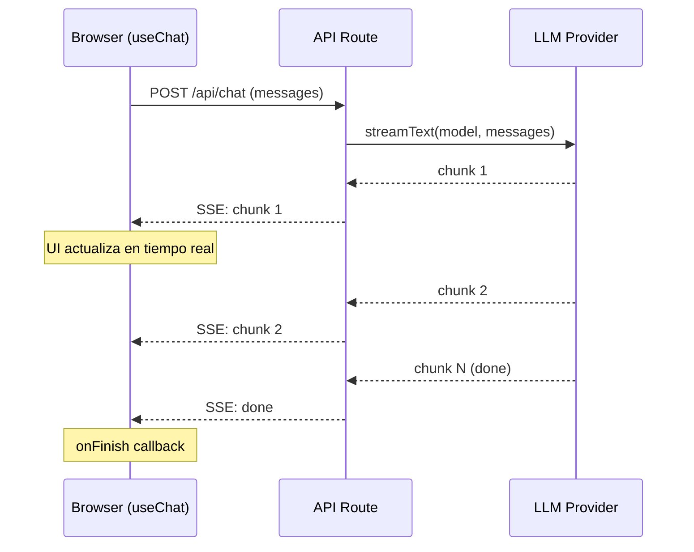

# Vercel AI SDK

> [!abstract] Resumen
> **Vercel AI SDK** es el framework de referencia para construir ==aplicaciones web con IA==. Proporciona hooks de React (`useChat`, `useCompletion`), streaming nativo, *tool calling*, middleware, *structured output*, y soporte multi-proveedor (OpenAI, Anthropic, Google, custom). Compatible con React, Next.js, Svelte, Vue, y Nuxt. Su fortaleza es la ==mejor developer experience (DX) para web AI apps== con streaming fluido. Su debilidad es el ecosistema Vercel-centric y la curva para deployments fuera de Vercel. ^resumen

---

## Qué es Vercel AI SDK

El Vercel AI SDK[^1] (también conocido simplemente como *AI SDK*) es un toolkit de TypeScript/JavaScript para construir aplicaciones web que interactúan con modelos de lenguaje. Fue creado por Vercel pero es ==open source y se puede usar fuera de Vercel==.

> [!info] Por qué importa
> Antes del AI SDK, construir un chat con streaming en una web app requería:
> - Gestionar Server-Sent Events manualmente
> - Parsear chunks de streaming del LLM
> - Mantener estado del chat en el cliente
> - Manejar errores de red y reconexión
> - Implementar tool calling desde cero
>
> El AI SDK ==abstrae todo esto en hooks y utilities== que funcionan out of the box.

---

## Características principales

### Hooks de React

Los hooks son el corazón del AI SDK para aplicaciones React/Next.js:

| Hook | Función | Caso de uso |
|---|---|---|
| `useChat` | ==Chat conversacional con streaming== | Chatbots, asistentes |
| `useCompletion` | Completación de texto con streaming | Autocompletar, generación |
| `useObject` | Generación de objetos estructurados | Formularios, extracción |
| `useAssistant` | Integración con OpenAI Assistants | Asistentes con memoria |

> [!example]- Ejemplo completo de useChat
> ```tsx
> // app/page.tsx (Next.js App Router)
> 'use client';
>
> import { useChat } from 'ai/react';
>
> export default function ChatPage() {
>   const { messages, input, handleInputChange, handleSubmit, isLoading, error } = useChat({
>     api: '/api/chat',
>     onError: (err) => console.error('Chat error:', err),
>     onFinish: (message) => console.log('Response complete:', message),
>   });
>
>   return (
>     <div className="flex flex-col h-screen max-w-2xl mx-auto p-4">
>       <div className="flex-1 overflow-y-auto space-y-4">
>         {messages.map((m) => (
>           <div key={m.id} className={`flex ${m.role === 'user' ? 'justify-end' : 'justify-start'}`}>
>             <div className={`rounded-lg p-3 max-w-[80%] ${
>               m.role === 'user' ? 'bg-blue-500 text-white' : 'bg-gray-100'
>             }`}>
>               {m.content}
>             </div>
>           </div>
>         ))}
>       </div>
>
>       <form onSubmit={handleSubmit} className="flex gap-2 pt-4">
>         <input
>           value={input}
>           onChange={handleInputChange}
>           placeholder="Escribe tu mensaje..."
>           className="flex-1 border rounded-lg p-2"
>           disabled={isLoading}
>         />
>         <button type="submit" disabled={isLoading}
>           className="bg-blue-500 text-white rounded-lg px-4 py-2">
>           {isLoading ? 'Enviando...' : 'Enviar'}
>         </button>
>       </form>
>
>       {error && <div className="text-red-500 mt-2">{error.message}</div>}
>     </div>
>   );
> }
> ```
>
> ```typescript
> // app/api/chat/route.ts (API Route)
> import { streamText } from 'ai';
> import { anthropic } from '@ai-sdk/anthropic';
>
> export async function POST(req: Request) {
>   const { messages } = await req.json();
>
>   const result = streamText({
>     model: anthropic('claude-3-5-sonnet-20241022'),
>     system: 'Eres un asistente técnico. Responde en español.',
>     messages,
>     maxTokens: 1000,
>   });
>
>   return result.toDataStreamResponse();
> }
> ```

### Streaming

El streaming es ==la funcionalidad más pulida== del AI SDK:



> [!tip] Streaming vs no-streaming
> ==Siempre usa streaming== para interfaces de usuario. La diferencia en percepción es enorme:
> - Sin streaming: usuario espera 3-10 segundos sin feedback → parece roto
> - Con streaming: ==tokens aparecen inmediatamente== → se siente rápido y natural

### Tool Calling

El AI SDK soporta *tool calling* (que el LLM ejecute funciones):

> [!example]- Ejemplo de tool calling
> ```typescript
> import { streamText, tool } from 'ai';
> import { anthropic } from '@ai-sdk/anthropic';
> import { z } from 'zod';
>
> const result = streamText({
>   model: anthropic('claude-3-5-sonnet-20241022'),
>   messages,
>   tools: {
>     weather: tool({
>       description: 'Obtiene el clima actual de una ciudad',
>       parameters: z.object({
>         city: z.string().describe('Nombre de la ciudad'),
>         unit: z.enum(['celsius', 'fahrenheit']).default('celsius'),
>       }),
>       execute: async ({ city, unit }) => {
>         // Llamada a API de clima
>         const response = await fetch(
>           `https://api.weather.com/${city}?unit=${unit}`
>         );
>         return response.json();
>       },
>     }),
>     searchDocs: tool({
>       description: 'Busca en la documentación interna',
>       parameters: z.object({
>         query: z.string().describe('Query de búsqueda'),
>       }),
>       execute: async ({ query }) => {
>         // Búsqueda vectorial en tu base de datos
>         const results = await vectorStore.search(query, { limit: 5 });
>         return results;
>       },
>     }),
>   },
>   maxSteps: 5,  // Permite hasta 5 pasos de tool calling
> });
> ```

### Structured Output

Generación de ==objetos tipados== usando esquemas Zod:

```typescript
import { generateObject } from 'ai';
import { anthropic } from '@ai-sdk/anthropic';
import { z } from 'zod';

const { object } = await generateObject({
  model: anthropic('claude-3-5-sonnet-20241022'),
  schema: z.object({
    title: z.string(),
    summary: z.string(),
    tags: z.array(z.string()),
    sentiment: z.enum(['positive', 'negative', 'neutral']),
    confidence: z.number().min(0).max(1),
  }),
  prompt: 'Analiza este artículo: ...',
});

// object es tipado: { title: string, summary: string, ... }
console.log(object.title);
console.log(object.sentiment);
```

### Multi-proveedor

| Proveedor | Paquete | Modelos |
|---|---|---|
| OpenAI | `@ai-sdk/openai` | GPT-4o, o1, etc. |
| Anthropic | `@ai-sdk/anthropic` | ==Claude Opus, Sonnet, Haiku== |
| Google | `@ai-sdk/google` | Gemini Pro, Flash |
| Mistral | `@ai-sdk/mistral` | Large, Medium |
| Cohere | `@ai-sdk/cohere` | Command R+ |
| Amazon Bedrock | `@ai-sdk/amazon-bedrock` | ==Multi-modelo== |
| Azure | `@ai-sdk/azure` | GPT-4 en Azure |
| Custom | `custom provider` | ==Cualquier API compatible== |

> [!info] Cambiar de proveedor
> Cambiar de proveedor es tan simple como cambiar el import:
> ```typescript
> // De OpenAI...
> import { openai } from '@ai-sdk/openai';
> const model = openai('gpt-4o');
>
> // ...a Anthropic
> import { anthropic } from '@ai-sdk/anthropic';
> const model = anthropic('claude-3-5-sonnet-20241022');
>
> // El resto del código NO cambia
> ```

### Middleware

El AI SDK soporta ==middleware para interceptar y modificar== llamadas:

```typescript
import { experimental_wrapLanguageModel as wrapLanguageModel } from 'ai';

const wrappedModel = wrapLanguageModel({
  model: anthropic('claude-3-5-sonnet-20241022'),
  middleware: {
    transformParams: async ({ params }) => {
      // Logging, rate limiting, cost tracking
      console.log('Tokens in prompt:', estimateTokens(params.prompt));
      return params;
    },
    wrapGenerate: async ({ doGenerate }) => {
      const start = Date.now();
      const result = await doGenerate();
      console.log(`Generation took ${Date.now() - start}ms`);
      return result;
    },
  },
});
```

---

## Frameworks soportados

| Framework | Soporte | Hooks disponibles |
|---|---|---|
| React | ==Completo== | useChat, useCompletion, useObject |
| Next.js (App Router) | ==Completo== | Todos + API routes |
| Next.js (Pages Router) | Completo | Todos + API routes |
| Svelte/SvelteKit | Bueno | Adaptados para stores |
| Vue/Nuxt | Bueno | Composables |
| Solid | Experimental | Básico |
| Node.js (sin framework) | ==Core functions== | streamText, generateText |

---

## Pricing

> [!warning] AI SDK es gratuito y open source — junio 2025
> Solo pagas por los LLMs que uses y por el hosting (si usas Vercel).

| Componente | Coste |
|---|---|
| AI SDK | ==$0 (open source, MIT)== |
| LLMs via SDK | Precio del proveedor |
| Vercel hosting | Free tier → Pro ($20/mo) → Enterprise |
| Self-hosted | ==$0 (Node.js)== |

> [!question] ¿Necesito Vercel para usar el AI SDK?
> ==No==. El AI SDK funciona en cualquier entorno Node.js. Puedes deployar en:
> - Vercel (óptimo, Edge Runtime support)
> - AWS Lambda / Serverless
> - Docker containers
> - VPS con Node.js
> - Cloudflare Workers (parcial)
>
> Vercel ofrece la ==mejor experiencia de deploy== pero no es un requisito.

---

## Quick Start

> [!example]- Crear una app de chat en 10 minutos
> ### Setup
> ```bash
> # Crear proyecto Next.js
> npx create-next-app@latest my-ai-app --typescript --app
> cd my-ai-app
>
> # Instalar AI SDK
> npm install ai @ai-sdk/anthropic
>
> # Configurar API key
> echo "ANTHROPIC_API_KEY=sk-ant-..." > .env.local
> ```
>
> ### API Route
> ```typescript
> // app/api/chat/route.ts
> import { streamText } from 'ai';
> import { anthropic } from '@ai-sdk/anthropic';
>
> export async function POST(req: Request) {
>   const { messages } = await req.json();
>
>   const result = streamText({
>     model: anthropic('claude-3-5-sonnet-20241022'),
>     system: 'Eres un asistente amable. Responde en español.',
>     messages,
>   });
>
>   return result.toDataStreamResponse();
> }
> ```
>
> ### Componente de chat
> ```tsx
> // app/page.tsx
> 'use client';
> import { useChat } from 'ai/react';
>
> export default function Chat() {
>   const { messages, input, handleInputChange, handleSubmit } = useChat();
>   return (
>     <div>
>       {messages.map(m => (
>         <div key={m.id}>{m.role}: {m.content}</div>
>       ))}
>       <form onSubmit={handleSubmit}>
>         <input value={input} onChange={handleInputChange} />
>         <button type="submit">Enviar</button>
>       </form>
>     </div>
>   );
> }
> ```
>
> ### Ejecutar
> ```bash
> npm run dev
> # Abrir http://localhost:3000
> ```

---

## Comparación con alternativas

| Aspecto | ==Vercel AI SDK== | LangChain.js | OpenAI SDK directo | Custom implementation |
|---|---|---|---|---|
| Streaming UI | ==Excelente== | Bueno | Manual | Manual |
| React hooks | ==Nativos== | No | No | Manual |
| Multi-proveedor | ==Sí== | Sí | No | Manual |
| Tool calling | ==Elegante== | Complejo | Manual | Manual |
| Structured output | ==Zod nativo== | Con parsers | Manual | Manual |
| Middleware | ==Sí== | Cadenas | No | Manual |
| Bundle size | Pequeño | ==Grande== | Pequeño | Mínimo |
| Learning curve | ==Baja== | Alta | Baja | Alta (total) |
| Flexibilidad | Alta | ==Máxima== | Media | Máxima |
| Producción | ==Probado== | Probado | Probado | Depende |

---

## Limitaciones honestas

> [!failure] Lo que el AI SDK NO hace bien
> 1. **Vercel-centric DX**: aunque funciona fuera de Vercel, la ==mejor experiencia es con Vercel + Next.js==. Edge Runtime, por ejemplo, es un concepto de Vercel
> 2. **Frontend-focused**: está diseñado para ==aplicaciones web con UI==. Para scripts backend puros, usar el SDK de OpenAI/Anthropic directamente es más simple
> 3. **React-first**: los hooks de Svelte y Vue son ==ports menos pulidos== que los de React
> 4. **Sin RAG nativo**: el AI SDK ==no incluye utilidades de RAG== (vector stores, chunking, embeddings). Para eso necesitas LangChain o implementación custom
> 5. **Sin memoria persistente**: la gestión de historia de conversación es ==in-memory por defecto==. Para persistencia necesitas implementar tu propio storage
> 6. **Middleware experimental**: el sistema de middleware está en ==estado experimental== y la API puede cambiar
> 7. **No para agentes complejos**: construir un agente de codificación como [[claude-code]] o [[architect-overview]] ==no es el caso de uso del AI SDK==. Es para apps web, no para agentes de terminal
> 8. **Documentación**: buena pero a veces ==desfasada respecto a la última versión==

> [!warning] Edge Runtime limitations
> El Edge Runtime de Vercel tiene ==limitaciones de Node.js==:
> - No todos los módulos de Node.js están disponibles
> - Sin acceso al filesystem
> - Timeout de 30 segundos (Vercel) o 25 segundos (gratis)
> - Para operaciones largas, usa Serverless Functions en lugar de Edge

---

## Relación con el ecosistema

El AI SDK es la ==pieza frontend== del ecosistema de aplicaciones con IA.

- **[[intake-overview]]**: una interfaz web construida con AI SDK podría servir como ==frontend para intake==, permitiendo a stakeholders interactuar con el proceso de requisitos a través de un chat web.
- **[[architect-overview]]**: architect opera en la terminal, no en la web. Sin embargo, un ==dashboard web construido con AI SDK podría visualizar== el estado de pipelines de architect, mostrar resultados, y permitir interacción.
- **[[vigil-overview]]**: un dashboard construido con AI SDK podría ==mostrar resultados de escaneo de vigil== de forma interactiva, con chat para explorar hallazgos.
- **[[licit-overview]]**: una aplicación web de compliance construida con AI SDK podría permitir a equipos legales ==interactuar con el sistema de licit== a través de una interfaz conversacional.

---

## Estado de mantenimiento

> [!success] Activamente mantenido — producto core de Vercel
> - **Empresa**: Vercel
> - **Licencia**: Apache 2.0 (open source)
> - **GitHub stars**: 10K+ (junio 2025)
> - **Cadencia**: releases frecuentes
> - **npm downloads**: 500K+/semana
> - **Documentación**: [sdk.vercel.ai](https://sdk.vercel.ai)

---

## Enlaces y referencias

> [!quote]- Bibliografía y recursos
> - [^1]: Vercel AI SDK — [sdk.vercel.ai](https://sdk.vercel.ai)
> - GitHub — [github.com/vercel/ai](https://github.com/vercel/ai)
> - Templates — [vercel.com/templates?type=ai](https://vercel.com/templates?type=ai)
> - "Building AI Apps with Vercel AI SDK" — Vercel Blog, 2024-2025
> - [[litellm]] — backend de modelos complementario
> - [[no-code-ai]] — alternativas sin código

[^1]: Vercel AI SDK, framework open source para aplicaciones web con IA.
