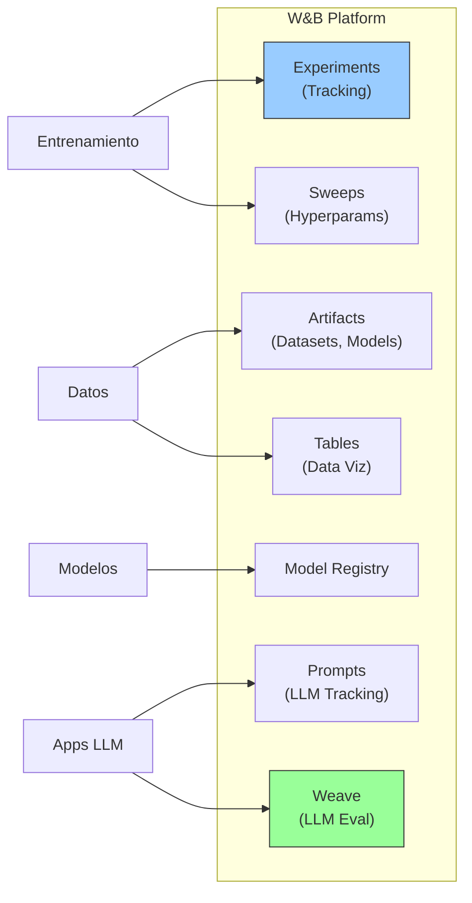
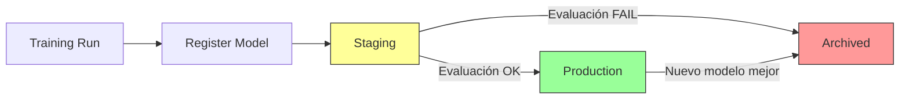

# Weights & Biases (W&B)

> [!abstract] Resumen
> **Weights & Biases** (W&B) es la plataforma de referencia para ==experiment tracking y MLOps==. Ofrece: tracking de experimentos con métricas en tiempo real, model registry para gestión de modelos, sweeps para optimización de hiperparámetros, Tables para visualización de datos, Prompts para tracking de LLMs, y ==Weave para evaluación de aplicaciones LLM==. Su fortaleza es la mejor UX de tracking del mercado y extensas integraciones. Su debilidad es el pricing en escala y el vendor lock-in. Es la alternativa managed a MLflow. ^resumen

---

## Qué es W&B

Weights & Biases[^1] es una plataforma de MLOps que empezó como herramienta de ==experiment tracking== y ha evolucionado para cubrir todo el ciclo de vida de ML:



> [!info] De ML clásico a LLMs
> W&B empezó enfocado en ML clásico (training de CNNs, transformers, etc.). Con la explosión de LLMs, han añadido **Prompts** (tracking de interacciones con LLMs) y ==**Weave** (evaluación y observabilidad de aplicaciones LLM)==, reconociendo que el nuevo paradigma requiere herramientas diferentes.

---

## Componentes principales

### Experiment Tracking

La funcionalidad core de W&B. Permite ==registrar métricas, hiperparámetros, y artefactos== de cada experimento de entrenamiento:

> [!example]- Ejemplo de tracking de entrenamiento
> ```python
> import wandb
>
> # Inicializar run
> wandb.init(
>     project="mi-proyecto",
>     config={
>         "learning_rate": 3e-4,
>         "batch_size": 32,
>         "epochs": 10,
>         "model": "llama-3.1-8b",
>         "optimizer": "AdamW",
>         "weight_decay": 0.01,
>         "warmup_steps": 100,
>         "lora_r": 16,
>         "lora_alpha": 32,
>     }
> )
>
> # Durante el entrenamiento
> for epoch in range(10):
>     for batch in dataloader:
>         loss = train_step(batch)
>         wandb.log({
>             "train/loss": loss,
>             "train/learning_rate": scheduler.get_lr(),
>             "train/epoch": epoch,
>         })
>
>     # Métricas de evaluación
>     eval_metrics = evaluate(model, eval_dataset)
>     wandb.log({
>         "eval/loss": eval_metrics["loss"],
>         "eval/accuracy": eval_metrics["accuracy"],
>         "eval/f1": eval_metrics["f1"],
>     })
>
>     # Guardar modelo como artifact
>     artifact = wandb.Artifact(f"model-epoch-{epoch}", type="model")
>     artifact.add_dir("./checkpoints/")
>     wandb.log_artifact(artifact)
>
> wandb.finish()
> ```

La UX del dashboard es donde W&B ==brilla por encima de alternativas==:
- Gráficos interactivos en tiempo real
- Comparación lado a lado de múltiples runs
- Agrupación y filtrado de experimentos
- Panel personalizable

### Sweeps — Optimización de hiperparámetros

*Sweeps* automatiza la búsqueda de hiperparámetros:

| Estrategia | Descripción | Cuándo usar |
|---|---|---|
| Grid | ==Todas las combinaciones== | Pocos hiperparámetros |
| Random | Muestreo aleatorio | Exploración amplia |
| Bayesian | ==Optimización inteligente== | Cuando quieres eficiencia |
| Hyperband | Early stopping | ==Muchos runs, limitados en tiempo== |

```yaml
# sweep_config.yaml
method: bayes
metric:
  name: eval/accuracy
  goal: maximize
parameters:
  learning_rate:
    distribution: log_uniform_values
    min: 1e-5
    max: 1e-3
  batch_size:
    values: [16, 32, 64]
  lora_r:
    values: [8, 16, 32]
  weight_decay:
    distribution: uniform
    min: 0.0
    max: 0.1
```

### Model Registry

Gestión centralizada de modelos con ==versionado, metadata, y estado de lifecycle==:



### Tables — Visualización de datos

*Tables* permite visualizar y explorar datasets interactivamente:
- Imágenes con bounding boxes
- Audio con espectrogramas
- Texto con highlights
- ==Métricas agregadas por grupo==
- Filtrado y búsqueda

### Prompts — LLM Tracking

*Prompts* está diseñado para el ==tracking de interacciones con LLMs==:

```python
import wandb

wandb.init(project="llm-app")

# Trackear una llamada a LLM
wandb.log({
    "prompt": "Genera un resumen de este documento",
    "completion": response.text,
    "model": "claude-3-5-sonnet",
    "tokens_used": response.usage.total_tokens,
    "latency_ms": response.latency,
    "cost_usd": response.cost,
})
```

### Weave — Evaluación de LLMs

**Weave** es el producto más reciente de W&B, enfocado en ==evaluación y observabilidad de aplicaciones LLM==:

> [!tip] Weave vs Prompts
> - **Prompts**: tracking básico de llamadas a LLM
> - **Weave**: ==evaluación completa== con datasets, métricas custom, comparación de modelos, y traces de ejecución

| Feature de Weave | Descripción |
|---|---|
| Tracing | ==Traza completa de ejecución== (como OpenTelemetry para LLMs) |
| Evaluation | Evaluación con datasets y métricas |
| Scorers | Funciones de evaluación custom |
| Comparison | Comparar modelos side-by-side |
| Datasets | Gestión de datasets de evaluación |
| Models | Wrapping de modelos para tracking |

> [!example]- Ejemplo de Weave para evaluación
> ```python
> import weave
> from weave import Evaluation
>
> # Inicializar Weave
> weave.init("mi-proyecto-llm")
>
> # Definir el modelo a evaluar
> @weave.op()
> def mi_modelo(pregunta: str) -> str:
>     response = client.chat.completions.create(
>         model="claude-3-5-sonnet",
>         messages=[{"role": "user", "content": pregunta}]
>     )
>     return response.choices[0].message.content
>
> # Definir métricas (scorers)
> @weave.op()
> def check_relevance(pregunta: str, output: str) -> dict:
>     # Evaluar si la respuesta es relevante
>     return {
>         "relevance": evaluate_relevance(pregunta, output),
>         "length_ok": 50 < len(output) < 5000,
>     }
>
> # Dataset de evaluación
> eval_dataset = [
>     {"pregunta": "¿Qué es Kubernetes?"},
>     {"pregunta": "Explica Docker vs VMs"},
>     {"pregunta": "¿Cómo funciona TCP/IP?"},
> ]
>
> # Ejecutar evaluación
> evaluation = Evaluation(
>     dataset=eval_dataset,
>     scorers=[check_relevance],
> )
>
> results = evaluation.evaluate(mi_modelo)
> # Resultados visibles en el dashboard de Weave
> ```

---

## Pricing

> [!warning] Precios verificados en junio 2025 — pueden cambiar
> Consulta [wandb.ai/pricing](https://wandb.ai/pricing) para información actualizada.

| Plan | Precio | Tracking hours | Storage | Usuarios |
|---|---|---|---|---|
| **Personal** | ==$0== | Ilimitado | 100GB | 1 |
| **Team** | $50/usuario/mes | Ilimitado | ==1TB== | 1+ |
| **Enterprise** | Custom | Ilimitado | Ilimitado | Ilimitado |

| Componente | Free | Team | Enterprise |
|---|---|---|---|
| Experiment tracking | ==Sí== | Sí | Sí |
| Sweeps | Sí | Sí | Sí |
| Artifacts | 100GB | 1TB | Ilimitado |
| Model Registry | Básico | ==Completo== | Completo |
| Weave | Sí | Sí | Sí |
| SSO | No | No | ==Sí== |
| Self-hosted | No | No | ==Sí== |
| Support | Community | Email | ==Dedicado== |

> [!question] ¿Vale la pena pagar por W&B Team?
> **Sí**, cuando:
> - Equipo de 3+ personas haciendo ML
> - Necesitas ==comparar experimentos entre personas==
> - Almacenamiento >100GB de artefactos
> - Model registry para producción
>
> **No**, cuando:
> - Eres individual (free es generoso)
> - Solo necesitas tracking básico (MLflow self-hosted)
> - No entrenas modelos, solo usas APIs de LLMs

---

## Comparación con MLflow

La comparación más importante es con ==MLflow==, la alternativa open source:

| Aspecto | ==W&B== | MLflow |
|---|---|---|
| Tipo | ==SaaS managed== | Self-hosted (or Databricks) |
| Precio | $50/user/mo | ==Gratis (open source)== |
| UX | ==Excelente== | Funcional |
| Setup | 5 minutos | 30+ minutos |
| Colaboración | ==Excelente (cloud)== | Requiere server compartido |
| Integraciones | ==Extensas== | Buenas |
| LLM features | Prompts + Weave | ==MLflow + LLM Evaluate== |
| Vendor lock-in | ==Sí== | No |
| Self-hosted | Enterprise only | ==Siempre== |
| Community | Grande | ==Muy grande== |

> [!tip] Recomendación pragmática
> - **Individual/startup**: W&B free tier (mejor UX, sin overhead de infra)
> - **Equipo con presupuesto**: ==W&B Team== (colaboración fluida)
> - **Equipo sin presupuesto**: MLflow self-hosted (gratis, más trabajo)
> - **Enterprise con requisitos de data sovereignty**: ==MLflow== o W&B Enterprise (self-hosted)

---

## Quick Start

> [!example]- Primeros pasos con W&B
> ### Instalación
> ```bash
> pip install wandb
> wandb login  # Te pide la API key de wandb.ai
> ```
>
> ### Primer experimento
> ```python
> import wandb
> import random
>
> # Inicializar
> wandb.init(project="test-project", config={"lr": 0.01, "epochs": 10})
>
> # Simular entrenamiento
> for epoch in range(10):
>     loss = random.random() * (10 - epoch) / 10
>     acc = 0.5 + random.random() * epoch / 20
>     wandb.log({"loss": loss, "accuracy": acc, "epoch": epoch})
>
> wandb.finish()
> # Resultado: link al dashboard con gráficos
> ```
>
> ### Con PyTorch
> ```python
> import wandb
> import torch
>
> wandb.init(project="pytorch-demo", config={"lr": 1e-3})
>
> model = MyModel()
> wandb.watch(model, log="all")  # Trackear gradientes y parámetros
>
> for epoch in range(num_epochs):
>     for batch in dataloader:
>         loss = train_step(model, batch)
>         wandb.log({"train_loss": loss})
> ```
>
> ### Con HuggingFace Transformers
> ```python
> from transformers import TrainingArguments, Trainer
>
> training_args = TrainingArguments(
>     output_dir="./results",
>     report_to="wandb",  # ← esto es todo
>     run_name="fine-tune-llama",
> )
>
> trainer = Trainer(
>     model=model,
>     args=training_args,
>     train_dataset=train_dataset,
> )
> trainer.train()  # Métricas se envían automáticamente a W&B
> ```
>
> ### Weave (evaluación de LLM)
> ```bash
> pip install weave
> ```
>
> ```python
> import weave
> weave.init("mi-proyecto")
>
> @weave.op()
> def mi_funcion(input: str) -> str:
>     # Tu lógica aquí
>     return resultado
>
> # Todas las llamadas se tracean automáticamente
> ```

---

## Integraciones

W&B se integra con ==prácticamente todo el ecosistema de ML==:

| Categoría | Herramientas |
|---|---|
| Frameworks DL | PyTorch, TensorFlow, JAX, ==HuggingFace== |
| Training | [[huggingface-ecosystem\|Transformers]], Lightning, Keras |
| Hyperparams | Optuna, Ray Tune |
| Deployment | ==SageMaker, Vertex AI, MLflow== |
| Data | DVC, Label Studio |
| LLM | LangChain, LlamaIndex, OpenAI, ==Anthropic== |

---

## Limitaciones honestas

> [!failure] Lo que W&B NO hace bien
> 1. **Vendor lock-in**: migrar de W&B a otra plataforma ==requiere esfuerzo significativo==. Tu historial de experimentos está en su cloud
> 2. **Pricing escala**: para equipos grandes (20+ personas), ==el coste puede ser sustancial== ($1,000+/mes)
> 3. **Self-hosted limitado**: la opción self-hosted ==solo está disponible en Enterprise== (costoso). MLflow gana aquí
> 4. **Data sovereignty**: por defecto, ==tus datos están en servidores de W&B (US)==. Para empresas europeas con GDPR, esto puede ser un problema
> 5. **Weave inmaduro**: comparado con el tracking de experimentos (maduro), ==Weave es todavía relativamente nuevo== y la API puede cambiar
> 6. **Offline limitado**: el modo offline existe pero ==la experiencia es degradada==. W&B asume conectividad
> 7. **Complejidad creciente**: la plataforma ha crecido tanto que ==puede ser abrumadora para nuevos usuarios==
> 8. **No es para operaciones de LLM en producción**: W&B es para ==training y evaluación, no para serving== de modelos en producción

> [!warning] Datos sensibles en W&B
> Si entrenas modelos con datos sensibles, recuerda que los logs de W&B ==pueden contener información derivada de tus datos de entrenamiento== (pérdidas, métricas por muestra, examples). Configura cuidadosamente qué se loggea, especialmente con `wandb.watch()` y Tables.

---

## Relación con el ecosistema

W&B es ==infraestructura de MLOps== que complementa las herramientas de desarrollo del ecosistema.

- **[[intake-overview]]**: W&B no se relaciona directamente con intake, pero podría usarse para ==trackear experimentos de prompt engineering== durante el desarrollo del pipeline de requisitos.
- **[[architect-overview]]**: architect podría integrar W&B/Weave para ==trackear el rendimiento de diferentes modelos y prompts== en sus pipelines. Los datos de coste de architect podrían loggearse en W&B para análisis.
- **[[vigil-overview]]**: no hay relación directa, aunque W&B podría ==registrar métricas de seguridad de vigil== como parte del tracking de calidad del código generado.
- **[[licit-overview]]**: W&B proporciona ==trazabilidad de experimentos== que puede ser relevante para compliance. Documentar qué modelo se usó, con qué datos, y qué resultados obtuvo es información valiosa para auditorías bajo el EU AI Act.

---

## Estado de mantenimiento

> [!success] Activamente mantenido — plataforma enterprise
> - **Empresa**: Weights & Biases, Inc.
> - **Financiación**: $250M+ (Serie C, 2023, valoración $1.25B)[^2]
> - **Empleados**: 200+
> - **Usuarios**: 700K+ developers, 1000+ enterprise customers
> - **Cadencia**: releases frecuentes
> - **Documentación**: [docs.wandb.ai](https://docs.wandb.ai)

---

## Enlaces y referencias

> [!quote]- Bibliografía y recursos
> - [^1]: W&B oficial — [wandb.ai](https://wandb.ai)
> - [^2]: W&B Series C — TechCrunch, 2023
> - Documentación — [docs.wandb.ai](https://docs.wandb.ai)
> - Weave docs — [wandb.me/weave](https://wandb.me/weave)
> - "W&B vs MLflow: An Honest Comparison" — varios autores, 2024
> - [[huggingface-ecosystem]] — integración directa con Transformers
> - [[promptfoo]] — alternativa open source para evaluación de prompts

[^1]: Weights & Biases, fundada en 2017.
[^2]: Datos de financiación de W&B, TechCrunch 2023.
