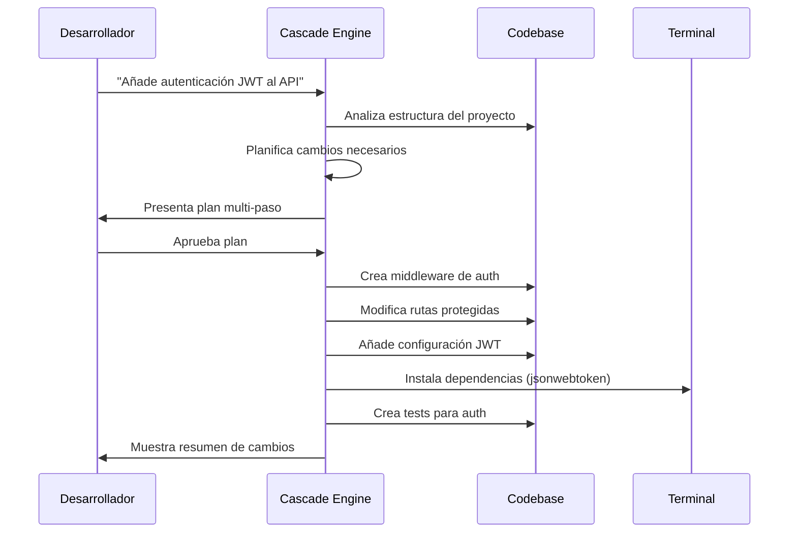
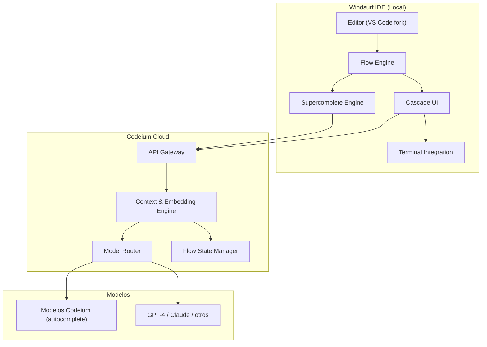

# Windsurf (Codeium)

> [!abstract] Resumen
> **Windsurf** es un IDE con IA nativa desarrollado por Codeium, construido como un ==fork de VS Code==. Su diferenciador principal es el paradigma de *Flows* — flujos de trabajo agenticos multi-paso que combinan acciones del desarrollador con acciones de la IA de forma coherente. Ofrece *Cascade* como su motor de interacción principal, *Supercomplete* para autocompletado avanzado, y un ==precio agresivo de $10/mes== que lo posiciona como alternativa económica a [[cursor]]. ^resumen

---

## Qué es Windsurf

Windsurf[^1] es la evolución del producto de Codeium, una empresa que originalmente ofrecía autocompletado de código gratuito como extensión para múltiples editores. En 2024, Codeium lanzó Windsurf como un IDE completo, reconociendo que la ==integración profunda con el editor== permite experiencias que las extensiones no pueden lograr.

> [!info] De Codeium a Windsurf
> Codeium comenzó como una alternativa gratuita a [[github-copilot]]. Su extensión de autocompletado fue popular por ofrecer funcionalidad comparable sin coste. La transición a un IDE propio con Windsurf marcó su apuesta por competir directamente con [[cursor]] en el mercado de IDEs con IA integrada.

La filosofía central de Windsurf gira en torno al concepto de *Flows* (flujos): la idea de que la interacción humano-IA durante la codificación no es una serie de comandos aislados sino un ==flujo continuo de colaboración==.

---

## Características principales

### Cascade

*Cascade* es el motor principal de interacción de Windsurf. A diferencia de un chat simple, Cascade:

1. **Mantiene contexto profundo**: recuerda no solo la conversación actual sino las acciones recientes del desarrollador en el editor
2. **Ejecuta acciones multi-paso**: puede buscar archivos, leer código, hacer ediciones, ejecutar comandos en terminal
3. **Propone y ejecuta**: sugiere un plan y lo ejecuta con aprobación del usuario

> [!tip] Cascade vs Composer de Cursor
> Ambos son herramientas de edición multi-archivo con IA, pero su filosofía difiere:
> - **Composer** (Cursor): orientado a instrucciones puntuales — "haz estos cambios"
> - **Cascade** (Windsurf): orientado a flujos — ==observa lo que haces y se anticipa==
>
> En la práctica, la diferencia es sutil pero notable en sesiones largas de desarrollo.



### Flows — El paradigma diferenciador

*Flows* es más una filosofía de diseño que una funcionalidad individual. Significa que Windsurf:

- **Detecta intención**: si empiezas a renombrar una variable manualmente, Windsurf puede sugerir renombrar todas las ocurrencias
- **Contexto bidireccional**: las acciones del desarrollador informan a la IA y viceversa
- **Continuidad**: no necesitas re-explicar el contexto en cada interacción

> [!example]- Ejemplo de un Flow típico
> ```
> 1. Abres un archivo de rutas de API
> 2. Windsurf detecta que estás trabajando en el API
> 3. Le pides: "Necesito un endpoint de búsqueda con paginación"
> 4. Cascade:
>    a. Lee los endpoints existentes para seguir el patrón
>    b. Identifica el ORM usado (Prisma, TypeORM, etc.)
>    c. Crea el endpoint siguiendo convenciones del proyecto
>    d. Añade tipos TypeScript si el proyecto usa TS
>    e. Genera tests siguiendo el patrón de tests existentes
> 5. Tú revisas y haces un ajuste manual al query
> 6. Windsurf detecta tu ajuste y pregunta:
>    "¿Quieres que aplique un filtro similar en los otros endpoints?"
> 7. El flujo continúa naturalmente
> ```

### Supercomplete

*Supercomplete* es la evolución del autocompletado de Codeium. Va más allá de predecir la siguiente línea:

| Capacidad | Autocompletado tradicional | ==Supercomplete== |
|---|---|---|
| Predicción de línea | Sí | Sí |
| Multi-línea | Básico | ==Avanzado== |
| Ediciones en cursor | No | Sí |
| Predicción de siguiente acción | No | ==Sí== |
| Contexto de archivos abiertos | Limitado | Completo |
| Detección de patrones | Básico | Avanzado |

> [!info] Motor de autocompletado
> Codeium entrena sus propios modelos de autocompletado, optimizados específicamente para velocidad de inferencia. Esto les permite ofrecer latencia más baja que soluciones que dependen de APIs externas como GPT-4 para el autocompletado.

---

## Arquitectura



> [!warning] Dependencia de la nube
> Al igual que [[cursor]], Windsurf ==depende de conectividad a internet== para todas las funcionalidades de IA. Sin conexión, es esencialmente un VS Code estándar. Los *Flow States* se almacenan en la nube de Codeium.

---

## Pricing

> [!warning] Precios verificados en junio 2025 — pueden cambiar
> Consulta [windsurf.com/pricing](https://windsurf.com/pricing) para información actualizada.

| Plan | Precio | Cascade | Supercomplete | Flows |
|---|---|---|---|---|
| **Free** | $0 | Limitado | ==Ilimitado== | Básico |
| **Pro** | ==$10/mes== | Generoso | Ilimitado | Completo |
| **Enterprise** | Custom | Ilimitado | Ilimitado | Completo + SSO |

> [!tip] Ventaja de precio
> A ==$10/mes==, Windsurf Pro cuesta la mitad que [[cursor]] Pro ($20/mes). Para desarrolladores individuales o equipos con presupuesto limitado, esta diferencia es significativa. La pregunta es si la diferencia en calidad justifica pagar el doble por Cursor.

---

## Quick Start

> [!example]- Instalación y primeros pasos
> ### Descarga
> ```bash
> # macOS
> brew install --cask windsurf
>
> # Linux (descarga directa)
> wget https://windsurf.com/download/linux -O windsurf.deb
> sudo dpkg -i windsurf.deb
>
> # Windows
> # Descargar desde windsurf.com
> ```
>
> ### Importar desde VS Code
> 1. Al primer inicio, Windsurf ofrece importar:
>    - Extensiones
>    - Configuraciones
>    - Keybindings
>    - Temas
> 2. La importación es automática y generalmente funciona bien
>
> ### Configurar Cascade
> 1. `Cmd+Shift+P` → "Windsurf: Open Settings"
> 2. Selecciona el modelo preferido para Cascade
> 3. Configura si quieres ejecución automática o confirmación manual
>
> ### Atajos esenciales
> | Atajo | Acción |
> |---|---|
> | `Cmd+L` | Abrir Cascade |
> | `Tab` | Aceptar Supercomplete |
> | `Cmd+I` | Edición inline |
> | `Cmd+Shift+L` | Cascade con selección |
> | `Escape` | Rechazar sugerencia |
>
> ### Primer proyecto
> 1. Abre una carpeta de proyecto existente
> 2. Deja que Windsurf indexe el proyecto (unos minutos)
> 3. Abre Cascade con `Cmd+L`
> 4. Escribe: "Explícame la arquitectura de este proyecto"
> 5. Windsurf analizará la estructura y dará un resumen contextual

---

## Comparación con alternativas

| Aspecto | [[cursor]] | ==Windsurf== | [[github-copilot\|Copilot]] |
|---|---|---|---|
| Precio Pro | $20/mo | ==$10/mo== | $10/mo |
| Editor base | VS Code fork | VS Code fork | Extensión |
| Paradigma IA | Composer + Chat | ==Flows + Cascade== | Chat + Workspace |
| Autocomplete | Excelente | Muy bueno | Bueno |
| Multi-archivo | Composer | Cascade | Workspace |
| Modelos propios | cursor-small | ==Modelos Codeium== | No |
| Comunidad | Grande | Mediana | ==Muy grande== |
| Open source | No | No | No |
| Flujos agenticos | Sí | Sí | Sí (preview) |
| Privacy por defecto | No (Business) | ==Sí== | No (Enterprise) |

---

## Limitaciones honestas

> [!failure] Problemas conocidos y debilidades
> 1. **Comunidad más pequeña**: comparado con [[cursor]] y [[github-copilot]], Windsurf tiene ==menos contenido educativo, tutoriales y experiencias compartidas==
> 2. **Madurez**: es un producto más joven que Cursor. Algunos usuarios reportan:
>    - Crashes ocasionales durante sesiones largas de Cascade
>    - Supercomplete a veces es menos preciso que Tab de Cursor
>    - La indexación inicial puede ser lenta en proyectos grandes
> 3. **Menos extensiones optimizadas**: aunque las extensiones de VS Code funcionan, algunas pueden tener conflictos
> 4. **Documentación**: la documentación oficial es ==menos completa== que la de Cursor
> 5. **Ecosistema cerrado**: al igual que Cursor, es código cerrado con dependencia de cloud
> 6. **Flujos no deterministas**: los Flows, por naturaleza, no son reproducibles. No puedes definir un pipeline como en [[architect-overview]]
> 7. **Límites del plan Free**: el tier gratuito es limitado en uso de Cascade, lo que puede frustrar durante la evaluación

> [!danger] Riesgo de concentración
> Codeium ha pivotado varias veces su modelo de negocio (de extensión gratuita a IDE de pago). Si dependes de Windsurf como tu IDE principal, ==considera el riesgo de que el modelo de negocio cambie nuevamente==. Mantén familiaridad con alternativas como VS Code + extensiones o [[cursor]].

---

## Relación con el ecosistema

Windsurf compite en el mismo espacio que [[cursor]] pero con un enfoque diferente en la interacción humano-IA.

- **[[intake-overview]]**: Windsurf puede asistir durante la fase de exploración de requisitos, pero ==no tiene un framework estructurado== para la conversión de requisitos a especificaciones. Cascade puede ayudar a explorar codebase existente para entender el estado actual.
- **[[architect-overview]]**: Windsurf y architect operan en niveles diferentes. Windsurf es un IDE interactivo; architect es un agente autónomo con *Ralph Loop*, pipelines YAML, worktrees git, y [[litellm]] como backend. Un desarrollador podría usar Windsurf para desarrollo interactivo y architect para tareas autónomas complejas.
- **[[vigil-overview]]**: Windsurf no incluye escaneo de seguridad determinista. El código generado por Cascade debería pasar por vigil antes de ser mergeado. ==Cascade no verifica vulnerabilidades== en el código que genera.
- **[[licit-overview]]**: No hay funcionalidad de compliance en Windsurf. Para proyectos regulados, licit complementa donde Windsurf no llega.

---

## Estado de mantenimiento

> [!success] Activamente mantenido
> - **Empresa**: Codeium (antes Exafunction)
> - **Financiación**: Serie C ($150M+, valoración $1.25B)[^2]
> - **Equipo**: ~80 empleados (estimado)
> - **Cadencia**: releases frecuentes, changelog público
> - **Última versión verificada**: 1.x (junio 2025)

---

## Enlaces y referencias

> [!quote]- Bibliografía y recursos
> - [^1]: Windsurf oficial — [windsurf.com](https://windsurf.com)
> - [^2]: Codeium Series C — TechCrunch, 2024
> - Documentación — [docs.windsurf.com](https://docs.windsurf.com)
> - Codeium Blog — [codeium.com/blog](https://codeium.com/blog)
> - "Windsurf vs Cursor: An Honest Comparison" — Reddit r/programming, 2025
> - [[ai-code-tools-comparison]] — comparación completa de herramientas
> - [[cursor]] — el competidor directo principal

[^1]: Windsurf, desarrollado por Codeium. Disponible en [windsurf.com](https://windsurf.com).
[^2]: Datos de financiación de Codeium, TechCrunch y Crunchbase, 2024-2025.
