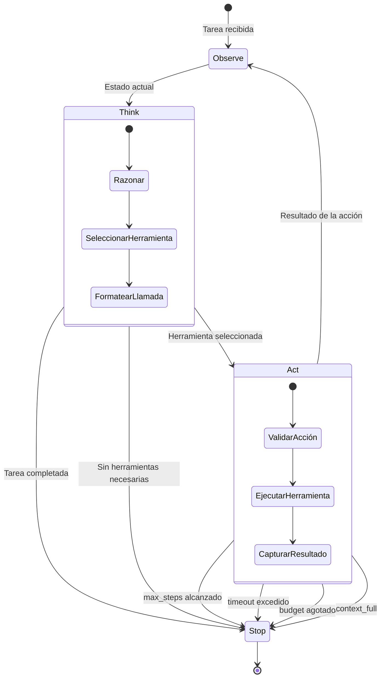
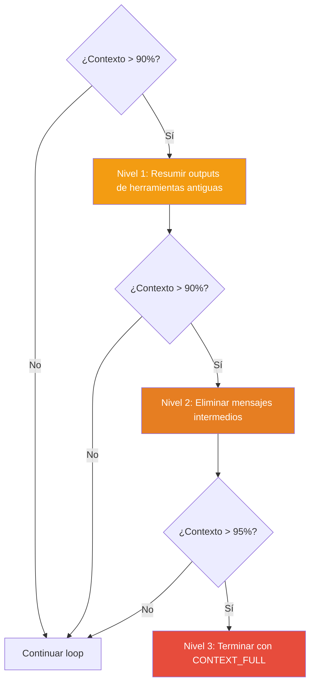

# Patrón Agent Loop — Observe → Think → Act → Repeat

> [!abstract]
> El *agent loop* es el ==patrón fundamental de todos los sistemas agénticos==. Define un ciclo iterativo donde el agente observa el estado actual, razona sobre qué hacer, ejecuta una acción con herramientas, observa el resultado y decide si continuar o terminar. Es la diferencia entre un LLM que responde una vez y un ==agente que resuelve problemas complejos de múltiples pasos==. architect implementa este patrón como su mecanismo central con redes de seguridad que incluyen `max_steps`, `timeout`, `budget` y `context_full`. ^resumen

## Problema

Una sola llamada al LLM es insuficiente para tareas que requieren:

- **Exploración**: Leer archivos, buscar en bases de datos, navegar APIs.
- **Iteración**: Probar, fallar, ajustar, reintentar.
- **Composición**: Combinar resultados de múltiples herramientas.
- **Verificación**: Comprobar que el resultado cumple requisitos.

> [!danger] Sin agent loop, el LLM es un autocompletado glorificado
> Un LLM sin herramientas ni iteración solo puede generar texto basado en su entrenamiento. No puede verificar hechos, ejecutar código, leer archivos actuales ni interactuar con sistemas externos. El *agent loop* transforma un modelo de lenguaje en un ==agente capaz de actuar en el mundo==.

## Solución

El *agent loop* implementa un ciclo de cuatro fases con condiciones de parada explícitas:



### Fase 1: Observe (Observar)

El agente recibe información del entorno:
- **Turno inicial**: La tarea del usuario + contexto del sistema.
- **Turnos subsiguientes**: El resultado de la herramienta ejecutada en el turno anterior.

### Fase 2: Think (Pensar)

El LLM procesa toda la información acumulada y decide:
1. ¿La tarea está completa? → Generar respuesta final.
2. ¿Necesito más información? → Seleccionar herramienta de lectura.
3. ¿Necesito actuar? → Seleccionar herramienta de acción.

### Fase 3: Act (Actuar)

El sistema ejecuta la herramienta seleccionada por el LLM:
- Validación previa (ver [[pattern-guardrails]]).
- Ejecución con timeout.
- Captura de resultado (stdout, stderr, valor de retorno).

### Fase 4: Repeat (Repetir)

El resultado se añade al historial de conversación y el ciclo vuelve a Observe.

## Variantes

### ReAct (Reasoning + Acting)

La variante más conocida, propuesta por Yao et al.[^1]. El LLM alterna explícitamente entre *thought* (razonamiento en texto) y *action* (llamada a herramienta).

> [!example]- Traza ReAct típica
> ```
> Thought: Necesito encontrar el archivo de configuración del pipeline.
> Action: search_files("pipeline.yaml")
> Observation: Encontrado en ./config/pipeline.yaml
>
> Thought: Ahora necesito leer el contenido del archivo.
> Action: read_file("./config/pipeline.yaml")
> Observation: [contenido del archivo]
>
> Thought: El archivo tiene 3 steps. El usuario quiere añadir
>          un paso de testing. Voy a editar el archivo.
> Action: edit_file("./config/pipeline.yaml", changes)
> Observation: Archivo editado exitosamente.
>
> Thought: La tarea está completa. He añadido el paso de testing.
> Action: finish("He añadido un paso de testing al pipeline...")
> ```

### Plan-and-Execute

Separa la planificación de la ejecución. Ver [[pattern-planner-executor]] para detalles completos.

### Reflexive

El agente evalúa su propio progreso periódicamente. Ver [[pattern-reflection]] para la versión completa del patrón.

## Implementación en architect

architect implementa el *agent loop* como su mecanismo central de ejecución. Cada agente (plan, build, resume, review) ejecuta su propio loop con parámetros específicos.

> [!info] Parámetros del loop en architect
> | Agente | max_steps | Herramientas | Modo |
> |---|---|---|---|
> | plan | 20 | Solo lectura | Observar, planificar |
> | build | 50 | Todas | Leer, escribir, ejecutar |
> | review | 20 | Solo lectura | Analizar cambios |
> | sub-agents | 15 | Según tipo | Tarea específica |

### StopReasons

architect define razones explícitas de parada que determinan el comportamiento post-loop:

| StopReason | Significado | Acción |
|---|---|---|
| `end_turn` | LLM decidió terminar | Éxito, procesar resultado |
| `max_steps` | Límite de pasos alcanzado | Warning, resultado parcial |
| `timeout` | Tiempo máximo excedido | Error, guardar progreso |
| `budget` | Presupuesto de tokens agotado | Error, guardar progreso |
| `context_full` | Ventana de contexto llena | Podar contexto o terminar |

> [!example]- Pseudocódigo del agent loop de architect
> ```python
> class AgentLoop:
>     def __init__(self, config: AgentConfig):
>         self.max_steps = config.max_steps
>         self.timeout = config.timeout
>         self.budget = config.budget
>         self.tools = config.tools
>         self.guardrails = config.guardrails
>
>     async def run(self, task: str) -> AgentResult:
>         messages = [system_prompt(), user_message(task)]
>         steps = 0
>         start_time = time.time()
>
>         while True:
>             # Safety checks
>             if steps >= self.max_steps:
>                 return AgentResult(stop=StopReason.MAX_STEPS)
>             if time.time() - start_time > self.timeout:
>                 return AgentResult(stop=StopReason.TIMEOUT)
>             if self.token_counter.total > self.budget:
>                 return AgentResult(stop=StopReason.BUDGET)
>             if self.context_usage() > 0.9:
>                 messages = self.prune_context(messages)
>                 if self.context_usage() > 0.95:
>                     return AgentResult(stop=StopReason.CONTEXT_FULL)
>
>             # Think: LLM decides next action
>             response = await self.llm.chat(messages)
>
>             if response.has_tool_calls():
>                 for tool_call in response.tool_calls:
>                     # Guardrails check
>                     if not self.guardrails.allow(tool_call):
>                         result = "Blocked by guardrails"
>                     else:
>                         result = await self.execute_tool(tool_call)
>
>                     messages.append(tool_result(result))
>             else:
>                 # No tool calls = agent finished
>                 return AgentResult(
>                     stop=StopReason.END_TURN,
>                     output=response.content
>                 )
>
>             steps += 1
> ```

### Poda de contexto en 3 niveles

Cuando el contexto se llena, architect aplica poda progresiva:



## Cuándo usar

> [!success] Escenarios ideales para agent loop
> - Tareas que requieren exploración del sistema de archivos o bases de datos.
> - Problemas de debugging que necesitan investigación iterativa.
> - Generación de código con verificación (escribir → ejecutar tests → corregir).
> - Cualquier tarea donde el número de pasos no se conoce de antemano.
> - Interacción con APIs externas que requieren múltiples llamadas.

## Cuándo NO usar

> [!failure] Escenarios donde el agent loop es excesivo
> - **Preguntas simples**: "¿Qué es Python?" no necesita herramientas ni iteración.
> - **Generación de texto puro**: Escribir un email o resumen es una sola llamada.
> - **Transformaciones deterministas**: Formatear JSON, convertir unidades. Usa código directo.
> - **Alta latencia inaceptable**: Cada paso añade 2-10 segundos. Si necesitas respuesta en <1s, el loop no es viable.

## Trade-offs

| Ventaja | Desventaja |
|---|---|
| Resuelve tareas complejas de múltiples pasos | Latencia acumulativa por paso |
| Adaptable a situaciones imprevistas | Coste proporcional al número de pasos |
| Verificación iterativa del progreso | Riesgo de loops infinitos sin safety nets |
| Composición flexible de herramientas | Contexto crece con cada paso |
| Recuperación de errores en tiempo de ejecución | Debugging complejo de trazas largas |
| Permite razonamiento sobre observaciones | El LLM puede tomar caminos subóptimos |

## Patrones relacionados

- [[pattern-human-in-loop]]: Añade puntos de aprobación humana dentro del loop.
- [[pattern-guardrails]]: Valida cada acción antes de ejecutarla.
- [[pattern-reflection]]: El agente evalúa su propio progreso dentro del loop.
- [[pattern-planner-executor]]: Separa la planificación del loop de ejecución.
- [[pattern-memory]]: Permite al loop acceder a información de sesiones anteriores.
- [[pattern-supervisor]]: Un agente externo monitoriza el loop.
- [[pattern-fallback]]: Cuando una herramienta del loop falla, usa alternativas.
- [[pattern-orchestrator]]: El loop puede delegar subtareas a otros agentes.

## Relación con el ecosistema

El *agent loop* es el ==corazón de [[architect-overview|architect]]==. Cada agente de architect (plan, build, resume, review) ejecuta su propio loop con parámetros calibrados. Los sub-agentes (explore, test, review) son loops anidados que se ejecutan dentro del loop principal del build agent.

[[vigil-overview|vigil]] actúa como guardrail dentro del loop, validando inputs y outputs en cada iteración. Sus 26 reglas deterministas y 4 analizadores se ejecutan como validaciones pre y post-acción.

[[intake-overview|intake]] genera las tareas que alimentan al agent loop, normalizando requisitos ambiguos en especificaciones claras que el agente puede seguir.

[[licit-overview|licit]] puede intervenir en el loop cuando una acción requiere verificación de cumplimiento, insertando *compliance gates* en puntos críticos.

> [!tip] El Ralph Loop de architect
> architect denomina a su implementación del agent loop como "Ralph Loop" — un ciclo `while True` con redes de seguridad que garantizan terminación. El nombre enfatiza que el loop es la unidad fundamental de ejecución: todo lo que architect hace, lo hace dentro de un Ralph Loop.

## Enlaces y referencias

> [!quote]- Bibliografía
> - [^1]: Yao, S. et al. (2023). *ReAct: Synergizing Reasoning and Acting in Language Models*. Paper que popularizó el patrón observe-think-act.
> - Anthropic. (2024). *Building effective agents*. Sección sobre agent loops y tool use.
> - Sumers, T. et al. (2024). *Cognitive Architectures for Language Agents*. Taxonomía de loops agénticos.
> - Significant Gravitas. (2024). *AutoGPT*. Implementación popular de agent loop autónomo.
> - LangChain. (2024). *Agent executor documentation*. Implementación de referencia del ReAct loop.

[^1]: ReAct demostró que alternar razonamiento explícito con acciones mejora significativamente el rendimiento en tareas complejas comparado con solo razonamiento (Chain-of-Thought) o solo acción.

---

> [!tip] Navegación
> - Anterior: [[pattern-rag]]
> - Siguiente: [[pattern-human-in-loop]]
> - Índice: [[patterns-overview]]
