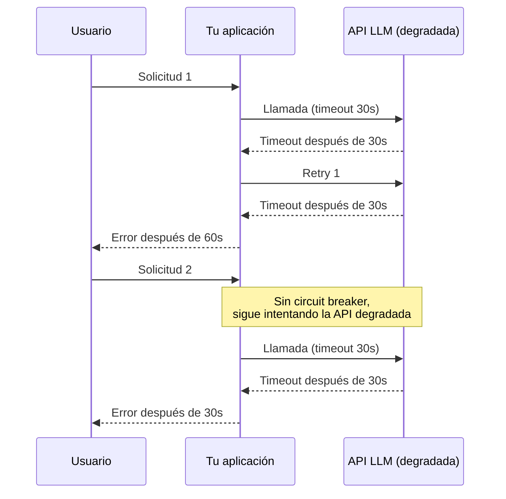
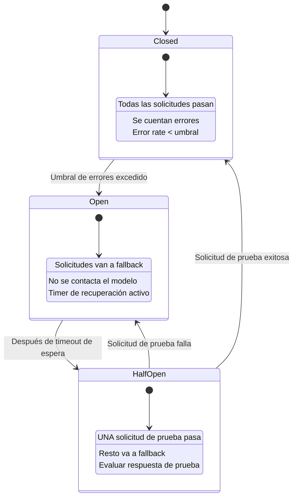
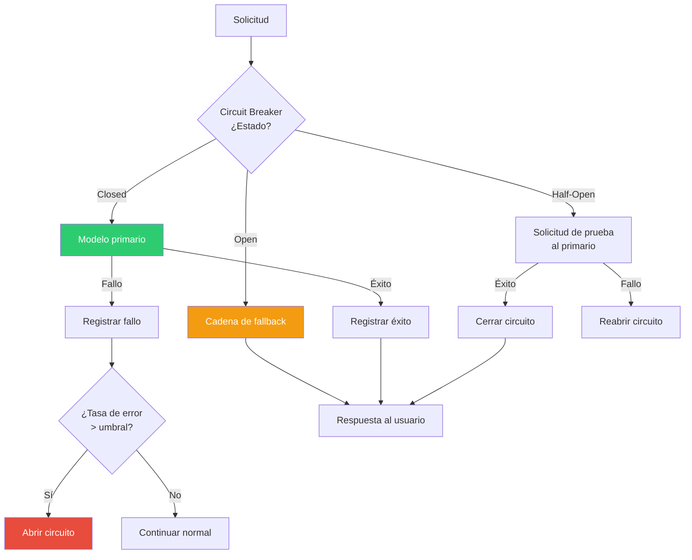

# Patrón Circuit Breaker para LLMs — Detección y Auto-Switch

> [!abstract]
> El *circuit breaker* adapta el patrón clásico de resiliencia al contexto de APIs de LLM. ==Monitoriza la tasa de errores y latencia de cada modelo==, y cuando detecta degradación, abre el circuito para redirigir tráfico a alternativas en lugar de seguir enviando solicitudes a un servicio degradado. Los tres estados — ==cerrado (normal), abierto (fallando) y semi-abierto (probando recuperación)== — forman un autómata que protege el sistema contra fallos en cascada. architect implementa una versión simplificada a través de sus safety nets (budget, timeout) que actúan como circuit breakers pasivos. ^resumen

## Problema

La degradación de APIs de LLM causa fallos en cascada:

1. **Latencia creciente**: El modelo responde cada vez más lento, pero no falla explícitamente.
2. **Errores intermitentes**: 429 (rate limit) y 500 (server error) intercalados con respuestas exitosas.
3. **Calidad degradada**: El modelo responde pero con calidad notablemente inferior.
4. **Efecto dominó**: El timeout de la API del LLM causa timeout en tu API, que causa timeout en tu frontend.

> [!danger] El peligro del "funciona a veces"
> El peor estado de un servicio externo no es "caído completamente" (fácil de detectar) sino ==degradado intermitentemente==. Tu sistema sigue intentando, acumulando timeouts, retries y costes mientras la experiencia del usuario se destruye.



## Solución

El circuit breaker implementa un autómata de tres estados:



### Estado: Closed (Cerrado — Operación normal)

- Todas las solicitudes van al modelo primario.
- Se monitoriza tasa de errores y latencia.
- Si la tasa de errores supera el umbral → Open.

### Estado: Open (Abierto — Modelo degradado)

- NINGUNA solicitud va al modelo primario.
- Todas van al [[pattern-fallback|fallback]] automáticamente.
- Timer de recuperación activo (30s-5min según configuración).
- Al expirar timer → Half-Open.

### Estado: Half-Open (Semi-abierto — Probando recuperación)

- UNA solicitud de prueba va al modelo primario.
- El resto sigue yendo al fallback.
- Si la solicitud de prueba es exitosa → Closed.
- Si falla → Open (reinicia timer).

## Métricas de monitorización

| Métrica | Umbral para abrir | Medición |
|---|---|---|
| Error rate | > 50% en ventana de 60s | Errores / Total solicitudes |
| Latencia p95 | > 10s (vs baseline de 2s) | Percentil 95 de latencia |
| Timeout rate | > 30% en ventana de 60s | Timeouts / Total solicitudes |
| Quality score | < 0.5 (vs baseline de 0.8) | Score del [[pattern-evaluator\|evaluator]] |
| Rate limit hits | > 80% del límite | 429 responses / Total |

> [!tip] Ventanas deslizantes, no contadores acumulativos
> Usa ventanas deslizantes de 30-60 segundos para calcular tasas. Un contador acumulativo tarda demasiado en reaccionar a degradaciones repentinas y demasiado en recuperarse de picos temporales.

## Implementación

> [!example]- Circuit Breaker para LLMs
> ```python
> import time
> import asyncio
> from enum import Enum
> from collections import deque
> from dataclasses import dataclass, field
>
> class State(Enum):
>     CLOSED = "closed"
>     OPEN = "open"
>     HALF_OPEN = "half_open"
>
> @dataclass
> class CircuitBreakerConfig:
>     failure_threshold: float = 0.5    # 50% error rate
>     latency_threshold: float = 10.0   # 10 seconds p95
>     window_size: int = 60             # 60 second window
>     recovery_timeout: float = 30.0    # 30s before half-open
>     min_requests: int = 5             # Minimum requests to evaluate
>
> class LLMCircuitBreaker:
>     def __init__(self, config: CircuitBreakerConfig):
>         self.config = config
>         self.state = State.CLOSED
>         self.requests: deque = deque()
>         self.opened_at: float = 0
>
>     def _clean_window(self):
>         cutoff = time.time() - self.config.window_size
>         while self.requests and self.requests[0]["time"] < cutoff:
>             self.requests.popleft()
>
>     def _failure_rate(self) -> float:
>         self._clean_window()
>         if len(self.requests) < self.config.min_requests:
>             return 0.0
>         failures = sum(1 for r in self.requests if r["failed"])
>         return failures / len(self.requests)
>
>     def should_allow(self) -> bool:
>         if self.state == State.CLOSED:
>             return True
>         if self.state == State.OPEN:
>             if time.time() - self.opened_at > self.config.recovery_timeout:
>                 self.state = State.HALF_OPEN
>                 return True  # Allow one probe
>             return False
>         if self.state == State.HALF_OPEN:
>             return False  # Only the probe request
>         return True
>
>     def record_success(self, latency: float):
>         self.requests.append({
>             "time": time.time(),
>             "failed": False,
>             "latency": latency
>         })
>         if self.state == State.HALF_OPEN:
>             self.state = State.CLOSED
>
>     def record_failure(self, latency: float = 0):
>         self.requests.append({
>             "time": time.time(),
>             "failed": True,
>             "latency": latency
>         })
>         if self.state == State.HALF_OPEN:
>             self.state = State.OPEN
>             self.opened_at = time.time()
>         elif self._failure_rate() > self.config.failure_threshold:
>             self.state = State.OPEN
>             self.opened_at = time.time()
> ```

## Circuit Breaker + Fallback



## Safety nets de architect como circuit breakers simplificados

architect implementa circuit breakers pasivos a través de sus safety nets:

> [!info] Equivalencia entre safety nets y circuit breaker
> | Safety net de architect | Equivalencia en circuit breaker |
> |---|---|
> | `timeout` | Si una llamada excede el timeout, se trata como fallo |
> | `budget` | Si el gasto acumulado excede el límite, se detiene la ejecución |
> | `max_steps` | Límite de iteraciones previene loops causados por degradación |
> | `context_full` | Cuando el contexto se llena, la ejecución para |

> [!question] ¿Por qué architect no implementa un circuit breaker completo?
> architect opera como agente de sesión única, no como servicio de alto tráfico. Un circuit breaker completo (con estados y transiciones) es más relevante para ==servicios con tráfico continuo== donde la tasa de errores es estadísticamente significativa. Para un agente con 20-50 requests por sesión, las safety nets proporcionan protección suficiente.

## Cuándo usar

> [!success] Escenarios ideales para circuit breaker
> - Servicios de producción con tráfico continuo (API gateway, chatbot).
> - Múltiples proveedores de LLM disponibles para fallback.
> - SLAs de disponibilidad que exigen respuesta rápida ante degradación.
> - Sistemas donde la latencia de reintentos es inaceptable.
> - Costes significativos por solicitudes que fallan (tokens consumidos en requests incompletos).

## Cuándo NO usar

> [!failure] Escenarios donde el circuit breaker no aporta
> - **Tráfico bajo**: Con pocas solicitudes no hay suficientes datos para calcular tasas de error.
> - **Un solo proveedor sin alternativa**: Sin fallback, abrir el circuito solo causa un error diferente.
> - **Agentes de sesión única**: Las safety nets (timeout, budget) son suficientes.
> - **Prototipos y desarrollo**: La complejidad no justifica el beneficio.

## Trade-offs

| Ventaja | Desventaja |
|---|---|
| Respuesta rápida ante degradación | Complejidad de implementación y tuning |
| Evita fallos en cascada | Puede abrir prematuramente (falsos positivos) |
| Reduce coste de solicitudes fallidas | Requiere alternativas de fallback |
| Protege la experiencia del usuario | Monitorización adicional necesaria |
| Auto-recuperación cuando el servicio mejora | Configuración de umbrales es un arte |
| Compatible con cualquier backend | La fase half-open puede causar latencia puntual |

> [!warning] El arte de configurar umbrales
> Umbrales demasiado sensibles causan ==falsos positivos== (el circuito se abre por un blip normal). Umbrales demasiado relajados causan ==reacción tardía== (usuarios sufren antes de que el circuito se abra). Calibrar con datos históricos de baseline.

## Patrones relacionados

- [[pattern-fallback]]: El fallback es el destino cuando el circuito se abre.
- [[pattern-routing]]: El router puede consultar el estado del circuit breaker para evitar modelos degradados.
- [[pattern-guardrails]]: Los guardrails pueden detectar degradación de calidad que activa el circuit breaker.
- [[pattern-supervisor]]: El supervisor puede monitorizar el estado de circuit breakers.
- [[pattern-evaluator]]: La evaluación de calidad puede ser una señal para el circuit breaker.
- [[pattern-agent-loop]]: El loop debe manejar el caso de circuito abierto (usar fallback).
- [[pattern-semantic-cache]]: El cache puede servir respuestas cuando el circuito está abierto.

## Relación con el ecosistema

[[architect-overview|architect]] implementa circuit breakers pasivos via safety nets. Para despliegues de architect como servicio (no CLI), un circuit breaker completo sobre LiteLLM proporcionaría protección adicional contra degradación de proveedores.

[[vigil-overview|vigil]] puede alimentar el circuit breaker con señales de calidad: si los outputs empiezan a fallar más reglas de las habituales, es señal de degradación del modelo que debería activar el circuit breaker.

[[intake-overview|intake]] como servicio de normalización necesita circuit breaker si procesa alto volumen de requisitos, protegiendo contra caídas del proveedor LLM.

[[licit-overview|licit]] en entornos regulados debe documentar cuándo y por qué el circuit breaker se activó, como parte del audit trail.

## Enlaces y referencias

> [!quote]- Bibliografía
> - Nygard, M. T. (2018). *Release It! Design and Deploy Production-Ready Software*. Pragmatic Bookshelf. Capítulo sobre circuit breakers.
> - Martin Fowler. (2014). *CircuitBreaker pattern*. Descripción canónica del patrón.
> - Netflix. (2012). *Hystrix: Latency and Fault Tolerance for Distributed Systems*. Implementación de referencia (ahora resilience4j).
> - Microsoft. (2024). *Circuit Breaker pattern — Azure Architecture Center*. Aplicación en cloud.
> - Python tenacity library. (2024). *Retrying library with circuit breaker support*. Implementación Python.

---

> [!tip] Navegación
> - Anterior: [[anti-patterns-ia]]
> - Siguiente: [[pattern-semantic-cache]]
> - Índice: [[patterns-overview]]
