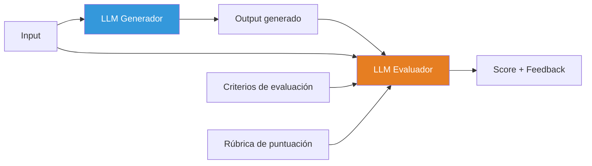
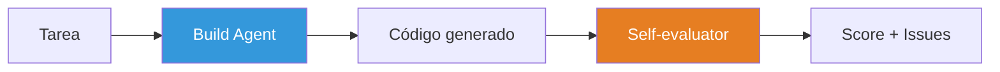
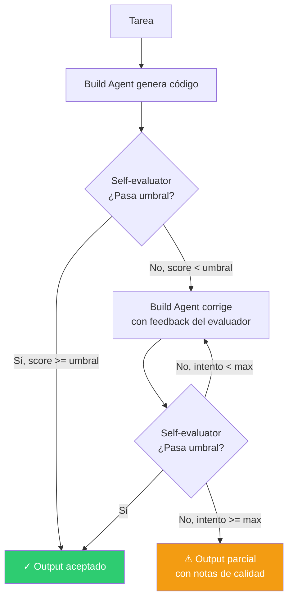

# Patrón Evaluator — LLM Evalúa a Otro LLM

> [!abstract]
> El patrón *Evaluator* utiliza un ==LLM como juez para evaluar la calidad del output de otro LLM==. Resuelve el problema de que la evaluación manual de outputs no escala, mientras que las métricas automáticas tradicionales (BLEU, ROUGE) no capturan la calidad semántica. architect implementa un ==self-evaluator con dos modos: basic (evaluación simple) y full (evaluar → corregir → reintentar)==. Las consideraciones clave incluyen sesgo del evaluador, consistencia inter-evaluador y calibración contra juicio humano. ^resumen

## Problema

Evaluar la calidad de outputs de LLMs es uno de los problemas más difíciles de la ingeniería de IA:

- **Evaluación manual no escala**: Un humano puede evaluar decenas de outputs por hora, no miles.
- **Métricas automáticas son superficiales**: BLEU mide solapamiento de n-gramas, no corrección ni utilidad.
- **La calidad es multidimensional**: Un output puede ser correcto pero mal formateado, o bien escrito pero incorrecto.
- **No hay ground truth**: Para tareas creativas o abiertas, no existe una respuesta "correcta" única.

> [!danger] Sin evaluación, estás volando a ciegas
> Deploying un sistema de IA sin evaluación automatizada es como lanzar software sin tests. ==Cada cambio de prompt, modelo o configuración puede degradar la calidad sin que lo detectes== hasta que los usuarios se quejan.

## Solución

El patrón Evaluator separa la generación de la evaluación en dos llamadas LLM independientes:



### Componentes del evaluador

| Componente | Descripción | Ejemplo |
|---|---|---|
| Input original | La solicitud que produjo el output | "Escribe una función de sorting" |
| Output a evaluar | Lo que generó el LLM | Código de la función |
| Criterios | Qué aspectos evaluar | Corrección, eficiencia, estilo |
| Rúbrica | Escala de puntuación | 1-5 con descripciones por nivel |
| Reference (opcional) | Respuesta de referencia | Implementación canónica |

### Rúbricas de evaluación

> [!tip] Diseño de rúbricas efectivas
> La calidad del evaluador depende directamente de la rúbrica. Una buena rúbrica:
> - Define cada nivel de puntuación con ejemplos concretos.
> - Es específica al tipo de tarea (código, texto, análisis).
> - Incluye dimensiones independientes (no un solo score global).
> - Es calibrada contra evaluación humana.

> [!example]- Rúbrica para evaluación de código
> ```markdown
> ## Rúbrica de evaluación de código
>
> ### Corrección (1-5)
> 1. No compila / errores de sintaxis
> 2. Compila pero produce resultados incorrectos
> 3. Funciona para casos básicos, falla en edge cases
> 4. Funciona correctamente para la mayoría de casos
> 5. Correcto para todos los casos, incluidos edge cases
>
> ### Eficiencia (1-5)
> 1. Complejidad exponencial o peor
> 2. Complejidad innecesariamente alta (O(n³) cuando O(n²) basta)
> 3. Complejidad aceptable pero subóptima
> 4. Complejidad óptima con constantes razonables
> 5. Solución óptima con optimizaciones prácticas
>
> ### Legibilidad (1-5)
> 1. Código ininteligible, sin nombres descriptivos
> 2. Difícil de seguir, nombres confusos
> 3. Legible pero sin documentación
> 4. Claro, con docstrings y nombres descriptivos
> 5. Ejemplar: claro, documentado, bien estructurado
>
> ### Seguridad (1-5)
> 1. Vulnerabilidades críticas (inyección, buffer overflow)
> 2. Problemas de seguridad significativos
> 3. Seguridad básica pero con gaps
> 4. Buenas prácticas de seguridad
> 5. Seguridad robusta con manejo defensivo
> ```

## Self-evaluator de architect

architect implementa un *self-evaluator* que evalúa los outputs de sus propios agentes:

### Modo basic

Evaluación simple de una pasada: generar → evaluar → reportar.



### Modo full

Evaluación con corrección: generar → evaluar → si falla, corregir → reevaluar.



> [!info] Diferencia entre self-evaluator y auto-review
> | Aspecto | Self-evaluator | Auto-review |
> |---|---|---|
> | Cuándo | Durante la generación | Después de completar |
> | Quién | El mismo agente evalúa | Agente limpio sin contexto previo |
> | Contexto | Tiene historial de build | Solo ve el diff final |
> | Propósito | Corregir errores iterativamente | Revisión imparcial |
> | Sesgo | Alto (evaluó su propio trabajo) | Bajo (contexto fresco) |

> [!example]- Implementación del self-evaluator
> ```python
> class SelfEvaluator:
>     def __init__(self, llm, rubric: str, threshold: float = 0.7):
>         self.llm = llm
>         self.rubric = rubric
>         self.threshold = threshold
>
>     async def evaluate(self, task: str, output: str) -> EvalResult:
>         prompt = f"""Evalúa el siguiente output según la rúbrica.
>
> Tarea original: {task}
>
> Output a evaluar:
> {output}
>
> Rúbrica:
> {self.rubric}
>
> Responde en JSON:
> {{
>     "scores": {{"criterio": score, ...}},
>     "overall": score_promedio,
>     "issues": ["problema 1", "problema 2"],
>     "suggestions": ["mejora 1", "mejora 2"]
> }}"""
>
>         result = await self.llm.generate(prompt)
>         return EvalResult.from_json(result)
>
>     async def evaluate_and_fix(
>         self, task: str, output: str, max_retries: int = 2
>     ) -> tuple[str, EvalResult]:
>         current_output = output
>
>         for attempt in range(max_retries + 1):
>             eval_result = await self.evaluate(task, current_output)
>
>             if eval_result.overall >= self.threshold:
>                 return current_output, eval_result
>
>             if attempt < max_retries:
>                 # Corregir basándose en feedback
>                 fix_prompt = f"""El output tiene problemas:
> {eval_result.issues}
>
> Sugerencias de mejora:
> {eval_result.suggestions}
>
> Output actual:
> {current_output}
>
> Genera una versión corregida:"""
>                 current_output = await self.llm.generate(fix_prompt)
>
>         return current_output, eval_result  # Mejor esfuerzo
> ```

## Consideraciones de LLM-as-Judge

> [!warning] Sesgos conocidos de LLM-as-Judge
> Los LLMs como evaluadores tienen sesgos documentados que debes mitigar:
>
> 1. **Sesgo de posición**: Favorecen la primera o última opción en comparaciones.
> 2. **Sesgo de verbosidad**: Puntúan más alto respuestas más largas.
> 3. **Sesgo de auto-mejora**: Si el generador y evaluador son el mismo modelo, tiende a evaluarse bien.
> 4. **Sesgo de estilo**: Favorecen su propio estilo de escritura.
> 5. **Inconsistencia**: La misma evaluación puede dar resultados diferentes en llamadas distintas.

### Mitigaciones

| Sesgo | Mitigación |
|---|---|
| Posición | Aleatorizar orden en comparaciones A/B |
| Verbosidad | Instrucción explícita de no premiar longitud |
| Auto-mejora | Usar modelo diferente como evaluador |
| Estilo | Rúbrica con criterios objetivos |
| Inconsistencia | Múltiples evaluaciones + promedio (n=3-5) |

> [!success] Calibración contra humanos
> Un evaluador LLM es útil solo si ==correlaciona con el juicio humano==. Calibrar periódicamente:
> 1. Evaluar 50-100 outputs manualmente.
> 2. Evaluar los mismos con el LLM.
> 3. Calcular correlación (Spearman, Cohen's kappa).
> 4. Ajustar rúbrica si la correlación es < 0.7.

## Cuándo usar

> [!success] Escenarios ideales para el patrón evaluator
> - Pipelines de producción que procesan miles de solicitudes diarias.
> - CI/CD para prompts: evaluar automáticamente antes de deploy.
> - Comparación de modelos: ¿GPT-4o o Claude Sonnet para esta tarea?
> - Quality gates en [[pattern-pipeline|pipelines]] automatizados.
> - Sistemas de [[pattern-reflection|reflection]] donde el agente mejora iterativamente.

## Cuándo NO usar

> [!failure] Escenarios donde el evaluator LLM no es adecuado
> - **Evaluación de seguridad**: Usar [[pattern-guardrails|guardrails deterministas]], no LLM.
> - **Validación de formato**: Regex o parsers son más fiables y baratos.
> - **Datos con ground truth**: Si tienes la respuesta correcta, usa métricas exactas.
> - **Presupuesto muy limitado**: Cada evaluación es una llamada LLM adicional.
> - **Tareas donde la calidad es binaria**: Funciona o no funciona (usar tests).

## Trade-offs

| Ventaja | Desventaja |
|---|---|
| Escala a miles de evaluaciones | Coste por evaluación (tokens adicionales) |
| Captura calidad semántica | Sesgos inherentes del evaluador |
| Adaptable a cualquier dominio via rúbrica | Inconsistencia entre evaluaciones |
| Automatiza quality gates | Necesita calibración contra humanos |
| Permite CI/CD de prompts | No sustituye tests deterministas |
| Feedback accionable para mejora | El evaluador puede fallar también |

## Patrones relacionados

- [[pattern-reflection]]: Reflection usa evaluación interna; evaluator es evaluación externa.
- [[pattern-guardrails]]: Guardrails deterministas complementan evaluación LLM.
- [[pattern-pipeline]]: El evaluator actúa como quality gate entre etapas.
- [[pattern-speculative-execution]]: El evaluator selecciona el mejor resultado de ejecuciones paralelas.
- [[pattern-agent-loop]]: El loop puede incorporar evaluación en cada iteración.
- [[pattern-map-reduce]]: Evaluación por lotes usa map-reduce para escalar.
- [[pattern-supervisor]]: El supervisor puede usar evaluadores para monitorizar calidad.

## Relación con el ecosistema

[[architect-overview|architect]] implementa el self-evaluator como parte de su ciclo de build. En modo basic, evalúa una vez al final. En modo full, implementa el ciclo evaluate → fix → retry que es una instancia del [[pattern-reflection|patrón reflection]]. El auto-review de architect es una forma especializada de evaluador: un agente limpio (sin contexto de build) revisa los cambios producidos.

[[vigil-overview|vigil]] es un evaluador determinista complementario al LLM-as-judge. Mientras el LLM evaluador captura calidad semántica, vigil verifica reglas estructurales, de formato y de seguridad con consistencia del 100%.

[[intake-overview|intake]] puede usar evaluadores para validar que las especificaciones generadas cumplen estándares de calidad antes de pasarlas a architect.

[[licit-overview|licit]] utiliza evaluadores especializados en compliance para verificar que los outputs cumplen normativas, con rúbricas derivadas de marcos regulatorios específicos.

## Enlaces y referencias

> [!quote]- Bibliografía
> - Zheng, L. et al. (2023). *Judging LLM-as-a-Judge with MT-Bench and Chatbot Arena*. Paper fundacional sobre LLM-as-judge.
> - Es, S. et al. (2024). *RAGAS: Automated Evaluation of Retrieval Augmented Generation*. Framework de evaluación para RAG.
> - Kim, S. et al. (2024). *Prometheus 2: An Open Source Language Model Specialized in Evaluating Other Language Models*. Modelo especializado en evaluación.
> - Anthropic. (2024). *Evaluating AI outputs*. Guía sobre diseño de evaluaciones para LLMs.
> - OpenAI. (2024). *Evals framework*. Framework open-source para evaluación de LLMs.

---

> [!tip] Navegación
> - Anterior: [[pattern-map-reduce]]
> - Siguiente: [[pattern-planner-executor]]
> - Índice: [[patterns-overview]]
