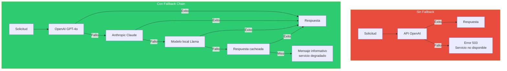
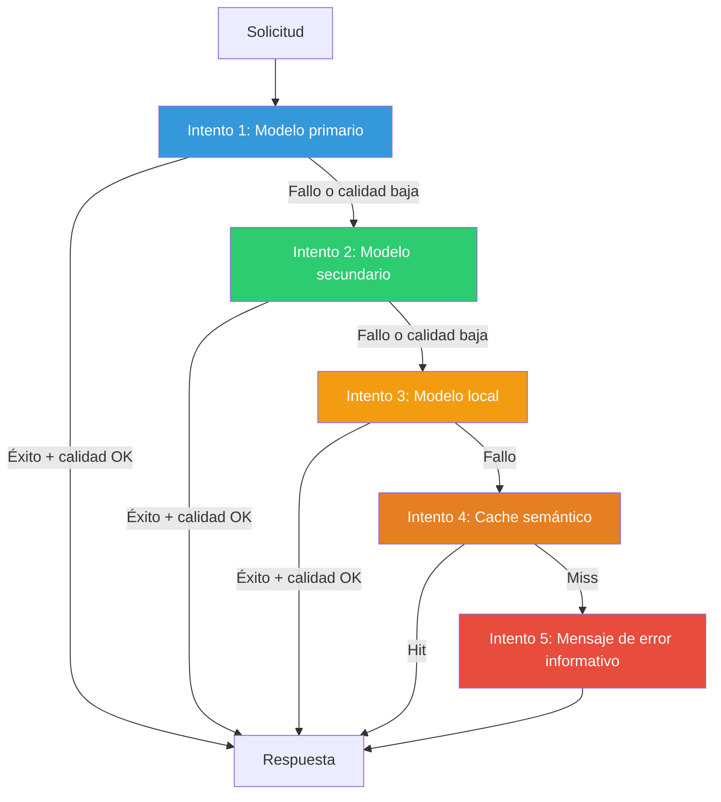
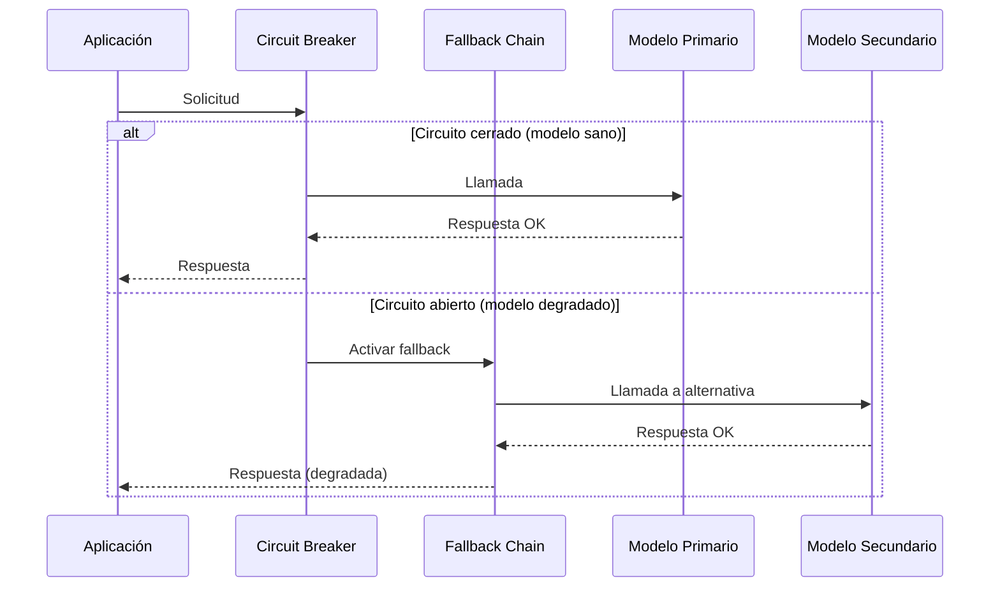

# Patrón Fallback Chains — Degradación Elegante

> [!abstract]
> Las *fallback chains* implementan ==cadenas de alternativas ordenadas por capacidad y fiabilidad== para cuando el modelo o servicio primario falla. El principio es simple: si A falla, intenta B; si B falla, intenta C. Cada eslabón es menos capaz pero más fiable, garantizando que ==el sistema siempre produce alguna respuesta==. architect configura fallbacks a través de LiteLLM, encadenando modelos de diferentes proveedores. El patrón es esencial en producción donde un SLA de disponibilidad del 99.9% exige resiliencia ante fallos de terceros. ^resumen

## Problema

Las APIs de LLM fallan de múltiples maneras:

| Tipo de fallo | Frecuencia | Impacto |
|---|---|---|
| Rate limiting (429) | Alta | Temporal, reintentar ayuda |
| Server error (500) | Media | Temporal, puede durar minutos |
| Timeout | Media | El modelo está sobrecargado |
| Output degradado | Baja | Respuesta de baja calidad |
| API caída completa | Rara | Minutos a horas sin servicio |
| Cambio de pricing | Rara | Coste inesperado |

> [!danger] La dependencia de un solo proveedor es un SPOF
> Si tu aplicación depende exclusivamente de OpenAI y su API cae (como ha ocurrido múltiples veces), tu servicio completo se detiene. En sistemas críticos, esto ==viola SLAs y puede tener consecuencias contractuales o legales==.



## Solución

Una *fallback chain* es una lista ordenada de proveedores/modelos que se prueban secuencialmente hasta obtener una respuesta aceptable.



### Niveles de la cadena

| Nivel | Tipo | Ejemplo | Trade-off |
|---|---|---|---|
| 1 | Modelo primario | Claude Opus | Mejor calidad, mayor coste |
| 2 | Modelo secundario (otro proveedor) | GPT-4o | Buena calidad, diversidad de proveedor |
| 3 | Modelo económico | GPT-4o-mini / Haiku | Menor calidad, más rápido y barato |
| 4 | Modelo local | Llama 3.1 via Ollama | Sin dependencia externa, menor calidad |
| 5 | Cache semántico | Respuesta similar previa | Instantáneo, puede estar desactualizado |
| 6 | Respuesta estática | Mensaje predefinido | Siempre funciona, sin inteligencia |

### Criterios de fallback

No solo los errores HTTP activan el fallback. Un sistema maduro también considera:

> [!warning] Fallback por calidad, no solo por error
> - **Timeout parcial**: El modelo responde pero tarda demasiado.
> - **Respuesta truncada**: El modelo alcanza el límite de tokens sin completar.
> - **Calidad insuficiente**: La respuesta no pasa un umbral de calidad (ver [[pattern-evaluator]]).
> - **Contenido bloqueado**: El modelo rechaza la solicitud por sus guardrails internos.
> - **Coste excesivo**: La estimación de tokens excede el presupuesto.

## Implementación

### Fallback con LiteLLM en architect

architect configura fallbacks a través de LiteLLM, aprovechando su soporte nativo para cadenas de modelos:

> [!example]- Configuración de fallbacks en architect
> ```python
> from litellm import Router
>
> # Configuración de fallback chain para architect
> model_list = [
>     {
>         "model_name": "primary",
>         "litellm_params": {
>             "model": "anthropic/claude-opus-4-20250514",
>             "api_key": os.environ["ANTHROPIC_API_KEY"],
>             "timeout": 60,
>             "max_retries": 2,
>         },
>     },
>     {
>         "model_name": "secondary",
>         "litellm_params": {
>             "model": "openai/gpt-4o",
>             "api_key": os.environ["OPENAI_API_KEY"],
>             "timeout": 45,
>             "max_retries": 2,
>         },
>     },
>     {
>         "model_name": "fallback",
>         "litellm_params": {
>             "model": "anthropic/claude-sonnet-4-20250514",
>             "api_key": os.environ["ANTHROPIC_API_KEY"],
>             "timeout": 30,
>             "max_retries": 1,
>         },
>     },
>     {
>         "model_name": "local",
>         "litellm_params": {
>             "model": "ollama/llama3.1:70b",
>             "api_base": "http://localhost:11434",
>             "timeout": 120,
>         },
>     },
> ]
>
> router = Router(
>     model_list=model_list,
>     fallbacks=[
>         {"primary": ["secondary", "fallback", "local"]},
>     ],
>     context_window_fallbacks=[
>         {"primary": ["secondary"]},  # Si excede contexto
>     ],
>     set_verbose=True,
> )
> ```

### Fallback con reintentos inteligentes

> [!example]- Implementación con retry + fallback
> ```python
> import asyncio
> from dataclasses import dataclass
> from typing import List, Optional
>
> @dataclass
> class FallbackConfig:
>     model: str
>     max_retries: int = 2
>     timeout: float = 60.0
>     retry_delay: float = 1.0
>     quality_threshold: float = 0.7
>
> class FallbackChain:
>     def __init__(self, configs: List[FallbackConfig]):
>         self.configs = configs
>         self.metrics = FallbackMetrics()
>
>     async def execute(self, messages: list) -> dict:
>         last_error = None
>
>         for i, config in enumerate(self.configs):
>             for retry in range(config.max_retries + 1):
>                 try:
>                     result = await asyncio.wait_for(
>                         self._call_llm(config.model, messages),
>                         timeout=config.timeout
>                     )
>
>                     # Verificar calidad
>                     quality = self._evaluate_quality(result)
>                     if quality >= config.quality_threshold:
>                         self.metrics.record_success(
>                             level=i, retry=retry
>                         )
>                         return result
>
>                     last_error = f"Quality {quality} < threshold"
>
>                 except asyncio.TimeoutError:
>                     last_error = f"Timeout after {config.timeout}s"
>                 except Exception as e:
>                     last_error = str(e)
>
>                 if retry < config.max_retries:
>                     await asyncio.sleep(config.retry_delay * (2**retry))
>
>             self.metrics.record_fallback(level=i)
>
>         # Todos los niveles fallaron
>         self.metrics.record_total_failure()
>         return self._static_fallback_response(last_error)
> ```

## Conexión con circuit breaker

El patrón fallback se complementa con [[pattern-circuit-breaker]]:



> [!tip] Fallback reactivo vs proactivo
> - **Reactivo**: Solo activa el fallback cuando el primario falla. Más simple, pero añade latencia del intento fallido.
> - **Proactivo** (con circuit breaker): Salta directamente al fallback cuando el primario está en estado "abierto". Más rápido, requiere monitorización.

## Cuándo usar

> [!success] Escenarios ideales para fallback chains
> - Sistemas en producción con SLAs de disponibilidad (99.9%+).
> - Aplicaciones que no pueden mostrar errores al usuario final.
> - Dependencia de APIs de terceros con historial de caídas.
> - Sistemas donde la respuesta degradada es mejor que ninguna respuesta.
> - Multi-proveedor como estrategia de negociación (evitar vendor lock-in).

## Cuándo NO usar

> [!failure] Escenarios donde los fallbacks son innecesarios
> - **Prototipos y desarrollo**: La complejidad no justifica el beneficio.
> - **Un solo proveedor disponible**: No hay alternativa real.
> - **Tareas críticas de precisión**: Si la respuesta degradada es peor que no responder, el fallback puede causar más daño.
> - **Sistemas offline**: Si no dependes de APIs externas, no necesitas fallbacks a nivel de modelo.

## Trade-offs

| Ventaja | Desventaja |
|---|---|
| Alta disponibilidad ante fallos de proveedores | Complejidad de configuración y testing |
| Reducción de impacto de rate limiting | Costes de mantener múltiples proveedores |
| Degradación elegante en lugar de errores | Inconsistencia entre respuestas de distintos modelos |
| Diversificación de riesgo de proveedor | Latencia adicional en caso de fallback |
| Preparación para cambios de pricing | Necesidad de abstraer diferencias de API |
| Experiencia de usuario más consistente | Monitorización más compleja |

## Patrones relacionados

- [[pattern-circuit-breaker]]: Detecta degradación y activa fallback proactivamente.
- [[pattern-routing]]: El router selecciona el modelo; el fallback actúa cuando falla.
- [[pattern-semantic-cache]]: El cache puede servir como nivel de fallback.
- [[pattern-guardrails]]: Valida la calidad del output del fallback.
- [[pattern-evaluator]]: Evalúa si la respuesta del fallback es suficientemente buena.
- [[pattern-agent-loop]]: El loop puede reintentar con fallback en cada iteración.
- [[pattern-pipeline]]: Cada paso del pipeline puede tener su propia cadena de fallback.
- [[pattern-supervisor]]: El supervisor detecta necesidad de activar fallback.

## Relación con el ecosistema

[[architect-overview|architect]] configura fallbacks a través de LiteLLM como parte de su infraestructura base. Cada agente (plan, build, review) tiene su cadena de fallback configurada. Las redes de seguridad de architect (timeout, budget) actúan como triggers para el fallback: si el modelo primario agota el presupuesto, el sistema puede degradar a un modelo más económico.

[[vigil-overview|vigil]] valida los outputs independientemente del modelo que los genere, asegurando que un fallback a un modelo menos capaz no comprometa la calidad mínima.

[[intake-overview|intake]] necesita fallbacks para garantizar que la normalización de requisitos siempre produce un resultado, incluso si el modelo primario está degradado.

[[licit-overview|licit]] puede requerir que ciertos niveles de fallback no se usen para tareas de compliance, ya que modelos menos capaces podrían no cumplir estándares regulatorios.

## Enlaces y referencias

> [!quote]- Bibliografía
> - BerriAI. (2024). *LiteLLM Fallback Documentation*. Configuración de fallbacks con LiteLLM.
> - Nygard, M. T. (2018). *Release It! Design and Deploy Production-Ready Software*. Pragmatic Bookshelf. Patrones de resiliencia clásicos aplicables a LLMs.
> - Netflix. (2012). *Fault Tolerance in a High Volume, Distributed System*. Principios de degradación elegante.
> - AWS. (2024). *Well-Architected Framework — Reliability Pillar*. Principios de fiabilidad aplicados a servicios de IA.
> - Microsoft. (2024). *Retry and fallback patterns for Azure AI Services*. Implementación de referencia en cloud.

---

> [!tip] Navegación
> - Anterior: [[pattern-routing]]
> - Siguiente: [[pattern-map-reduce]]
> - Índice: [[patterns-overview]]
