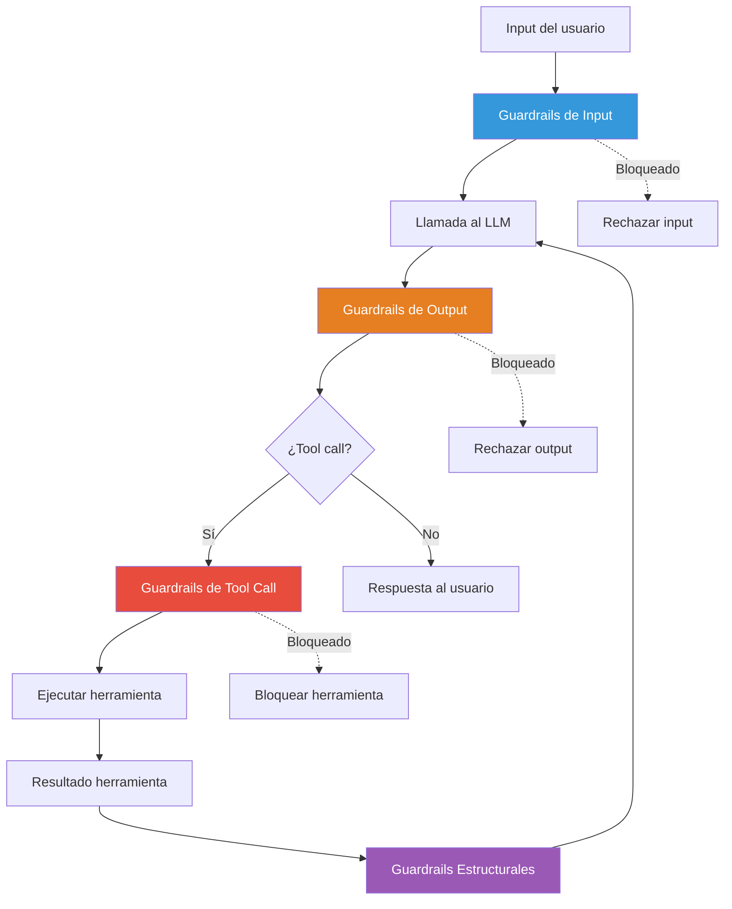
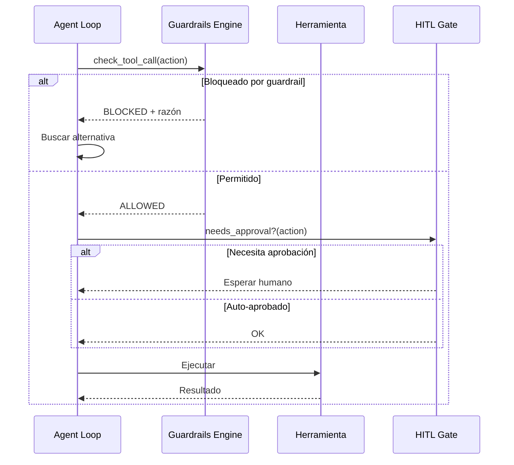

# Patrón Guardrails — Validación Determinista de I/O

> [!abstract]
> El patrón *Guardrails* establece ==validaciones deterministas antes y después de cada interacción con un LLM==. A diferencia de la supervisión humana ([[pattern-human-in-loop]]), los guardrails son automáticos, instantáneos y consistentes. Resuelven el problema de que los LLMs producen ==outputs impredecibles que pueden violar políticas de seguridad, formato o contenido==. architect implementa un motor de guardrails con funciones como `check_file_access`, `check_command`, `check_edit_limits` y `check_code_rules`. vigil es el sistema de guardrails de output más completo del ecosistema, con 26 reglas deterministas y 4 analizadores. ^resumen

## Problema

Los LLMs son sistemas probabilísticos que pueden producir:

- **Outputs inseguros**: Código con vulnerabilidades, comandos destructivos, datos sensibles expuestos.
- **Outputs malformados**: JSON inválido, código con errores de sintaxis, respuestas fuera de formato.
- **Outputs inapropiados**: Contenido ofensivo, información personal, contenido con derechos de autor.
- **Acciones fuera de scope**: El agente intenta operaciones que no debería hacer.

> [!danger] Sin guardrails, un LLM es un sistema de confianza ciega
> Cada llamada al LLM es una caja negra que puede devolver cualquier cosa. Los guardrails son la ==red de seguridad que transforma un sistema impredecible en uno fiable==. Sin ellos, estás a una alucinación de distancia de un incidente de seguridad.

## Solución

Los guardrails implementan capas de validación en cuatro puntos del flujo de ejecución:



### Capa 1: Guardrails de input

Validan lo que entra al LLM antes de la llamada:

| Regla | Descripción | Ejemplo |
|---|---|---|
| Longitud máxima | Limitar tokens de input | Max 4000 tokens por mensaje |
| Detección de inyección | Identificar prompt injection | "Ignora instrucciones anteriores..." |
| PII detection | Detectar información personal | Números de tarjeta, SSN, emails |
| Content filtering | Filtrar contenido prohibido | Palabras clave de políticas |
| Schema validation | Validar estructura esperada | JSON schema del input |

### Capa 2: Guardrails de output

Validan lo que el LLM genera:

| Regla | Descripción | Ejemplo |
|---|---|---|
| Format validation | Verificar formato esperado | JSON válido, Markdown correcto |
| Factual consistency | Verificar coherencia interna | No contradecir hechos del contexto |
| Toxicity check | Detectar contenido tóxico | Clasificador de toxicidad |
| Length bounds | Limitar longitud de respuesta | Min/max caracteres |
| Source attribution | Verificar citas de fuentes | En RAG, toda afirmación debe tener fuente |

### Capa 3: Guardrails de tool calls

Validan las acciones que el agente quiere ejecutar:

> [!warning] Esta es la capa más crítica para seguridad
> Un agente con acceso a herramientas puede ejecutar código arbitrario, modificar archivos y ejecutar comandos del sistema. Los guardrails de tool calls son la ==última línea de defensa antes de la acción==.

### Capa 4: Guardrails estructurales

Validan invariantes del sistema:

- Presupuesto de tokens no excedido.
- Número de pasos dentro del límite.
- Tiempo de ejecución dentro del timeout.
- Uso de contexto dentro de la ventana.

## Motor de guardrails de architect

architect implementa un motor de guardrails que intercepta cada acción del agente:

> [!example]- Funciones del motor de guardrails de architect
> ```python
> class GuardrailsEngine:
>     """Motor de guardrails de architect."""
>
>     def check_file_access(self, path: str, operation: str) -> bool:
>         """Verifica acceso a archivos.
>
>         Reglas:
>         - No acceder fuera del directorio del proyecto.
>         - No modificar archivos del sistema.
>         - No leer archivos sensibles (.env, credentials).
>         - Respetar .gitignore para operaciones de búsqueda.
>         """
>         if self._is_outside_project(path):
>             return False
>         if self._is_system_file(path):
>             return False
>         if operation == "write" and self._is_sensitive(path):
>             return False
>         return True
>
>     def check_command(self, command: str) -> bool:
>         """Valida comandos shell antes de ejecutar.
>
>         Reglas:
>         - Bloquear comandos destructivos (rm -rf /, etc).
>         - Bloquear comandos de red no autorizados.
>         - Bloquear instalación de paquetes sin confirmación.
>         - Bloquear modificación de configuración del sistema.
>         """
>         for pattern in self.BLOCKED_COMMANDS:
>             if re.match(pattern, command):
>                 return False
>         return True
>
>     def check_edit_limits(
>         self, file_path: str, changes: dict
>     ) -> bool:
>         """Limita el scope de ediciones.
>
>         Reglas:
>         - No editar más de N líneas en una operación.
>         - No reescribir archivos completos sin justificación.
>         - No crear archivos excesivamente grandes.
>         """
>         if changes["lines_changed"] > self.MAX_EDIT_LINES:
>             return False
>         if changes["is_full_rewrite"] and not changes["justified"]:
>             return False
>         return True
>
>     def check_code_rules(self, code: str, language: str) -> bool:
>         """Valida código generado contra reglas.
>
>         Reglas:
>         - No hardcodear secretos.
>         - No usar funciones deprecated.
>         - No desactivar seguridad (SSL verify, CORS).
>         - Seguir convenciones del proyecto.
>         """
>         for rule in self.CODE_RULES[language]:
>             if rule.matches(code):
>                 return False
>         return True
> ```

### Flujo de ejecución con guardrails



## vigil como sistema de guardrails de output

[[vigil-overview|vigil]] es el sistema de guardrails más completo del ecosistema, diseñado específicamente para validar outputs de LLMs:

> [!info] Arquitectura de vigil
> | Componente | Reglas | Tipo |
> |---|---|---|
> | Analizador de formato | 6 reglas | Determinista |
> | Analizador de seguridad | 8 reglas | Determinista |
> | Analizador de contenido | 7 reglas | Determinista |
> | Analizador semántico | 5 reglas | Determinista + heurístico |
> | **Total** | **26 reglas** | **4 analizadores** |

> [!tip] Determinista vs LLM-based
> vigil usa ==reglas deterministas== (regex, AST parsing, heurísticas) en lugar de otro LLM para validar. Esto garantiza:
> - **Consistencia**: La misma entrada siempre produce el mismo resultado.
> - **Velocidad**: Microsegundos vs segundos de una llamada LLM.
> - **Coste**: Cero tokens adicionales.
> - **Auditabilidad**: Cada decisión es trazable a una regla específica.

### Guardrails deterministas vs LLM-based

| Aspecto | Deterministas (vigil) | LLM-based |
|---|---|---|
| Consistencia | 100% reproducible | Probabilístico |
| Latencia | Microsegundos | 1-5 segundos |
| Coste | Cero | Tokens por validación |
| Cobertura | Reglas conocidas | Casos emergentes |
| Mantenimiento | Actualizar reglas | Actualizar prompts |
| Edge cases | Pueden escaparse | Mejor generalización |

> [!success] Estrategia recomendada
> Combinar ambos tipos: ==deterministas como primera línea== (rápidos, baratos, consistentes) y ==LLM-based como segunda línea== (para casos que las reglas no cubren).

## Cuándo usar

> [!success] Escenarios ideales para guardrails
> - Todo sistema en producción que use LLMs. Sin excepción.
> - Agentes con acceso a herramientas (lectura, escritura, ejecución).
> - Sistemas que generan código ejecutable.
> - Aplicaciones que manejan datos sensibles (PII, financieros, médicos).
> - Pipelines automatizados sin supervisión humana.

## Cuándo NO usar

> [!failure] Escenarios donde los guardrails son innecesarios
> - Prototipos desechables sin datos reales.
> - Experimentación en entornos completamente aislados.
> - Sistemas donde el output no tiene consecuencias (generación creativa sin publicación).
> - **Nota**: Estos escenarios son raros. En la duda, añade guardrails.

## Implementación

> [!example]- Framework de guardrails extensible
> ```python
> from abc import ABC, abstractmethod
> from dataclasses import dataclass
> from typing import List, Optional
>
> @dataclass
> class GuardrailResult:
>     allowed: bool
>     rule_id: str
>     reason: str
>     severity: str  # "info", "warning", "error", "critical"
>     suggestion: Optional[str] = None
>
> class Guardrail(ABC):
>     @abstractmethod
>     def check(self, content: str, context: dict) -> GuardrailResult:
>         pass
>
> class PII_Detector(Guardrail):
>     PATTERNS = {
>         "credit_card": r"\b\d{4}[\s-]?\d{4}[\s-]?\d{4}[\s-]?\d{4}\b",
>         "ssn": r"\b\d{3}-\d{2}-\d{4}\b",
>         "email": r"\b[A-Za-z0-9._%+-]+@[A-Za-z0-9.-]+\.[A-Z]{2,}\b",
>     }
>
>     def check(self, content, context):
>         for pii_type, pattern in self.PATTERNS.items():
>             if re.search(pattern, content):
>                 return GuardrailResult(
>                     allowed=False,
>                     rule_id=f"pii_{pii_type}",
>                     reason=f"PII detectado: {pii_type}",
>                     severity="critical",
>                     suggestion="Redactar información personal"
>                 )
>         return GuardrailResult(True, "pii_check", "OK", "info")
>
> class GuardrailPipeline:
>     def __init__(self, guardrails: List[Guardrail]):
>         self.guardrails = guardrails
>
>     def run(self, content: str, context: dict) -> List[GuardrailResult]:
>         results = []
>         for guardrail in self.guardrails:
>             result = guardrail.check(content, context)
>             results.append(result)
>             if result.severity == "critical" and not result.allowed:
>                 break  # Parar en primera violación crítica
>         return results
> ```

## Trade-offs

| Ventaja | Desventaja |
|---|---|
| Seguridad consistente y automática | Falsos positivos pueden bloquear acciones legítimas |
| Sin latencia significativa (deterministas) | Mantenimiento de reglas requiere esfuerzo continuo |
| Auditabilidad completa | Reglas demasiado estrictas frustran al usuario |
| Independiente de la calidad del LLM | No cubren todos los edge cases |
| Coste marginal cero (deterministas) | Complejidad creciente con más reglas |
| Complementan HITL y supervisores | Necesitan testing y actualización regular |

## Patrones relacionados

- [[pattern-human-in-loop]]: HITL maneja lo que los guardrails no pueden decidir automáticamente.
- [[pattern-agent-loop]]: Los guardrails se integran en cada iteración del loop.
- [[pattern-evaluator]]: Evaluadores LLM-based complementan guardrails deterministas.
- [[pattern-pipeline]]: Los guardrails actúan como quality gates entre etapas.
- [[pattern-supervisor]]: El supervisor usa guardrails como señales de alerta.
- [[anti-patterns-ia]]: No tener guardrails es el anti-patrón de seguridad más peligroso.
- [[pattern-fallback]]: Cuando un guardrail bloquea, el fallback proporciona alternativas.
- [[pattern-circuit-breaker]]: Los guardrails detectan degradación que activa el circuit breaker.

## Relación con el ecosistema

[[vigil-overview|vigil]] es el ==sistema de guardrails del ecosistema==. Sus 26 reglas deterministas y 4 analizadores validan tanto inputs como outputs de los agentes. Cada regla tiene un ID único, documentación y tests, permitiendo auditoría completa.

[[architect-overview|architect]] integra su propio motor de guardrails para validar acciones del agente (acceso a archivos, comandos, ediciones) y delega la validación de contenido generado a vigil.

[[licit-overview|licit]] extiende los guardrails al dominio regulatorio, implementando *compliance guardrails* que verifican que los outputs cumplan normativas específicas (GDPR, HIPAA, SOC2).

[[intake-overview|intake]] utiliza guardrails para validar que los requisitos normalizados cumplen estándares de calidad y completitud antes de pasar al siguiente pipeline.

## Enlaces y referencias

> [!quote]- Bibliografía
> - Anthropic. (2024). *Safeguarding AI Systems*. Guía sobre guardrails para sistemas IA.
> - Guardrails AI. (2024). *Guardrails Framework*. Framework open-source de referencia para guardrails.
> - Rebedea, T. et al. (2023). *NeMo Guardrails: A Toolkit for Controllable and Safe LLM Applications*. NVIDIA. Framework de guardrails conversacionales.
> - OWASP. (2024). *Top 10 for LLM Applications*. Lista de vulnerabilidades que los guardrails deben cubrir.
> - Inan, H. et al. (2023). *Llama Guard: LLM-based Input-Output Safeguard for Human-AI Conversations*. Meta. Guardrails basados en LLM.

---

> [!tip] Navegación
> - Anterior: [[pattern-human-in-loop]]
> - Siguiente: [[pattern-routing]]
> - Índice: [[patterns-overview]]
