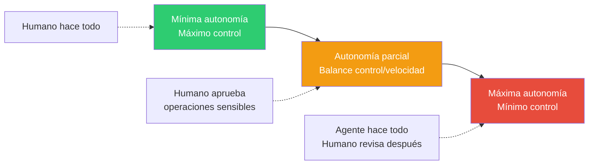
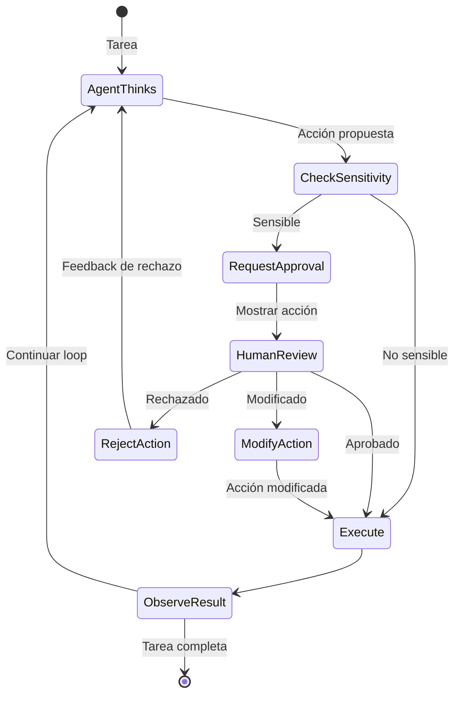
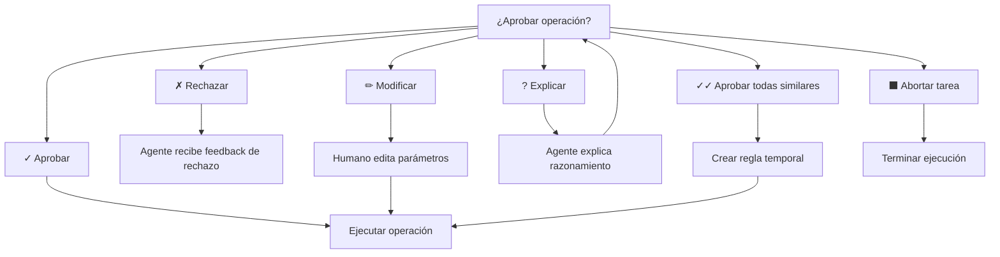

# Patrón Human-in-the-Loop — Aprobación Humana en Puntos Críticos

> [!abstract]
> El patrón *Human-in-the-Loop* (HITL) introduce ==puntos de aprobación humana en la ejecución de agentes autónomos==. Resuelve el problema fundamental de que los agentes IA pueden tomar decisiones costosas o irreversibles sin comprensión real de las consecuencias. architect implementa tres modos de confirmación: ==`yolo` (sin confirmación), `confirm-sensitive` (solo escrituras y comandos) y `confirm-all` (todo)==. El diseño UX de los flujos de aprobación es tan importante como la lógica técnica. ^resumen

## Problema

Los agentes autónomos con acceso a herramientas pueden ejecutar operaciones con consecuencias graves:

- **Eliminar archivos** que no deberían eliminarse.
- **Ejecutar comandos** destructivos (`rm -rf`, `DROP TABLE`).
- **Modificar configuraciones** de producción.
- **Enviar comunicaciones** con contenido inapropiado.
- **Gastar presupuesto** en llamadas API excesivas.

> [!danger] El incidente del agente autónomo
> Un agente de código con permisos completos puede interpretar "limpia el proyecto" como "elimina todos los archivos que no son esenciales", incluyendo archivos de configuración, datos de prueba y documentación. Sin HITL, esta operación se ejecuta en segundos y puede ser ==irrecuperable== sin backups.

La tensión fundamental es: ==más autonomía = más productividad pero más riesgo==.



## Solución

HITL inserta checkpoints de aprobación humana en el [[pattern-agent-loop|agent loop]], pausando la ejecución antes de operaciones sensibles.



### Clasificación de operaciones

La clave del patrón es ==clasificar correctamente qué operaciones son sensibles==:

| Nivel | Tipo de operación | Ejemplos | Acción |
|---|---|---|---|
| Safe | Solo lectura | Leer archivos, buscar, listar | Ejecutar sin confirmación |
| Sensitive | Escritura reversible | Editar archivos, crear archivos | Confirmar según modo |
| Dangerous | Escritura irreversible | Eliminar archivos, ejecutar comandos shell | Siempre confirmar |
| Critical | Impacto externo | Enviar emails, deploy, pagos | Confirmar con detalle extra |

## Modos de confirmación en architect

architect implementa tres modos que el usuario selecciona según su nivel de confianza y el contexto de la tarea:

### Modo `yolo` — Sin confirmación

> [!warning] Modo yolo: máxima velocidad, máximo riesgo
> El agente ejecuta todas las operaciones sin pedir aprobación. Útil para:
> - Entornos de desarrollo aislados (contenedores, VMs desechables).
> - Tareas bien definidas con bajo riesgo.
> - Usuarios expertos que confían en los [[pattern-guardrails|guardrails]] del sistema.
>
> **NUNCA** usar en producción ni con datos irreemplazables.

### Modo `confirm-sensitive` — Balance recomendado

El modo por defecto. El agente ejecuta lecturas libremente pero solicita aprobación para:
- Escrituras en archivos.
- Ejecución de comandos shell.
- Operaciones con efectos secundarios.

> [!example]- Flujo de confirm-sensitive
> ```
> Agent: Necesito editar src/config.py para añadir el nuevo parámetro.
>
> [CONFIRMACIÓN REQUERIDA]
> Operación: edit_file
> Archivo: src/config.py
> Cambios:
>   + timeout: int = 30
>   + max_retries: int = 3
>
> ¿Aprobar? [y/n/edit/explain]
>
> Usuario: y
> Agent: ✓ Archivo editado. Ahora necesito ejecutar los tests.
>
> [CONFIRMACIÓN REQUERIDA]
> Operación: run_command
> Comando: pytest tests/test_config.py -v
>
> ¿Aprobar? [y/n/edit/explain]
>
> Usuario: y
> Agent: ✓ 12 tests passed, 0 failed.
> ```

### Modo `confirm-all` — Máximo control

Cada acción del agente, incluyendo lecturas, requiere aprobación. Adecuado para:
- Primeras interacciones con un agente nuevo.
- Operaciones en entornos sensibles.
- Auditoría completa de acciones.

> [!info] El coste de confirm-all
> Este modo reduce drásticamente la productividad del agente. Una tarea de 20 pasos con 2 segundos de aprobación por paso añade 40 segundos de latencia humana. Úsalo solo cuando el riesgo justifica el coste.

## Diseño UX para flujos de aprobación

> [!tip] Principios de UX para HITL
> 1. **Contexto suficiente**: Mostrar qué hará la operación, no solo el nombre de la herramienta.
> 2. **Diff visual**: Para ediciones de archivos, mostrar el diff antes/después.
> 3. **Opciones claras**: Aprobar, rechazar, modificar, pedir explicación.
> 4. **Agrupación**: Permitir aprobar lotes de operaciones similares ("aprobar todas las ediciones").
> 5. **Memoria de decisiones**: Si el usuario aprueba un patrón, no preguntar de nuevo por el mismo tipo.
> 6. **Timeout con default seguro**: Si el humano no responde en X minutos, asumir rechazo.

### Opciones de respuesta del humano



## Criterios de escalación

No todas las operaciones se escalan igual. Un sistema HITL maduro implementa ==criterios de escalación progresiva==:

| Criterio | Escalación |
|---|---|
| Operación nunca vista | Confirmar siempre |
| Operación vista y aprobada 3+ veces | Auto-aprobar |
| Operación en archivo nuevo | Confirmar |
| Operación en archivo previamente editado | Auto-aprobar |
| Comando shell con flags destructivos | Confirmar siempre |
| Coste estimado > umbral | Confirmar con detalle |
| Operación fuera del scope de la tarea | Confirmar con warning |

> [!question] ¿Cuánta autonomía dar al agente?
> La respuesta depende del contexto:
> - **Desarrollo personal**: `yolo` o `confirm-sensitive`.
> - **Proyecto de equipo**: `confirm-sensitive` con reglas de escalación.
> - **Producción**: `confirm-all` o workflows de aprobación multi-persona.
> - **Compliance regulatorio**: Aprobación documentada con audit trail (ver [[licit-overview]]).

## Implementación de referencia

> [!example]- Sistema HITL completo
> ```python
> from enum import Enum
> from dataclasses import dataclass
> from typing import Optional
>
> class ConfirmMode(Enum):
>     YOLO = "yolo"
>     CONFIRM_SENSITIVE = "confirm-sensitive"
>     CONFIRM_ALL = "confirm-all"
>
> class Sensitivity(Enum):
>     SAFE = "safe"
>     SENSITIVE = "sensitive"
>     DANGEROUS = "dangerous"
>     CRITICAL = "critical"
>
> @dataclass
> class ApprovalRequest:
>     tool_name: str
>     parameters: dict
>     sensitivity: Sensitivity
>     context: str
>     diff: Optional[str] = None
>
> class HITLGate:
>     def __init__(self, mode: ConfirmMode):
>         self.mode = mode
>         self.auto_approved_patterns = set()
>
>     def needs_approval(self, request: ApprovalRequest) -> bool:
>         if self.mode == ConfirmMode.YOLO:
>             return False
>         if self.mode == ConfirmMode.CONFIRM_ALL:
>             return True
>         # CONFIRM_SENSITIVE
>         if request.sensitivity == Sensitivity.SAFE:
>             return False
>         if request.sensitivity == Sensitivity.DANGEROUS:
>             return True  # Siempre confirmar
>         # Check auto-approval patterns
>         pattern = f"{request.tool_name}:{request.parameters}"
>         return pattern not in self.auto_approved_patterns
>
>     async def request_approval(
>         self, request: ApprovalRequest
>     ) -> tuple[bool, Optional[dict]]:
>         display_approval_prompt(request)
>         response = await wait_for_human_input(timeout=300)
>
>         match response:
>             case "y" | "yes":
>                 return (True, None)
>             case "n" | "no":
>                 return (False, None)
>             case "edit":
>                 modified = await get_modified_params()
>                 return (True, modified)
>             case "explain":
>                 return (None, None)  # Re-prompt
>             case "approve-all":
>                 self.auto_approved_patterns.add(
>                     f"{request.tool_name}:*"
>                 )
>                 return (True, None)
>             case _:
>                 return (False, None)  # Default seguro
> ```

## Cuándo usar

> [!success] Escenarios ideales para HITL
> - Agentes con acceso a operaciones destructivas (eliminar, sobrescribir).
> - Entornos de producción o staging.
> - Operaciones con coste financiero (APIs de pago, cloud resources).
> - Sistemas que interactúan con usuarios finales (envío de emails, mensajes).
> - Requisitos de compliance que exigen audit trail.

## Cuándo NO usar

> [!failure] Escenarios donde HITL es contraproducente
> - **Pipelines automatizados**: CI/CD que debe ejecutarse sin intervención humana. Usar [[pattern-guardrails]] en su lugar.
> - **Tareas de alto volumen**: Procesar 1000 archivos uno a uno con aprobación no es viable.
> - **Entornos sandboxed**: Si el agente opera en un contenedor desechable, el riesgo es mínimo.
> - **Latencia crítica**: Sistemas que necesitan respuesta en tiempo real no pueden esperar aprobación humana.

## Trade-offs

| Ventaja | Desventaja |
|---|---|
| Previene operaciones destructivas no deseadas | Reduce velocidad de ejecución |
| Audit trail completo de decisiones | Fatiga de aprobación (*approval fatigue*) |
| El humano mantiene control del proceso | Depende de la disponibilidad humana |
| Confianza incremental en el agente | UX compleja de implementar bien |
| Combinable con escalación progresiva | Riesgo de *rubber-stamping* por fatiga |
| Cumplimiento regulatorio | Coste de oportunidad del tiempo humano |

> [!warning] Approval fatigue
> Cuando el humano aprueba muchas operaciones seguidas, empieza a aprobar sin leer (*rubber-stamping*). Mitiga esto con: agrupación de operaciones, auto-aprobación de patrones repetidos y resúmenes claros en lugar de detalles técnicos.

## Patrones relacionados

- [[pattern-agent-loop]]: HITL se integra dentro del agent loop como punto de pausa.
- [[pattern-guardrails]]: Guardrails automáticos complementan HITL para operaciones que siempre deben bloquearse.
- [[pattern-supervisor]]: El supervisor automatiza parte del trabajo de revisión humana.
- [[pattern-pipeline]]: Los pipelines definen checkpoints donde HITL es obligatorio.
- [[pattern-evaluator]]: Puede reducir la necesidad de HITL al automatizar evaluación de calidad.
- [[pattern-planner-executor]]: El humano puede aprobar el plan antes de la ejecución.

## Relación con el ecosistema

[[architect-overview|architect]] implementa HITL como característica central con sus tres modos de confirmación. La elección del modo se hace al inicio de la sesión y afecta a todo el [[pattern-agent-loop|agent loop]]. Los [[pattern-guardrails|guardrails]] de architect actúan como un HITL automatizado: bloquean operaciones peligrosas independientemente del modo de confirmación.

[[licit-overview|licit]] extiende HITL al dominio de compliance, donde la aprobación humana no es opcional sino ==legalmente requerida==. Los *compliance gates* de licit generan evidencia documental de cada aprobación para auditorías.

[[vigil-overview|vigil]] opera como un HITL automatizado: sus 26 reglas deterministas toman decisiones de aprobación/rechazo sin intervención humana, liberando al humano para focalizarse en decisiones que requieren juicio.

[[intake-overview|intake]] puede generar las reglas de escalación basándose en los requisitos del proyecto, determinando qué operaciones necesitan aprobación humana según el contexto del sistema.

## Enlaces y referencias

> [!quote]- Bibliografía
> - Amershi, S. et al. (2019). *Guidelines for Human-AI Interaction*. Microsoft Research. 18 directrices para interacción humano-IA.
> - Anthropic. (2024). *Building effective agents — Human-in-the-loop patterns*. Sección específica sobre HITL en agentes.
> - Horvitz, E. (1999). *Principles of Mixed-Initiative User Interfaces*. Paper fundacional sobre iniciativa mixta humano-máquina.
> - Shneiderman, B. (2022). *Human-Centered AI*. Oxford University Press. Marco teórico para IA centrada en humanos.
> - Wu, T. et al. (2022). *AI Chains: Transparent and Controllable Human-AI Interaction*. Patrones de interacción transparente.

---

> [!tip] Navegación
> - Anterior: [[pattern-agent-loop]]
> - Siguiente: [[pattern-guardrails]]
> - Índice: [[patterns-overview]]
