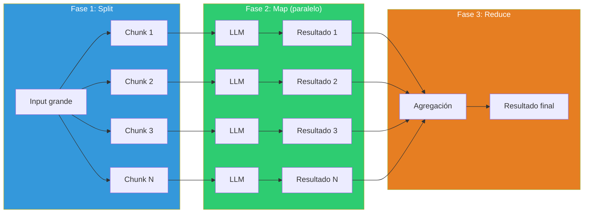
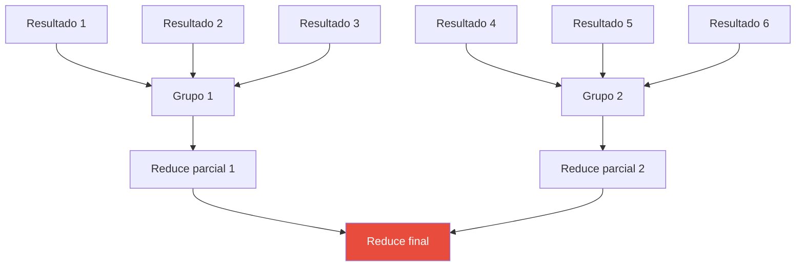
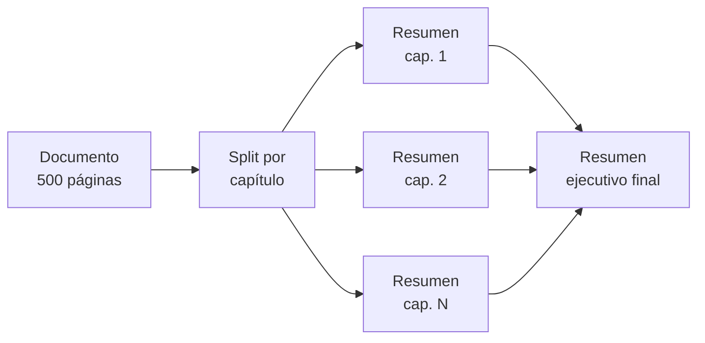
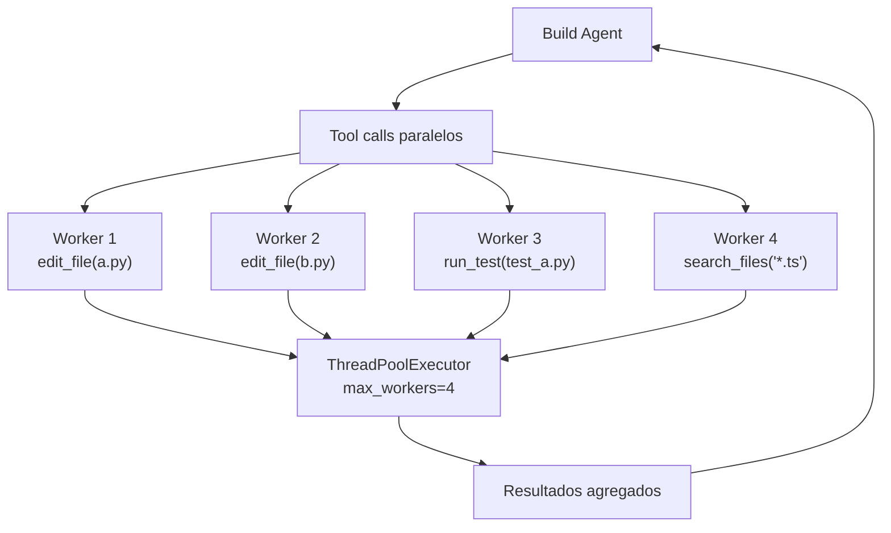

# Patrón Map-Reduce con LLMs — Procesamiento Paralelo

> [!abstract]
> El patrón *map-reduce* adapta el paradigma clásico de procesamiento distribuido al mundo de los LLMs. Resuelve el problema de que ==documentos o conjuntos de datos exceden la ventana de contexto== o requieren procesamiento paralelo. La solución divide el input en fragmentos (split), procesa cada uno independientemente con un LLM (map), y agrega los resultados en una respuesta coherente (reduce). architect implementa ejecución paralela con `ThreadPoolExecutor` de hasta ==4 workers simultáneos== para herramientas que operan sobre múltiples archivos. ^resumen

## Problema

Los LLMs tienen tres limitaciones que map-reduce resuelve:

1. **Ventana de contexto finita**: Incluso con modelos de 128K-1M tokens, documentos corporativos, bases de código o repositorios completos exceden el límite.
2. **Latencia secuencial**: Procesar 50 archivos uno a uno toma 50x el tiempo de uno solo.
3. **Degradación con contexto largo**: La calidad del LLM disminuye con inputs muy largos (*lost in the middle* problem)[^1].

> [!warning] El problema "lost in the middle"
> Estudios demuestran que los LLMs ==prestan menos atención a la información en el medio de contextos largos==. Un documento de 100K tokens procesado de una vez puede perder información crítica que está en la zona media. Map-reduce mitiga esto al procesar fragmentos pequeños donde toda la información recibe atención.

## Solución

Map-reduce para LLMs implementa tres fases:



### Fase 1: Split (Dividir)

Dividir el input en fragmentos procesables independientemente:

| Estrategia | Uso | Ejemplo |
|---|---|---|
| Por tamaño fijo | Documentos continuos | Cada 2000 tokens |
| Por estructura | Documentos con secciones | Por capítulo, por función |
| Por unidad lógica | Bases de código | Por archivo |
| Por entidad | Datos estructurados | Por registro, por usuario |
| Por relevancia | Filtrado previo | Solo chunks relevantes a la query |

> [!tip] Elegir la estrategia de split correcta
> La regla de oro: ==cada fragmento debe ser auto-contenido==. Si procesar un fragmento requiere información de otro, el split es incorrecto. Usa solapamiento (*overlap*) o incluye encabezados de contexto cuando la independencia total no es posible.

### Fase 2: Map (Procesar)

Cada fragmento se procesa independientemente con el mismo prompt:

> [!example]- Prompt de Map para resumen
> ```python
> MAP_PROMPT = """Analiza el siguiente fragmento de código y produce:
> 1. Un resumen de 2-3 oraciones de qué hace este código.
> 2. Lista de funciones/clases definidas.
> 3. Dependencias externas importadas.
> 4. Problemas potenciales detectados (bugs, seguridad, performance).
>
> Fragmento ({chunk_index} de {total_chunks}):
> ```{language}
> {chunk_content}
> ```
>
> Análisis:"""
> ```

La fase map se ejecuta en ==paralelo==, reduciendo latencia proporcionalmente al número de workers.

### Fase 3: Reduce (Agregar)

Los resultados individuales se combinan en un resultado final coherente:

| Estrategia de reduce | Descripción | Cuándo usar |
|---|---|---|
| Concatenación | Unir resultados | Listados, inventarios |
| Resumen jerárquico | LLM resume los resúmenes | Documentos largos |
| Votación | Mayoría gana | Clasificación |
| Fusión | LLM integra resultados | Análisis complejos |
| Filtrado | Mantener solo relevantes | Búsqueda |

> [!info] Reduce recursivo
> Si los resultados del map son demasiados para una sola llamada de reduce, se aplica reduce recursivo: agrupar resultados → reducir cada grupo → reducir los grupos reducidos. Esto crea una estructura de árbol que escala a cualquier tamaño.



## Casos de uso

### Resumen de documentos largos



### Análisis de base de código

> [!example]- Map-reduce para análisis de repositorio
> ```python
> import asyncio
> from concurrent.futures import ThreadPoolExecutor
>
> class CodebaseAnalyzer:
>     def __init__(self, llm, max_workers=4):
>         self.llm = llm
>         self.executor = ThreadPoolExecutor(max_workers=max_workers)
>
>     async def analyze(self, repo_path: str) -> dict:
>         # Split: obtener archivos relevantes
>         files = self._get_source_files(repo_path)
>
>         # Map: analizar cada archivo en paralelo
>         loop = asyncio.get_event_loop()
>         tasks = [
>             loop.run_in_executor(
>                 self.executor,
>                 self._analyze_file,
>                 f
>             )
>             for f in files
>         ]
>         results = await asyncio.gather(*tasks)
>
>         # Reduce: integrar análisis
>         return await self._reduce_analyses(results)
>
>     def _analyze_file(self, file_path: str) -> dict:
>         content = open(file_path).read()
>         return self.llm.analyze(
>             prompt=MAP_PROMPT.format(
>                 content=content,
>                 file=file_path
>             )
>         )
>
>     async def _reduce_analyses(self, analyses: list) -> dict:
>         # Reduce recursivo si hay muchos resultados
>         while len(analyses) > 5:
>             groups = [analyses[i:i+5] for i in range(0, len(analyses), 5)]
>             analyses = [
>                 await self._merge_group(g) for g in groups
>             ]
>
>         return await self._final_reduce(analyses)
> ```

### Evaluación por lotes

Evaluar múltiples outputs de LLM en paralelo (ver [[pattern-evaluator]]):

| Input | Map | Reduce |
|---|---|---|
| 100 respuestas | Evaluar cada una (score 0-10) | Promedio, distribución, outliers |
| 50 traducciones | Verificar precisión de cada una | Informe de calidad global |
| 200 resúmenes | Comparar con original | Métricas agregadas de fidelidad |

## Ejecución paralela en architect

architect implementa paralelismo a través de `ThreadPoolExecutor` para operaciones que pueden ejecutarse simultáneamente:

> [!info] Configuración de paralelismo en architect
> - **Workers máximos**: 4 (por defecto, configurable).
> - **Uso principal**: Ejecución de herramientas paralelas cuando el agente invoca múltiples tool calls en una sola respuesta.
> - **Aislamiento**: Cada worker opera en su propio contexto; los worktrees de git permiten operaciones paralelas sin conflictos.
> - **Safety**: Los [[pattern-guardrails|guardrails]] se aplican a cada worker independientemente.



## Cuándo usar

> [!success] Escenarios ideales para map-reduce
> - Documentos que exceden la ventana de contexto del modelo.
> - Análisis de repositorios completos de código.
> - Procesamiento por lotes de muchos items similares.
> - Cuando la latencia importa y las tareas son paralelizables.
> - Evaluación masiva de outputs de LLM.
> - Migración o transformación de código en múltiples archivos.

## Cuándo NO usar

> [!failure] Escenarios donde map-reduce es inadecuado
> - **Tareas con dependencias secuenciales**: Si chunk N depende del resultado de chunk N-1, no se puede paralelizar.
> - **Input pequeño**: Si cabe en el contexto, una sola llamada es más simple y barata.
> - **Coherencia global requerida**: Si la respuesta debe ser un texto cohesivo (no una agregación), el reduce puede ser insatisfactorio.
> - **Presupuesto limitado**: Map-reduce multiplica el coste por número de chunks.

## Trade-offs

| Ventaja | Desventaja |
|---|---|
| Procesa inputs de cualquier tamaño | Coste proporcional al número de chunks |
| Paralelismo reduce latencia | Complejidad del split y reduce |
| Evita "lost in the middle" | Pierde contexto entre chunks |
| Escalable horizontalmente | Fase de reduce puede ser cuello de botella |
| Cada chunk recibe atención completa del modelo | Inconsistencias entre resultados de chunks |
| Reutilizable para múltiples tareas | Overhead de gestión de chunks |

> [!question] ¿Cuántos workers usar?
> El número óptimo de workers depende de:
> - **Rate limits de la API**: Si tienes 60 RPM, más de 4 workers saturan.
> - **Coste**: Más workers = más tokens simultáneos = más coste pico.
> - **Coherencia**: Demasiado paralelismo puede causar respuestas inconsistentes.
> - architect usa 4 como balance pragmático.

## Patrones relacionados

- [[pattern-rag]]: RAG recupera chunks relevantes; map-reduce los procesa todos.
- [[pattern-pipeline]]: Map-reduce como un paso dentro de un pipeline secuencial.
- [[pattern-evaluator]]: Evaluación por lotes usa map-reduce para escalar.
- [[pattern-orchestrator]]: El orquestador puede implementar map-reduce con workers especializados.
- [[pattern-speculative-execution]]: Similar a map (paralelo) pero con la misma tarea, no diferentes datos.
- [[pattern-agent-loop]]: Cada worker del map ejecuta su propio agent loop.

## Relación con el ecosistema

[[architect-overview|architect]] implementa ejecución paralela con `ThreadPoolExecutor` para herramientas que pueden operar simultáneamente. Los worktrees de git permiten que múltiples workers editen archivos sin conflictos. Esta es la aplicación más directa de map-reduce en el ecosistema.

[[intake-overview|intake]] puede usar map-reduce para procesar múltiples documentos de requisitos en paralelo, normalizando cada uno independientemente y luego fusionando las especificaciones resultantes.

[[vigil-overview|vigil]] aplica sus 26 reglas a cada output independientemente, lo cual es inherentemente map-reduce: cada validación es un map, y el veredicto final es un reduce (AND lógico de todas las reglas).

[[licit-overview|licit]] puede analizar múltiples documentos regulatorios en paralelo para generar un informe de compliance unificado.

## Enlaces y referencias

> [!quote]- Bibliografía
> - [^1]: Liu, N. et al. (2023). *Lost in the Middle: How Language Models Use Long Contexts*. Paper que demuestra la degradación de atención en contextos largos.
> - Dean, J. & Ghemawat, S. (2004). *MapReduce: Simplified Data Processing on Large Clusters*. Paper original de MapReduce.
> - LangChain. (2024). *Map-reduce chain documentation*. Implementación de referencia para LLMs.
> - Anthropic. (2024). *Long context prompt engineering*. Guía para maximizar el uso de contextos largos.
> - OpenAI. (2024). *Batch API documentation*. API de procesamiento por lotes.

[^1]: El estudio demostró que modelos como GPT-4 y Claude pueden perder hasta un 40% de precisión en información ubicada en el centro de contextos de 128K tokens.

---

> [!tip] Navegación
> - Anterior: [[pattern-fallback]]
> - Siguiente: [[pattern-evaluator]]
> - Índice: [[patterns-overview]]
