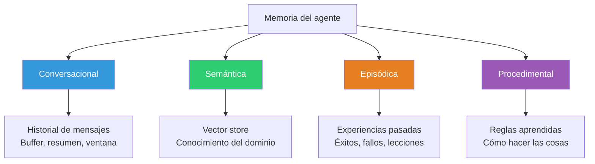
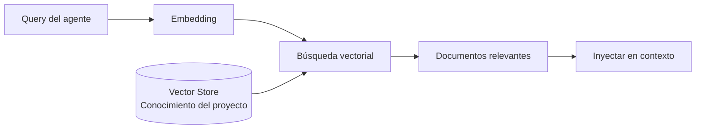
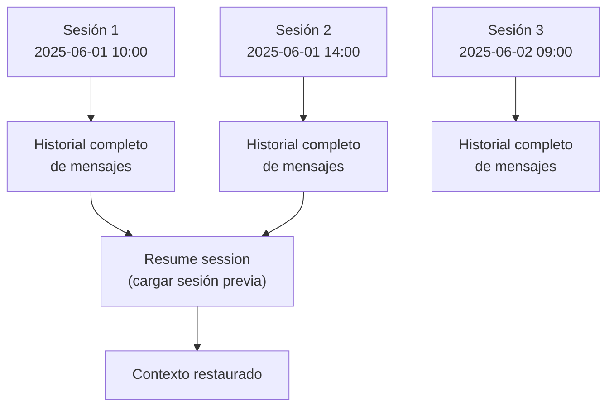
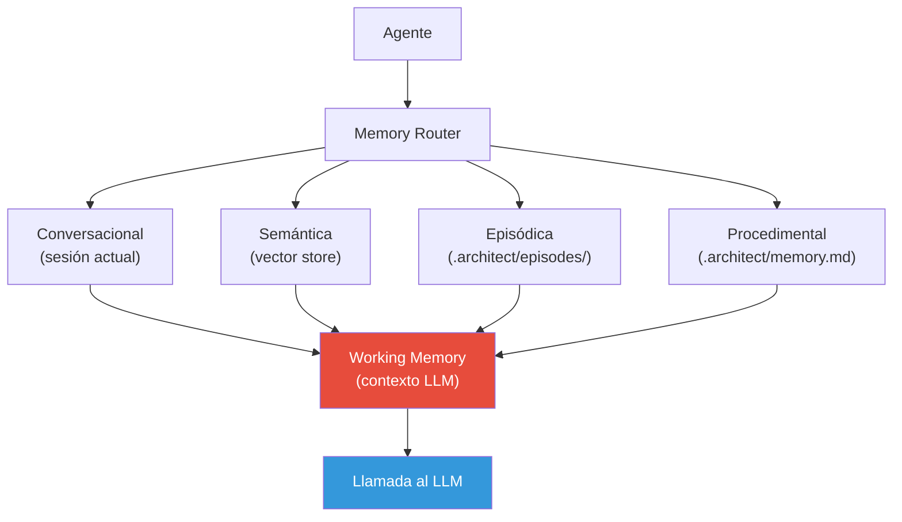

# Patrones de Memoria para Agentes

> [!abstract]
> Los patrones de *memory* resuelven el problema de que los agentes ==olvidan todo entre sesiones== y tienen una ventana de contexto finita dentro de una sesión. Existen cuatro tipos de memoria: ==conversacional== (historial de mensajes), ==semántica== (vector store con conocimiento), ==episódica== (experiencias pasadas) y ==procedimental== (reglas aprendidas). architect implementa memorias de sesión para conversación, `.architect/memory.md` para memoria procedimental, y *skills* para conocimiento reutilizable entre sesiones. ^resumen

## Problema

Los agentes LLM tienen una paradoja de memoria:

1. **Dentro de una sesión**: El contexto crece hasta llenar la ventana, y luego se pierde información.
2. **Entre sesiones**: Todo se olvida. Cada sesión empieza desde cero.
3. **Conocimiento genérico vs específico**: El LLM sabe mucho en general, pero nada sobre TU proyecto específico.

> [!danger] Un agente sin memoria es como un empleado con amnesia
> Cada vez que inicias una sesión, el agente no sabe nada sobre tu proyecto, tus preferencias, errores pasados, ni decisiones tomadas. ==Repites contexto, repites errores, repites explicaciones==. La memoria transforma un agente genérico en un asistente personalizado.

## Solución: Taxonomía de memorias



### 1. Memoria conversacional (*Conversation Memory*)

La forma más básica: mantener el historial de mensajes de la sesión actual.

| Estrategia | Descripción | Ventana efectiva |
|---|---|---|
| Buffer completo | Guardar todos los mensajes | Limitada por contexto |
| Ventana deslizante | Últimos N mensajes | Fija (N mensajes) |
| Resumen acumulativo | Resumir mensajes antiguos | Virtualmente ilimitada |
| Token-based | Podar cuando excede X tokens | Fija (X tokens) |
| Híbrida | Resumen + últimos N mensajes | Balance |

> [!tip] La estrategia híbrida es la más práctica
> Combina un resumen creciente de la conversación antigua con los últimos N mensajes completos. Así el agente tiene ==contexto histórico resumido + detalle reciente==.

### 2. Memoria semántica (*Semantic Memory*)

Conocimiento del dominio almacenado en un *vector store*, accesible via [[pattern-rag|RAG]]:



Ejemplos de contenido en memoria semántica:
- Documentación del proyecto.
- Guías de estilo y convenciones.
- Decisiones de arquitectura (ADRs).
- FAQ del equipo.
- Documentación de APIs internas.

### 3. Memoria episódica (*Episodic Memory*)

Registro de experiencias pasadas del agente: qué hizo, qué funcionó, qué falló.

> [!info] Episodic memory como "diario del agente"
> Cada sesión puede generar un resumen episódico:
> - Tarea: "Migrar de SQLAlchemy 1.4 a 2.0"
> - Resultado: Éxito parcial
> - Pasos que funcionaron: Actualizar imports, cambiar Session syntax
> - Pasos que fallaron: Query compilation con Alembic
> - Lección: Ejecutar Alembic migrations antes de actualizar queries

### 4. Memoria procedimental (*Procedural Memory*)

Reglas y procedimientos que el agente ha "aprendido":

> [!example]- Ejemplo de memoria procedimental
> ```markdown
> ## Reglas aprendidas para este proyecto
>
> - Siempre ejecutar `make lint` antes de commitear.
> - Los tests de integración requieren `docker-compose up -d` primero.
> - El usuario prefiere type hints explícitos, no usar Any.
> - El módulo auth/ no se debe modificar sin aprobación.
> - Los migrations de Alembic van en migrations/, no en alembic/.
> - Variables de entorno en .env.example, nunca en .env.
> ```

## Implementación en architect

architect implementa tres formas de memoria:

### Sesiones como memoria conversacional



> [!info] Resume agent en architect
> El *resume agent* de architect carga una sesión previa y continúa donde se dejó. Esto es memoria conversacional explícita: el historial completo de mensajes se persiste y se puede recargar.

### `.architect/memory.md` como memoria procedimental

architect lee un archivo de memoria del proyecto que contiene reglas y preferencias:

> [!example]- Estructura de .architect/memory.md
> ```markdown
> # Memoria del proyecto
>
> ## Convenciones
> - Usar Python 3.12 con type hints estrictos.
> - Framework: FastAPI + SQLAlchemy 2.0 + Alembic.
> - Tests: pytest con fixtures en conftest.py.
> - Formato: black + isort + ruff.
>
> ## Estructura del proyecto
> - src/ — Código fuente principal.
> - tests/ — Tests unitarios e integración.
> - migrations/ — Migraciones de base de datos.
> - config/ — Configuración por entorno.
>
> ## Decisiones importantes
> - 2025-05-15: Decidimos usar Redis para caché en lugar de memcached.
> - 2025-05-20: Migramos de poetry a uv para gestión de dependencias.
>
> ## Errores conocidos
> - El test test_concurrent_writes es flaky; ignorar si falla una vez.
> - Alembic necesita DATABASE_URL, no DB_URL.
> ```

### Skills como conocimiento reutilizable

Los *skills* de architect son bloques de conocimiento que el agente puede invocar:

| Tipo de skill | Ejemplo | Persistencia |
|---|---|---|
| Comando predefinido | `/commit`, `/test` | Global |
| Skill aprendido | Flujo de deploy del proyecto | Por proyecto |
| Prompt template | Estructura de PR description | Por proyecto |

## Arquitectura de memoria completa



> [!warning] El cuello de botella: Working Memory
> Toda la memoria disponible debe caber en la ventana de contexto del LLM (la *working memory*). No importa cuánta memoria tengas almacenada; solo es útil lo que entra en el contexto. El ==memory router debe seleccionar qué memorias son relevantes== para la tarea actual.

## Cuándo usar cada tipo

> [!question] ¿Qué tipo de memoria necesito?
> | Necesidad | Tipo de memoria | Ejemplo |
> |---|---|---|
> | Recordar lo hablado en esta sesión | Conversacional | Buffer de mensajes |
> | Buscar en documentación del proyecto | Semántica | Vector store + RAG |
> | Aprender de errores pasados | Episódica | Registro de sesiones |
> | Recordar preferencias del usuario | Procedimental | memory.md |
> | Compartir conocimiento entre agentes | Semántica + Procedimental | Skills + vector store |

## Cuándo NO usar

> [!failure] Escenarios donde la memoria complica sin beneficio
> - **Tareas únicas**: Si cada tarea es completamente independiente, la memoria episódica no aporta.
> - **Proyectos efímeros**: Para un script rápido, no vale la pena configurar memoria persistente.
> - **Información sensible**: La memoria puede persistir datos que deberían olvidarse (PII, secretos).
> - **Equipos grandes con rotación**: La memoria procedimental puede desactualizarse si el equipo cambia.

> [!danger] Memoria y privacidad
> La memoria persistente puede contener información sensible: nombres de usuarios, rutas de sistemas internos, decisiones confidenciales. Implementa ==políticas de retención y borrado== para cumplir con regulaciones como GDPR (ver [[licit-overview|licit]]).

## Trade-offs

| Ventaja | Desventaja |
|---|---|
| Agente que mejora con el uso | Complejidad de implementación y mantenimiento |
| Menos repetición de contexto | Riesgo de persistir información incorrecta |
| Personalización por proyecto | Overhead de almacenamiento |
| Aprendizaje de errores | Memoria desactualizada puede inducir a error |
| Continuidad entre sesiones | Problemas de privacidad y retención de datos |
| Conocimiento compartido entre agentes | Conflictos si múltiples agentes escriben memoria |

## Patrones relacionados

- [[pattern-rag]]: RAG es la implementación técnica de la memoria semántica.
- [[pattern-agent-loop]]: El loop consume y produce memorias en cada iteración.
- [[pattern-reflection]]: La reflexión genera episodios de aprendizaje para memoria episódica.
- [[pattern-tool-maker]]: Las herramientas persistentes son memoria procedimental.
- [[pattern-semantic-cache]]: El cache es una forma de memoria de corto plazo para queries.
- [[pattern-planner-executor]]: Los planes pasados pueden ser memoria episódica.
- [[pattern-orchestrator]]: La memoria compartida entre workers es memoria semántica.
- [[pattern-supervisor]]: El supervisor accede a memoria para detectar patrones de fallo.

## Relación con el ecosistema

[[architect-overview|architect]] implementa memoria en tres niveles: sesiones para memoria conversacional (con resume agent), `.architect/memory.md` para memoria procedimental, y skills para conocimiento reutilizable. La poda de contexto en 3 niveles es un mecanismo de gestión de working memory.

[[intake-overview|intake]] puede alimentar la memoria semántica del agente con requisitos normalizados, documentación y especificaciones generadas en sesiones previas.

[[vigil-overview|vigil]] puede validar que la memoria no contenga información prohibida (PII, secretos, datos regulados) antes de que se persista.

[[licit-overview|licit]] impone políticas de retención de datos sobre la memoria del agente, asegurando que información sensible se borre según normativas de privacidad.

## Enlaces y referencias

> [!quote]- Bibliografía
> - Park, J. S. et al. (2023). *Generative Agents: Interactive Simulacra of Human Behavior*. Paper que introdujo memoria episódica y reflexiva para agentes.
> - Zhang, Z. et al. (2024). *A Survey on the Memory Mechanism of Large Language Model Based Agents*. Survey completo de tipos de memoria.
> - Sumers, T. et al. (2024). *Cognitive Architectures for Language Agents (CoALA)*. Marco teórico que clasifica tipos de memoria para agentes.
> - Hu, C. et al. (2024). *Memorybank: Enhancing Large Language Models with Long-Term Memory*. Framework de memoria a largo plazo.
> - Anthropic. (2024). *Claude persistent memory documentation*. Implementación de referencia de memoria persistente.

---

> [!tip] Navegación
> - Anterior: [[pattern-tool-maker]]
> - Siguiente: [[pattern-orchestrator]]
> - Índice: [[patterns-overview]]
