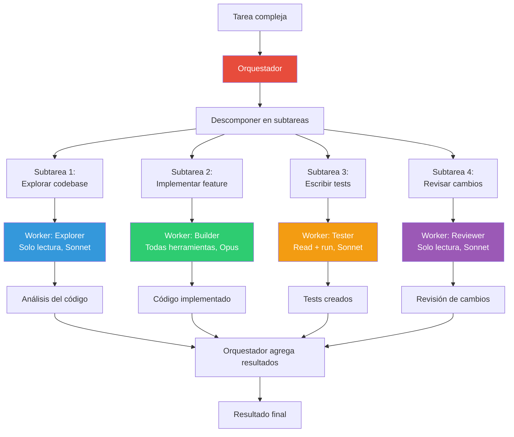
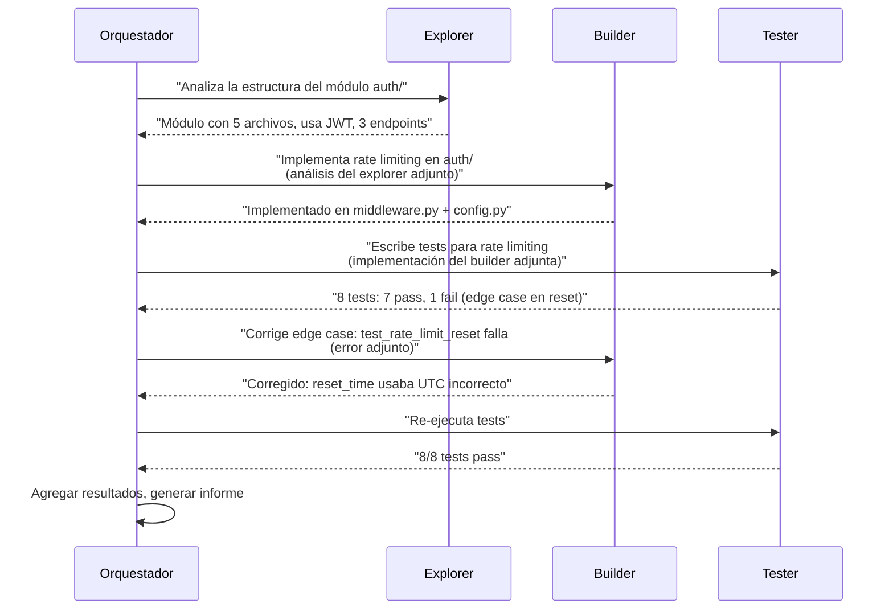

# Patrón Orchestrator-Worker — Delegación a Agentes Especializados

> [!abstract]
> El patrón *Orchestrator-Worker* introduce un ==agente central que analiza una tarea compleja y la delega a agentes especializados==. El orquestador no ejecuta el trabajo directamente; en su lugar, descompone la tarea, asigna subtareas a workers con habilidades específicas y agrega los resultados. architect implementa este patrón con su ==build agent que delega a sub-agents (explore, test, review) con aislamiento de contexto==. Los frameworks multi-agente como CrewAI y AutoGen formalizan este patrón con roles, comunicación y coordinación explícitos. ^resumen

## Problema

Un solo agente generalista enfrenta limitaciones al manejar tareas complejas con subtareas diversas:

1. **Context pollution**: Herramientas y contexto de subtareas distintas compiten por espacio en la ventana.
2. **Jack of all trades**: Un prompt de sistema que cubre todo es menos efectivo que prompts especializados.
3. **Secuencialidad forzada**: Un solo agente procesa una subtarea a la vez.
4. **Falta de especialización**: No puede optimizar su configuración (modelo, herramientas, temperatura) por tipo de subtarea.

> [!warning] El agente monolítico
> Un agente con 30 herramientas, un prompt de sistema de 5000 tokens y responsabilidad sobre todo (leer código, escribir código, ejecutar tests, revisar cambios, documentar) es como un desarrollador al que se le pide ser ==frontend, backend, DBA, QA y tech writer simultáneamente==. Cada rol distrae del otro.

## Solución

El orquestador actúa como un manager que asigna trabajo a especialistas:



### Roles en el patrón

| Rol | Responsabilidad | Características |
|---|---|---|
| Orquestador | Descomponer, asignar, agregar | Sin herramientas de ejecución, visión global |
| Worker | Ejecutar subtarea específica | Herramientas especializadas, contexto reducido |
| Monitor (opcional) | Observar progreso de workers | Solo lectura, puede alertar al orquestador |

### Comunicación entre agentes



## Aislamiento de contexto en architect

architect implementa sub-agents con aislamiento de contexto: cada sub-agent tiene ==su propio historial de mensajes y no comparte contexto con otros==.

> [!info] Sub-agents de architect
> | Sub-agent | Propósito | Herramientas | Max steps | Modelo |
> |---|---|---|---|---|
> | explore | Investigar codebase | Solo lectura | 15 | Configurable |
> | test | Ejecutar y analizar tests | Read + run_command | 15 | Configurable |
> | review | Revisar cambios | Solo lectura | 15 | Configurable |

> [!tip] Beneficios del aislamiento de contexto
> 1. **Sin contaminación**: El contexto de exploración no distrae al builder.
> 2. **Eficiencia**: Cada sub-agent tiene un prompt de sistema reducido y enfocado.
> 3. **Paralelismo potencial**: Sub-agents independientes podrían ejecutarse en paralelo.
> 4. **Reutilización**: El mismo sub-agent puede invocarse múltiples veces con contextos diferentes.

> [!example]- Cómo architect despacha a sub-agents
> ```python
> class BuildAgent:
>     async def dispatch_subagent(
>         self,
>         agent_type: str,
>         task: str,
>         context: str = ""
>     ) -> str:
>         """Despacha una subtarea a un sub-agent."""
>
>         config = SUBAGENT_CONFIGS[agent_type]
>
>         # Crear loop aislado para el sub-agent
>         subagent = AgentLoop(
>             model=config.model,
>             tools=config.tools,
>             max_steps=config.max_steps,
>             system_prompt=config.system_prompt,
>             # NO comparte historial con el build agent
>         )
>
>         # El sub-agent solo recibe la subtarea + contexto mínimo
>         result = await subagent.run(
>             f"{task}\n\nContexto adicional:\n{context}"
>         )
>
>         return result.output
>
>     async def build_with_subagents(self, task: str):
>         # Explorar primero
>         analysis = await self.dispatch_subagent(
>             "explore",
>             f"Analiza la estructura relevante para: {task}"
>         )
>
>         # Implementar con el análisis
>         implementation = await self.implement(task, analysis)
>
>         # Testear
>         test_result = await self.dispatch_subagent(
>             "test",
>             "Ejecuta los tests y reporta resultados"
>         )
>
>         # Revisar si hay problemas
>         if test_result.has_failures:
>             review = await self.dispatch_subagent(
>                 "review",
>                 f"Analiza por qué fallan los tests:\n{test_result}"
>             )
>             # Corregir basándose en la revisión
>             await self.fix(review)
> ```

## Frameworks multi-agente

### CrewAI

CrewAI modela equipos de agentes con roles, objetivos y herramientas:

| Concepto CrewAI | Equivalente en patrón |
|---|---|
| Agent | Worker con rol definido |
| Task | Subtarea asignada |
| Crew | Orquestador + conjunto de workers |
| Process | Estrategia de orquestación (secuencial, jerárquica) |

### AutoGen

AutoGen de Microsoft enfatiza la conversación entre agentes:

| Concepto AutoGen | Equivalente en patrón |
|---|---|
| ConversableAgent | Worker con capacidad de diálogo |
| GroupChat | Canal de comunicación entre workers |
| GroupChatManager | Orquestador |
| UserProxyAgent | Interface con el humano |

> [!question] ¿Cuándo usar un framework vs implementar desde cero?
> - **Framework**: Cuando necesitas coordinación compleja entre muchos agentes con roles distintos.
> - **Desde cero**: Cuando la orquestación es simple (1 orquestador + 2-3 workers con lógica clara).
> - architect implementa desde cero porque su patrón es predecible: plan → build (con sub-agents) → review.

## Cuándo usar

> [!success] Escenarios ideales para orchestrator-worker
> - Tareas con subtareas claramente diferenciadas que requieren habilidades distintas.
> - Cuando diferentes subtareas se benefician de modelos o configuraciones diferentes.
> - Sistemas que necesitan separación de responsabilidades para auditoría.
> - Proyectos grandes donde el contexto de una sola sesión no es suficiente.
> - Cuando la paralelización de subtareas es posible y beneficiosa.

## Cuándo NO usar

> [!failure] Escenarios donde el orquestador es excesivo
> - **Tareas simples**: Una tarea de un solo paso no necesita descomposición.
> - **Subtareas fuertemente acopladas**: Si cada paso depende del anterior, la orquestación no añade valor sobre un pipeline secuencial.
> - **Presupuesto limitado**: Múltiples agentes multiplican el coste de tokens.
> - **Latencia crítica**: La coordinación entre agentes añade overhead.
> - **Equipo pequeño**: La complejidad de debugging multi-agente puede ser desproporcionada.

## Trade-offs

| Ventaja | Desventaja |
|---|---|
| Especialización por tipo de tarea | Complejidad de coordinación |
| Contexto limpio por worker | Overhead de comunicación |
| Configuración optimizada por rol | Coste multiplicado por número de agentes |
| Paralelización potencial | Debugging más complejo |
| Escalable a tareas complejas | Puede sobre-descomponer tareas simples |
| Separación de responsabilidades | Pérdida de contexto entre workers |

> [!danger] El riesgo de sobre-descomposición
> Descomponer una tarea en 10 subtareas cuando 3 bastarían genera ==overhead de coordinación, costes innecesarios y pérdida de coherencia== entre los resultados. La regla: descomponer solo cuando la especialización aporta valor medible.

## Patrones relacionados

- [[pattern-agent-loop]]: Cada worker ejecuta su propio agent loop.
- [[pattern-planner-executor]]: El planner puede actuar como orquestador del executor.
- [[pattern-supervisor]]: El supervisor monitoriza al orquestador y sus workers.
- [[pattern-map-reduce]]: Map-reduce es una forma de orquestación con la misma tarea replicada.
- [[pattern-pipeline]]: Pipeline es orquestación secuencial; orchestrator permite paralelo.
- [[pattern-speculative-execution]]: Múltiples workers hacen la misma tarea con diferentes enfoques.
- [[pattern-memory]]: La memoria compartida permite coordinación entre workers.
- [[pattern-human-in-loop]]: El humano puede aprobar el plan de descomposición.

## Relación con el ecosistema

[[architect-overview|architect]] implementa orchestrator-worker a través de su build agent que despacha a sub-agents (explore, test, review). El build agent actúa como orquestador, decidiendo cuándo y a quién delegar. La ejecución paralela en worktrees permite que sub-agents operen sin conflictos.

[[vigil-overview|vigil]] valida los outputs de cada worker independientemente, asegurando que la especialización no comprometa los estándares de calidad.

[[intake-overview|intake]] puede generar la descomposición inicial de una tarea compleja en subtareas, facilitando la labor del orquestador.

[[licit-overview|licit]] puede requerir que ciertos workers operen bajo restricciones de compliance, o que la descomposición misma sea aprobada por un compliance gate.

## Enlaces y referencias

> [!quote]- Bibliografía
> - Wu, Q. et al. (2023). *AutoGen: Enabling Next-Gen LLM Applications via Multi-Agent Conversation*. Microsoft. Framework multi-agente de referencia.
> - Hong, S. et al. (2023). *MetaGPT: Meta Programming for A Multi-Agent Collaborative Framework*. Orquestación con roles de ingeniería de software.
> - CrewAI. (2024). *CrewAI Documentation*. Framework de equipos de agentes.
> - Li, G. et al. (2023). *CAMEL: Communicative Agents for "Mind" Exploration of Large Language Model Society*. Comunicación entre agentes.
> - Anthropic. (2024). *Building effective agents — Multi-agent patterns*. Guía de patrones multi-agente.

---

> [!tip] Navegación
> - Anterior: [[pattern-memory]]
> - Siguiente: [[pattern-pipeline]]
> - Índice: [[patterns-overview]]
