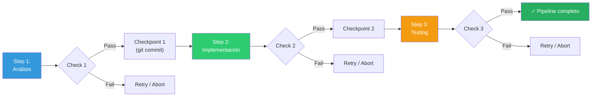
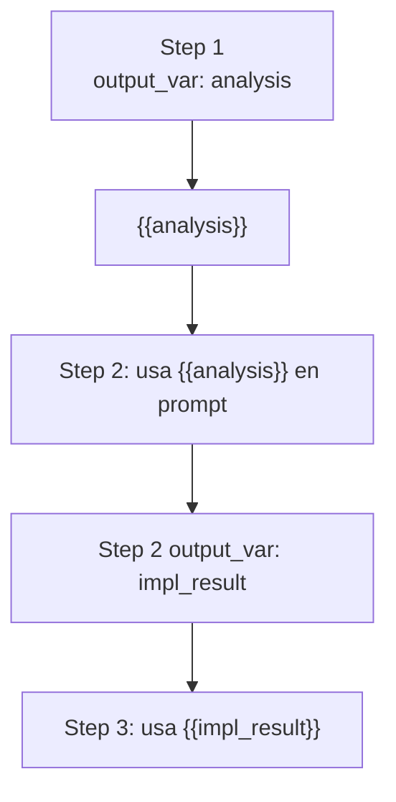
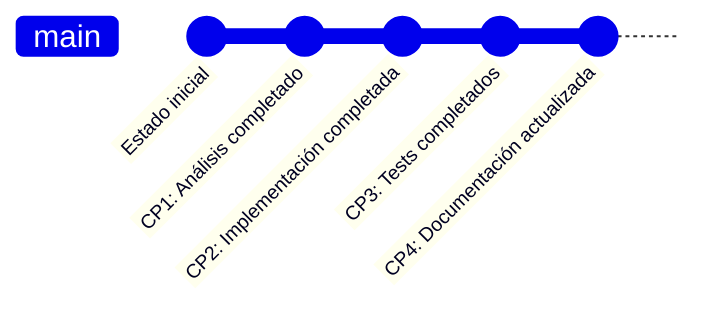

# Patrón Pipeline — Ejecución por Etapas con Quality Gates

> [!abstract]
> El patrón *Pipeline* estructura la ejecución de tareas complejas como una ==secuencia de etapas con validación entre cada una==. Cada etapa tiene un agente asignado, un prompt, checks de calidad y opcionalmente un checkpoint. Si una etapa falla, el pipeline puede reintentar, revertir o continuar desde la última etapa exitosa. architect implementa pipelines declarativos en ==YAML con steps que incluyen agent, prompt, checks, checkpoint, output_var y condition==. La substitución de variables `{{var}}` permite pasar resultados entre etapas. ^resumen

## Problema

Los workflows complejos de IA necesitan:

1. **Reproducibilidad**: Ejecutar la misma secuencia de pasos con los mismos resultados.
2. **Validación intermedia**: Verificar calidad después de cada etapa, no solo al final.
3. **Recuperación de fallos**: Si el paso 5 de 8 falla, no repetir los pasos 1-4.
4. **Visibilidad**: Saber en qué etapa está la ejecución y cuánto falta.
5. **Composición**: Combinar etapas reutilizables en diferentes workflows.

> [!danger] Sin pipeline: el workflow frágil
> Sin estructura, un workflow de IA es un script imperativo donde cada fallo obliga a ==reiniciar desde el principio==, no hay visibilidad de progreso, y los resultados intermedios se pierden. En workflows que toman horas, esto es inaceptable.

## Solución

Un pipeline define etapas (*steps*) declarativas que se ejecutan secuencialmente con validación entre cada una:



### Anatomía de un step

Cada step del pipeline tiene:

| Campo | Descripción | Obligatorio |
|---|---|---|
| `agent` | Tipo de agente que ejecuta el step | Sí |
| `prompt` | Instrucciones para el agente | Sí |
| `checks` | Validaciones post-step | No |
| `checkpoint` | Crear punto de recuperación (git commit) | No |
| `output_var` | Variable para guardar el resultado | No |
| `condition` | Condición para ejecutar el step | No |
| `on_fail` | Acción si el step falla (retry/abort/skip) | No |

## Pipelines YAML de architect

architect declara pipelines como archivos YAML:

> [!example]- Pipeline YAML completo
> ```yaml
> # pipeline-feature.yaml
> name: "Implementar nueva feature"
> description: "Pipeline para implementar, testear y documentar"
>
> variables:
>   feature_name: "rate-limiting"
>   target_module: "src/middleware/"
>
> steps:
>   - name: "Análisis del módulo"
>     agent: plan
>     prompt: |
>       Analiza el módulo {{target_module}} y describe:
>       1. Estructura actual de archivos
>       2. Dependencias existentes
>       3. Puntos de extensión para {{feature_name}}
>       4. Riesgos potenciales
>     output_var: analysis
>     checks:
>       - type: contains
>         value: "Estructura"
>         message: "El análisis debe incluir estructura"
>
>   - name: "Implementación"
>     agent: build
>     prompt: |
>       Basándote en el análisis anterior:
>       {{analysis}}
>
>       Implementa {{feature_name}} en {{target_module}}.
>       Sigue las convenciones existentes del proyecto.
>     checkpoint: true
>     checks:
>       - type: command
>         value: "python -m py_compile {{target_module}}/*.py"
>         message: "El código debe compilar sin errores"
>
>   - name: "Tests"
>     agent: build
>     prompt: |
>       Escribe tests para {{feature_name}}:
>       - Unit tests para lógica core
>       - Integration tests para endpoints
>       - Edge cases (límites, concurrencia)
>     checkpoint: true
>     checks:
>       - type: command
>         value: "pytest tests/ -v --tb=short"
>         message: "Todos los tests deben pasar"
>
>   - name: "Review"
>     agent: review
>     prompt: |
>       Revisa todos los cambios realizados para {{feature_name}}.
>       Verifica corrección, completitud, seguridad y estilo.
>     output_var: review_result
>
>   - name: "Documentación"
>     agent: build
>     condition: "{{review_result}} contains 'APPROVED'"
>     prompt: |
>       Actualiza la documentación para reflejar {{feature_name}}.
>       Incluye: descripción, configuración, ejemplos de uso.
>     checkpoint: true
> ```

### Substitución de variables `{{var}}`

Las variables permiten pasar información entre steps:



> [!tip] Variables como contratos entre etapas
> Las variables `output_var` actúan como ==contratos entre etapas==. Si la etapa 1 produce un `analysis` que la etapa 2 necesita, el pipeline falla de forma clara si el análisis no se produce (en lugar de fallar silenciosamente).

### Checkpoints como git commits

> [!info] Checkpoints y recuperación
> Cuando `checkpoint: true`, architect crea un commit de git con los cambios del step. Esto permite:
> - **Rollback**: Revertir al último checkpoint si un step posterior falla.
> - **Resume**: Reiniciar el pipeline desde el último checkpoint exitoso.
> - **Auditoría**: Cada commit documenta qué cambió en cada etapa.
> - **Diff por etapa**: Ver exactamente qué modificó cada step.



### Ejecución condicional

```yaml
- name: "Fix basado en review"
  agent: build
  condition: "{{review_result}} contains 'CHANGES_REQUESTED'"
  prompt: "Corrige los problemas encontrados: {{review_result}}"
```

> [!warning] Condiciones simples, no Turing-completas
> Las condiciones de los steps deben ser simples (`contains`, `equals`, `not_empty`) para mantener el pipeline legible y predecible. Si necesitas lógica compleja, encapsúlala en un step que produzca una variable booleana.

### Resume desde step específico

Cuando un pipeline falla en el step N, se puede resumir desde ahí:

```bash
architect pipeline run pipeline-feature.yaml --from-step "Tests"
```

> [!success] Resume con checkpoints
> El resume carga el estado del último checkpoint exitoso y continúa desde el step especificado. Los `output_var` de steps anteriores se restauran desde el checkpoint, permitiendo que el step reanudado tenga acceso al mismo contexto que tendría en una ejecución completa.

## Quality gates

Los `checks` son quality gates que validan el resultado de cada step:

| Tipo de check | Descripción | Ejemplo |
|---|---|---|
| `contains` | El output contiene un texto | `"APPROVED"` |
| `not_contains` | El output no contiene un texto | `"ERROR"` |
| `command` | Un comando retorna exit code 0 | `"pytest tests/"` |
| `regex` | El output cumple un patrón | `"Score: [89]\d"` |
| `file_exists` | Un archivo fue creado | `"src/new_module.py"` |
| `custom` | Función personalizada | Script de validación |

## Cuándo usar

> [!success] Escenarios ideales para pipeline
> - Workflows reproducibles que se ejecutan frecuentemente.
> - Tareas con validación intermedia obligatoria (compliance, calidad).
> - Workflows largos donde el fallo parcial es costoso.
> - Equipos que necesitan visibilidad de progreso.
> - Tareas que requieren audit trail de cada etapa.

## Cuándo NO usar

> [!failure] Escenarios donde pipeline es excesivo
> - **Tareas exploratorias**: No conoces los pasos de antemano.
> - **Tareas interactivas**: El usuario decide el siguiente paso dinámicamente.
> - **Workflows de un solo paso**: Un pipeline de 1 step es innecesario.
> - **Prototipado rápido**: La declaración YAML añade overhead de setup.

## Trade-offs

| Ventaja | Desventaja |
|---|---|
| Reproducibilidad de ejecución | Rigidez: cambiar un paso requiere modificar YAML |
| Validación entre etapas | Overhead de configuración para workflows simples |
| Recuperación desde checkpoints | Los quality gates pueden ser difíciles de definir |
| Auditoría completa por etapa | Latencia por checks entre etapas |
| Visibilidad de progreso | No apto para workflows dinámicos |
| Composición de steps reutilizables | Las variables entre steps pueden complejizarse |

> [!question] ¿Pipeline YAML o pipeline en código?
> - **YAML**: Más legible, más fácil de versionar, más fácil de modificar por no-programadores.
> - **Código**: Más flexible, puede incluir lógica compleja, mejor IDE support.
> - architect usa YAML para definición y código para ejecución, combinando beneficios de ambos.

## Patrones relacionados

- [[pattern-agent-loop]]: Cada step ejecuta su propio agent loop.
- [[pattern-evaluator]]: Los quality gates son una forma de evaluación.
- [[pattern-guardrails]]: Los checks son guardrails específicos por etapa.
- [[pattern-human-in-loop]]: HITL puede ser un check que pausa para aprobación.
- [[pattern-planner-executor]]: El plan puede expresarse como un pipeline.
- [[pattern-map-reduce]]: Un step puede implementar map-reduce internamente.
- [[pattern-orchestrator]]: El pipeline es una forma de orquestación secuencial.
- [[pattern-reflection]]: Un step de review es reflexión sobre la ejecución.

## Relación con el ecosistema

[[architect-overview|architect]] implementa pipelines YAML como su mecanismo principal de workflows reproducibles. Los checkpoints se implementan como commits de git, y el resume agent puede retomar desde cualquier checkpoint.

[[licit-overview|licit]] aprovecha los pipelines para implementar *compliance gates*: steps obligatorios de verificación regulatoria con checks que deben pasar antes de continuar. Los *evidence bundles* se generan automáticamente como output de steps de compliance.

[[vigil-overview|vigil]] puede actuar como motor de checks en el pipeline, ejecutando sus 26 reglas como quality gate entre etapas.

[[intake-overview|intake]] puede generar pipelines YAML a partir de requisitos, transformando especificaciones en workflows ejecutables.

## Enlaces y referencias

> [!quote]- Bibliografía
> - GitHub. (2024). *GitHub Actions workflow syntax*. Referencia para sintaxis de pipelines YAML.
> - GitLab. (2024). *CI/CD pipeline configuration*. Modelo de pipelines con stages y gates.
> - Anthropic. (2024). *Building effective agents — Pipeline patterns*. Patrones de pipeline para agentes.
> - Martin Fowler. (2024). *Continuous Delivery pipelines*. Principios de CD aplicables a pipelines de IA.
> - LangChain. (2024). *LCEL: LangChain Expression Language*. Composición de cadenas LLM.

---

> [!tip] Navegación
> - Anterior: [[pattern-orchestrator]]
> - Siguiente: [[anti-patterns-ia]]
> - Índice: [[patterns-overview]]
