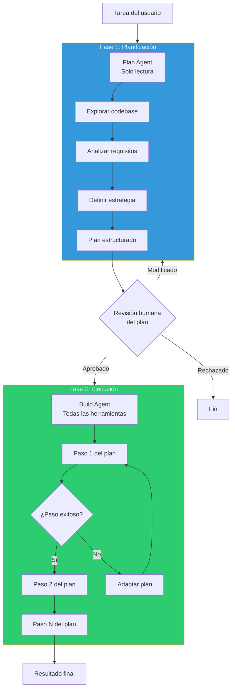
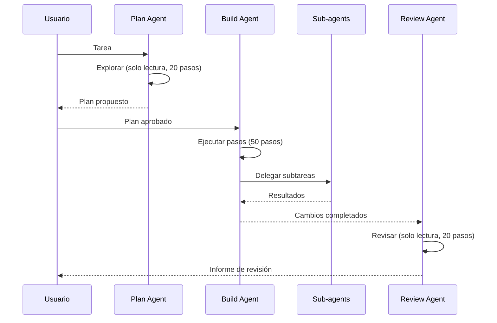
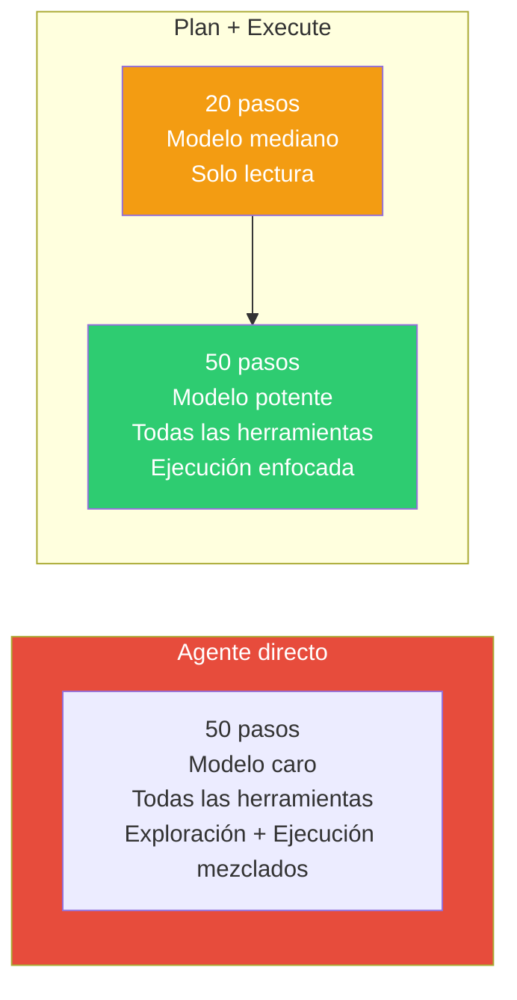

# Patrón Plan-and-Execute — Separar Planificación de Ejecución

> [!abstract]
> El patrón *Plan-and-Execute* separa la ==planificación estratégica de la ejecución táctica== en dos fases distintas con agentes especializados. El planificador analiza la tarea completa y produce un plan de acción sin ejecutar nada. El ejecutor sigue el plan paso a paso con acceso completo a herramientas. architect implementa este patrón con su ==plan agent (solo lectura, 20 pasos) y build agent (todas las herramientas, 50 pasos)==. El beneficio principal es que los planes son revisables antes de la ejecución, permitiendo intervención humana y optimización de recursos. ^resumen

## Problema

Un agente que planifica y ejecuta simultáneamente sufre de varios problemas:

1. **Miopía**: Toma decisiones paso a paso sin visión global de la tarea.
2. **Recursos desperdiciados**: Empieza a ejecutar antes de entender completamente el problema.
3. **Difícil de revisar**: No hay un artefacto de plan que el humano pueda aprobar antes de la ejecución.
4. **Context pollution**: El contexto del LLM se llena con resultados de herramientas que contaminan el razonamiento estratégico.

> [!warning] El problema del agente miope
> Un agente que ejecuta directamente puede refactorizar un archivo solo para descubrir que necesitaba refactorizar tres archivos de manera coordinada. Sin planificación previa, ==cada decisión se toma sin visión del panorama completo==, resultando en trabajo redundante o inconsistente.

## Solución

Separar la ejecución en dos fases con agentes especializados:



### Fase 1: Plan Agent

El plan agent tiene las siguientes restricciones:

| Aspecto | Configuración |
|---|---|
| Herramientas | Solo lectura (leer archivos, buscar, listar) |
| Max steps | 20 |
| Propósito | Comprender el problema y generar un plan |
| Output | Plan estructurado con pasos numerados |
| Restricción | NO puede modificar archivos ni ejecutar comandos |

> [!tip] ¿Por qué solo lectura?
> Restringir el plan agent a herramientas de lectura tiene tres beneficios:
> 1. **Seguridad**: No puede causar daño accidental.
> 2. **Foco**: Sin la tentación de "arreglar cosas sobre la marcha".
> 3. **Eficiencia**: Menos herramientas = menos tokens en el prompt del sistema.

### Fase 2: Build Agent

El build agent recibe el plan y lo ejecuta:

| Aspecto | Configuración |
|---|---|
| Herramientas | Todas (leer, escribir, ejecutar, buscar) |
| Max steps | 50 |
| Input | Plan del plan agent + tarea original |
| Propósito | Ejecutar el plan paso a paso |
| Flexibilidad | Puede adaptar el plan si un paso falla |

## Implementación en architect

architect implementa Plan-and-Execute como su modo principal de operación:



> [!example]- Ejemplo de plan generado por architect
> ```markdown
> ## Plan de implementación: Añadir sistema de caché
>
> ### Análisis
> - El proyecto usa FastAPI con SQLAlchemy.
> - No hay caché actual; todas las queries van a la BD.
> - Los endpoints más llamados son /users y /products.
>
> ### Pasos
> 1. **Crear módulo de caché** (`src/cache.py`)
>    - Implementar wrapper de Redis con TTL configurable.
>    - Métodos: get, set, invalidate, flush.
>
> 2. **Añadir dependencia Redis** (`requirements.txt`, `docker-compose.yml`)
>    - redis==5.0.0
>    - Contenedor Redis en docker-compose.
>
> 3. **Cachear endpoint /users** (`src/routes/users.py`)
>    - Cache en GET /users con TTL 5 min.
>    - Invalidar cache en POST/PUT/DELETE.
>
> 4. **Cachear endpoint /products** (`src/routes/products.py`)
>    - Igual que users pero TTL 15 min.
>
> 5. **Añadir tests** (`tests/test_cache.py`)
>    - Unit tests del módulo de caché.
>    - Integration tests con endpoints cacheados.
>
> 6. **Actualizar documentación** (`README.md`)
>    - Sección de configuración de Redis.
>    - Variables de entorno requeridas.
>
> ### Estimación
> - Archivos afectados: 6
> - Líneas de código estimadas: ~200
> - Riesgo: Bajo (nueva funcionalidad, no modifica existente)
> ```

## Beneficios de la separación

### Planes revisables

> [!success] El plan como contrato verificable
> Al separar la planificación, el plan se convierte en un ==artefacto revisable== que:
> - El humano puede aprobar, modificar o rechazar antes de ejecutar.
> - Sirve como documentación de la intención del agente.
> - Permite estimar costes y riesgos antes de actuar.
> - Se puede versionar y comparar con planes anteriores.

### Mejor asignación de recursos



> [!info] El plan agent puede usar un modelo más barato
> Dado que el plan agent solo lee y razona (no genera código), puede usar un modelo de menor capacidad (Sonnet vs Opus), reduciendo costes sin sacrificar calidad del plan. La ejecución, que requiere máxima precisión, usa el modelo más potente.

## Riesgos y mitigaciones

### Planes que se vuelven obsoletos

> [!danger] Plan stale: el riesgo principal
> Un plan creado en el paso 1 puede volverse obsoleto cuando la ejecución del paso 3 revela información nueva. Mitigaciones:
> - **Re-planificación adaptativa**: El executor puede solicitar re-planificación parcial si un paso falla.
> - **Checkpoints**: Verificar la validez del plan en puntos clave.
> - **Plan vivo**: Actualizar el plan a medida que se ejecuta (pero esto pierde parte del beneficio de separación).

### Overhead de planificación

Para tareas simples, la fase de planificación es overhead innecesario:

| Tipo de tarea | ¿Plan-and-Execute? | Alternativa |
|---|---|---|
| Fix de un bug de una línea | No | Agent loop directo |
| Refactoring de módulo | Sí | — |
| Nueva feature multi-archivo | Sí | — |
| Pregunta sobre el código | No | Agent loop directo |
| Migración de framework | Sí, con plan detallado | — |

## Cuándo usar

> [!success] Escenarios ideales
> - Tareas que afectan múltiples archivos de manera coordinada.
> - Requisitos complejos que necesitan descomposición.
> - Entornos donde la revisión humana del plan es necesaria.
> - Tareas donde el coste de un error es alto (producción, datos sensibles).
> - Cuando la estimación de esfuerzo es importante antes de actuar.

## Cuándo NO usar

> [!failure] Escenarios donde es contraproducente
> - **Tareas triviales**: Un fix de una línea no necesita un plan de 20 pasos.
> - **Tareas exploratorias**: "Investiga este bug" no tiene plan claro hasta explorar.
> - **Iteración rápida**: Cuando necesitas feedback inmediato, la planificación añade latencia.
> - **Tareas sin estructura**: Conversaciones, brainstorming, preguntas abiertas.

## Trade-offs

| Ventaja | Desventaja |
|---|---|
| Visión estratégica antes de actuar | Overhead de planificación |
| Planes revisables y aprobables | Planes pueden volverse obsoletos |
| Mejor asignación de modelos/recursos | Latencia adicional (dos fases) |
| Documentación implícita de intención | Rigidez: difícil adaptar el plan en marcha |
| Estimación de coste antes de ejecutar | No apto para tareas exploratorias |
| Separación clara de responsabilidades | Complejidad de implementación |

> [!question] ¿Plan fijo o plan adaptativo?
> - **Plan fijo**: Se genera una vez, el executor lo sigue estrictamente. Más predecible, más frágil.
> - **Plan adaptativo**: El executor puede modificar pasos restantes. Más flexible, menos revisable.
> - architect usa plan adaptativo: el build agent puede desviarse del plan si descubre impedimentos.

## Patrones relacionados

- [[pattern-agent-loop]]: Cada fase (plan y execute) ejecuta su propio agent loop.
- [[pattern-reflection]]: El plan agent puede reflexionar sobre su plan antes de entregarlo.
- [[pattern-orchestrator]]: El orquestador puede usar plan-and-execute para cada subtarea.
- [[pattern-pipeline]]: El plan se puede expresar como un pipeline de pasos.
- [[pattern-human-in-loop]]: La revisión del plan es un punto natural de HITL.
- [[pattern-evaluator]]: Evaluar la calidad del plan antes de ejecutar.
- [[pattern-memory]]: Planes pasados pueden informar planes futuros.
- [[pattern-supervisor]]: El supervisor monitoriza la adherencia del executor al plan.

## Relación con el ecosistema

[[architect-overview|architect]] es la implementación canónica de Plan-and-Execute en el ecosistema. Su plan agent (20 pasos, solo lectura) analiza el repositorio y genera un plan que el build agent (50 pasos, todas las herramientas) ejecuta. Los sub-agents (explore, test, review) son mini-ejecutores que el build agent delega para tareas específicas.

[[intake-overview|intake]] actúa como un "pre-planificador": normaliza requisitos ambiguos en especificaciones claras que facilitan la planificación posterior por parte de architect.

[[vigil-overview|vigil]] puede validar tanto el plan generado (¿cumple las políticas?) como los outputs de la ejecución (¿el código cumple las reglas?).

[[licit-overview|licit]] puede requerir que ciertos planes pasen por aprobación de compliance antes de la ejecución, insertando un gate entre la fase de planificación y la de ejecución.

## Enlaces y referencias

> [!quote]- Bibliografía
> - Wang, L. et al. (2023). *Plan-and-Solve Prompting: Improving Zero-Shot Chain-of-Thought Reasoning*. Paper sobre beneficios de planificación explícita.
> - Sun, H. et al. (2024). *AdaPlanner: Adaptive Planning from Feedback with Language Models*. Planificación adaptativa con LLMs.
> - LangChain. (2024). *Plan-and-execute agent documentation*. Implementación de referencia.
> - Anthropic. (2024). *Building effective agents — Planning patterns*. Patrones de planificación para agentes.
> - Yao, S. et al. (2023). *Tree of Thoughts: Deliberate Problem Solving with Large Language Models*. Exploración de planes alternativos.

---

> [!tip] Navegación
> - Anterior: [[pattern-evaluator]]
> - Siguiente: [[pattern-reflection]]
> - Índice: [[patterns-overview]]
