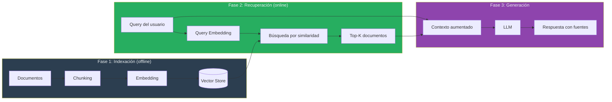
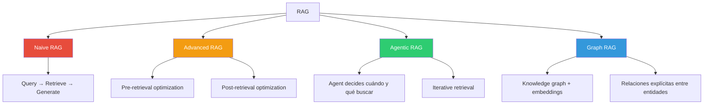
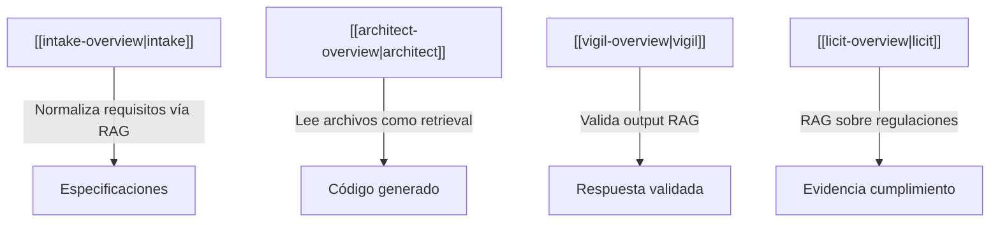

# Patrón RAG — Retrieval-Augmented Generation

> [!abstract]
> *Retrieval-Augmented Generation* (RAG) es el patrón que ==conecta un LLM con fuentes de conocimiento externas== para responder preguntas con información actualizada y específica del dominio. En lugar de depender exclusivamente del conocimiento paramétrico del modelo, RAG ==recupera documentos relevantes y los inyecta en el contexto== antes de generar la respuesta. Es el patrón de datos más adoptado en producción y la primera línea de defensa contra las alucinaciones de dominio. ^resumen

## Problema

Los LLMs tienen tres limitaciones fundamentales que RAG resuelve:

1. **Conocimiento estático**: El modelo solo sabe lo que aprendió durante el entrenamiento. No conoce eventos recientes, documentación interna ni datos privados.
2. **Alucinaciones de dominio**: Sin acceso a fuentes verificables, el modelo fabrica información con apariencia legítima.
3. **Falta de trazabilidad**: Sin fuentes, el usuario no puede verificar la respuesta.

> [!danger] El coste de no usar RAG
> Un sistema de soporte técnico que responde con documentación inventada puede causar que usuarios ejecuten comandos destructivos en sus sistemas. Las alucinaciones en dominios técnicos no son meras inexactitudes: son ==vectores de riesgo operacional==.

## Solución

RAG implementa un pipeline de tres fases: ==indexación, recuperación y generación==.



### Fase 1: Indexación

La indexación convierte documentos en representaciones vectoriales buscables.

| Paso | Descripción | Herramientas comunes |
|---|---|---|
| Carga | Obtener documentos de fuentes | LangChain loaders, Unstructured |
| *Chunking* | Dividir en fragmentos | RecursiveTextSplitter, semantic chunking |
| *Embedding* | Convertir a vectores | OpenAI ada-002, Cohere embed, BGE |
| Almacenamiento | Guardar en vector store | ChromaDB, Pinecone, Weaviate, pgvector |

> [!warning] Chunking: la decisión más crítica
> El tamaño y estrategia de *chunking* determina la calidad de todo el pipeline. Fragmentos demasiado pequeños pierden contexto; demasiado grandes diluyen la relevancia. No existe un tamaño universal: depende del dominio, tipo de documento y modelo de embedding.

### Fase 2: Recuperación

> [!tip] Estrategias de recuperación
> - **Similaridad coseno**: Estándar, funciona bien para la mayoría de casos.
> - **MMR** (*Maximal Marginal Relevance*): Balancea relevancia con diversidad.
> - **Hybrid search**: Combina búsqueda vectorial con búsqueda por palabras clave (BM25).
> - **Reranking**: Usa un modelo cross-encoder para reordenar los resultados iniciales.

### Fase 3: Generación

El prompt de generación combina la query del usuario con los documentos recuperados:

> [!example]- Prompt template RAG típico
> ```python
> RAG_PROMPT = """Responde la pregunta basándote EXCLUSIVAMENTE
> en el contexto proporcionado. Si el contexto no contiene la
> información necesaria, di "No tengo información suficiente".
>
> Contexto:
> {context}
>
> Fuentes utilizadas:
> {sources}
>
> Pregunta: {question}
>
> Instrucciones:
> 1. Cita las fuentes usando [Fuente N] junto a cada afirmación.
> 2. No inventes información que no esté en el contexto.
> 3. Si hay información contradictoria entre fuentes, menciónalo.
>
> Respuesta:"""
> ```

## Variantes de RAG



### Naive RAG

El pipeline básico: query → retrieve → generate. Funciona para prototipos y casos simples, pero sufre de varios problemas:

- No optimiza la query antes de buscar.
- No valida la relevancia de los resultados.
- No maneja queries complejas que necesitan descomposición.

### Advanced RAG

Añade optimizaciones pre y post-recuperación:

| Técnica | Fase | Descripción |
|---|---|---|
| Query rewriting | Pre-retrieval | Reformular la query para mejor recuperación |
| HyDE | Pre-retrieval | Generar documento hipotético, buscar similares |
| Query decomposition | Pre-retrieval | Dividir query compleja en sub-queries |
| Reranking | Post-retrieval | Reordenar resultados con cross-encoder |
| Compression | Post-retrieval | Extraer solo fragmentos relevantes del chunk |
| Fusion | Post-retrieval | Combinar resultados de múltiples estrategias |

### Agentic RAG

Un agente decide ==cuándo, qué y cómo buscar==. Es la variante más potente y la que implementan sistemas como [[architect-overview|architect]] a través de su [[pattern-agent-loop|agent loop]].

> [!example]- Implementación de Agentic RAG
> ```python
> class AgenticRAG:
>     def __init__(self, retriever, llm):
>         self.retriever = retriever
>         self.llm = llm
>         self.tools = [
>             Tool("search_docs", self.retriever.search),
>             Tool("search_code", self.code_search),
>             Tool("search_web", self.web_search),
>         ]
>
>     def answer(self, question: str) -> str:
>         # El agente decide qué herramienta usar
>         plan = self.llm.plan(question, self.tools)
>
>         context = []
>         for step in plan:
>             result = step.tool.execute(step.query)
>             context.extend(result)
>
>             # Evaluación intermedia: ¿tenemos suficiente?
>             if self.llm.has_enough_context(question, context):
>                 break
>
>         return self.llm.generate(question, context)
> ```

### Graph RAG

Combina un *knowledge graph* con búsqueda vectorial. Las entidades y relaciones del grafo proporcionan estructura que los embeddings solos no capturan.

> [!info] Graph RAG de Microsoft
> Microsoft Research publicó Graph RAG en 2024, mostrando mejoras significativas en preguntas que requieren síntesis de información distribuida en múltiples documentos[^1].

## Anti-patrones de RAG

> [!failure] Lo que NO hacer con RAG
> 1. **Recuperar demasiado**: Inyectar 20 chunks satura el contexto y confunde al modelo. Usa 3-5 chunks relevantes.
> 2. **Recuperar muy poco**: Un solo chunk puede no tener la respuesta completa. Balancea con diversidad (MMR).
> 3. **Chunking inadecuado**: Cortar a mitad de párrafo, tabla o bloque de código destruye el significado.
> 4. **Ignorar metadata**: No filtrar por fecha, autor o tipo de documento cuando es relevante.
> 5. **No evaluar retrieval**: Medir solo la respuesta final sin evaluar la calidad de los documentos recuperados.

## Decisión: RAG vs fine-tuning vs contexto largo

| Criterio | RAG | Fine-tuning | Contexto largo |
|---|---|---|---|
| Datos actualizados | Sí (actualizar índice) | No (re-entrenar) | Sí (inyectar) |
| Trazabilidad | Alta (fuentes citables) | Ninguna | Media |
| Coste inicial | Medio (indexación) | Alto (entrenamiento) | Bajo |
| Coste por query | Medio (embedding + LLM) | Bajo (solo LLM) | Alto (muchos tokens) |
| Escalabilidad de datos | Excelente (millones docs) | Limitada | Limitada por ventana |
| Latencia | Media (+búsqueda) | Baja | Alta (contexto grande) |
| Alucinaciones de dominio | Baja con buena retrieval | Media | Media |

> [!question] ¿Cuándo NO usar RAG?
> - Cuando el conocimiento paramétrico del modelo es suficiente (preguntas generales).
> - Cuando necesitas razonamiento sobre todos los datos simultáneamente (usa [[pattern-map-reduce]] o fine-tuning).
> - Cuando la latencia adicional de la búsqueda es inaceptable.
> - Cuando los documentos son tan pocos que caben directamente en el contexto.

## Implementación de referencia

> [!example]- Pipeline RAG completo con LangChain
> ```python
> from langchain.document_loaders import DirectoryLoader
> from langchain.text_splitter import RecursiveCharacterTextSplitter
> from langchain.embeddings import OpenAIEmbeddings
> from langchain.vectorstores import Chroma
> from langchain.chains import RetrievalQA
> from langchain.chat_models import ChatOpenAI
>
> # Fase 1: Indexación
> loader = DirectoryLoader("./docs", glob="**/*.md")
> documents = loader.load()
>
> splitter = RecursiveCharacterTextSplitter(
>     chunk_size=1000,
>     chunk_overlap=200,
>     separators=["\n## ", "\n### ", "\n\n", "\n", " "]
> )
> chunks = splitter.split_documents(documents)
>
> embeddings = OpenAIEmbeddings(model="text-embedding-3-small")
> vectorstore = Chroma.from_documents(
>     chunks, embeddings,
>     persist_directory="./chroma_db"
> )
>
> # Fase 2+3: Recuperación y Generación
> retriever = vectorstore.as_retriever(
>     search_type="mmr",
>     search_kwargs={"k": 5, "fetch_k": 20}
> )
>
> qa_chain = RetrievalQA.from_chain_type(
>     llm=ChatOpenAI(model="gpt-4o", temperature=0),
>     chain_type="stuff",
>     retriever=retriever,
>     return_source_documents=True
> )
>
> result = qa_chain({"query": "¿Cómo configuro pipelines?"})
> print(result["result"])
> for doc in result["source_documents"]:
>     print(f"  Fuente: {doc.metadata['source']}")
> ```

## Trade-offs

| Ventaja | Desventaja |
|---|---|
| Datos actualizados sin reentrenamiento | Latencia adicional por búsqueda |
| Fuentes citables y verificables | Calidad depende del chunking |
| Escala a millones de documentos | Requiere infraestructura de vectores |
| Reduce alucinaciones de dominio | No elimina alucinaciones completamente |
| Separación de datos y modelo | Complejidad operacional adicional |
| Funciona con cualquier LLM | Costes de embedding y almacenamiento |

## Métricas de evaluación

> [!success] Métricas clave para RAG
> - **Retrieval precision**: ¿Cuántos documentos recuperados son relevantes?
> - **Retrieval recall**: ¿Cuántos documentos relevantes fueron recuperados?
> - **Faithfulness**: ¿La respuesta es fiel a los documentos recuperados?
> - **Answer relevancy**: ¿La respuesta responde la pregunta?
> - **Context utilization**: ¿Cuánto del contexto recuperado se usa en la respuesta?

Frameworks como RAGAS[^2] automatizan estas métricas usando LLM-as-judge (ver [[pattern-evaluator]]).

## Patrones relacionados

- [[pattern-semantic-cache]]: Cachear respuestas RAG para queries similares reduce latencia y costes.
- [[pattern-map-reduce]]: Cuando el corpus es demasiado grande incluso para RAG, map-reduce procesa en paralelo.
- [[pattern-evaluator]]: Evaluar la calidad de las respuestas RAG con LLM-as-judge.
- [[pattern-guardrails]]: Validar que la respuesta RAG no contiene información fabricada.
- [[pattern-pipeline]]: RAG como paso dentro de un pipeline más amplio.
- [[pattern-agent-loop]]: Agentic RAG usa el agent loop para decidir cuándo buscar.

## Relación con el ecosistema

El patrón RAG es fundamental para [[intake-overview|intake]], que normaliza requisitos buscando en bases de conocimiento existentes para generar especificaciones consistentes. [[architect-overview|architect]] utiliza RAG implícitamente cuando sus agentes leen archivos del proyecto para comprender el contexto antes de generar código. [[vigil-overview|vigil]] puede actuar como validador post-RAG, verificando que la respuesta generada cumple reglas deterministas. [[licit-overview|licit]] aprovecha RAG para buscar en marcos regulatorios y generar evidencia de cumplimiento.



## Enlaces y referencias

> [!quote]- Bibliografía
> - [^1]: Edge, D. et al. (2024). *From Local to Global: A Graph RAG Approach to Query-Focused Summarization*. Microsoft Research.
> - [^2]: Es, S. et al. (2024). *RAGAS: Automated Evaluation of Retrieval Augmented Generation*. Framework de evaluación de referencia.
> - Lewis, P. et al. (2020). *Retrieval-Augmented Generation for Knowledge-Intensive NLP Tasks*. Paper original de RAG.
> - Gao, Y. et al. (2024). *Retrieval-Augmented Generation for Large Language Models: A Survey*. Survey completo de técnicas RAG.
> - LangChain. (2024). *RAG from Scratch*. Serie de tutoriales sobre implementación RAG.

[^1]: El paper de Microsoft Graph RAG mostró mejoras del 30-70% en tareas de síntesis global comparado con naive RAG.
[^2]: RAGAS usa métricas como faithfulness, answer relevancy y context precision para evaluar pipelines RAG de forma automatizada.

---

> [!tip] Navegación
> - Anterior: [[patterns-overview]]
> - Siguiente: [[pattern-agent-loop]]
> - Índice: [[patterns-overview]]
